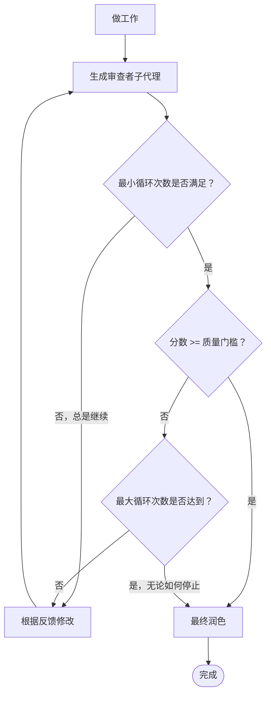

# 审查循环

在单个会话内进行迭代的工作者-审查者循环。你完成工作，生成一个审查者子代理来评价它，根据反馈进行修改，重复直到达到质量门槛。

**核心原则：** 初稿永远不会是最终稿。迭代审查产生的输出比单次处理更好。

> **平台提示：** 此技能在支持子代理生成的代理上效果最佳。
> 在没有该功能的平台上，通过打开一个新的聊天上下文，仅粘贴工作成果（不包含先前的推理），并要求它进行1-10分的评分并提供具体反馈来模拟审查步骤。

## 快速入门

1. 说出：`"实现X，使用审查循环"` 或 `"在我刚写的文件上运行审查循环"`
2. 代理完成工作（或读取现有工作）
3. 一个独立的审查者子代理对其进行1-10分的评分并提供具体反馈
4. 代理修改并重复，直到分数 >= 8（默认质量门槛）
5. 提供一个循环摘要与最终输出

---

## 何时使用

- 用户说"使用审查循环"、"润色这个"、"迭代这个"、"/review-loop"
- 复杂的实现，其中质量比速度更重要
- 设计文档、规范或技术写作
- 需要健壮的代码（安全性、数据管道、金融逻辑）
- 当用户希望在过程中嵌入对抗性审查时

## 何时不使用

- 简单的修复、快速编辑、单行更改
- 测试是质量门槛的任务（使用TDD + CI代替）
- 当用户只是想快速完成
- 探索性/原型工作，目标是学习而不是发布
- 没有明确验收标准的任务——先定义这些标准，然后使用审查循环

---

## 默认值

| 设置       | 默认值 |
|------------|--------|
| 最小循环次数 | 2     |
| 最大循环次数 | 4     |
| 质量门槛     | 8/10  |
| 工作者模型   | （你当前的模型） |
| 审查者模型   | （你当前的模型或快速/平衡的替代方案） |

---

## 模型选择

审查者任务评估逻辑和约束。工作者任务编写和修改代码。相应地选择子代理功能。

**关键规则：** 审查者必须始终等于或比工作者更强大。如果审查者比工作者弱，它无法正确审查复杂的逻辑或捕获微妙的回归错误。

| 任务复杂度   | 工作者能力   | 审查者能力   | 理由     |
|--------------|------------|------------|----------|
| 简单/机械（CRUD、格式化、样板文件） | 快速 / 轻量级 | 平衡       | 轻量级工作者速度快，平衡审查者容易发现问题 |
| 标准（功能、重构、文档） | 平衡       | 平衡       | 成本、速度和质量的良好组合 |
| 复杂（多文件、集成、设计） | 平衡       | 高级 / 推理 | 高级审查者可以捕获微妙的架构问题，平衡工作者可以实施它们 |
| 非常复杂（安全性、量化、分布式系统） | 高级 / 推理 | 高级 / 推理 | 两者都需要完整的上下文和推理能力。审查者必须与工作者能力匹配。 |

**黄金法则：** 工作者必须足够智能，能够根据审查者的反馈采取行动。如果审查者说"用基于通道的信号量修复竞态条件"，而工作者无法推理并发性，循环将不会收敛。

**升级信号：** 如果在连续2个循环中收到相同的反馈后分数没有提高，那么工作者模型太弱。升级：
- 选项A：要求用户切换到更强大的模型
- 选项B：暂时降低质量门槛并通知用户差距
- 选项C：将任务分解为更小的子任务，并在每个子任务上运行审查循环

**默认行为：** 由于你（主代理）是工作者，生成一个与你的当前能力匹配或超过的审查者子代理，根据任务：
- 大多数任务 → 标准/平衡审查者
- 专业/困难任务 → 高级/推理审查者
- 快速检查 → 快速/轻量级审查者（仅当你也充当轻量级工作者时）

---

## 用户覆盖

用户可以覆盖他们的请求中的任何默认值。自然地解析这些：

```
"实现X，使用审查循环，质量门槛9，使用高级模型进行审查，最大5次循环"
"润色这个，最小2次循环，门槛为8"
"运行审查循环，快速审查者，最大2次循环"
"使用审查循环，推理审查者，质量门槛9，最小3最大6"
```

**解析规则：**
- "质量门槛N"或"门槛N" → quality_gate = N
- "[模型]审查者"或"使用[模型]审查" → 审查者模型覆盖
- "最大N次循环" → max_loops = N
- "最小N次循环" → min_loops = N
- 如果用户没有指定，使用默认值
- 如果用户说"彻底"或"严格" → 解释为质量门槛8，最小循环2
- 如果用户说"快速"或"快速" → 解释为max_loops 2，质量门槛6

---

## 流程



---

## 分步操作

### 第1步：做工作

像平常一样完成任务。编写代码、创建规范、实现功能。不要犹豫——做出你最好的第一次尝试。

### 第2步：生成审查者子代理

使用代理工具来派遣审查者。审查者必须：
- 是一个**独立的子代理**（新的上下文，没有与你推理的锚定）
- 只接收**工作成果**（文件、差异）——而不是你的推理过程
- 进行1-10分的评分并提供**具体、可操作的反馈**
- 默认使用平衡/标准模型（或对于复杂/专业任务使用高级推理模型）

**审查者提示模板：**

```
你是一个严格的审查者。对以下工作评分1-10，并提供具体、可操作的反馈。

## 做了什么
{任务的简要描述}

## 审查标准
{任务特定的标准——这对这个任务很重要}

好的审查标准的示例：
  对于REST API端点：
    - 使用正确的HTTP状态码
    - 所有参数都有输入验证
    - 强制身份验证；没有未经身份验证的访问
    - 没有N+1查询模式

  对于设计文档：
    - 问题陈述是无歧义的
    - 考虑了替代方案及其权衡
    - 没有对实现复杂性的回避
    - 成功指标是可衡量的

  对于数据管道：
    - 不可逆——可以重新运行
    - 优雅地处理模式更改
    - 记录了故障模式
    - 处理了PII

## 指示
1. 仔细阅读工作
2. 评分1-10，其中：
   - 1-3：根本性损坏或缺少主要要求
   - 4-6：可以工作但有重大问题
   - 7-8：良好，只有小问题
   - 9-10：优秀，可以发布
3. 如适用，列出具体问题，包括文件：行引用
4. 对于每个问题，解释为什么它很重要以及如何修复
5. 不要客气——要诚实和直接
6. 明确说明你的分数，如"分数：N/10"

## 要审查的文件
{粘贴文件内容或列出包含相关摘录的文件路径}
```

### 第3步：解析反馈

从审查者响应中提取：
- **分数**（数字）
- **问题**（分类为关键 / 重要 / 轻微）
- **具体修复**（要更改的内容）

向用户报告：
```
循环 {N}/{max}: 分数 {X}/10
- {关键反馈点的摘要}
```

### 第4步：检查停止条件

按此顺序：
1. 如果循环次数 < 最小循环次数 → **继续**（总是）
2. 如果分数 >= 质量门槛 → **停止，进入最终润色**
3. 如果循环次数 >= 最大循环次数 → **停止，进入最终润色**
4. 否则 → **修改并循环**

### 第5步：修改

解决审查者的反馈。修复关键和重要问题。轻微问题可选。然后回到第2步。

**重要：** 每次修改应该是有针对性的。不要重写所有内容——修复审查者标记的问题。保持一个包含所有先前反馈的心理列表，以避免回归错误。

### 第6步：最终润色

一旦循环退出（达到质量门槛或达到最大循环次数）：
- 如果有剩余的轻微问题，则如果琐碎则解决
- 验证最终输出是一致的（没有来自修改周期的痕迹）
- 向用户报告最终分数和循环次数

---

## 根据任务类型调整审查标准

| 任务类型   | 审查者应关注 |
|------------|------------|
| 代码       | 正确性、边缘情况、错误处理、可读性、没有安全性问题 |
| 规范/设计 | 完整性、可行性、没有回避、可实施性 |
| 重构       | 没有行为变化、没有回归、比以前更干净 |
| 写作       | 清晰度、结构、适合受众、没有废话 |
| 修复错误   | 解决根本原因、有回归测试、没有副作用 |
| 基础设施 / IaC | 不可逆性、最小权限、没有硬编码的密钥、销毁安全性 |
| 数据库迁移 | 可逆性、索引策略、数据丢失风险、扩展性能 |
| API设计   | 向后兼容性、身份验证、版本控制、错误契约 |
| 测试套件   | 边缘情况覆盖、没有测试相互依赖、有意义的断言 |

---

## 两种操作模式

### 模式A："做和审查"（完整循环）

用户给出任务 + 说要使用审查循环。你完成工作并运行审查循环。

```
用户："实现缓存层。使用审查循环，质量门槛8。"

你：
1. 实现缓存层
2. 生成审查者 → 分数6，反馈：缺少淘汰机制，没有TTL
3. 修改：添加淘汰机制 + TTL
4. 生成审查者 → 分数8，反馈：轻微命名问题
5. 最终润色，完成
```

### 模式B："审查现有"（仅审查）

用户已经完成了工作或你已经完成了工作。只需在现有内容上运行审查循环。

```
用户："在我刚写的认证模块上运行审查循环"

你：
1. 读取认证模块
2. 生成审查者 → 分数5，反馈：SQL注入，没有速率限制
3. 修复：参数化查询，添加速率限制器
4. 生成审查者 → 分数8，通过
5. 完成
```

---

## 信号旗

**永远不要：**
- 自我审查而不是生成子代理（锚定偏差）
- 因为"反馈是错误的"而跳过修改周期，没有正当理由
- 膨胀你自己的分数（"我认为这实际上是9"）
- 在没有用户同意的情况下继续超过最大循环次数
- 用你的完整推理/历史生成审查者（他们必须审查工作，而不是你的意图）

**如果审查者错了：**
- 用证据反驳（显示代码/测试来反驳反馈）
- 跳过那个特定的修改点
- 在向用户的报告中注明
- 不要为了弥补而降低质量标准

---

## 示例报告格式

```
--- 审查循环：{任务名称} ---

循环 1/4：分数 6/10
  审查者：缺少输入验证，没有网络超时的错误处理，函数太长（80行）。
  行动：修复所有三个问题。

循环 2/4：分数 8/10
  审查者：干净。轻微：变量名`d`可以更描述性。
  行动：质量门槛满足（8 >= 8）。最终润色。

结果：8/10在2次循环中。完成。
```

---

## 已知限制

- 审查者子代理没有对先前循环的记忆——在每次审查者提示中明确包含先前反馈上下文，以避免重复已解决的问题
- 如果审查者提示标准太模糊，可能会出现分数膨胀——投入时间编写具体、可衡量的标准
- 此技能不能替代人类代码审查，用于安全性关键或合规性敏感的代码；将输出视为一个强大的第一遍
- 如果任务未明确说明，循环收敛可能无法保证——在开始之前定义明确的验收标准

---

## 成本和速度

- 每个循环 = 1个审查者子代理调用
- 预算大约是单个实现遍历时间的1-2倍，用于完整的3次循环周期
- 与发布有错误代码、模糊规范或触发后期审查周期相比，这是便宜的
- 对于大多数审查，使用你的默认/标准模型；仅在专业领域（安全性审计、分布式系统、量化金融）升级到高级推理模型

---

## 许可证

MIT — 自由使用、适应和重新分发，任何AI工具或平台。感谢归因。欢迎贡献。
