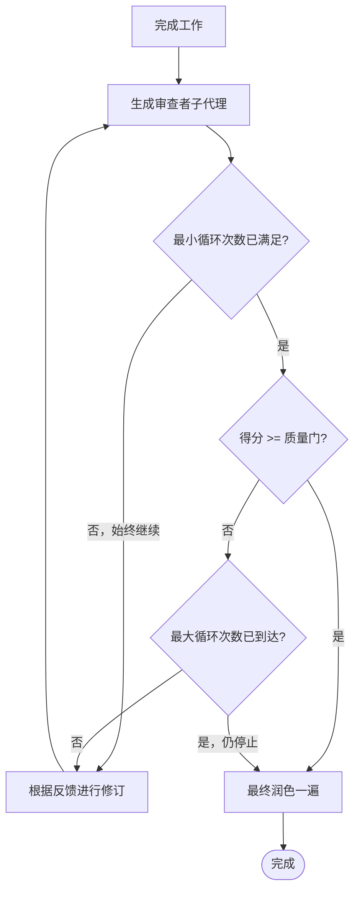

# 审查循环

在同一会话内的迭代式工作者-审查者循环。您完成工作，生成审查者子代理对其进行审查，根据反馈进行修订，重复执行直至达到质量门标准。

**核心原则：** 初稿绝不能视为最终版本。迭代式审查产生的输出优于单次处理。

> **平台说明：** 此技能在支持子代理生成的代理上效果最佳。
> 在不具备该能力的平台上，通过开启新的聊天上下文，仅粘贴工作产物（不含先前推理内容），并请其根据具体反馈对结果进行 1-10 分评分，来模拟审查者步骤。

## 快速开始

1. 说：`"implement X, use review-loop"` 或 `"run review-loop on the file I just wrote"`
2. 代理完成工作（或阅读现有工作）
3. 生成独立的批评子代理对其进行 1-10 分评分并给出具体反馈
4. 代理进行修订并重复执行，直至得分 ≥ 8（默认质量门）
5. 交付包含最终输出的循环总结

---

## 何时使用

- 用户说"使用 review-loop"、"润色此内容"、"在此基础上迭代"、"/review-loop"
- 质量比速度更重要的复杂实现
- 设计文档、规范或技术写作
- 需要更稳健的代码（安全、数据管道、财务逻辑）
- 当用户希望将对抗性审查融入流程中时

## 何时不使用

- 简单修复、快速修改、单行更改
- 以测试作为质量门的任务（改用 TDD + CI）
- 当用户仅希望快速完成时
- 探索性/验证性工作，其目标为学习而非交付
- 无明确验收标准的任务——先定义标准，再使用 review-loop

---

## 默认设置

| 设置 | 默认值 |
|--------|--------|
| 最小循环次数 | 2 |
| 最大循环次数 | 4 |
| 质量门 | 8/10 |
| 工作者模型 | （您的当前模型） |
| 审查者模型 | （您的当前模型或快速/均衡的替代模型） |

---

## 模型选择

审查者任务评估逻辑与约束。工作者任务编写和修改代码。请相应选择子代理能力。

**关键规则：** 审查者必须始终等同于或比工作者更有能力。如果审查者弱于工作者，则无法正确审查复杂逻辑或发现细微回归。

| 任务复杂度 | 工作者能力 | 审查者能力 | 理由 |
|----------------|--------|----------|-----------|
| 简单/机械（CRUD、格式化、样板代码） | 快速 / 轻量 | 均衡 | 轻量工作者速度快，均衡审查者可轻松发现问题 |
| 标准（功能、重构、文档） | 均衡 | 均衡 | 成本、速度和质量的良好平衡 |
| 复杂（多文件、集成、设计） | 均衡 | 高级 / 推理 | 高级审查者可发现细微架构问题，均衡工作者可实施这些方案 |
| 非常复杂（安全、量化、分布式系统） | 高级 / 推理 | 高级 / 推理 | 双方都需要完整上下文和推理能力。审查者必须与工作者能力匹配。 |

**黄金法则：** 工作者必须足够智能，能够响应审查者的反馈。如果审查者说"用基于通道的信号量修复竞态条件"，而工作者无法理解并发逻辑，则循环无法收敛。

**升级信号：** 如果在两次连续循环后得分未提升且反馈相同，则工作者模型过于薄弱。进行升级：
- 选项 A：请用户切换为能力更强的模型
- 选项 B：临时降低质量门，并向用户说明差距
- 选项 C：将任务拆分为更小的子任务，对每个子任务运行 review-loop

**默认行为：** 由于（您，作为主要代理）本身就是工作者，请根据任务生成匹配或超越您当前能力的审查者子代理：
- 大多数任务 → 标准/均衡审查者
- 专业化/困难任务 → 高级/推理审查者
- 快速检查 → 快速/轻量审查者（仅当您同时作为轻量工作者执行时）

---

## 用户覆盖

用户可在请求中直接覆盖任意默认设置。自然解析以下内容：

```
"implement X with review-loop, quality gate 9, use advanced model for review, max 5 loops"
"polish this, 2 loops minimum, gate at 8"
"run review-loop with fast reviewer, max 2 loops"
"use review-loop, reasoning reviewer, quality gate 9, min 3 max 6"
```

**解析规则：**
- `"quality gate N"` 或 `"gate N"` → 质量门 = N
- `"[model] reviewer"` 或 `"review with [model]"` → 审查者模型覆盖
- `"max N loops"` → 最大循环次数 = N
- `"min N loops"` → 最小循环次数 = N
- 若用户未指定，则使用默认值
- 若用户说"thorough"或"strict" → 解释为质量门 8，最小循环次数 2
- 若用户说"quick"或"fast" → 解释为最大循环次数 2，质量门 6

---

## 流程



---

## 分步执行

### 步骤 1：完成工作

以您正常的方式完成任务。编写代码、创建规范、实现功能。不要有所保留——产出您最佳的首次尝试。

### 步骤 2：生成审查者子代理

使用 Agent 工具分发审查者。审查者必须：
- 是**独立的子代理**（全新上下文，不锚定于您的推理过程）
- 仅接收**工作产物**（文件、差异）——而非您的思考过程
- 以**具体、可操作**的方式对结果进行 1-10 分评分
- 默认使用均衡/标准模型（或对于复杂/专业化任务使用高级推理模型）

**审查者提示模板：**

```
您是一位严格的审查者。请对以下工作进行 1-10 分评分，并提供具体、可操作的反馈。

## 已完成的工作
{任务的简要描述}

## 审查标准
{针对本任务的特定标准——本任务中什么最重要}

良好标准的示例：
  - 对于 REST API 端点：
    - 使用的 HTTP 状态码正确
    - 所有参数均有输入验证
    - 已强制执行认证；不存在未认证访问
    - 无 N+1 查询模式
  - 对于设计文档：
    - 问题陈述清晰无歧义
    - 已考虑替代方案及其权衡
    - 未对实现复杂度进行空泛论述
    - 成功指标可衡量
  - 对于数据管道：
    - 幂等——可安全重跑
    - 处理 Schema 变更时表现良好
    - 失败模式已文档化
    - 已处理 PII

## 指示
1. 仔细阅读工作内容
2. 根据以下标准评分 1-10：
    - 1-3 分：存在根本性缺陷或缺失主要需求
    - 4-6 分：可运行但存在重大问题
    - 7-8 分：良好，仅有 minor 问题
    - 9-10 分：优秀，可发布
3. 适用时列出具体的文件：行号引用
4. 针对每个问题，解释其为何重要以及需如何修复
5. 不要客气——要诚实且直接
6. 明确说明您的得分为"Score: N/10"

## 待审查的文件
{粘贴文件内容，或列出包含相关摘录的文件路径}
```

### 步骤 3：解析反馈

从审查者回复中提取：
- **得分**（数字）
- **问题**（分类为 Critical / Important / Minor）
- **具体修复方案**（需更改的内容）

向用户报告：
```
循环 {N}/{max}：得分 {X}/10
- {关键反馈点的摘要}
```

### 步骤 4：检查停止条件

按以下顺序：
1. 若循环次数少于最小循环次数 → **继续**（始终）
2. 若得分 ≥ 质量门 → **停止，进入最终润色**
3. 若循环次数 ≥ 最大循环次数 → **停止，进入最终润色**
4. 其他情况 → **修订并循环**

### 步骤 5：修订

针对审查者的反馈进行修改。修复 Critical 和 Important 问题。Minor 问题为可选。然后返回步骤 2。

**重要：** 每次修订应具针对性。不要重写一切——只修复审查者标记的内容。保持所有先前反馈的清单在脑中，以避免回归。

### 步骤 6：最终润色

当循环退出（质量门满足或达到最大循环次数）后：
- 若仍有简单的剩余 minor 问题，则进行处理
- 验证最终输出是否连贯（无修订周期的残留问题）
- 向用户报告最终得分和循环次数

---

## 根据任务类型调整审查者标准

| 任务类型 | 审查者应重点关注 |
|-----------|--------------------------|
| 代码 | 正确性、边界情况、错误处理、可读性、无安全问题 |
| 规范/设计 | 完整性、可行性、无空泛论述、可实施性 |
| 重构 | 无行为变更、无回归、比之前更清晰 |
| 写作 | 清晰度、结构、符合受众、无冗余 |
| Bug 修复 | 已解决根本原因、存在回归测试、无副作用 |
| 基础设施 / IaC | 幂等性、最小权限、无硬编码密钥、销毁安全性 |
| 数据库迁移 | 可逆性、索引策略、数据丢失风险、规模化后的性能 |
| API 设计 | 向后兼容性、认证、版本控制、错误契约 |
| 测试套件 | 边界情况覆盖、无测试间依赖、断言有实质意义 |

---

## 两种运行模式

### 模式 A："完成并审查"（完整循环）

用户给出任务并要求使用 review-loop。您完成工作并运行审查循环。

```
用户： "Implement the caching layer. Use review-loop, quality gate 8."

您：
1. 实现缓存层
2. 生成审查者 → 得分 6，反馈：缺少淘汰机制、无 TTL
3. 修订：添加淘汰机制 + TTL
4. 生成审查者 → 得分 8，反馈：仅存在 minor 命名问题
5. 最终润色，完成
```

### 模式 B："审查现有内容"（仅审查）

用户已完成工作，或您已完成任务。仅对现有内容运行审查循环。

```
用户： "Run review-loop on the auth module I just wrote"

您：
1. 阅读认证模块
2. 生成审查者 → 得分 5，反馈：存在 SQL 注入、无限流
3. 修复：参数化查询、添加限流器
4. 生成审查者 → 得分 8，通过
5. 完成
```

---

## 危险信号

**绝不：**
- 代替生成子代理进行自我审查（锚定偏差）
- 以"反馈有误"为由跳过修订循环，且无合理理由
- 夸大自身得分（"我认为实际上这已经是 9 分了"）
- 未经用户同意越过最大循环次数继续
- 将您的完整推理/历史用于生成审查者（他们必须审查**工作成果**，而非您的意图）

**若审查者有误：**
- 以证据反驳（展示证明反馈不成立的代码/测试）
- 在修订中跳过该具体点
- 在报告中向用户说明
- 不要降低质量门槛以进行补偿

---

## 示例报告格式

```
--- 审查循环：{任务名称} ---

循环 1/4：得分 6/10
  Reviewer：缺少输入验证、网络超时无错误处理、函数过长（80 行）。
  行动：修复这三个问题。

循环 2/4：得分 8/10
  Reviewer：内容干净。Minor：变量名 `d` 可更具描述性。
  行动：满足质量门（8 >= 8）。进行最终润色。

结果：2 个循环后得 8/10。完成。
```

---

## 已知限制

- 审查者子代理无先前循环的记忆——在每个审查者提示中明确包含先前反馈上下文，以避免重复已解决的问题
- 若审查者提示标准过于模糊，可能出现分数虚高的情况——投入时间撰写具体、可衡量的标准
- 此技能不能替代对人类安全关键或合规敏感代码的人工代码审查；将输出视为一次强有力的初步检查
- 若任务定义不充分，循环收敛无法保证——启动前先定义明确的验收标准

---

## 成本与速度

- 每个循环 = 1 次审查者子代理调用
- 完整的 3 循环周期，时间预算约为单次实现流程的 1-2 倍
- 与交付有缺陷的代码、模糊的规范或触发后期审查循环相比，这是成本较低的
- 大多数审查使用默认/标准模型；仅在专业化领域（安全审计、分布式系统、量化金融）升级到高级推理模型

---

## 许可

MIT —— 免费使用、适配和重新分发，可与任何 AI 工具或平台配合使用。 appreciated 归属。欢迎贡献。
