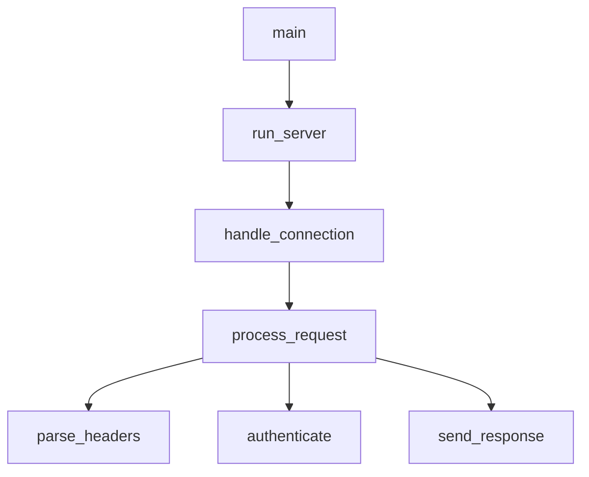

# Rust 调用图

使用 LSP 调用层级可视化函数调用关系。

## 使用方法

```
/rust-call-graph <函数名> [--depth N] [--direction in|out|both]
```

**选项：**
- `--depth N`：遍历多少层级（默认：3）
- `--direction`：`in`（调用者），`out`（被调用者），`both`

**示例：**
- `/rust-call-graph process_request` - 显示调用者和被调用者
- `/rust-call-graph handle_error --direction in` - 仅显示调用者
- `/rust-call-graph main --direction out --depth 5` - 深度被调用者分析

## LSP 操作

### 1. 准备调用层级

获取函数的调用层级项。

```
LSP(
  operation: "prepareCallHierarchy",
  filePath: "src/handler.rs",
  line: 45,
  character: 8
)
```

### 2. 入口调用（谁调用这个？）

```
LSP(
  operation: "incomingCalls",
  filePath: "src/handler.rs",
  line: 45,
  character: 8
)
```

### 3. 出口调用（这个调用什么？）

```
LSP(
  operation: "outgoingCalls",
  filePath: "src/handler.rs",
  line: 45,
  character: 8
)
```

## 工作流程

```
用户: "显示 process_request 的调用图"
    │
    ▼
[1] 查找函数位置
    LSP(workspaceSymbol) 或 Grep
    │
    ▼
[2] 准备调用层级
    LSP(prepareCallHierarchy)
    │
    ▼
[3] 获取入口调用（调用者）
    LSP(incomingCalls)
    │
    ▼
[4] 获取出口调用（被调用者）
    LSP(outgoingCalls)
    │
    ▼
[5] 递归扩展到深度 N
    │
    ▼
[6] 生成 ASCII 可视化
```

## 输出格式

### 入口调用（谁调用这个？）

```
## `process_request` 的调用者

main
└── run_server
    └── handle_connection
        └── process_request  ◄── YOU ARE HERE
```

### 出口调用（这个调用什么？）

```
## `process_request` 的被调用者

process_request  ◄── YOU ARE HERE
├── parse_headers
│   └── validate_header
├── authenticate
│   ├── check_token
│   └── load_user
├── execute_handler
│   └── [动态分发]
└── send_response
    └── serialize_body
```

### 双向（全部）

```
## `process_request` 的调用图

                    ┌─────────────────┐
                    │      main       │
                    └────────┬────────┘
                             │
                    ┌────────▼────────┐
                    │   run_server    │
                    └────────┬────────┘
                             │
                    ┌────────▼────────┐
                    │handle_connection│
                    └────────┬────────┘
                             │
        ┌────────────────────┼────────────────────┐
        │                    │                    │
┌───────▼───────┐   ┌───────▼───────┐   ┌───────▼───────┐
│ parse_headers │   │ authenticate  │   │send_response  │
└───────────────┘   └───────┬───────┘   └───────────────┘
                            │
                    ┌───────┴───────┐
                    │               │
             ┌──────▼──────┐ ┌──────▼──────┐
             │ check_token │ │  load_user  │
             └─────────────┘ └─────────────┘
```

## 分析洞察

生成调用图后，提供洞察：

```
## 分析

**入口点：** main, test_process_request
**叶函数：** validate_header, serialize_body
**热点路径：** main → run_server → handle_connection → process_request
**复杂度：** 12 个函数，3 层深度

**潜在问题：**
- `authenticate` 有高扇出（4 个被调用者）
- `process_request` 从 3 个地方被调用（考虑是否为有意设计）
```

## 常见模式

| 用户说法 | 方向 | 用例 |
|-----------|-----------|----------|
| "谁调用 X?" | incoming | 影响分析 |
| "X 调用什么?" | outgoing | 理解实现 |
| "显示调用图" | both | 全景 |
| "从 main 到 X 的调用路径" | outgoing | 执行路径 |

## 可视化选项

| 风格 | 适合 |
|-------|----------|
| 树形（默认） | 简单层级 |
| 盒图 | 复杂关系 |
| 平列表 | 许多连接 |
| Mermaid | 导出为文档 |

### Mermaid 导出



## 相关技能

| 当... | 看到... |
|------|-----|
| 查找定义 | rust-code-navigator |
| 项目结构 | rust-symbol-analyzer |
| 特性实现 | rust-trait-explorer |
| 安全重构 | rust-refactor-helper |
