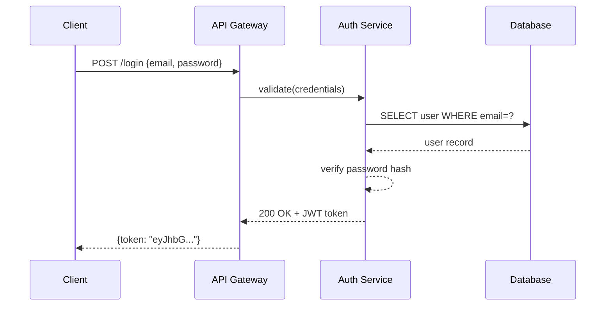
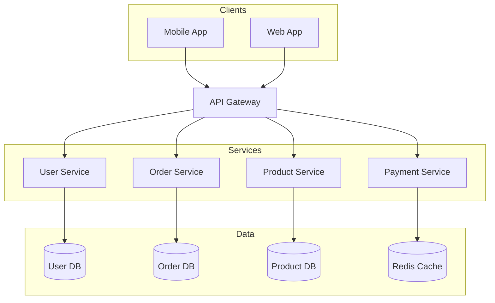
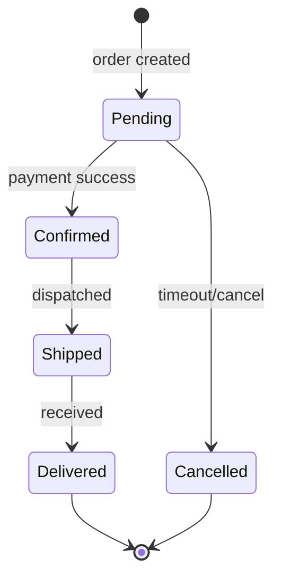

# Mermaid 图表

生成 `.mmd` 文本文件并使用 `mmdc`（本地）或 Kroki API（无需安装）导出为 PNG/SVG/PDF。

**主要优势：** 基于文本的语法，具有 **完全自动的布局** — 无需 x/y 坐标。

## 前置条件

**选项 A：本地 (mmdc)**
```bash
npm install -g @mermaid-js/mermaid-cli
mmdc --version
```

**选项 B：Kroki API (无需安装)**
```bash
curl --version  # 仅需 curl
```

## 工作流程

0. **更新检查（通知，不要拉取）** — 每次对话首次使用。通过 `<this-skill-dir>/.last_update` 每天限制一次；未经明确用户同意，切勿修改技能目录。

   - 如果存在 `.last_update` 且小于 24 小时，则完全跳过此步骤。
   - 否则，从上游获取最新标签：
     ```bash
     git -C <this-skill-dir> ls-remote --tags origin 'v*' 2>/dev/null \
       | awk '{print $2}' | sed 's|refs/tags/||' | sort -V | tail -1
     ```
   - 与此技能的前置 `metadata.version` 进行比较。如果上游标签严格更新（semver），向用户显示一行并询问：
     > "此技能有更新版本可用：vX.Y.Z → vA.B.C。要让我执行 `git pull` 吗？"

     如果他们回答是，则运行 `git -C <this-skill-dir> pull --ff-only`。无论结果如何，刷新 `.last_update` 以确保 24 小时内不再重复提示。
   - 如果上游相同或较旧，则静默刷新 `.last_update` 并继续。
   - 任何失败情况（离线、非 git 检出 — 例如 ClawHub 安装的副本、只读路径、无权限），静默吞掉错误并继续执行用户任务。不要提及失败。
1. **检查依赖项** — 尝试 `mmdc --version`，不可用时回退到 Kroki
2. **选择图表类型** — 从下表中选择
3. **生成** — 将 `.mmd` 文件写入磁盘
4. **验证** — 运行验证（导出前必须执行）
5. **导出** — 使用 `mmdc` 或 Kroki API 生成 PNG/SVG/PDF
6. **报告** — 告知用户输出文件路径

## 验证（必须）

**导出图表前，切勿先验证。**

```bash
# 使用 mmdc（本地）验证
mmdc -i diagram.mmd -o /tmp/test.png 2>&1

# 使用 Kroki（如果 mmdc 不可用）验证
curl -s -X POST -H "Content-Type: text/plain" --data-binary @diagram.mmd https://kroki.io/mermaid/svg -o /tmp/test.svg && echo "Valid" || echo "Invalid"

# 如果有错误，修复 .mmd 文件并再次验证
# 仅在验证通过后继续导出
```

常见的验证错误：
- 带特殊字符的标签缺少引号
- 箭头语法错误（使用 `->>` 表示顺序，`-->` 表示流程图）
- 顺序图中未声明的参与者

## 图表类型

| 类型 | 关键字 | 用途 |
|------|---------|---------|
| 流程图 | `flowchart TD/LR` | 流程、管道、决策 |
| 顺序图 | `sequenceDiagram` | API 调用、消息传递 |
| 类图 | `classDiagram` | 面向对象模型、数据结构 |
| ER 图 | `erDiagram` | 数据库模式 |
| 状态图 | `stateDiagram-v2` | 状态机、生命周期 |
| 甘特图 | `gantt` | 项目时间线 |
| 饼图 | `pie` | 比例 |
| Git 图 | `gitGraph` | 分支策略 |
| C4 上下文图 | `C4Context` | 高级架构 |
| 思维导图 | `mindmap` | 主题分解 |

## 语法参考

**流程图**：参见 [reference/FLOWCHART.md](reference/FLOWCHART.md)
**顺序图**：参见 [reference/SEQUENCE.md](reference/SEQUENCE.md)
**类 & ER 图**：参见 [reference/CLASS-ER.md](reference/CLASS-ER.md)
**其他类型**：参见 [reference/OTHER-TYPES.md](reference/OTHER-TYPES.md)

## 示例

### 示例 1：API 认证流程

**用户提示：**
> 创建 JWT 认证的顺序图

**生成的 `.mmd`：**


**输出文件：** `auth-flow.mmd` + `auth-flow.png`

---

### 示例 2：微服务架构

**用户提示：**
> 绘制电商微服务架构

**生成的 `.mmd`：**


**输出文件：** `ecommerce-arch.mmd` + `ecommerce-arch.png`

---

### 示例 3：订单状态机

**用户提示：**
> 显示订单生命周期状态

**生成的 `.mmd`：**


**输出文件：** `order-states.mmd` + `order-states.png`

## 导出命令

### 选项 1：本地导出 (mmdc)

需要本地安装 `mmdc`。适合离线使用。

```bash
# PNG（推荐：宽度 2048px，白色背景）
mmdc -i diagram.mmd -o diagram.png -w 2048 --backgroundColor white

# PNG 带主题（默认 | dark | neutral | forest | base）
mmdc -i diagram.mmd -o diagram.png -w 2048 --backgroundColor white --theme neutral

# SVG
mmdc -i diagram.mmd -o diagram.svg

# PDF
mmdc -i diagram.mmd -o diagram.pdf
```

### 选项 2：Kroki API（无需安装）

当 `mmdc` 不可用时使用 [Kroki](https://kroki.io)。无需本地依赖。

```bash
# 通过 Kroki 导出 SVG
curl -X POST -H "Content-Type: text/plain" --data-binary @diagram.mmd https://kroki.io/mermaid/svg -o diagram.svg

# 通过 Kroki 导出 PNG
curl -X POST -H "Content-Type: text/plain" --data-binary @diagram.mmd https://kroki.io/mermaid/png -o diagram.png

# 通过 Kroki 导出 PDF
curl -X POST -H "Content-Type: text/plain" --data-binary @diagram.mmd https://kroki.io/mermaid/pdf -o diagram.pdf
```

**Kroki 优势：**
- 无需本地安装
- 任何有 `curl` 的系统均可使用
- 支持 20+ 图表类型（PlantUML、GraphViz、D2 等）

**何时使用 Kroki：**
- `mmdc` 安装失败
- 快速一次性图表
- 无 Node.js 的 CI/CD 管道

## 常见错误

| 错误 | 修复 |
|------|-----|
| `mmdc` 未找到 | `npm install -g @mermaid-js/mermaid-cli` |
| 顺序图箭头错误 | 使用 `->>` 表示请求，`-->>` 表示响应 |
| 标签中特殊字符 | 用引号括起来：`A["Label: value"]` |
| 输出为空/小 | 添加 `-w 2048` 标志 |
| 参与者顺序错误 | 明确在顶部声明 `participant` |
| 子图名称含空格 | 用引号括起来：`subgraph "My Layer"` |
