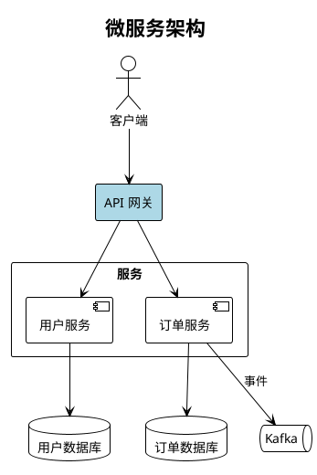
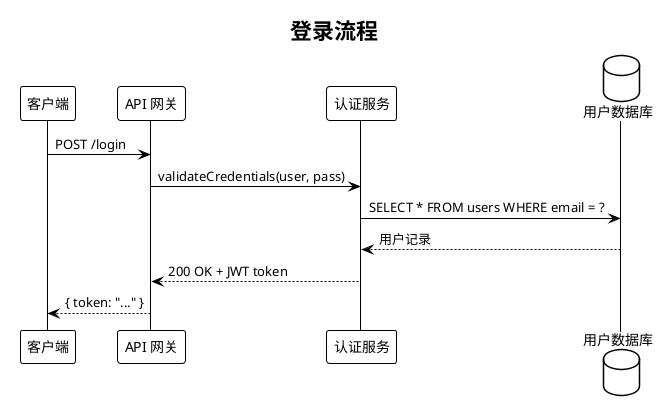
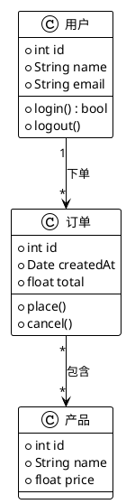
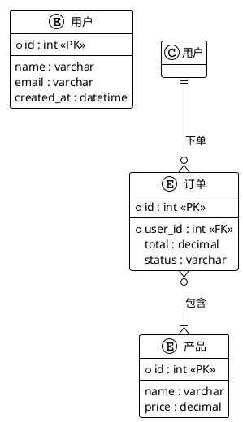
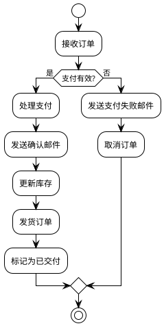
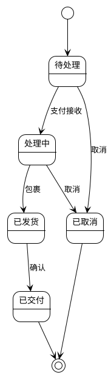
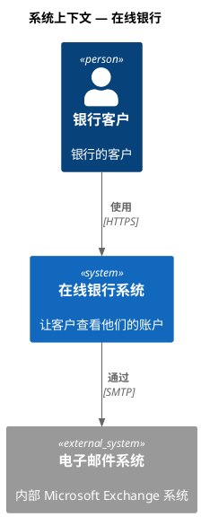

# PlantUML 图表技能

## 概述

生成 `.puml` PlantUML 图表文件，并使用 **Kroki** 导出为 PNG/SVG —— Kroki 是一个云渲染 API，除了 `curl` 无需本地安装。

**格式：** `.puml` (PlantUML 文本)
**渲染器：** Kroki API (`https://kroki.io`) —— 仅需 `curl`，无需 Java
**输出：** PNG, SVG
**图表类型：** 顺序图、组件图、类图、ER 图、活动图、用例图、状态图、C4 图，以及更多

## 何时使用

**显式触发：**

- "plantuml diagram", "sequence diagram", "class diagram", "component diagram"
- "UML", "activity diagram", "use case diagram", "state machine"
- "visualize", "draw", "diagram", "flowchart", "architecture chart"

**主动触发：**

- 解释具有 3 个或更多交互组件的系统
- 描述 API 流程、认证序列、消息传递
- 显示类层次结构、数据库模式或 ER 模型
- 说明状态机或生命周期流程

**何时不用它 —— 转向其他方案：**

- 嵌入 Markdown 中的通用、非 UML 快速图表 → **mermaid**。
- 自由形式、重度样式或需要像素级控制的图表 → **drawio**。
- 手绘/草图风格 → **excalidraw** 或 **tldraw**。

## 模式

一旦触发，根据用户实际需求进行路由，然后运行共享渲染循环（步骤 4–8）：

| 模式 | 用户想要… | 入口点 |
| --- | --- | --- |
| **生成** (默认) | 从文本描述生成图表 | 以下步骤 1–8 |
| **从代码生成** | 现有源代码的图表 | [`references/from-source-code.md`](references/from-source-code.md) → 步骤 4–8 |
| **嵌入** | 将 PlantUML 嵌入渲染为图像的 Markdown 文档 | [`references/markdown-embed.md`](references/markdown-embed.md) |
| **优化** | 修改现有图表 | 加载其 `.puml`，应用最小编辑（步骤 7），重新渲染（步骤 4–6） |
| **审查** | 知道现有图表是否可读/正确 | 对图像运行步骤 6 视觉自检 |

## 前置条件

**选项 A：Kroki API (推荐 — 无需安装)**

```bash
# 仅需 curl (macOS/Linux/Windows Git Bash 预装)
curl --version
```

**选项 B：本地 Kroki 通过 Docker (用于离线使用)**

```bash
docker run -d -p 8000:8000 yuzutech/kroki
# 然后将命令中的 https://kroki.io 替换为 http://localhost:8000
```

**选项 C：本地 PlantUML jar (传统方式)**

```bash
# 需要 Java + Graphviz
brew install graphviz   # macOS
sudo apt install graphviz  # Ubuntu
# 从 https://plantuml.com/download 下载 plantuml.jar
java -jar plantuml.jar diagram.puml
```

## 工作流程

### 步骤 1：检查依赖项

```bash
curl --version
```

curl 在所有现代系统上都可用。如果缺失，请通过包管理器安装。

### 步骤 2：选择图表类型

选择最合适的 PlantUML 图表类型（见下文参考）。

### 步骤 3：生成 .puml 文件

使用 `@startuml` / `@enduml` 标记编写 PlantUML 源文件。

### 步骤 4：通过 Kroki 导出（捕获 HTTP 状态码）

首先选择后端。下面的默认设置（公共 Kroki）**将 `.puml` 源文件上传到 kroki.io** —— 对于敏感图表，请使用本地后端，并且永远不要无声回退。参见 [`references/rendering-backends.md`](references/rendering-backends.md)。对于本地 Kroki，将 `https://kroki.io` 交换为 `http://localhost:8000`。

```bash
# PNG (推荐) — 保留状态码，以便步骤 5 可以验证
http=$(curl -s -w "%{http_code}" -o diagram.png \
  -X POST https://kroki.io/plantuml/png \
  -H "Content-Type: text/plain" \
  --data-binary "@diagram.puml")
echo "HTTP $http"

# SVG
http=$(curl -s -w "%{http_code}" -o diagram.svg \
  -X POST https://kroki.io/plantuml/svg \
  -H "Content-Type: text/plain" \
  --data-binary "@diagram.puml")
echo "HTTP $http"
```

### 步骤 5：验证和自纠正（循环 — 不要跳过）

永远不要在盲目的 `curl` 上报告成功。首先验证输出；如果以下任何一项成立，则将导出视为**失败**：

- `$http` 不是 `200`。Kroki 在语法错误时返回 `400`，并将错误文本写入输出文件，因此 `.png` 文件可能存在但已损坏。
- 文件为空：`[ -s diagram.png ]` 失败。
- 字节不是真正的图像：`file diagram.png` 应该报告 `PNG image data`；对于 SVG，文件应该以 `<svg` 或 `<?xml` 开头。

```bash
if [ "$http" != "200" ] || [ ! -s diagram.png ]; then
  echo "渲染失败 — Kroki 说:"
  cat diagram.png    # 400 正文包含有问题的行 + 原因
fi
```

失败时：`cat` 输出文件以读取 Kroki 的错误，修复标记的 `.puml` 行（见 **常见错误**），然后重新运行步骤 4。**最多重复 3 次。** 如果目标行修复无法清除，按此顺序降级，每次重新渲染后停止——一旦渲染成功即可停止：

1. 移除异形形状 → 平面 `rectangle`/`component`/`node`
2. 删除 `skinparam` / `!theme` (首先渲染普通样式)
3. 移除 `note` 行
4. 简化标签，用 `"…"` 括起来
5. 减少边
6. 切换到更简单的图表类型，而不是强制当前类型

对于每个图表类型的错误目录和 Kroki 安全子集，请阅读 [`references/kroki-troubleshooting.md`](references/kroki-troubleshooting.md)。如果 3 次尝试后仍然失败，请停止并显示用户原始的 Kroki 错误——不要声称图表已生成。

### 步骤 6：自检（视觉）

步骤 5 的循环仅证明 Kroki 返回了一个**有效的图像**——而不是图表是**可读的**。渲染后，使用代理的视觉能力读取 PNG，并捕获自动布局（Graphviz）无法防止的问题。PlantUML 自己定位所有内容，所以这里的失败是关于可读性，而不是你的坐标：

| 检查 | 查找内容 | 修复 |
| --- | --- | --- |
| 标签截断/溢出 | 文本被裁剪或溢出框外 | 缩短标签，用 `"…"` 括起来，或用 `\n` 拆分 |
| 组件重叠/拥挤 | 盒子接触或拥挤；难以阅读 | 添加 `together { }`，布局提示，或拆分图表 |
| 方向/纵横比错误 | 图表太宽或太高，难以阅读 | 切换 `left to right direction` ↔ `top to bottom direction` |
| 边缘杂乱 | 许多关系交叉，难以跟随 | 重新排序声明，用 `package`/`together` 分组，或添加隐藏边进行布局 |
| 图表类型错误 | 类型不适合内容 | 切换类型（顺序图、状态图、C4、…） |
| 对比度低 | 文本与填充/主题混合 | 调整 `skinparam` / `!theme` 使文本与填充对比 |

- 最大 **2 轮自检**——如果 2 次修复后仍有问题，无论如何都显示给用户。
- **每次修复后重新渲染（步骤 4）和重新验证（步骤 5）。**
- 如果视觉不可用，跳过自检并直接显示 PNG。

### 步骤 7：审查循环

自检后，显示导出的图像并收集反馈。对每个请求应用**最小的 `.puml` 编辑**，然后重新渲染和验证：

| 用户请求 | 编辑操作 |
| --- | --- |
| 修改标签 | 在 `.puml` 中编辑元素/消息文本 |
| 添加/删除元素或关系 | 添加或删除匹配的行 |
| 更改颜色 | `skinparam`，`!theme`，或元素上的内联 `#color` |
| 更改布局方向 | 交换 `left to right direction` ↔ `top to bottom direction` |
| 重组/分组 | 将相关元素包裹在 `package` / `together { }` 中，或重新生成 |

- 每轮覆盖相同的 `diagram.puml` / 输出文件——不要创建 `v1`，`v2`，…
- **安全阀：**5 轮后，建议用户直接在 `.puml` 中微调或使用 [plantuml.com](https://www.plantuml.com/plantuml/uml/)。

### 步骤 8：向用户报告

仅当步骤 5–7 通过后。告诉用户：

- `.puml` 源文件的路径
- 导出的 PNG/SVG 路径
- 生成的简要描述
- 渲染的后端，以及源是否离开机器——例如 "通过公共 Kroki (上传到 kroki.io)" 与 "通过本地 Kroki (保持本地)"

---

## 导入工作流程

两种非默认模式——触发时加载链接的剧本，然后运行相同的步骤 4–8 循环：

- **从现有源代码生成图表**——模块的类图、请求处理器的顺序图、存储库的组件图、ORM 模型的 ER 图。读取代码，提取真实实体/关系，仅绘制存在的内容。→ [`references/from-source-code.md`](references/from-source-code.md)
- **渲染嵌入在 Markdown 中的 PlantUML**——提取 ` ```plantuml ` / ` ```puml ` 块（和链接的 `.puml`），将每个块渲染为图像，并重写 Markdown 带图像链接（例如，发布到 Confluence / Notion，它们不渲染围栏 PlantUML）。→ [`references/markdown-embed.md`](references/markdown-embed.md)

---

## 图表类型

| 类型 | 关键词 | 用于 |
| ------ | --------- | --------- |
| 顺序图 | `@startuml` + 顺序语法 | API 调用、协议流程、消息传递 |
| 组件图 | `@startuml` + 组件 | 服务架构、模块依赖 |
| 类图 | `@startuml` + 类语法 | 面向对象模型、数据结构 |
| ER / 实体图 | `@startuml` + 实体语法 | 数据库模式 |
| 活动图 | `@startuml` + 活动语法 | 工作流、业务流程 |
| 用例图 | `@startuml` + 演员/用例 | 系统需求、用户故事 |
| 状态图 | `@startuml` + 状态语法 | 状态机、生命周期 |
| C4 上下文图 | `@startuml` + C4 包含 | 高级系统上下文图 |
| 思维导图 | `@startmindmap` | 主题分解、概念图 |
| 甘特图 | `@startgantt` | 项目时间线、日程 |

---

## 语法参考

### 组件 / 架构图



**形状类型：**

- `actor "Name" as id` — 粘贴小人（用户、外部参与者）
- `component "Name" as id` — 组件框带 [括号]
- `rectangle "Name" as id` — 普通矩形（用于分组/层）
- `database "Name" as id` — 圆柱形（数据库）
- `queue "Name" as id` — 队列符号
- `cloud "Name" as id` — 云形状（外部服务）
- `node "Name" as id` — 服务器/节点框
- `frame "Name" as id` — 框组
- `package "Name" { }` — 包组

**箭头：**

- `A --> B` — 实线箭头
- `A -> B` — 细箭头
- `A ..> B` — 虚线箭头
- `A --> B : label` — 带标签的箭头
- `A <--> B` — 双向

**颜色：**

- `#LightBlue`, `#LightGreen`, `#LightYellow`, `#Pink`, `#Violet`
- `#AED6F1` (蓝色), `#A9DFBF` (绿色), `#FAD7A0` (橙色), `#F1948A` (红色)
- `#D7BDE2` (紫色), `#F9E79F` (黄色), `#D3D3D3` (灰色)

---

### 顺序图



**箭头类型：**

- `A -> B` — 同步调用
- `A --> B` — 返回/虚线
- `A ->> B` — 异步消息
- `A -[#red]-> B` — 带颜色的箭头
- `activate A` / `deactivate A` — 显示激活框

---

### 类图



**关系：**

- `A --> B` — 关联
- `A --|> B` — 继承
- `A ..|> B` — 实现接口
- `A *-- B` — 组合
- `A o-- B` — 聚合
- `A "1" --> "*" B : label` — 带多重性

---

### ER 图



---

### 活动图 / 流程图



---

### 状态图



---

### C4 上下文图

C4 使用捆绑的 C4-PlantUML 标准库通过 `!include <C4/...>`，Kroki 和最新本地 jar 无需网络获取即可解析。使用**标准** `plantuml` 端点导出（`c4plantuml` Kroki 类型也有效）。



其他级别：`<C4/C4_Container>` (`Container`, `ContainerDb`)，`<C4/C4_Component>` (`Component`)。常用宏：`Person`，`System`，`System_Ext`，`Container`，`Rel`，`Boundary`。**不要**使用远程 `!includeurl https://…` — Kroki 无法获取外部 URL；始终使用捆绑的 `<C4/…>` 形式。

---

## 导出命令

渲染变体的快速参考。Kroki 的命令为简洁起见省略了状态捕获——实际导出时，请使用步骤 4 的形式并运行步骤 5 的验证循环。

```bash
# 通过 Kroki API 导出 PNG (推荐)
curl -s -X POST https://kroki.io/plantuml/png \
  -H "Content-Type: text/plain" \
  --data-binary "@diagram.puml" \
  -o diagram.png

# 通过 Kroki API 导出 SVG
curl -s -X POST https://kroki.io/plantuml/svg \
  -H "Content-Type: text/plain" \
  --data-binary "@diagram.puml" \
  -o diagram.svg

# 通过本地 Kroki Docker (离线)
curl -s -X POST http://localhost:8000/plantuml/png \
  -H "Content-Type: text/plain" \
  --data-binary "@diagram.puml" \
  -o diagram.png

# 通过本地 PlantUML jar (如果已安装)
java -jar plantuml.jar diagram.puml
# 输出：同一目录下的 diagram.png
```

---

## 主题

```plantuml
!theme plain       ← 干净、极简（推荐）
!theme cerulean    ← 蓝色调
!theme blueprint   ← 深蓝色背景
!theme aws-orange  ← AWS 风格
!theme vibrant     ← 活泼的颜色
```

或使用 `skinparam` 进行自定义样式：

```plantuml
skinparam backgroundColor #FAFAFA
skinparam componentBorderColor #555555
skinparam ArrowColor #333333
skinparam FontName Arial
```

---

## 常见错误

下方快速表格；有关每个图表类型的错误目录、Kroki 安全子集和失败降级步骤，请参阅 [`references/kroki-troubleshooting.md`](references/kroki-troubleshooting.md)。

| 错误 | 修复 |
| --------- | ----- |
| `curl` POST 返回 HTML 错误页面 | 检查网络；尝试 `curl -v` 查看错误详情 |
| Kroki 返回 400 Bad Request | `cat` 输出文件——Kroki 在那里写入了有问题的行 + 原因；修复并重新渲染通过步骤 5 循环。在 <https://www.plantuml.com/plantuml/uml/> 验证语法 |
| 箭头方向意外 | 使用 `-->` 向下/向右；明确使用 `-up->`, `-down->`, `-left->`, `-right->` |
| 图表太大/拥挤 | 分成多个图表或使用 `package`/`rectangle` 分组 |
| 缺少 `@startuml` / `@enduml` | 始终用这些标记包裹图表 |
| 标签中包含特殊字符 | 用引号括起来：`"Label: value"` |
| C4 包含未找到 | 使用捆绑的 `!include <C4/C4_Context>`（在标准 `plantuml` 端点和 `c4plantuml` 中解析）；**不要**使用远程 `!includeurl https://…` — Kroki 无法获取外部 URL |
| 组件重叠 | 使用 `together { }` 或明确的布局提示 (`top to bottom direction`) |
| 顺序图的参与者顺序错误 | 在顶部显式声明 `participant`，按从左到右的顺序 |
