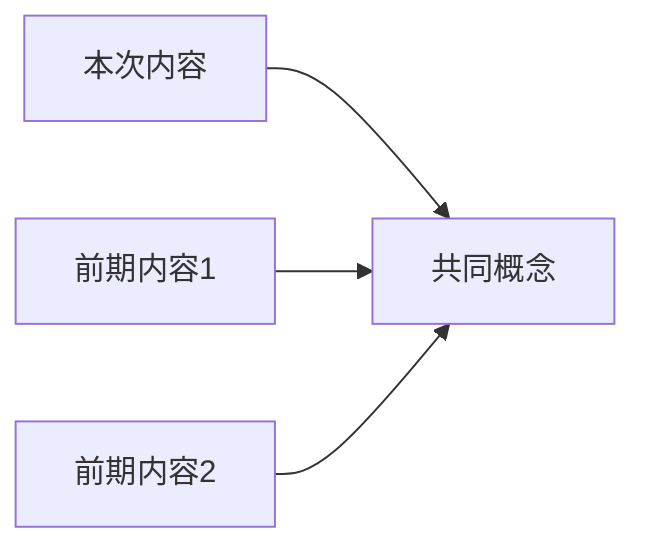

# 内容摘要

内容 → 优先测验式学习 → 选择性深度探索 → 基础概念扩展。

> **基于任务代理的设计**: 长文本由子代理处理，主会话仅消费最终结论

## 架构原则

1. **上下文分离**: 长字幕/正文由任务代理处理，主会话仅读取轻量级md文件
2. **干净转录**: 从字幕中去除编号、时间 → 仅提取纯英文文本
3. **网络研究集成**: 使用提取的关键词自动进行网络搜索
4. **单一输出**: 所有处理结果存储为单个md文件

## 支持内容

| 类型 | 提取方法 | 存储路径 |
|-----|----------|----------|
| YouTube | 任务代理 (yt-dlp + 精炼) | `research/digests/youtube/` |
| X/Twitter | fetch-tweet 技能 (api.fxtwitter.com) | `research/digests/tweet/` |
| 网页 | 任务代理 (浏览器 + 精炼) | `research/digests/web/` |
| PDF | 任务代理 (Read + 精炼) | `research/digests/pdf/` |

## 核心原则

1. **优先测验**: 在查看摘要之前先进行测验 (预测试效应 → 提升9-12%)
2. **知识差距**: 错误的问题会激发好奇心，好奇心会强化记忆
3. **选择性深度**: 用户只深入了解自己想了解的部分
4. **基础扩展**: 通过网络搜索扩展内容之外的基础概念

---

## 工作流概述 (基于任务代理)

```
阶段 1: 内容类型检测
阶段 2: 任务代理执行 (内容提取 + 精炼 + 网络搜索 + md存储)
阶段 3: 主会话读取结果md
阶段 4: 预测验 (3题)
阶段 5: 选择性内容提供
阶段 6: 主测验 (9题)
阶段 7: 解释性提问
阶段 8: 基础扩展
阶段 9: 模式连接
阶段 10: 文档更新 (反映测验结果)
阶段 11: 后续选择
```

---

## 阶段 1: 内容类型检测

根据输入模式自动决定内容类型:

| 模式 | 类型 |
|------|------|
| `youtube.com`, `youtu.be` | YouTube |
| `x.com`, `twitter.com` | X/Twitter |
| `http://`, `https://` (其他) | 网页 |
| `.pdf` 文件路径 | PDF |

不明确时向用户确认:

```
AskUserQuestion:
questions:
  - question: "要分析什么内容？"
    header: "类型"
    options:
      - label: "YouTube视频"
        description: "请提供URL"
      - label: "网页/文章"
        description: "请提供URL"
      - label: "PDF文档"
        description: "请提供文件路径"
```

---

## 阶段 2: 任务代理执行 (核心)

> **在保护主会话上下文的同时处理长内容**

### 2-1. 任务代理调用模式

```
Task:
  subagent_type: "general-purpose"
  description: "内容提取及分析"
  prompt: |
    ## 目标
    从 {URL/文件路径} 提取内容并分析，保存为md文件

    ## 步骤 (顺序重要)
    1. 内容提取 (按类型应用不同方法)
    2. 文本精炼 (去除编号、时间 → 仅提取英文)
    3. 关键词提取 (5-10个)
    4. 网络搜索 (按关键词进行WebSearch)
    5. **核心摘要生成** (3-5句话)
    6. **主要洞察提炼** (3个)
    7. **测验材料生成** (基于摘要/洞察生成核心主题)
    8. md文件保存

    ## 输出路径
    research/digests/{type}/{YYYY-MM-DD}-{sanitized-title}.md
```

### 2-2. X/Twitter提取 (使用fetch-tweet技能)

> **无需任务代理** - 直接使用fetch-tweet脚本提取 (短内容)

```bash
# 提取原文+互动数据
python3 .claude/skills/fetch-tweet/scripts/fetch_tweet.py "{URL}" --json
```

JSON响应中可用的字段:
- `tweet.text`: 推文正文
- `tweet.author`: 作者信息 (name, bio, followers)
- `tweet.likes/retweets/views`: 互动数据
- `tweet.quote`: 引用推文 (存在时结构相同)
- `tweet.media`: 附加图片/视频

推文较短，无需任务代理，主会话直接处理。
引用推文存在时一并分析。
存储路径: `research/digests/tweet/{YYYY-MM-DD}-{author}-{short-topic}.md`

### 2-3. YouTube提取 (任务代理内部)

```
# 1. 字幕提取
yt-dlp --write-auto-sub --sub-lang "en" --skip-download \
  --convert-subs vtt -o "%(title)s" "{URL}"

# 2. VTT → 纯文本转换
sed -E 's/^[0-9]+$//' | \                    # 去除编号
sed -E 's/[0-9]{2}:[0-9]{2}:[0-9]{2}.*//g' | \  # 去除时间戳
sed -E 's/<[^>]+>//g' | \                    # 去除HTML标签
tr -s '\n' | \                               # 合并空行
grep -v '^$'                                 # 去除空行
```

精炼结果: 仅保留纯英文文本 (无编号/时间/重复)

### 2-4. 网页提取 (任务代理内部)

```
1. mcp__claude-in-chrome__tabs_context_mcp
2. mcp__claude-in-chrome__tabs_create_mcp
3. mcp__claude-in-chrome__navigate: url="{URL}"
4. mcp__claude-in-chrome__get_page_text: tabId={tabId}
5. 滚动后检查附加内容
```

### 2-5. PDF提取 (任务代理内部)

```
Read: file_path="{PDF路径}"
```

### 2-6. 网络搜索 (任务代理内部)

从提取文本中识别5-10个关键关键词后:

```
WebSearch (并行执行):
  - "{关键词1} explained"
  - "{关键词2} research"
  - "{作者/演讲者} {主题}"
  - "{核心概念} fundamentals"
```

### 2-7. 最终md文件保存 (任务代理内部)

路径: `research/digests/{type}/{YYYY-MM-DD}-{sanitized-title}.md`

```markdown
---
title: {内容标题}
type: {youtube|web|pdf}
url: {URL或文件路径}
author: {作者/频道名}
date: {发布日期}
processed_at: {处理时间}
keywords: [{关键词1}, {关键词2}, ...]
---

# {内容标题}

## 核心摘要
{3-5句话}

## 主要洞察
1. **{洞察1}**: 说明
2. **{洞察2}**: 说明
3. **{洞察3}**: 说明

## 网络搜索结果
### {关键词1}
- 发现有何内容总结
- 来源: {URL}

### {关键词2}
- 发现有何内容总结
- 来源: {URL}

## 原文 (精炼版)
{去除编号/时间/重复的纯文本}

## 测验材料 (预测验+主测验用)
> **生成顺序**: 必须先编写"核心摘要"和"主要洞察", 然后基于这些创建测验
> **出题原则**: 仅出题核心主题. 禁止日期、统计数据、细节性内容

### 基础级别 (3题候选)
- Q1: {核心概念/信息相关}
- Q2: {主要原则相关}
- Q3: {作者核心论点相关}

### 中级级别 (3题候选)
- Q4: {概念间关系}
- Q5: {证据与逻辑连接}
- Q6: {核心思想的比较}

### 高级级别 (3题候选)
- Q7: {实际应用/扩展}
- Q8: {核心原理的扩展}
- Q9: {作者观点的内涵}
```

---

## 阶段 3: 主会话读取结果

任务代理完成后:

```
Read: file_path="research/digests/{type}/{YYYY-MM-DD}-{sanitized-title}.md"
```

> **主会话仅读取精炼的md文件** → 最大化上下文效率

---

## 阶段 4: 预测验 (核心)

> **目的**: 创建信息差距 → 注意力预热 → 引导主动学习

### 测验出题原则

**仅提问核心主题**: 非细节性内容或数字，仅出题与内容核心信息直接相关的内容
- ✅ 核心概念、主要原则、作者的核心理念
- ❌ 日期、统计数据、辅助性示例、细节性内容

利用结果md文件的"测验材料"部分出题3个:

```
AskUserQuestion:
questions:
  - question: "[预测验] 这段内容可能涉及的核心概念是？"
    header: "PQ1"
    options: [4个选项]
  - question: "[预测验] 作者可能强调的信息是？"
    header: "PQ2"
    options: [4个选项]
  - question: "[预测验] 这个主题中最重要的原则是？"
    header: "PQ3"
    options: [4个选项]
```

**结果处理**:
- 立即显示对错
- 错误问题 → 引导"请查看内容中的这部分"
- **知识差距创建**: "现在看内容时你会想找到答案"

---

## 阶段 5: 选择性内容提供

根据预测验结果向用户提供选项:

```
AskUserQuestion:
questions:
  - question: "您想先看什么内容？"
    header: "内容"
    options:
      - label: "仅错误问题相关部分"
        description: "在预测验中答错的部分的答案"
      - label: "核心洞察3个"
        description: "内容的最重要的要点"
      - label: "总结+洞察"
        description: "综合性的内容分析"
      - label: "直接做主测验"
        description: "不提供总结直接进行9题测验"
```

### 5-1. 错误问题相关部分

仅提取与预测验错误相关的部分:
- YouTube: 对应时间戳
- Webpage: 相关段落
- PDF: 对应页/章节

### 5-2. 核心洞察 (简洁模式)

```markdown
## 核心洞察3个

1. **[关键词]**: 1-2句话说明
2. **[关键词]**: 1-2句话说明
3. **[关键词]**: 1-2句话说明
```

### 5-3. 总结+洞察

```markdown
## 总结
{3-5句话}

## 洞察
### 核心思想
### 可应用点
```

---

## 阶段 6: 主测验 (9题)

3阶段 × 3题. 使用AskUserQuestion逐步进行.

> **出题原则**: 所有问题必须与内容核心主题直接相关. 禁止细节性内容、日期、统计数据.

| 阶段 | 难度 | 出题标准 |
|------|--------|----------|
| 1 | 基础 | 核心信息、主要概念 |
| 2 | 中级 | 概念间关系、证据连接 |
| 3 | 高级 | 案例分析、应用、具体数据 |

问题类型详细: `references/quiz-patterns.md`

**即时反馈**: 每阶段完成后立即提供对错/解析

---

## 阶段 7: 解释性提问

> **"为什么?"问题引发深度处理 (76% vs 69% 正确率提升)**

测验完成后，对核心概念进行深入提问:

```
AskUserQuestion:
questions:
  - question: "以下哪个概念您想更深入理解？"
    header: "深入"
    multiSelect: true
    options:
      - label: "{概念A}"
        description: "探究为什么它很重要"
      - label: "{概念B}"
        description: "理解其基本原理"
      - label: "{概念C}"
        description: "扩展实际应用案例"
      - label: "直接进入下一阶段"
        description: "当前理解水平已足够"
```

选择的概念:
1. "为什么这是事实?"提问与回答
2. 内容中相关依据位置 (时间戳/页/章节)
3. 网络搜索提供额外背景

---

## 阶段 8: 基础扩展 (根本扩展)

> **扩展内容之外的基础知识**

### 8-1. 基础概念网络搜索 (WebSearch 并行 3-5个)

```
搜索查询:
- "{核心概念} fundamentals explained"
- "{核心概念} 基础原理"
- "{理论/方法} original research paper"
- "{作者/演讲者} other works recommendations"
```

### 8-2. 根本知识整理

```markdown
## Foundation Expansion

### 这段内容的根本概念

| 概念 | 说明 | 来源 |
|------|------|------|
| {基础概念1} | 1句话说明 | {URL} |
| {基础概念2} | 1句话说明 | {URL} |

### 深入学习需要

- **先修知识**: {完全理解此内容需要知道什么}
- **后续学习**: {此内容之后可以学习什么}
- **相关研究**: {学术背景}

```

---

## 阶段 9: 模式连接 (与先前学习连接)

> **与现有知识连接时学习效果最大化**

扫描`research/digests/`文件夹中的现有不同摘要:

```markdown
## 相关学习记录

与本次内容相关的前期学习:

| 内容 | 类型 | 连接点 | 日期 |
|-------|------|--------|------|
| {标题} | {youtube/web/pdf} | {共同概念/对比观点} | {日期} |

### 知识网络


```

---

## 阶段 10: 文档更新 (反映测验结果)

任务代理保存的md文件添加测验结果:

```markdown
## Pre-Quiz 结果
{分数及知识差距记录}

## 主测验结果
{分数, 错误笔记}

## 解释性提问
{对选定概念深入探究}
```

> 基础内容在Phase 2中已保存. 这里仅添加学习结果.

---

## 阶段 11: 后续选择

```
AskUserQuestion:
questions:
  - question: "接下来您想做什么？"
    header: "下一步"
    options:
      - label: "重新测验其他问题"
        description: "相同内容, 新的9题"
      - label: "深度研究"
        description: "通过网络深度扩展 (references/deep-research.md)"
      - label: "相关内容推荐"
        description: "查找此主题的其他内容"
      - label: "结束"
        description: "学习完成"
```

---

## 必须的: 优先测验模式

> **无模式选择**. 始终按优先测验进行.
>
> 研究表明, 学习前的测试可提升9-12%效果, 而先看摘要则消除此效果.

```
工作流程 (固定):
1. 内容类型检测
2. Task Agent执行 (提取 + 精炼 + 网络搜索 + md存储)
3. 主会话读取结果md
4. Pre-Quiz (3题) ← 必须首先进行
5. 选择性内容提供
6. 主测验 (9题)
7-9. 深度学习 (Elaboration, Foundation, 模式)
10. 文档更新
11. 后续选择
```

用户要求"仅摘要", "无测验"等:
- "优先测验可提升学习效果9-12%. 先做3题如何?"
- 强烈要求时才提供摘要, 但包含测验建议信息

---

## 内容类型注意事项

### YouTube

#### 字幕语言优先级
1. 韩语自动 → 2. 英语自动 → 3. 韩语手动 → 4. 英语手动

#### yt-dlp选项
- `--list-subs`: 查看字幕列表
- `--cookies-from-browser chrome`: 需要登录时

### 网页

> **始终使用claude-in-chrome**. 禁止使用WebFetch.

#### claude-in-chrome工作流程
```
1. tabs_context_mcp检查标签上下文
2. tabs_create_mcp创建新标签
3. navigate跳转URL
4. get_page_text提取文本
5. scroll加载全部内容 (应对无限滚动)
6. get_page_text重新调用确认附加内容
7. read_page分析结构 (如需)
```

#### 优势
- 完美支持动态内容
- 支持付费/登录内容访问
- 处理无限滚动页面
- 精确获取全文

### PDF

#### Read工具特性
- 可同时识别文本与图像
- 按页面处理
- 可识别表格/图表结构

#### 大量PDF
- 指定页面范围分批处理
- 先查看目录确认后集中处理感兴趣章节

---

## 资源

- `scripts/extract_metadata.sh` - YouTube元数据提取
- `scripts/extract_transcript.sh` - YouTube字幕提取
- `references/quiz-patterns.md` - 测验问题类型详细说明
- `references/deep-research.md` - Deep Research工作流程
- `references/learning-science.md` - 学习科学研究依据

---

## 学习科学依据

此工作流程基于以下研究:

1. **预测试效应** (Richland et al., Roediger & Karpicke)
   - 学习前测试 → 提升9-12%, effect size g = 0.34-0.54

2. **信息差距理论** (Loewenstein, 1994)
   - 知识差距认知 → 多巴胺回路激活 → 强化记忆

3. **解释性提问** (Dunlosky et al., 2013)
   - "为什么?"问题 → 深度处理 → 76% vs 69% 正确率

4. **PACE框架** (Gruber et al., 2019)
   - 好奇状态可提升无关信息记忆力

详细: `references/learning-science.md`
