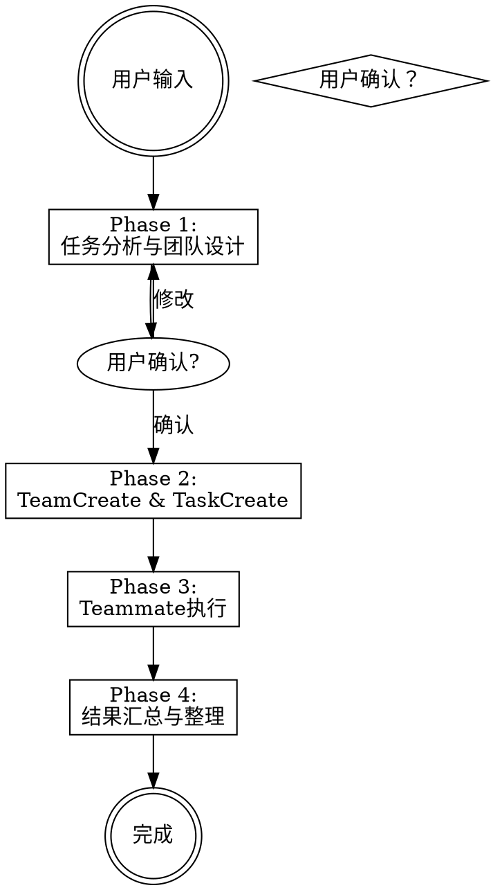

# 团队组建

分析任务并动态组建专家团队，基于TeamCreate立即执行的功能。

## 使用场景

- 可分解为两个以上独立子任务的复杂任务
- 研究与实现与验证等角色分工明确的工作
- 可通过并行执行节省时间的任务

**不适用情况**：单一文件修改、简单提问、仅支持顺序执行的任务

## 工作流程



---

## Phase 1: 任务分析与团队设计

分析任务并决定以下内容：

1. **角色分解** — 分解为独立子任务并分配专家角色
2. **模型选择** — 为各角色分配最佳模型
3. **依赖关系图** — 确定前置关系

### 角色模型映射

| 角色类型 | 模型 | 示例 |
|-----------|------|------|
| 规划/设计/决策 | opus | architect, planner, lead |
| 分析/研究/复杂判断 | opus | analyzer, researcher, code-reviewer |
| 实现/执行/收集 | sonnet | implementer, collector, writer |
| 验证/整理/格式化 | sonnet | validator, formatter, tester |

**边界角色判断**：需要做出新判断吗？→ opus. 需按给定标准执行吗？→ sonnet.

### 团队组建建议

使用AskUserQuestion必须获得确认后执行：

```
团队组建建议: {team-name}

| # | 角色 | 模型 | 负责任务 | 依赖关系 |
|---|------|------|----------|--------|
| 1 | role-name | opus | 任务描述 | - |
| 2 | role-name | sonnet | 任务描述 | #1 |
```

选项： "同意，请执行" / "需要修改角色"

选择"修改角色"时需具体说明要修改什么. 超过2次修改请求时转为自由文本输入.

---

## Phase 2: 团队创建与任务分配

确认后按顺序执行：

```
TeamCreate(team_name: "{keyword}-team", description: "任务描述")
```

team_name规则：任务核心关键词 + `-team` (例如：`migration-team`, `research-team`)

各角色调用TaskCreate后通过TaskUpdate设置blockedBy依赖：

```
TaskCreate(subject: "#1 {角色}: {任务摘要}", description: "详细说明", activeForm: "{任务}进行中")
TaskUpdate(taskId: "2", addBlockedBy: ["1"])
```

---

## Phase 3: Teammate执行

**核心机制**：Task工具在foreground(默认)模式下**阻塞** — 等待teammate完成并返回结果文本. 该返回值即为teammate的工作结果.

### 并行执行

无blockedBy的task以**单条消息**同时调用Task：

```
Task(name: "analyst", team_name: "...", subagent_type: "general-purpose", model: "opus", prompt: "...", mode: "bypassPermissions")
Task(name: "collector", team_name: "...", subagent_type: "general-purpose", model: "sonnet", prompt: "...", mode: "bypassPermissions")
// 两个Task完成后分别接收结果文本
```

### 顺序执行 (依赖关系)

前置task的**返回值**将插入到下一个teammate提示中：

```
Task(name: "writer", prompt: "前置任务结果:\n{result_1}\n\n基于此结果...")
```

### Teammate提示必要元素

1. **背景** — 整个项目与该任务的关系
2. **具体目标** — 需要精确达成的目标
3. **约束条件** — 不能做什么，变更范围限制
4. **输出格式** — 结果形式 (文本/文件/表格)
5. **团队信息** — team_name, task ID → 指示TaskUpdate完成

详细提示模板参考 **`references/prompt-templates.md`**.

---

## Phase 4: 结果汇总与整理

### 结果收集

汇总所有teammate结果并向用户汇报：

```
## 团队执行结果: {team-name}
### 1. {角色}: {任务}  →  {结果摘要}
### 最终产出物
- {文件路径或结果列表}
```

### 团队整理

foreground Task完成后teammate进入idle状态. 整理顺序：

```
SendMessage(type: "shutdown_request", recipient: "{name}", content: "任务完成")
TeamDelete()  // 确认所有teammate终止后
```

无shutdown_request响应则视为已终止 — 忽略并执行TeamDelete.

---

## 常见错误

| 错误 | 正确方法 |
|------|------------|
| 无用户确认创建团队 | Phase 1必须使用AskUserQuestion确认 |
| 所有任务顺序执行 | 独立任务以单条消息并行调用Task |
| teammate提示模糊 | 必须包含背景+目标+约束+输出格式 |
| 忽略TeamDelete | 必须按shutdown_request → TeamDelete顺序整理 |
| 所有角色使用opus | 执行/收集角色使用sonnet节省成本 |

## 快速参考

```
Phase 1: 分析 → AskUserQuestion (团队组建确认)
Phase 2: TeamCreate → TaskCreate × N → TaskUpdate (依赖关系)
Phase 3: Task × N (并行) → 结果传递 → Task × N (后续)
Phase 4: 结果汇总 → shutdown_request × N → TeamDelete
```

## 额外资源

### 参考文件

- **`references/examples.md`** — 包含DB迁移、竞品分析、全栈实现等3个worked example (完整Phase 1~3流程)
- **`references/prompt-templates.md`** — 角色별teammate提示模板 (analyst, implementer, validator)及编写技巧
