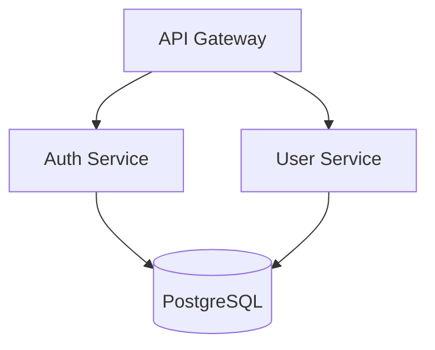

# 高级架构师

用于做出明智技术决策的架构设计和分析工具。

## 目录

- [快速入门](#快速入门)
- [工具概览](#工具概览)
  - [架构图生成器](#1-架构图生成器)
  - [依赖分析器](#2-依赖分析器)
  - [项目架构师](#3-项目架构师)
- [决策流程](#决策流程)
  - [数据库选择](#数据库选择流程)
  - [架构模式选择](#架构模式选择流程)
  - [单体 vs 微服务](#单体-vs-微服务决策)
- [参考文档](#参考文档)
- [技术栈覆盖](#技术栈覆盖)
- [常用命令](#常用命令)

---

## 快速入门

```bash
# 从项目生成架构图
python scripts/architecture_diagram_generator.py ./my-project --format mermaid

# 分析依赖问题
python scripts/dependency_analyzer.py ./my-project --output json

# 获取架构评估
python scripts/project_architect.py ./my-project --verbose
```

---

## 工具概览

### 1. 架构图生成器

从项目结构生成多种格式的架构图。

**解决:** "我需要为文档或团队讨论可视化系统架构"

**输入:** 项目目录路径
**输出:** 图表代码 (Mermaid, PlantUML 或 ASCII)

**支持的图表类型:**
- `component` - 显示模块及其关系
- `layer` - 显示架构层 (表示层、业务层、数据层)
- `deployment` - 显示部署拓扑

**使用方法:**
```bash
# Mermaid 格式 (默认)
python scripts/architecture_diagram_generator.py ./project --format mermaid --type component

# PlantUML 格式
python scripts/architecture_diagram_generator.py ./project --format plantuml --type layer

# ASCII 格式 (终端友好)
python scripts/architecture_diagram_generator.py ./project --format ascii

# 保存到文件
python scripts/architecture_diagram_generator.py ./project -o architecture.md
```

**示例输出 (Mermaid):**


---

### 2. 依赖分析器

分析项目依赖，检测耦合、循环依赖和过时的包。

**解决:** "我需要理解依赖树并识别潜在问题"

**输入:** 项目目录路径
**输出:** 分析报告 (JSON 或人类可读)

**分析:**
- 依赖树 (直接和传递)
- 模块间的循环依赖
- 耦合分数 (0-100)
- 过时的包

**支持的包管理器:**
- npm/yarn (`package.json`)
- Python (`requirements.txt`, `pyproject.toml`)
- Go (`go.mod`)
- Rust (`Cargo.toml`)

**使用方法:**
```bash
# 人类可读报告
python scripts/dependency_analyzer.py ./project

# 用于 CI/CD 集成的 JSON 输出
python scripts/dependency_analyzer.py ./project --output json

# 仅检查循环依赖
python scripts/dependency_analyzer.py ./project --check circular

# 带建议的详细模式
python scripts/dependency_analyzer.py ./project --verbose
```

**示例输出:**
```
依赖分析报告
==========================
总依赖: 47 (32 直接, 15 传递)
耦合分数: 72/100 (中等)

发现的问题:
- CIRCULAR: auth → user → permissions → auth
- OUTDATED: lodash 4.17.15 → 4.17.21 (安全)

建议:
1. 提取共享接口以打破循环依赖
2. 更新 lodash 以修复 CVE-2020-8203
```

---

### 3. 项目架构师

分析项目结构，检测架构模式、代码异味和改进机会。

**解决:** "我想了解当前架构并识别改进领域"

**输入:** 项目目录路径
**输出:** 架构评估报告

**检测:**
- 架构模式 (MVC、分层、六边形、微服务指标)
- 代码组织问题 (神类、混合关注点)
- 层违规
- 缺失架构组件

**使用方法:**
```bash
# 全面评估
python scripts/project_architect.py ./project

# 带详细建议的详细模式
python scripts/project_architect.py ./project --verbose

# JSON 输出
python scripts/project_architect.py ./project --output json

# 检查特定方面
python scripts/project_architect.py ./project --check layers
```

**示例输出:**
```
架构评估
=======================
检测到的模式: 分层架构 (置信度: 85%)

结构分析:
  ✓ controllers/  - 检测到表示层
  ✓ services/     - 检测到业务逻辑层
  ✓ repositories/ - 检测到数据访问层
  ⚠ models/       - 混合领域和 DTOs

问题:
- LARGE FILE: UserService.ts (1,847 行) - 考虑拆分
- MIXED CONCERNS: PaymentController 包含业务逻辑

建议:
1. 将 UserService 拆分为专注的服务
2. 将业务逻辑从控制器移至服务
3. 将领域模型与 DTOs 分离
```

---

## 决策流程

### 数据库选择流程

用于为新项目选择数据库或迁移现有数据。

**步骤 1: 确定数据特征**
| 特征 | 指向 SQL | 指向 NoSQL |
|----------------|---------------|-----------------|
| 结构化带关系 | ✓ | |
| 需要 ACID 事务 | ✓ | |
| 灵活/演进的架构 | | ✓ |
| 文档化数据 | | ✓ |
| 时间序列数据 | | ✓ (专业) |

**步骤 2: 评估规模需求**
- <1M 记录，单个区域 → PostgreSQL 或 MySQL
- 1M-100M 记录，读密集型 → PostgreSQL 带读副本
- >100M 记录，全球分布 → CockroachDB、Spanner 或 DynamoDB
- 高写入吞吐量 (>10K/sec) → Cassandra 或 ScyllaDB

**步骤 3: 检查一致性需求**
- 需要强一致性 → SQL 或 CockroachDB
- 可接受最终一致性 → DynamoDB、Cassandra、MongoDB

**步骤 4: 记录决策**
创建 ADR (架构决策记录)，包含:
- 上下文和需求
- 考虑的选项
- 决策和理由
- 接受的权衡

**快速参考:**
```
PostgreSQL → 大多数应用的默认选择
MongoDB    → 文档存储，灵活架构
Redis      → 缓存、会话、实时功能
DynamoDB   → 无服务器、自动扩展、AWS 原生
TimescaleDB → 带有 SQL 接口的时间序列数据
```

---

### 架构模式选择流程

用于设计新系统或重构现有架构。

**步骤 1: 评估团队和项目规模**
| 团队规模 | 推荐起点 |
|-----------|---------------------------|
| 1-3 开发者 | 模块化单体 |
| 4-10 开发者 | 模块化单体或面向服务 |
| 10+ 开发者 | 考虑微服务 |

**步骤 2: 评估部署需求**
- 可接受单个部署单元 → 单体
- 需要独立扩展 → 微服务
- 混合 (部分服务扩展不同) → 混合

**步骤 3: 考虑数据边界**
- 可接受共享数据库 → 单体或模块化单体
- 需要严格数据隔离 → 带有独立数据库的微服务
- 事件驱动通信适合 → 事件溯源/CQRS

**步骤 4: 将模式与需求匹配**

| 需求 | 推荐模式 |
|-------------|-------------------|
| 快速 MVP 开发 | 模块化单体 |
| 独立团队部署 | 微服务 |
| 复杂领域逻辑 | 领域驱动设计 |
| 高读/写差异 | CQRS |
| 需要审计跟踪 | 事件溯源 |
| 第三方集成 | 六边形/端口和适配器 |

有关详细模式描述，请参阅 `references/architecture_patterns.md`。

---

### 单体 vs 微服务决策

**选择单体当:**
- [ ] 团队规模小 (<10 开发者)
- [ ] 领域边界不明确
- [ ] 优先快速迭代
- [ ] 必须最小化运维复杂性
- [ ] 可接受共享数据库

**选择微服务当:**
- [ ] 团队可以端到端拥有服务
- [ ] 独立部署至关重要
- [ ] 每个组件需要不同扩展需求
- [ ] 需要技术多样性
- [ ] 领域边界明确

**混合方法:**
从模块化单体开始。仅在以下情况下提取服务:
1. 模块具有显著不同的扩展需求
2. 团队需要独立部署
3. 技术限制需要分离

---

## 参考文档

加载这些文件获取详细信息:

| 文件 | 包含 | 用户询问时加载 |
|------|----------|--------------------------|
| `references/architecture_patterns.md` | 9 种架构模式，权衡、代码示例和何时使用 | "哪种模式?", "微服务 vs 单体", "事件驱动", "CQRS" |
| `references/system_design_workflows.md` | 6 步系统设计任务的逐步工作流 | "如何设计?", "容量规划", "API 设计", "迁移" |
| `references/tech_decision_guide.md` | 技术选择的决策矩阵 | "哪种数据库?", "哪种框架?", "哪种云?", "哪种缓存?" |

---

## 技术栈覆盖

**语言:** TypeScript, JavaScript, Python, Go, Swift, Kotlin, Rust
**前端:** React, Next.js, Vue, Angular, React Native, Flutter
**后端:** Node.js, Express, FastAPI, Go, GraphQL, REST
**数据库:** PostgreSQL, MySQL, MongoDB, Redis, DynamoDB, Cassandra
**基础设施:** Docker, Kubernetes, Terraform, AWS, GCP, Azure
**CI/CD:** GitHub Actions, GitLab CI, CircleCI, Jenkins

---

## 常用命令

```bash
# 架构可视化
python scripts/architecture_diagram_generator.py . --format mermaid
python scripts/architecture_diagram_generator.py . --format plantuml
python scripts/architecture_diagram_generator.py . --format ascii

# 依赖分析
python scripts/dependency_analyzer.py . --verbose
python scripts/dependency_analyzer.py . --check circular
python scripts/dependency_analyzer.py . --output json

# 架构评估
python scripts/project_architect.py . --verbose
python scripts/project_architect.py . --check layers
python scripts/project_architect.py . --output json
```

---

## 获取帮助

1. 使用 `--help` 运行任何脚本获取使用信息
2. 检查参考文档获取详细模式和流程
3. 使用 `--verbose` 标志获取详细解释和建议
