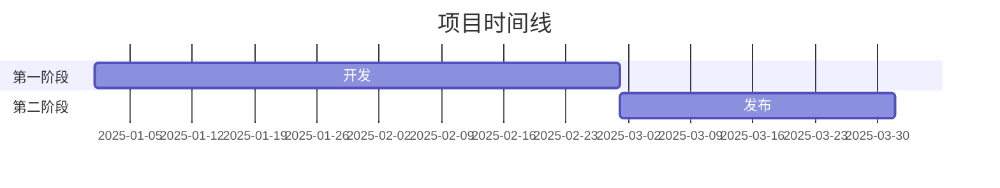
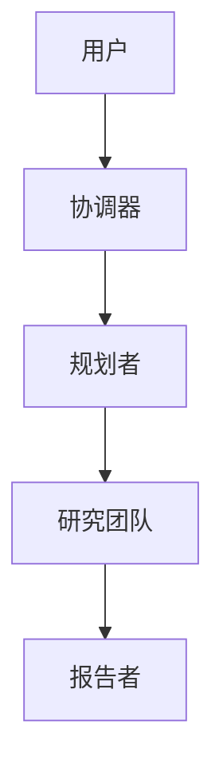
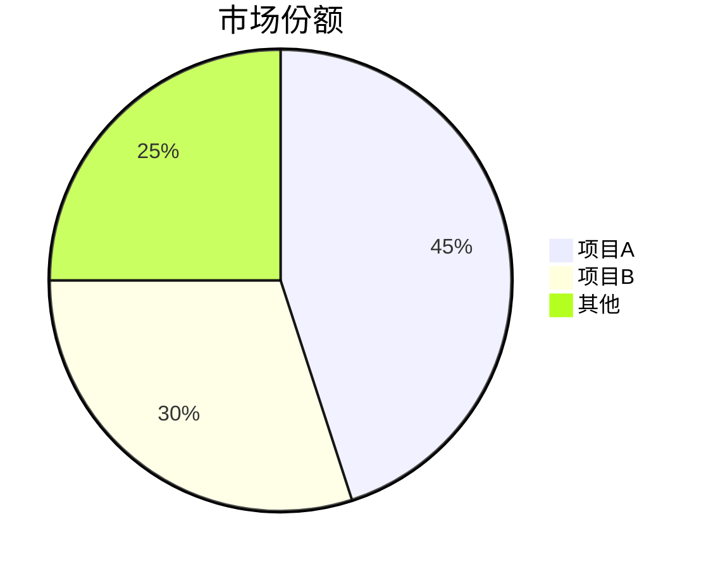

# GitHub深度研究技能

结合GitHub API、web_search和web_fetch进行多轮研究，生成全面的markdown报告。

## 研究工作流

- 第一轮：GitHub API
- 第二轮：发现
- 第三轮：深度调查
- 第四轮：深入分析

## 核心方法论

### 查询策略

**由宽到窄**：从GitHub API开始，然后进行一般查询，根据发现结果进行细化。

```
第一轮：GitHub API
第二轮："{主题}概览"
第三轮："{主题}架构"、"{主题}与替代方案对比"
第四轮："{主题}问题"、"{主题}路线图"、"site:github.com {主题}"
```

**来源优先级**：
1. 官方文档/仓库（最高权重）
2. 技术博客（Medium、Dev.to）
3. 新闻文章（经验证的来源）
4. 社区讨论（Reddit、HN）
5. 社交媒体（最低权重，用于情绪分析）

### 研究轮次

**第一轮 - GitHub API**
直接执行`scripts/github_api.py`，不使用`read_file()`：
```bash
python /path/to/skill/scripts/github_api.py <owner> <repo> summary
python /path/to/skill/scripts/github_api.py <owner> <repo> readme
python /path/to/skill/scripts/github_api.py <owner> <repo> tree
```

**可用命令（`github_api.py`的最后一个参数）**：
- summary
- info
- readme
- tree
- languages
- contributors
- commits
- issues
- prs
- releases

**第二轮 - 发现（3-5 web_search）**
- 获取概览并识别关键术语
- 找到官方网站/仓库
- 确定主要参与者/竞争对手

**第三轮 - 深度调查（5-10 web_search + web_fetch）**
- 技术架构细节
- 关键事件的时间线
- 社区情绪
- 对有价值URL使用web_fetch获取完整内容

**第四轮 - 深入分析**
- 分析提交历史以确定时间线
- 审查问题/PR以了解功能演变
- 检查贡献者活动

## 报告结构

遵循`assets/report_template.md`中的模板：

1. **元数据块** - 日期、置信度、主题
2. **执行摘要** - 2-3句概述，包含关键指标
3. **时间线** - 带日期的阶段分解
4. **关键分析部分** - 主题特定的深入分析
5. **指标与对比** - 表格、增长图表
6. **优势与劣势** - 平衡评估
7. **来源** - 分类参考文献
8. **置信度评估** - 按置信度级别的声明
9. **方法论** - 使用的研究方法

### Mermaid图表

在需要时包含图表：

**时间线（甘特图）**：


**架构（流程图）**：


**对比（饼图/柱状图）**：


## 置信度评分

根据来源质量分配置信度：

| 置信度 | 标准 |
|------------|----------|
| 高（90%+） | 官方文档、GitHub数据、多个相互印证的来源 |
| 中等（70-89%） | 单个可靠来源、近期文章 |
| 低（50-69%） | 社交媒体、未经验证的声明、过时信息 |

## 输出

保存报告为：`research_{主题}_{YYYYMMDD}.md`

### 格式规则

- 中文内容：使用全角标点（，。：；！？）
- 技术术语：首次出现时提供Wiki/文档URL
- 表格：用于指标、对比
- 代码块：用于技术示例
- Mermaid：用于架构、时间线、流程

## 最佳实践

1. **从官方来源开始** - 仓库、文档、公司博客
2. **通过提交/PR验证日期** - 比文章更可靠
3. **交叉验证声明** - 2个或更多独立来源
4. **记录冲突信息** - 不要隐藏矛盾
5. **区分事实与观点** - 清晰标注推测
6. **关键：始终包含内联引用** - 使用`[citation:Title](URL)`格式立即在来自外部来源的每个声明后使用
7. **从搜索结果中提取URL** - web_search返回{title、url、snippet} - 始终使用URL字段
8. **边进行边更新** - 不要等到最后才综合

### 引用示例

**良好 - 带内联引用**：
```markdown
该项目在发布后3个月内获得了10,000个星标 [citation:GitHub Stats](https://github.com/owner/repo)。
架构使用LangGraph进行工作流编排 [citation:LangGraph Docs](https://langchain.com/langgraph)。
```

**不良 - 无引用**：
```markdown
该项目在发布后3个月内获得了10,000个星标。
架构使用LangGraph进行工作流编排。
```
