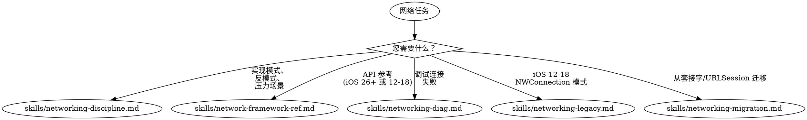

# 网络

**您必须在任何网络工作中使用此技能，包括 HTTP 请求、WebSockets、TCP 连接或网络调试。**

<!-- AXIOM_AUDITOR_INLINE_BEGIN — 由脚本 build-inlined-auditors.ts 自动维护；请勿手动编辑 -->
> **不在 Claude Code 上？** 当此路由器说“启动 `some-auditor` 代理”时，请在此套件中阅读该审计器的文件并按内联方式遵循——相同的程序，只需文件搜索和读取即可。
>
> 可在此处找到：`skills/networking-auditor.md`。
>
> 需要 Bash 的代理——构建、测试、模拟器、崩溃符号化——保持 Claude Code 仅限；没有这些的内联等效项。
<!-- AXIOM_AUDITOR_INLINE_END -->

## 快速参考

| 症状 / 任务 | 参考 |
|----------------|-----------|
| URLSession 与结构化并发 | 查看 `skills/networking-discipline.md` |
| Network.framework 反模式 | 查看 `skills/networking-discipline.md` |
| 废弃 API 迁移 | 查看 `skills/networking-discipline.md` |
| gRPC Swift — 类型化 RPC、流式传输、`.proto` 代码生成 (WWDC 2026) | 查看 `skills/networking-discipline.md` |
| 压力场景（可达性、套接字） | 查看 `skills/networking-discipline.md` |
| NetworkConnection (iOS 26+) API 参考 | 查看 `skills/network-framework-ref.md` |
| NWConnection (iOS 12-18) API 参考 | 查看 `skills/network-framework-ref.md` |
| TLV 帧化、Coder 协议 | 查看 `skills/network-framework-ref.md` |
| NetworkListener、NetworkBrowser、Wi-Fi Aware | 查看 `skills/network-framework-ref.md` |
| 连接超时、TLS 失败 | 查看 `skills/networking-diag.md` |
| 数据未到达、连接中断 | 查看 `skills/networking-diag.md` |
| ATS / HTTP / App Store 拒绝 | 查看 `skills/networking-diag.md` |
| 生产危机诊断 | 查看 `skills/networking-diag.md` |
| NWConnection 模式 (iOS 12-18) | 查看 `skills/networking-legacy.md` |
| UDP 批量、NWListener、NWBrowser | 查看 `skills/networking-legacy.md` |
| BSD 套接字 → NWConnection 迁移 | 查看 `skills/networking-migration.md` |
| 在没有互联网的网络上的推送/调用 (Local Push Connectivity, NEAppPushProvider) | **使用 axiom-integration (skills/local-push-connectivity.md)** |
| NWConnection → NetworkConnection 迁移 | 查看 `skills/networking-migration.md` |
| URLSession StreamTask → NetworkConnection | 查看 `skills/networking-migration.md` |

## 决策树

1. URLSession 与结构化并发？ → `skills/networking-discipline.md`
2. Network.framework / NetworkConnection (iOS 26+)？ → `skills/network-framework-ref.md`
3. NWConnection (iOS 12-18)？ → `skills/networking-legacy.md`
4. 从套接字/URLSession 迁移？ → `skills/networking-migration.md`
5. 连接问题 / 调试？ → `skills/networking-diag.md`
6. 对您控制的服务的类型化 RPC / 流式传输？ → gRPC Swift (`skills/networking-discipline.md`)
7. ATS / HTTP / App Store 拒绝（网络相关）？ → `skills/networking-diag.md` + networking-auditor
8. 证书固定、签名 API 请求、加密有效负载？ → `/skill axiom-security`
9. UIWebView 或废弃 API 拒绝？ → networking-auditor (代理)
10. 想要废弃 API / 反模式扫描？ → networking-auditor (代理)

#### 平台特定的网络
- watchOS 低级网络限制 (TN3135) → 查看 axiom-watchos (skills/background-and-networking.md)

## 压力抵抗

**当用户在自定义实现上投入了大量时间时：**

不要屈服于沉没成本压力。正确的做法是：

1. **首先诊断** — 在推荐更改之前，了解实际失败的原因
2. **专业推荐** — 如果标准 API (URLSession, Network.framework) 会解决问题，请专业地说明
3. **尊重但不禁用** — 承认他们的工作，同时提供诚实的技术指导

## 关键模式

**网络** (`skills/networking-discipline.md`):
- URLSession 与结构化并发
- 8 个红色警告反模式 (SCNetworkReachability、阻塞套接字、硬编码 IP)
- 选择 TCP/UDP/TLS 模式的决策树
- NetworkConnection 模式 (iOS 26+)：TLS、UDP、TLV 帧化、Coder 协议
- 3 个压力场景和专业的反对模板
- 发货前检查清单

**网络框架参考** (`skills/network-framework-ref.md`):
- NetworkConnection (iOS 26+)：所有 12 个 WWDC 2025 示例
- NWConnection (iOS 12-18)：带示例的完整 API
- TLV 帧化、Coder 协议、NetworkListener、NetworkBrowser
- 移动性：可行性、更好路径、多路径 TCP、NWPathMonitor
- 安全性：TLS、证书固定、密码套件
- 性能：用户空间网络、ECN、服务类别、TCP 快速打开

**诊断** (`skills/networking-diag.md`):
- 所有连接失败类型的系统化决策树
- DNS 失败、TLS 证书验证、消息帧化
- TCP 拥塞、仅 IPv6 的蜂窝网络、VPN 干扰、ATS
- 生产危机场景和专业的沟通模板

**遗留** (`skills/networking-legacy.md`):
- NWConnection 与 TLS (完成处理程序)
- UDP 批量 (CPU 减少 30%)
- NWListener、NWBrowser (Bonjour 发现)

## 自动扫描

**网络审计** → 启动 `networking-auditor` 代理或 `/axiom:audit networking`（废弃 API、反模式和不完整差距——过渡处理、TLS 覆盖、连接清理、框架选择）

## 反合理化

| 思想 | 现实 |
|---------|---------|
| "URLSession 很简单，我不需要技能" | URLSession 与结构化并发具有异步/取消模式。`skills/networking-discipline.md` 涵盖它们。 |
| "我会自己调试连接超时" | 连接失败有 8 个原因 (DNS、TLS、代理、蜂窝网络)。`skills/networking-diag.md` 系统地诊断。 |
| "我只需要一个基本的 HTTP 请求" | 即使是基本请求也需要错误处理、重试和取消模式。 |
| "我的自定义网络层工作正常" | 自定义层遗漏了蜂窝网络/代理边缘情况。标准 API 自动处理它们。 |

## 示例调用

用户: "我的 API 请求超时失败"
→ 阅读：`skills/networking-diag.md`

用户: "我该如何使用 URLSession 与 async/await？"
→ 阅读：`skills/networking-discipline.md`

用户: "我需要实现一个 TCP 连接"
→ 阅读：`skills/network-framework-ref.md`

用户: "我应该使用 NWConnection 还是 NetworkConnection？"
→ 阅读：`skills/network-framework-ref.md`

用户: "我的应用因使用 HTTP 连接而被拒绝"
→ 阅读：`skills/networking-diag.md` (ATS 合规性)

用户: "App Store 说我在使用 UIWebView"
→ 调用：`networking-auditor` 代理（废弃 API 扫描）

用户: "检查我的网络代码中的废弃 API"
→ 调用：`networking-auditor` 代理
