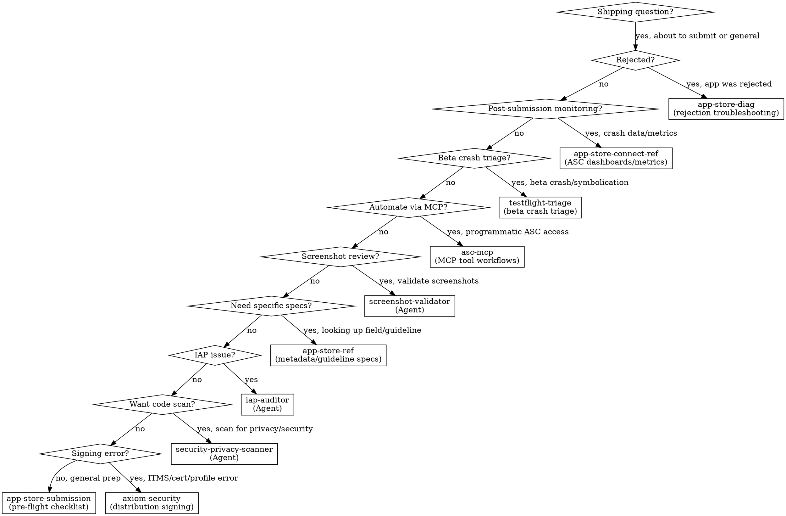

# 发货 & App Store

**在准备提交任何应用、处理 App Store 拒绝或处理发布工作流程时，您必须使用此技能。**

<!-- AXIOM_AUDITOR_INLINE_BEGIN — 由脚本 build-inlined-auditors.ts 自动维护；请勿手动编辑 -->
> **不在 Claude Code 上？** 当此路由器说“启动 `some-auditor` 代理”时，请在此套件中阅读该审计器的文件并按内联方式执行——相同的程序，只需要文件搜索和读取。
>
> 位于另一个套件中：`axiom-integration/skills/iap-auditor.md`，`axiom-security/skills/security-privacy-scanner.md`。
>
> 需要 Bash 的代理——构建、测试、模拟器、崩溃符号化——仅限于 Claude Code；没有这些的内联等效项。
<!-- AXIOM_AUDITOR_INLINE_END -->

## 何时使用

当您遇到以下情况时，请使用此技能：
- 准备应用提交到 App Store
- App Store 拒绝（任何指南）
- 元数据要求（截图、描述、关键词）
- 隐私清单和营养标签问题
- 年级评级和内容分类
- 出口合规和加密声明
- EU DSA 商人状态
- 账户删除或使用 Apple 登录要求
- 构建上传和处理问题
- App Review 申诉
- WWDC25/WWDC26 App Store Connect 更改
- 首次提交工作流程

## 快速参考

| 症状 / 任务 | 参考 |
|----------------|-----------|
| 如何提交我的应用？ | 查看 `skills/app-store-submission.md` |
| 预飞行清单 | 查看 `skills/app-store-submission.md` |
| 首次提交 | 查看 `skills/app-store-submission.md` |
| 加密合规 | 查看 `skills/app-store-submission.md` |
| 无障碍营养标签 | 查看 `skills/app-store-submission.md` |
| 元数据字段要求 | 查看 `skills/app-store-ref.md` |
| 产品页面标题、资源库、搜索视觉效果 `OS27` | 查看 `skills/app-store-ref.md` (第 11 部分) |
| 保留消息（订阅取消流程） `OS27` | 查看 `skills/app-store-ref.md` (第 11 部分) |
| 组 / 数量订阅销售（ABM、ASM、数量定价） `OS27` | 查看 `skills/app-store-ref.md` (第 11 部分) |
| 指南编号查找 | 查看 `skills/app-store-ref.md` |
| 隐私清单架构 | 查看 `skills/app-store-ref.md` |
| 年级评级等级 | 查看 `skills/app-store-ref.md` |
| EU DSA 合规 | 查看 `skills/app-store-ref.md` |
| WWDC25/WWDC26 ASC 更改 | 查看 `skills/app-store-ref.md` |
| 应用被拒绝 | 查看 `skills/app-store-diag.md` |
| 指南 2.1/4.2/4.3 拒绝 | 查看 `skills/app-store-diag.md` |
| 撰写申诉 | 查看 `skills/app-store-diag.md` |
| 重复拒绝 | 查看 `skills/app-store-diag.md` |
| App Review 指南参考 | 查看 `skills/app-review-guidelines.md` |
| 专家评审清单 | 查看 `skills/expert-review-checklist.md` |
| App Store Connect 中的崩溃数据 | 查看 `skills/app-store-connect-ref.md` |
| TestFlight 崩溃报告 | 查看 `skills/app-store-connect-ref.md` |
| ASC 指标仪表板 | 查看 `skills/app-store-connect-ref.md` |
| Beta 测试者崩溃报告、本地组织者崩溃语料库 (.xccrashpoint) | 查看 `skills/testflight-triage.md` |
| 生产语料库分诊（Sentry、ASC — 多个分组问题） | 查看 `skills/production-triage.md` + `triage-analyzer` 代理或 `/axiom:triage` |
| 崩溃日志符号化 (.ips / MetricKit / .crash) | 查看 axiom-tools (skills/xcsym-ref.md) 或 `/axiom:analyze-crash`；`skills/testflight-triage.md` 用于完整的 TF 工作流程 |
| 自动化 App Store Connect | 查看 `skills/asc-mcp.md` |
| 程序提交构建 | 查看 `skills/asc-mcp.md` |
| 通过 MCP 管理TestFlight | 查看 `skills/asc-mcp.md` |
| 上传时出现 ITMS 签名错误 | 查看 axiom-security (skills/code-signing-diag.md) |
| 证书/配置文件不匹配 | 查看 axiom-security (skills/code-signing-diag.md) |
| 代码签名设置 | 查看 axiom-security (skills/code-signing.md) |
| App Clips（大小等级、调用、AASA、启动体验） | 查看 `skills/app-clips.md` |
| App Clip 权限 / 大小 / 数据共享参考 | 查看 `skills/app-clips-ref.md` |
| Apple Pay / Wallet / Tap to Pay 支付 | 查看 `axiom-payments` 套件 |
| 使用 Claude 模型-ID 更改的发货更新（4.6 → 4.7 等） | 查看 **`claude-api`** 技能（外部）+ 此技能用于提交 |
| 在应用内切换云 AI 提供商（OpenAI → Claude 等） | 查看 **`claude-api`** 技能（外部）+ 此技能用于提交 |

## 路由逻辑

### 1. 提交前准备 → **app-store-submission**

**触发器**：
- “我该如何将应用提交到 App Store？”
- “提交前我需要什么？”
- 准备首次提交
- 需要预飞行清单
- 截图要求
- 元数据完整性检查
- 加密合规问题
- 无障碍营养标签
- 提交所需的隐私清单要求

**为什么 app-store-submission**： 这是一个具有 8 种反模式、决策树和压力场景的学科技能。它可以防止导致 90% 拒绝的错误。

**参考**： `skills/app-store-submission.md`

---

### 2. 元数据、指南和 API 参考 → **app-store-ref**

**触发器**：
- “App Store Connect 中需要哪些字段？”
- “应用描述的最大长度是多少？”
- 特定指南编号查找
- 隐私清单架构详细信息
- 年级评级等级和问卷
- IAP 提交元数据
- EU DSA 合规详细信息
- 构建上传方法
- WWDC25 和 WWDC26 对 App Store Connect 的更改

**为什么 app-store-ref**： 11 部分 参考资料，涵盖了每个元数据字段、指南和合规要求的确切规范。

**参考**： `skills/app-store-ref.md`

---

### 3. 拒绝故障排除 → **app-store-diag**

**触发器**：
- “我的应用被拒绝了”
- “指南 2.1 拒绝”
- “二进制文件被拒绝了”
- 指南 4.2 或 4.3 拒绝（应用过于简单、网络包装器、垃圾邮件、重复）
- 指南 1.x 拒绝（令人反感的內容、UGC 调节、儿童类别）
- 如何回应拒绝
- 撰写申诉
- 理解拒绝消息
- 第三次或重复拒绝
- 解决中心沟通

**为什么 app-store-diag**： 9 种诊断模式，将拒绝类型映射到根本原因和修复方案，包括主观拒绝（4.2/4.3，1.x）。包括申诉写作指南和重复拒绝的危机场景。

**参考**： `skills/app-store-diag.md`

---

### 4. 隐私 & 安全合规 → **security-privacy-scanner** (代理)

**触发器**：
- “在提交前扫描我的代码以发现隐私问题”
- 硬编码的 API 密钥或密钥
- 缺少隐私清单
- Required Reason API 声明
- ATS 违规

**为什么 security-privacy-scanner**： 这是一个自主代理，扫描导致拒绝的安全漏洞和隐私合规问题。

**调用**： 启动 `security-privacy-scanner` 代理或 `/axiom:audit security`

---

### 5. IAP 审查问题 → **iap-auditor** (代理)

**触发器**：
- IAP 被拒绝或无法工作
- 缺少 transaction.finish()
- 缺少恢复购买
- 订阅跟踪问题

**为什么 iap-auditor**： 扫描 IAP 代码，查找导致 StoreKit 拒绝的模式。

**调用**： 启动 `iap-auditor` 代理

---

### 6. 截图验证 → **screenshot-validator** (代理)

**触发器**：
- “检查我的 App Store 截图”
- “我的截图尺寸是否正确？”
- “提交前验证截图”
- “审查我的营销截图”
- 截图内容或尺寸问题

**为什么 screenshot-validator**： 这是一个多模式代理，可以视觉检查每个截图，以查找占位符文本、错误尺寸、调试痕迹、损坏的 UI 和竞争对手参考。它可以捕捉人工审查遗漏的问题。

**调用**： 启动 `screenshot-validator` 代理或 `/axiom:audit screenshots`

---

### 7. 程序化 ASC 访问 → **asc-mcp**

**触发器**：
- “自动化 App Store Connect”
- “程序化提交构建”
- “从 Claude 管理TestFlight”
- “通过 API 回应评论”
- “设置 asc-mcp”
- “通过 MCP 将构建分发给 TestFlight 组”
- “无需打开 ASC 即创建新版本”

**为什么 asc-mcp**： 这是一个以工作流程为中心的技能，教 Claude 使用 asc-mcp MCP 工具进行发布管道、TestFlight 分发、评论管理和反馈分诊——所有这些都不离开 Claude Code。

**参考**： `skills/asc-mcp.md`

---

### 8. 提交后监控 → **app-store-connect-ref**

**触发器**：
- “我如何在 App Store Connect 中查看崩溃数据？”
- “我的 TestFlight 崩溃报告在哪里？”
- “我如何阅读 ASC 指标仪表板？”
- 发布后的崩溃调查
- 从 ASC 下载崩溃日志

**为什么 app-store-connect-ref**： ASC 导航，用于崩溃仪表板、TestFlight 反馈、性能指标和数据导出工作流程。

**参考**： `skills/app-store-connect-ref.md`

---

### 9. Beta 崩溃分诊 → **testflight-triage**

**触发器**：
- Beta 测试者报告崩溃
- 崩溃出现在组织者或 App Store Connect 中
- 崩溃日志需要符号化
- 发布后的崩溃调查（单个文件或组织者）

**为什么 testflight-triage**： 从符号化到根本原因分析的系统崩溃分诊。使用 `xcsym` 作为第一步（解析 → 发现 dSYMs → 符号化 → 使用 `pattern_tag` 分类 → 发出结构化 JSON）。

**参考**： `skills/testflight-triage.md`。对于 xcsym 子命令/退出代码参考，请查看 axiom-tools (skills/xcsym-ref.md)。对于单次调用代理工作流程，`/axiom:analyze-crash`。

---

### 10a. 生产语料库分诊 → **production-triage** / **triage-analyzer**

**触发器**：
- “分诊我的 Sentry 崩溃”
- “生产中的顶级崩溃家族是什么？”
- “显示我从 App Store Connect 需要首先修复哪些问题”
- 来自聚合器（Sentry、ASC）的多个分组问题——几十个问题，而不是单个文件
- “这些崩溃中有哪些是真实错误而不是噪音？”
- 语料库级挂起分诊（“我的 ANR 报告是真实的阻塞吗？”）

**为什么 production-triage**： 语料库级分诊需要从聚合器获取，对每个问题进行分类，将挂起假阳性标记为噪音，并将它们聚类为根本原因家族。`testflight-triage` 覆盖组织者路径——单个文件和本地磁盘 `.xccrashpoint` 语料库；`production-triage` 覆盖聚合器路径（Sentry / ASC 分组问题）。

**参考**： `skills/production-triage.md`（获取 + NormalizedReport 架构 + flag-never-hide 规则）。**代理**： `triage-analyzer` 或 `/axiom:triage sentry` / `/axiom:triage asc`。

---

### 10. 分发签名问题 → **code-signing** / **code-signing-diag**

**触发器**：
- ITMS-90035 上传时无效签名
- ITMS-90161 无效的配置文件
- “归档时找不到签名证书”
- 证书在提交前过期
- 归档成功但导出/上传失败
- 配置文件与捆绑包 ID 不匹配
- 上传时的权限不匹配

**为什么 code-signing**： 分发签名错误是上传失败的首要原因。使用 CLI 工具进行诊断需要 5 分钟。code-signing-diag 有 6 个决策树，将 ITMS 错误映射到根本原因。

**参考**： 查看 axiom-security (skills/code-signing-diag.md)（故障排除）或 查看 axiom-security (skills/code-signing.md)（设置）

---

### 11. App Clips → **app-clips**

**触发器**：
- 添加 App Clip 目标，或选择调用方法
- “App Clip 大小限制是多少？” / 构建超过最大大小
- 关联域 / AASA 用于 App Clip 链接
- App Store Connect 默认和高级启动体验
- 将 App Clip 数据传递给升级后的完整应用
- “我的 App Clip 链接什么也不做”

**为什么 app-clips**： App Clips 嵌入在完整应用中，并生活在严格的大小（10/15/100 MB）、权限和功能限制下。该学科涵盖了大小等级、权限、AASA 和数据传递；参考资料有表格。

**参考**： `skills/app-clips.md`，`skills/app-clips-ref.md`

---

## 决策树

简化：

1. 应用被拒绝？→ `skills/app-store-diag.md`
2. 提交后崩溃数据/指标？→ `skills/app-store-connect-ref.md`
3. Beta 崩溃分诊/符号化（组织者或单个文件）？→ `skills/testflight-triage.md`
4. 生产语料库分诊（Sentry/ASC，多个分组问题）？→ `skills/production-triage.md` + `triage-analyzer` 代理
5. 通过 MCP 工具自动化 ASC？→ `skills/asc-mcp.md`
6. 验证截图？→ `screenshot-validator` (代理)
7. 需要特定元数据/指南规范？→ `skills/app-store-ref.md`
8. IAP 提交问题？→ `iap-auditor` (代理)
9. 想要预提交代码扫描？→ `security-privacy-scanner` (代理)
10. 上传时出现 ITMS 签名错误？→ 查看 axiom-security (skills/code-signing-diag.md)
11. 一般提交准备？→ `skills/app-store-submission.md`
12. App Clip（大小等级、调用、AASA、数据传递）？→ `skills/app-clips.md`，`skills/app-clips-ref.md`

#### 平台特定提交
- watchOS 26 SDK 要求，64 位，独立应用提交 → 查看 axiom-watchos (skills/platform-basics.md)

## 反理性化

| 思考 | 现实 |
|---------|---------|
| “我只需提交看看会发生什么” | 40% 的拒绝是指南 2.1（完整性）。app-store-submission 在 10 分钟内可以捕获它们。 |
| “我以前提交过应用，我知道流程” | 要求每年都会变化。隐私清单、年级评级等级、EU DSA、无障碍营养标签自 2024 年以来都是新的。 |
| “拒绝是错误的，我将重新提交” | 没有更改就重新提交会浪费每个周期 24-48 小时。app-store-diag 找到根本原因。 |
| “隐私清单只有大应用才需要” | 自 2024 年 5 月以来，每个使用 Required Reason APIs 的应用都需要清单。缺少 = 自动拒绝。 |
| “我将稍后添加元数据” | 缺少元数据会阻止提交。app-store-ref 有完整的字段列表。 |
| “只是一个错误修复，我不需要完整的清单” | 错误更新仍然需要 What's New 文本、正确的截图和有效的构建。app-store-submission 涵盖了这些。 |
| “我自己用肉眼检查截图” | 人工审查会遗漏尺寸不匹配（即使 1px 偏移 = 拒绝）、微妙的占位符文本和调试指示符。单个遗漏的问题会导致 24-48 小时重新提交。screenshot-validator 在 2 分钟内可以捕获它。 |
| “我将在 ASC 网络仪表板中手动完成” | 如果 asc-mcp 已配置，MCP 工具比手动操作更快，用于批量操作——分发构建、回应评论、创建版本。asc-mcp 有工作流程。 |
| “上传时出现 ITMS 错误，让我重新归档” | ITMS 签名错误是配置——错误的证书、过期的配置文件、缺少权限。使用相同配置重新归档会产生相同的结果。code-signing-diag 有修复方案。 |
| “只是一个模型 ID 交换（Claude 4.6 → 4.7 等）” | 4.6 → 4.7 移除了 `temperature`、`top_p`、`top_k` 和 Messages API 的 prefill。构建成功；运行时在提交后返回 HTTP 400。在提交前阅读 `claude-api`（外部）并测试实时端点。 |
| “我的 App Clip 可以是 100 MB，所以我会添加一个 App Clip Code” | 100 MB 等级（iOS 17+）仅限于数字调用；添加任何 NFC/QR/App Clip Code 都会将限制降至 15 MB。查看 `skills/app-clips.md`。 |

## 外部资源

**云 Claude 迁移（`claude-api` 技能，独立于 Axiom 发送）——在发送任何 Claude 模型-ID 更改前强制执行。** Opus 4.7 从 Messages API 中移除了 `temperature`、`top_p`、`top_k` 和 prefill；在 4.6 上构建的代码在运行时返回 HTTP 400。如果 App Store 更新发送此回归，则是一个加急审查情况。`claude-api` 技能自动化了迁移（模型 ID 交换、采样参数移除、prefill 替换）并从第一天开始强制执行提示缓存。将其视为您预飞行清单的一部分，而不是一个侧边参考。

## 不应使用时（冲突解决）

**不要使用 axiom-shipping 来处理这些——使用正确的技能：**

| 问题 | 正确技能 | 为什么不使用 axiom-shipping |
|-------|---------------|----------------------|
| 构建在归档前失败 | **axiom-build** | 环境构建问题，不是提交 |
| SwiftData 迁移崩溃 | **axiom-data** | 模式问题，不是 App Store |
| 隐私清单编码（编写文件） | **axiom-build** | security-privacy-scanner 处理代码扫描 |
| StoreKit 2 实现（编写 IAP 代码） | **axiom-integration** | in-app-purchases / storekit-ref 涵盖实现 |
| 测试期间发现的性能问题 | **axiom-performance** | 分析问题，不是提交 |
| 无障碍实现 | **axiom-accessibility** | 代码级无障碍，不是 App Store 标签 |

**axiom-shipping 是用于提交工作流程**，而不是代码实现：
- 准备元数据和合规性 → axiom-shipping
- 编写实际代码 → 特定领域技能（axiom-build、axiom-data 等）
- 应用被拒绝 → axiom-shipping
- 修复拒绝的代码更改 → 特定领域技能，然后回到 axiom-shipping 进行验证

## 示例调用

用户：“如何将应用提交到 App Store？”
→ 查看 `skills/app-store-submission.md`

用户：“我的应用因指南 2.1 被拒绝”
→ 查看 `skills/app-store-diag.md`

用户：“我需要哪些截图？”
→ 查看 `skills/app-store-ref.md`

用户：“App Store Connect 中需要哪些字段？”
→ 查看 `skills/app-store-ref.md`

用户：“我如何填写年龄评级问卷？”
→ 查看 `skills/app-store-ref.md`

用户：“我需要加密合规声明吗？”
→ 查看 `skills/app-store-submission.md`

用户：“我的应用不断被拒绝，我该怎么办？”
→ 查看 `skills/app-store-diag.md`

用户：“我如何申诉 App Store 拒绝？”
→ 查看 `skills/app-store-diag.md`

用户：“我的应用因指南 4.2 最小功能被拒绝”
→ 查看 `skills/app-store-diag.md`

用户：“拒绝因为是网络包装器/重复应用”
→ 查看 `skills/app-store-diag.md`

用户：“用户生成内容未经调节的拒绝”
→ 查看 `skills/app-store-diag.md`

用户：“儿童类别合规拒绝”
→ 查看 `skills/app-store-diag.md`

用户：“扫描我的代码以发现 App Store 合规问题”
→ 启动 `security-privacy-scanner` 代理

用户：“在提交前检查我的 IAP 实现”
→ 启动 `iap-auditor` 代理

用户：“检查我的 App Store 截图在 ~/Screenshots”
→ 启动 `screenshot-validator` 代理

用户：“我的截图尺寸是否正确？”
→ 启动 `screenshot-validator` 代理

用户：“分诊我的 Sentry 崩溃”
→ 启动 `triage-analyzer` 代理（或 `/axiom:triage sentry`）

用户：“目前生产中的顶级崩溃家族是什么？”
→ 启动 `triage-analyzer` 代理（或 `/axiom:triage sentry`）

用户：“显示我应首先修复哪些 ASC 问题”
→ 启动 `triage-analyzer` 代理（或 `/axiom:triage asc`）

用户：“我如何在 App Store Connect 中查找崩溃数据？”
→ 查看 `skills/app-store-connect-ref.md`

用户：“我的 TestFlight 崩溃报告在 ASC 中的位置？”
→ 查看 `skills/app-store-connect-ref.md`

用户：“今年 App Store Connect 中的新内容是什么？”
→ 查看 `skills/app-store-ref.md`

用户：“我需要为 EU 设置 DSA 商人状态”
→ 查看 `skills/app-store-ref.md`

用户：“无障碍营养标签是什么？”
→ 查看 `skills/app-store-submission.md`

用户：“这是我第一次提交应用”
→ 查看 `skills/app-store-submission.md`

用户：“程序化提交此构建到 App Store”
→ 查看 `skills/asc-mcp.md`

用户：“设置 asc-mcp 以便使用 App Store Connect”
→ 查看 `skills/asc-mcp.md`

用户：“通过 MCP 将构建 42 分发给我的 Beta 测试者”
→ 查看 `skills/asc-mcp.md`

用户：“从 Claude 回应 App Store 评论”
→ 查看 `skills/asc-mcp.md`

用户：“上传时出现 ITMS-90035 无效签名”
→ 查看 axiom-security (skills/code-signing-diag.md)

用户：“我的配置文件过期了，我无法上传”
→ 查看 axiom-security (skills/code-signing-diag.md)

用户：“如何添加 App Clip？” / “App Clip 大小限制是多少？” / “我的 App Clip 链接什么也不做”
→ 查看 `skills/app-clips.md`
