# SwiftUI

**你必须使用这项技能来完成任何 SwiftUI 工作，包括视图、状态、导航、布局、动画、架构、手势和调试。**

<!-- AXIOM_AUDITOR_INLINE_BEGIN — 由脚本/build-inlined-auditors.ts自动维护；请勿手动编辑 -->
> **如果在 Claude Code 中找不到？** 当这个路由器说“启动 `some-auditor` 代理”时，请在这个套件中阅读该审计器的文件并按行内方式遵循——相同的程序，只需要文件搜索和读取。
>
> 可在此处找到：`skills/swiftui-architecture-auditor.md`、`skills/swiftui-layout-auditor.md`、`skills/swiftui-nav-auditor.md`、`skills/swiftui-performance-analyzer.md`、`skills/textkit-auditor.md`、`skills/ux-flow-auditor.md`。
> 另一个套件中的主目录：`axiom-design/skills/liquid-glass-auditor.md`。
>
> 需要 Bash 的代理——构建、测试、模拟器、崩溃符号化——保持 Claude Code 唯一；没有这些的行内等效项。
<!-- AXIOM_AUDITOR_INLINE_END -->

## 快速参考

| 症状 / 任务 | 参考 |
|----------------|-----------|
| 视图未更新 | 查看 `skills/debugging.md` |
| 调试后视图更新仍然损坏 | 查看 `skills/debugging-diag.md` |
| 慢预览 / 构建良好预览 / `@Previewable` / `PreviewModifier` / 变体矩阵 | 查看 `skills/previews.md` |
| 预览 API 参考 (`#Preview`、特征、模式、开发资源) | 查看 `skills/previews-ref.md` |
| 预览崩溃 / 无法加载 | 查看 `skills/debugging.md` (预览崩溃部分) |
| 热重载 / 实时编辑 / 在设备上编辑正在运行的应用 | 查看 `skills/hot-reload.md` |
| 导航问题 | 查看 `skills/nav.md` |
| 调试后导航仍然损坏 | 查看 `skills/nav-diag.md` |
| 导航 API 参考 | 查看 `skills/nav-ref.md` |
| 在 iPad/旋转时布局损坏 | 查看 `skills/layout.md` |
| 调整大小/旋转时状态丢失（滚动、选择、焦点、草稿） | 查看 `skills/layout.md` (状态在过渡中存活) |
| 布局 API 参考 | 查看 `skills/layout-ref.md` |
| 性能/卡顿/慢滚动 | 查看 `skills/swiftui-performance.md` |
| 架构/可测试性 | 查看 `skills/architecture.md` |
| `@State` 对象在每次视图初始化时重建，或在运行时忽略 `init` 分配 | 查看 `skills/architecture.md` (`@State` 现在是一个宏) |
| 动画问题 | 查看 `skills/animation-ref.md` |
| 栈/网格/轮廓 | 查看 `skills/containers-ref.md` |
| 自定义容器 / 列表替换（iOS 18+） | 查看 `skills/containers-ref.md` 第 7 部分 |
| 搜索实现 | 查看 `skills/search-ref.md` |
| 工具栏、`ToolbarItem`、表单按钮位置、自定义 | 查看 `skills/toolbars.md` |
| 导航副标题：`navigationSubtitle`、`.title` / `.subtitle` / `.largeTitle` / `.largeSubtitle` 位置（iOS 26） | 查看 `skills/toolbars.md` (模式 14) |
| 表单、触发点、弹出窗口、全屏覆盖、呈现适配 | 查看 `skills/presentations.md` |
| 多列表格、可排序/可调整大小的列（iPad/Mac；在紧凑模式下折叠为第一列） | 查看 axiom-macos (skills/swiftui-differences.md) |
| 检查器面板（`.inspector` — 在常规宽度中的尾随列，在紧凑模式中的表单） | 查看 axiom-macos (skills/swiftui-differences.md) |
| 手势冲突 | 查看 `skills/gestures.md` |
| 分区索引——垂直的 A-Z 索引条 / 列表尾部的字母滚动条、跳转到分区 | 查看 `skills/26-ref.md` (分区索引) |
| 列表分区边距 / `Section` 周围的空白 | 查看 `skills/26-ref.md` (分区边距) |
| 网页内容 — `WebView` / `WebPage`、滚动修饰符、WebView 在 `NavigationStack` 中 | 查看 `skills/26-ref.md` (WebView & WebPage) |
| iPhone Duo / 折叠式 iPhone：姿势、垂直条、折痕、排列、铰链、场景附件（SwiftUI 和 UIKit） | 查看 `skills/iphone-duo.md` |
| iOS 26 功能 | 查看 `skills/26-ref.md` |

## 非 SwiftUI UI 路径

这些主题属于更广泛的 iOS UI 领域，但位于单独的套件中：

#### UIKit 问题
- Auto Layout 冲突 → 查看 axiom-uikit (skills/auto-layout-debugging.md)
- 动画时间 → 查看 axiom-uikit (skills/uikit-animation-debugging.md)
- SwiftUI ↔ UIKit 桥接 → 查看 axiom-uikit (skills/uikit-bridging.md)

#### 设计 & 指南
- Liquid Glass 采用 → 查看 axiom-design (skills/liquid-glass.md)
- SF Symbols → 查看 axiom-design (skills/sf-symbols.md)
- HIG 合规性 → 查看 axiom-design (skills/hig.md)
- 字体 → 查看 axiom-design (skills/typography-ref.md)
- TextKit/富文本 → 查看 axiom-uikit (skills/textkit-ref.md)

#### 其他
- tvOS（焦点、遥控器、文本输入）→ 查看 axiom-swift (skills/tvos.md)
- 应用级组合（根、认证、场景）→ 查看 axiom-design (skills/app-composition.md)
- 拖放、共享、复制/粘贴 → 查看 axiom-swift (skills/transferable-ref.md)
- VoiceOver、Dynamic Type → `/skill axiom-accessibility`
- UI 测试不可靠性 → `/skill axiom-testing`
- UX 死胡同、关闭陷阱 → 启动 `ux-flow-auditor` 代理

#### watchOS 特定模式
- 可快速浏览的 UI、watch 导航、智能堆栈小部件 → 查看 axiom-watchos

## 冲突解决

**axiom-swiftui vs axiom-performance**：当 UI 慢（例如，“SwiftUI 列表慢”）：
1. **首先尝试 axiom-swiftui** — 领域特定修复（LazyVStack、视图身份、@State 优化）通常在 5 分钟内解决 UI 性能问题
2. **仅在领域修复无效时使用 axiom-performance** — 分析需要更长时间，可能确认领域知识已经知道的内容

## 决策树

```dot
digraph swiftui {
    start [label="SwiftUI 问题" shape=ellipse];
    what [label="出什么问题了？" shape=diamond];

    start -> what;
    what -> "skills/debugging.md" [label="视图未更新"];
    what -> "skills/nav.md" [label="导航"];
    what -> "skills/swiftui-performance.md" [label="慢/卡顿"];
    what -> "skills/layout.md" [label="自适应布局"];
    what -> "skills/containers-ref.md" [label="栈/网格/轮廓"];
    what -> "skills/architecture.md" [label="功能架构"];
    what -> "skills/animation-ref.md" [label="动画"];
    what -> "skills/gestures.md" [label="手势"];
    what -> "skills/search-ref.md" [label="搜索"];
    what -> "skills/toolbars.md" [label="工具栏 / 表单按钮"];
    what -> "skills/presentations.md" [label="表单/触发点/弹出窗口"];
    what -> "skills/26-ref.md" [label="iOS 26 功能"];
    what -> "skills/iphone-duo.md" [label="iPhone Duo / 折叠式"];
    what -> "skills/previews.md" [label="慢预览 / 构建良好预览"];
    what -> "skills/previews-ref.md" [label="预览 API 参考"];
    what -> "skills/debugging.md" [label="预览崩溃 / 无法加载"];
    what -> "skills/hot-reload.md" [label="热重载 / 实时编辑"];
    what -> "axiom-macos (skills/swiftui-differences.md)" [label="表格 / .inspector\n(大窗口密度)"];
    what -> "axiom-uikit (skills/uikit-bridging.md)" [label="UIKit 互操作"];
    what -> "axiom-design (skills/app-composition.md)" [label="应用级（根、认证）"];
    what -> "axiom-swift (skills/transferable-ref.md)" [label="拖放、共享"];
}
```

## 自动扫描

- 架构审计 → 启动 `swiftui-architecture-auditor` 代理
- 性能扫描 → 启动 `swiftui-performance-analyzer` 代理或 `/axiom:audit swiftui-performance`
- 导航审计 → 启动 `swiftui-nav-auditor` 代理或 `/axiom:audit swiftui-nav`
- 布局审计 → 启动 `swiftui-layout-auditor` 代理或 `/axiom:audit swiftui-layout`
- UX 流程审计 → 启动 `ux-flow-auditor` 代理或 `/axiom:audit ux-flow`
- Liquid Glass 扫描 → 启动 `liquid-glass-auditor` 代理或 `/axiom:audit liquid-glass`（检测迁移机会 AND 采用完整性差距：媒体表面的变体纪律、玻璃上玻璃嵌套、26 之前的无样式回退、语义工具栏位置、`Tab(role: .search)`、`UIDesignRequiresCompatibility` 的放弃；评分 ADOPTED / PARTIAL / NOT ADOPTED）
- TextKit 扫描 → 启动 `textkit-auditor` 代理或 `/axiom:audit textkit`（检测回退触发器、损坏复杂脚本的字形 API、缺少写作工具接线，AND 架构差距如缺少回退观察、SwiftUI 包装器丢失 TextKit 2 属性、缺少 `isWritingToolsActive` 防护；评分 MODERN / MIXED / LEGACY）

## 反理性化

| 思想 | 现实 |
|---------|---------|
| “简单的 SwiftUI 布局，不需要” | SwiftUI 布局有 12 个陷阱。`skills/layout.md` 涵盖了所有陷阱。 |
| “我知道 NavigationStack 的工作原理” | 导航有状态恢复、深度链接和身份陷阱。`skills/nav.md` 防止 2 小时的调试。 |
| “只是一个视图未更新” | 视图更新失败有 4 个根本原因。`skills/debugging.md` 在 5 分钟内诊断。 |
| “我只是添加 .animation()” | 动画问题会累积。`skills/animation-ref.md` 有正确的模式。 |
| “不需要架构” | 即使是小型功能也能从分离中受益。`skills/architecture.md` 防止重构债务。 |
| “我知道 .searchable” | 搜索有 6 个陷阱。`skills/search-ref.md` 涵盖了所有陷阱。 |
| “我只是添加一个 Done 按钮” | 没有取消的表单会破坏 HIG（更新于 2026-03-24）。`.cancellationAction` / `.confirmationAction` 自动生成符合 HIG 的位置——`skills/toolbars.md` 模式 2 有规则。 |
| “表单就是一个表单，没有什么要配置的” | 触发点、紧凑适配、背景交互和 iOS 18 尺寸决定其在不同窗口形状下的行为。`skills/presentations.md` 涵盖了适配陷阱（横向表单在静默中变为全屏覆盖）。 |
| “预览永远慢，我会直接使用模拟器” | `skills/previews.md` 中的五个具体修复。规则 4（自动刷新关闭）是 30 秒，通常将感知速度减半。 |
| "`@State` 在 Xcode 27 中是惰性的，我读了发布说明” | 只有当属性是 `private`/`fileprivate` **并且** 部署目标是 iOS 17 或更高版本——低于 17 的情况下，私有情况会静默地保持旧的急切行为。`skills/architecture.md` 有门禁、三个 TN3211 破坏和一个编译正确但在运行时错误的。 |
| “我会在预览中写一个 `@State` 的包装视图” | `@Previewable @State` (Xcode 16+) 消除了这种样板代码。`skills/previews-ref.md` 有宏签名。 |
| “我会每次重新构建并重新启动” | 热重载在原地编辑正在运行的应用，状态保留。`skills/hot-reload.md` 有 InjectionNext + Inject 设置和 `xclog` 验证循环。 |
| “Duo 只是一个更大的 iPhone；我的布局已经可以调整大小” | 条形移动到侧面，折痕将屏幕分成两半，外显示器无法打开窗口。`skills/iphone-duo.md` 涵盖了仅调整大小会遗漏的内容。 |
