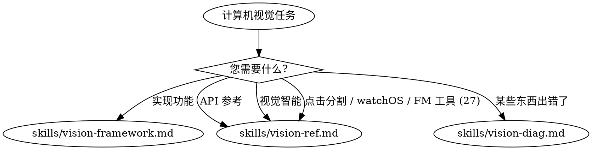

# 计算机视觉

**对于使用 Vision 框架进行的任何计算机视觉工作，您必须使用此技能。**

## 快速参考

| 症状 / 任务 | 参考 |
|----------------|-----------|
| 主体分割、提取 | 查看 `skills/vision-framework.md` |
| 手部/身体姿态检测 | 查看 `skills/vision-framework.md` |
| 文本识别 (OCR) | 查看 `skills/vision-framework.md` |
| 条形码/二维码检测 | 查看 `skills/vision-framework.md` |
| 文档扫描 | 查看 `skills/vision-framework.md` |
| DataScannerViewController | 查看 `skills/vision-framework.md` |
| 结构化文档提取 (iOS 26+) | 查看 `skills/vision-framework.md` |
| 排除手部隔离对象 | 查看 `skills/vision-framework.md` |
| 点击分割任何对象 `OS27` | 查看 `skills/vision-ref.md` |
| watchOS 上的 Vision `watchOS27` | 查看 `skills/vision-ref.md` |
| Foundation Models 的 Vision 工具 (BarcodeReaderTool, OCRTool) `OS27` | 查看 `skills/vision-ref.md` |
| Vision 框架 API 参考 | 查看 `skills/vision-ref.md` |
| 视觉智能集成 (iOS 26+, iPadOS27/macOS27) | 查看 `skills/vision-ref.md` |
| 敏感内容分类 (裸露/血腥/暴力), 通过 `detectedTypes` 分类 (`OS27`) | 查看 `skills/vision-ref.md` |
| 在库、视频高亮/关键帧中按人分组/聚类面部 (`OS27`) | 使用 axiom-media (skills/media-intelligence.md) 而不是 — MediaIntelligence 聚类身份；Vision 在单张图像中检测面部 |
| 主体未检测到 | 查看 `skills/vision-diag.md` |
| 手部/身体姿态缺少关键点 | 查看 `skills/vision-diag.md` |
| 低置信度观察结果 | 查看 `skills/vision-diag.md` |
| 处理期间 UI 冻结 | 查看 `skills/vision-diag.md` |
| 坐标转换错误 | 查看 `skills/vision-diag.md` |
| 文本未识别 / 错误字符 | 查看 `skills/vision-diag.md` |
| 条形码未检测到 | 查看 `skills/vision-diag.md` |
| DataScanner 空白 / 无项目 | 查看 `skills/vision-diag.md` |
| 文档边缘未检测到 | 查看 `skills/vision-diag.md` |

## 决策树

1. 实现 (姿态、分割、OCR、条形码、文档、实时扫描)? → `skills/vision-framework.md`
2. 视觉智能系统集成 (相机/截图搜索；iOS 26+, iPadOS27/macOS27)? → `skills/vision-ref.md` (视觉智能部分)
3. 点击分割、watchOS 上的 Vision 或 Foundation Models 的 Vision 工具 (27 周期)? → `skills/vision-ref.md`
4. 需要 API 参考 / 代码示例? → `skills/vision-ref.md`
5. 调试问题 (检测失败、置信度、坐标)? → `skills/vision-diag.md`

## 关键模式

**实现** (`skills/vision-framework.md`):
- 选择正确 Vision API 的决策树
- 使用 VisionKit 进行主体分割
- 在排除手部时隔离对象 (结合 API)
- 手部/身体姿态检测 (21/19 关键点)
- 文本识别 (快速 vs 精确模式)
- 带符号选择功能的条形码检测
- 文档扫描和结构化提取 (iOS 26+)
- 使用 DataScannerViewController 进行实时扫描
- CoreImage HDR 合成

**诊断** (`skills/vision-diag.md`):
- 主体检测失败 (帧边缘、光照)
- 关键点跟踪问题 (置信度阈值)
- 性能优化 (帧跳过、下采样)
- 坐标转换 (左下 vs 顶部原点)
- 文本识别失败 (语言、对比度)
- 条形码检测问题 (符号、大小、眩光)
- DataScanner 故障排除 (可用性、数据类型)

## 反理性化

| 思想 | 现实 |
|---------|---------|
| "Vision 框架只是一个请求/处理器模式" | Vision 具有坐标转换、置信度阈值和性能陷阱。vision-framework.md 涵盖了这些内容。 |
| "我将不使用技能处理文本识别" | VNRecognizeTextRequest 具有快速/精确模式和语言特定设置。vision-framework.md 包含了模式。 |
| "主体分割很简单" | 实例掩码具有 HDR 合成和排除手部的模式。vision-framework.md 涵盖了复杂场景。 |
| "视觉智能只是相机 API" | 视觉智能是一项系统级功能，需要 IntentValueQuery 和 SemanticContentDescriptor。vision-ref.md 包含了集成部分。 |
| "我将在主线程上处理" | Vision 在旧设备上会阻塞 UI。iPhone 12 用户将体验到冻结的应用。15 分钟添加后台队列。 |

## 示例调用

用户: "如何在图像中检测手部姿态?"
→ 查看 `skills/vision-framework.md`

用户: "隔离主体但排除用户的手部"
→ 查看 `skills/vision-framework.md`

用户: "如何从图像中读取文本?"
→ 查看 `skills/vision-framework.md`

用户: "使用相机扫描 QR 码"
→ 查看 `skills/vision-framework.md`

用户: "主体检测不起作用"
→ 查看 `skills/vision-diag.md`

用户: "文本识别返回错误字符"
→ 查看 `skills/vision-diag.md`

用户: "给我 VNDetectHumanBodyPoseRequest 示例"
→ 查看 `skills/vision-ref.md`

用户: "如何让我的应用与视觉智能配合使用?"
→ 查看 `skills/vision-ref.md`

用户: "让用户在照片中点击对象将其裁剪出来"
→ 查看 `skills/vision-ref.md` (迭代分割)

用户: "我可以在 watchOS 应用中使用 Vision 吗?"
→ 查看 `skills/vision-ref.md` (watchOS 上的 Vision)

用户: "RecognizeDocumentsRequest API 参考"
→ 查看 `skills/vision-ref.md`

用户: "将面部按人分组到我的库中" / "在设备上按图像聚类面部为人物"
→ 使用 `axiom-media` (`skills/media-intelligence.md`) — 跨资产的身份聚类，而不是每张图像的检测
