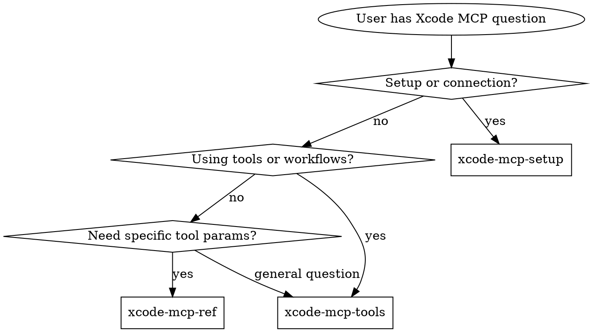

# Xcode MCP

**您必须在任何 Xcode MCP 交互中使用此技能——设置、工具使用、工作流模式或故障排除。**

Xcode 随附一个 MCP 服务器，将 IDE 工具暴露给外部 AI 客户端。`xcrun mcpbridge` 是自 Xcode 26.3 起可用的标准输入输出传输客户端注册方式。Xcode 27 添加了一个明确的“允许外部代理使用 Xcode 工具”设置、`run-agent` 启动路径、代理扩展模型（自定义 MCP 服务器、技能、插件）以及无头服务器。这一技能套件涵盖了设置、工具参考、工作流模式和故障排除。

**在 Xcode 26.x 上，mcpbridge 需要一个正在运行且打开了项目的 Xcode。** 如果这是一个问题，这些操作中设备/模拟器部分有一个完全独立的 Xcode 非依赖 CLI 路径：`devicectl` + `simctl` + Axiom 的 `xcui`/`xclog`/`xcsym`/`xcprof`。参见 `axiom-tools (skills/device-control-ref.md)`。

**在 Xcode 27 上，这个限制已经不存在了。** `xcrun mcp-server` 可以在关闭 Xcode.app 的情况下运行工具服务——`sudo xcrun mcp-server enable`，然后 `start` 和 `open <路径>`。客户端仍然注册 `xcrun mcpbridge`；桥接器是传输方式，`mcp-server` 是服务。Apple 的工具模式描述 `workspaceIdentifier` 为“在无头模式下使用”，因此无头是一个受支持的模式，而不仅仅是变通方法。

在 **能力** 而不是 **运行时间** 之间选择 MCP 和 CLI 工具（`devicectl`、`simctl` 和 Axiom 的 `xcui`/`xclog`/`xcsym`/`xcprof`）。`xcui` 断言、等待、切换辅助功能设置，并计算 VoiceOver 宣布，它们都不需要 `sudo`——这在 CI 中仍然很重要，因为在 CI 中，无头服务器的 sudo 选择可能不可用。IDE 作者工具（构建状态、渲染预览）仍然是 MCP 专属；`xcodebuild` 构建和测试，但不渲染预览。

## 使用时机

在以下情况下使用此技能：
- 首次设置 Xcode MCP
- 配置 `xcrun mcpbridge` 以用于任何 MCP 客户端
- 使用任何 Xcode MCP 工具（文件操作、构建、测试、预览）
- 通过 MCP 工具构建、测试或预览
- 故障排除 mcpbridge 连接问题
- 工作区目标问题
- 权限对话框混淆
- 使用 AXe (`tap`/`type`/`swipe`) 驱动模拟器输入 -> 阅读 `skills/axe-ref.md`

## 路由逻辑

### 1. 设置/连接 → **xcode-mcp-setup**

**触发条件**：
- 首次 Xcode MCP 设置
- 客户端特定配置（Claude Code、Cursor、Codex、VS Code、Gemini CLI）
- 连接错误（“连接被拒绝”、“当前没有打开的工作区。”）
- 权限对话框混淆
- 多 Xcode 目标 (`MCP_XCODE_PID`)
- 严格客户端的架构合规性问题
- 允许外部代理访问 Xcode（智能设置门控）
- 通过 Xcode 配置启动代理 (`xcrun mcpbridge run-agent`)
- 导出 Xcode 的技能包 (`xcrun agent skills export`)
- 扩展 Xcode 的代理（每个代理的配置文件、MCP 服务器、插件）

**阅读**：`skills/xcode-mcp-setup.md`

---

### 2. 使用工具和工作流 → **xcode-mcp-tools**

**触发条件**：
- 如何通过 MCP 构建/测试/预览
- 工作流模式（BuildFix 循环、TestFix 循环）
- 工具陷阱和反模式
- 工作区目标策略；无头引导（打开或创建工作区）
- 何时使用 MCP 工具与 CLI (`xcodebuild`)
- 破坏性操作安全性 (`XcodeRM`、`XcodeMV`)

**阅读**：`skills/xcode-mcp-tools.md`

---

### 3. 工具 API 参考 → **xcode-mcp-ref**

**触发条件**：
- 特定工具参数和模式
- 工具的输入/输出格式
- “XcodeGrep 是如何工作的？”
- “BuildProject 接受哪些参数？”
- 工具类别列表

**阅读**：`skills/xcode-mcp-ref.md`

---

## 决策树

## 反理性化

| 思考 | 现实 |
|------|------|
| "我直接使用 xcodebuild" | MCP 提供了 IDE 状态、过滤的编译器诊断和渲染预览，而 CLI 不暴露这些 |
| "我已经知道如何设置 MCP" | 客户端配置不同。权限对话框行为是特定的。检查设置技能。 |
| "我可以弄清楚工具参数" | 工具模式有必需字段和陷阱。检查参考技能。 |
| "一个工作区已经打开，所以我可以跳过标识符" | `workspaceIdentifier` 无论如何都是必需的，尽管它不在任何 `required` 列表中。 |
| "这只是文件读取，我将使用 Read 工具" | XcodeRead 看到Xcode的项目视图，包括生成的文件和解析的包 |

## 冲突解决（与其他路由器对比）

| 领域 | 所有者 | 原因 |
|------|------|------|
| MCP 特定交互（mcpbridge、mcp-server、MCP 工具、工作区标识符） | **axiom-xcode-mcp** | MCP 协议和工具特定 |
| Xcode 环境（衍生数据、僵尸进程、模拟器） | **axiom-build** | 环境诊断，不是 MCP |
| Apple 的捆绑文档（for-LLM 指南/诊断） | **axiom-apple-docs** | 捆绑文档，不是 MCP 工具 |
| `DocumentationSearch` MCP 工具使用特定 | **axiom-xcode-mcp** | MCP 工具调用 |
| 通过 CLI 诊断的构建失败 | **axiom-build** | 传统构建调试 |
| 通过 MCP 工具诊断的构建失败 | **axiom-xcode-mcp** | MCP 工作流模式 |

## 示例调用

用户："如何设置 Xcode MCP 与 Claude Code？"
-> 阅读：`skills/xcode-mcp-setup.md`

用户："如何使用 MCP 工具构建我的项目？"
-> 阅读：`skills/xcode-mcp-tools.md`

用户："BuildProject 接受哪些参数？"
-> 阅读：`skills/xcode-mcp-ref.md`

用户："我的 mcpbridge 连接不断失败"
-> 阅读：`skills/xcode-mcp-setup.md`

用户："如何定位特定工作区？" / "如何在不打开 Xcode 的情况下运行？"
-> 阅读：`skills/xcode-mcp-tools.md`

用户："我能通过 MCP 渲染 SwiftUI 预览吗？"
-> 阅读：`skills/xcode-mcp-tools.md`（工作流），然后 `skills/xcode-mcp-ref.md`（参数）

用户："Cursor 无法解析 Xcode 的 MCP 响应"
-> 阅读：`skills/xcode-mcp-setup.md`（架构合规性部分）

## 资源

**技能**：skills/xcode-mcp-setup.md, skills/xcode-mcp-tools.md, skills/xcode-mcp-ref.md, skills/axe-ref.md
