# Mermaid 图表专家

## 概述

**目的**：为文档、架构可视化和流程映射创建全面的 Mermaid 图表

**类别**：技术 **主要用户**：技术文档编写者、架构验证者、产品技术专家、技术主管

## 何时使用此技能

- 创建架构文档
- 可视化工作流和流程
- 记录数据模型（ERDs）
- 解释序列流
- 创建状态机
- 记录组件关系
- 创建决策树
- 可视化用户旅程

## 前置条件

**必需的**：

- 对要记录的系统/流程的理解
- 访问技术规范
- 了解所需的图表类型

**可选的**：

- 设计系统颜色以保持一致性
- 现有文档以供参考

## 输入

**技能需要的内容**：

- 流程/系统描述
- 实体和关系（用于 ERDs）
- 组件交互（用于序列图）
- 架构层（用于 C4 图）
- 状态和转换（用于状态图）

## 工作流程

### 第 1 步：图表类型选择

**目标**：为需求选择合适的图表类型

**可用图表类型**：

1. **流程图**：决策流、算法、流程
2. **序列图**：API 交互、消息流
3. **ERD**：数据库模式、实体关系
4. **类图**：面向对象设计
5. **状态图**：状态机、生命周期
6. **甘特图**：项目时间线、日程
7. **C4 图**：不同层级的架构
8. **饼图/条形图**：数据可视化
9. **Git 图**：版本控制流
10. **用户旅程**：用户体验流

**决策矩阵**：

- 带决策的流程 → **流程图**
- API/系统交互 → **序列图**
- 数据库结构 → **ERD**
- 系统架构 → **C4 图**
- 对象关系 → **类图**
- 状态转换 → **状态图**
- 项目时间线 → **甘特图**

**验证**：

- [ ] 图表类型与内容匹配
- [ ] 复杂度适当
- [ ] 考虑了受众
- [ ] 目的明确

**输出**：选定的图表类型

### 第 2 步：流程图创建

**目标**：创建流程和决策流图表

**语法**：

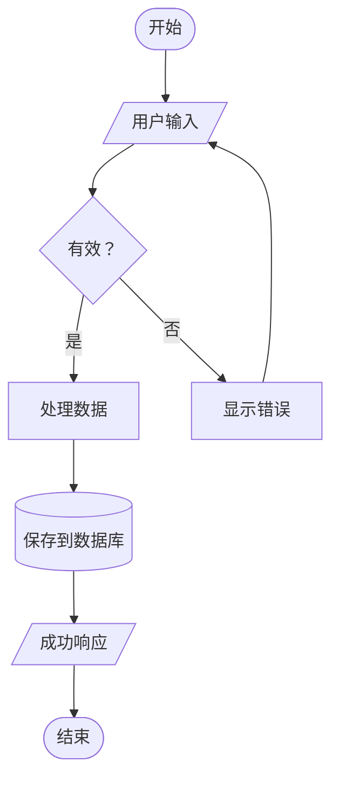

**节点形状**：

- `[矩形]` - 处理步骤
- `([圆角])` - 开始/结束
- `{菱形}` - 决策
- `[/平行四边形/]` - 输入/输出
- `[(数据库)]` - 数据存储
- `((圆形))` - 连接器

**方向选项**：

- `TD` - 从上到下
- `LR` - 从左到右
- `BT` - 从下到上
- `RL` - 从右到左

**示例 - 预订流程**：

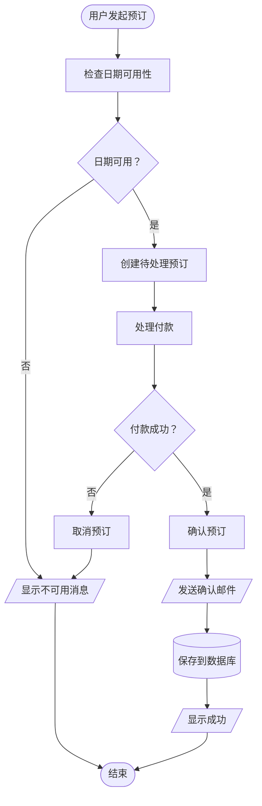

**验证**：

- [ ] 所有路径都覆盖
- [ ] 决策点清晰
- [ ] 开始和结束定义
- [ ] 流向逻辑

**输出**：流程流程图

### 第 3 步：序列图创建

**目标**：记录 API 交互和消息流

**语法**：

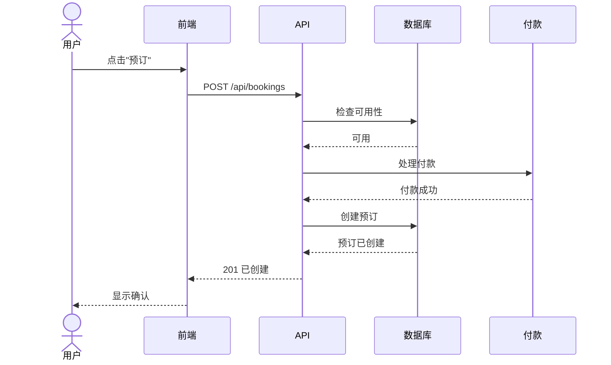

**参与者类型**：

- `actor` - 人类用户
- `participant` - 系统/服务
- `database` - 数据库

**箭头类型**：

- `->` - 实线（同步）
- `-->` - 虚线（响应）
- `->>` - 实线箭头（异步消息）
- `-->>` - 虚线箭头（异步响应）

**示例 - 身份验证流程**：

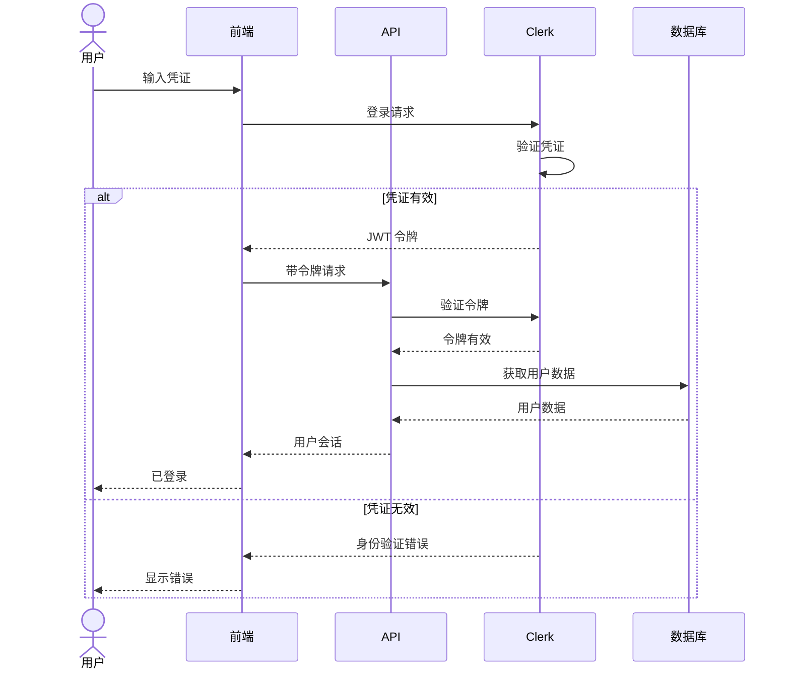

**验证**：

- [ ] 所有参与者已识别
- [ ] 消息流逻辑
- [ ] 返回消息显示
- [ ] Alt/循环块使用正确

**输出**：序列图

### 第 4 步：ERD 创建

**目标**：记录数据库模式和关系

**语法**：

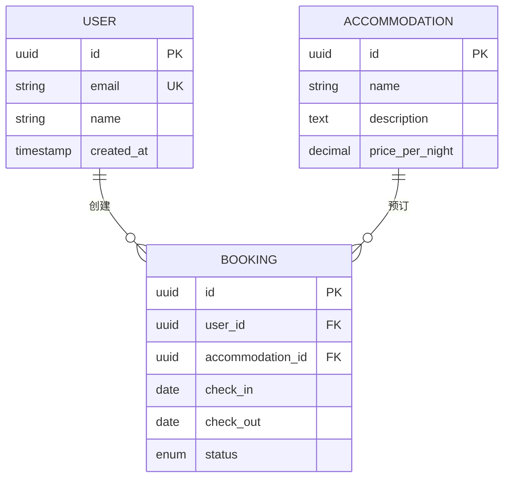

**关系类型**：

- `||--||` - 一对一
- `||--o{` - 一对多
- `}o--o{` - 多对多
- `||--o|` - 一对零或一个

**基数符号**：

- `||` - 恰好一个
- `o|` - 零或一个
- `}o` - 零或更多
- `}|` - 一个或更多

**示例 - 完整 Hospeda ERD**：

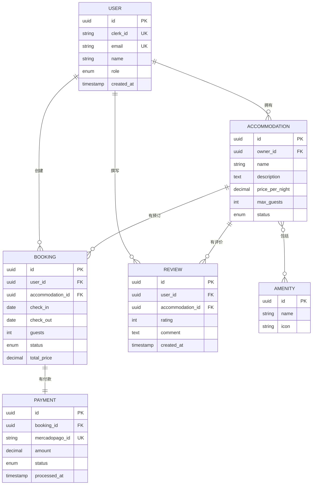

**验证**：

- [ ] 所有实体已定义
- [ ] 关系准确
- [ ] 基数正确
- [ ] 主键/外键标记

**输出**：ERD 图表

### 第 5 步：C4 架构图表

**目标**：记录不同层级的系统架构

**上下文层**（系统在环境中）：

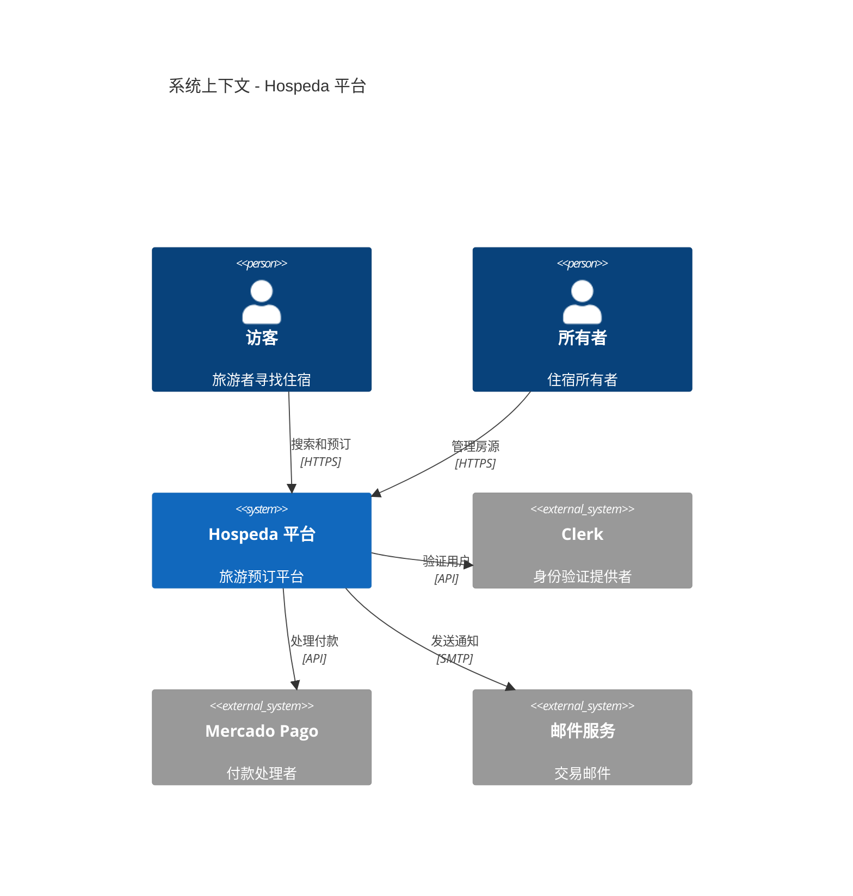

**容器层**（应用程序和数据存储）：

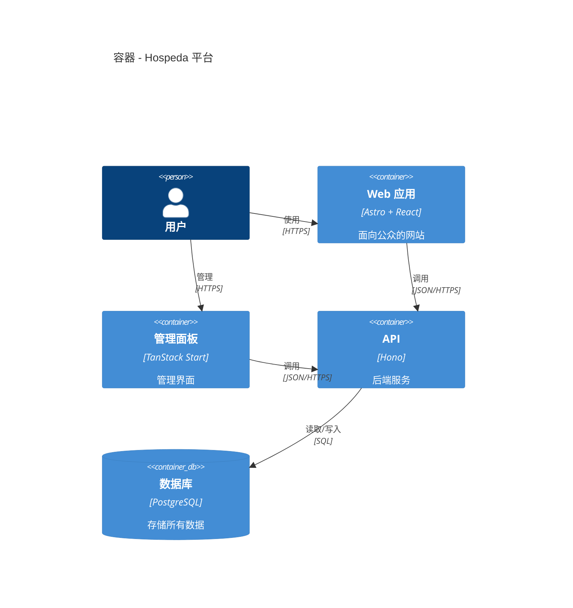

**组件层**（内部结构）：

```mermaid
C4Component
    title 组件 - API 应用

    Container(api, "API", "Hono")

    Component(routes, "路由", "Hono 路由器", "HTTP 端点")
    Component(services, "服务", "业务逻辑", "领域操作")
    Component(models, "模型", "数据访问", "数据库操作")
    Component(middleware, "中间件", "跨切面", "身份验证、日志记录、错误处理")

    Rel(routes, middleware, "使用")
    Rel(routes, services, "调用")
    Rel(services, models, "使用")
    Rel(models, db, "查询")
```

**验证**：

- [ ] 选择了合适的层级
- [ ] 所有系统/容器显示
- [ ] 关系清晰
- [ ] 识别了外部系统

**输出**：C4 架构图表

### 第 6 步：状态图创建

**目标**：记录状态机和生命周期

**语法**：

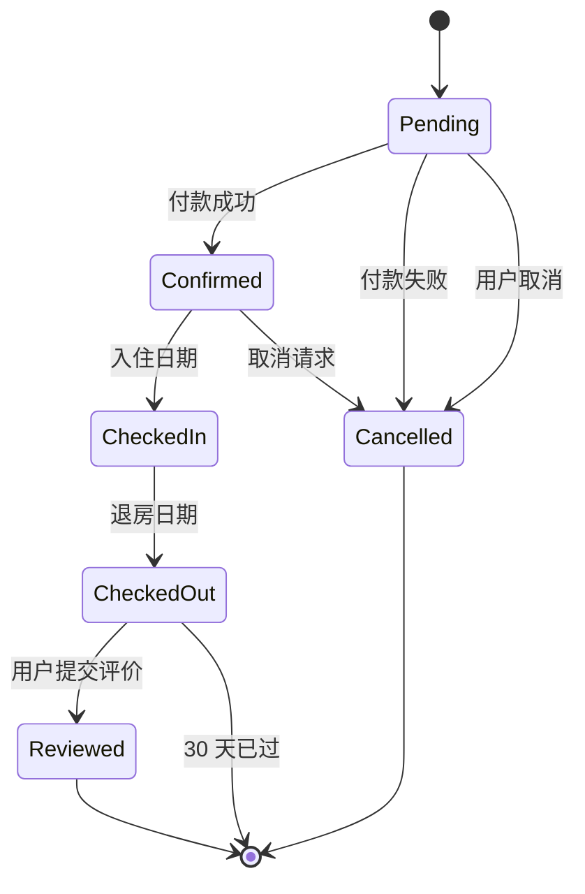

**示例 - 预订生命周期**：

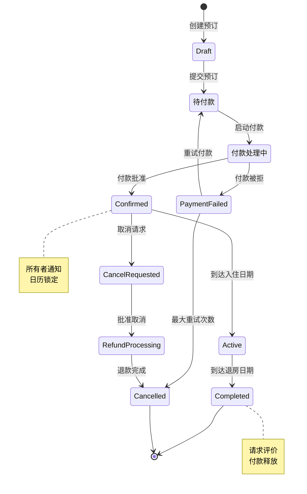

**验证**：

- [ ] 所有状态定义
- [ ] 转换逻辑
- [ ] 开始/结束状态标记
- [ ] 注释解释关键状态

**输出**：状态图

### 第 7 步：样式和定制

**目标**：对图表应用一致的样式

**主题应用**：

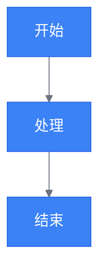

**类样式**：

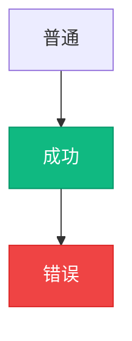

**验证**：

- [ ] 颜色与品牌匹配
- [ ] 对比度足够
- [ ] 样式一致
- [ ] 在两种主题中都可读

**输出**：样式图表

## 输出

**产生**：

- Mermaid 图表代码（Markdown 格式）
- 多种图表类型（按需）
- 样式和主题图表
- 文档化就绪的可视化

**成功标准**：

- 图表准确表示系统
- 所有元素正确标记
- 关系清晰且正确
- 样式与品牌一致
- 在 Markdown 中正确渲染

## 最佳实践

1. **简洁性**：保持图表专注且不杂乱
2. **标签**：所有元素都有清晰、描述性的标签
3. **方向**：保持一致的流向（通常从上到下或从左到右）
4. **分组**：使用子图将相关元素分组
5. **颜色**：使用颜色突出显示重要元素
6. **注释**：添加注释以解释复杂逻辑
7. **层级**：为受众选择适当的抽象层级
8. **更新**：保持图表与代码同步
9. **注释**：在 mermaid 代码中添加注释以保持可维护性
10. **测试**：在目标平台上验证图表渲染

## 常见模式

### API 请求流

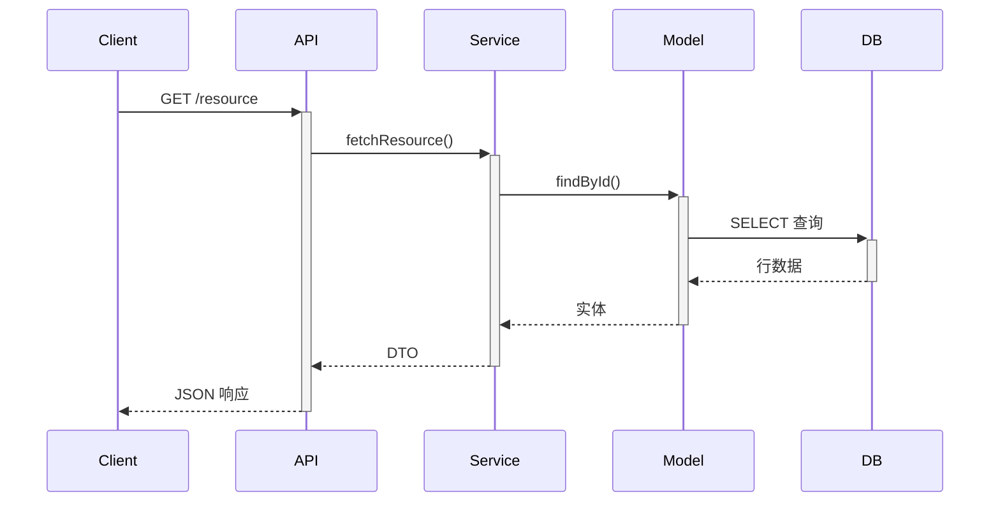

### 错误处理流

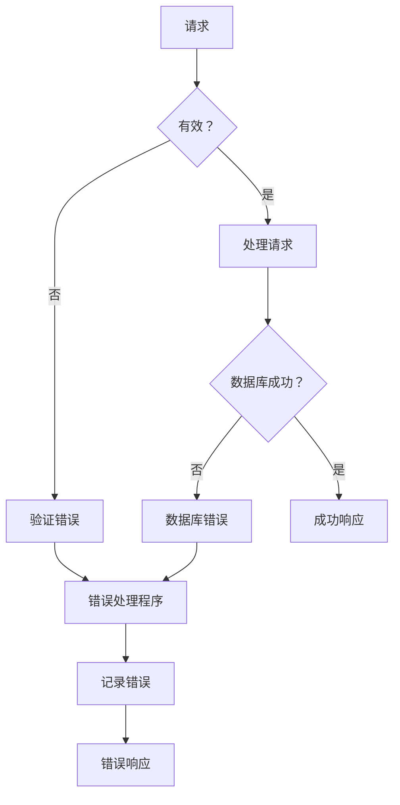

## 备注

- Mermaid 在 GitHub、GitLab、Notion 和大多数 Markdown 查看器中渲染
- 实时编辑器可在 mermaid.live 上使用
- 最大复杂度：保持少于 20 个节点以保持可读性
- 使用子图对相关节点进行分组
- 在提交前在目标平台上测试渲染
- 将图表源保持在 Markdown 文件中，而不是图像
- 使用代码进行图表版本控制
- 在代码审查期间更新图表
