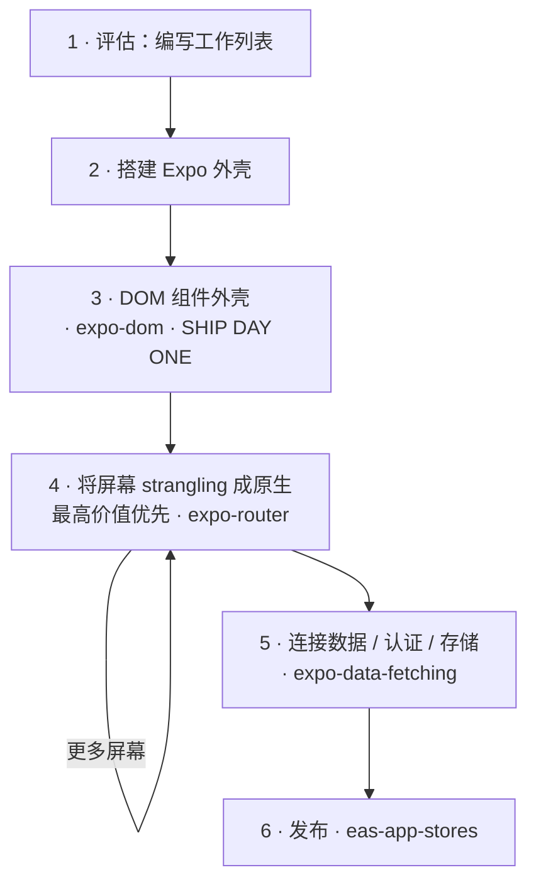

# Web to Native

一个 Web React 应用程序不会 *转换* 成原生——没有转换器。它 **迁移**，逐屏地，就像 strangler fig 围绕树木生长并逐渐取代它一样：第一天在原生外壳中运行整个 Web UI，然后按优先级顺序将每个屏幕 strangling 成原生。这项技能是工作的骨干；每一步都转交给现有的 Expo 技能，而不是重新解释。它使 Expo 的 [使用 React 从 Web 到原生](https://expo.dev/blog/from-web-to-native-with-react) 操作化——阅读那篇以了解原因。



## 原则

- **迁移，不要重写。** 不要进行大爆炸式迁移；每一步都保持应用程序可发布。
- **第一天发布。** Web UI 在 DOM 组件外壳（第 3 步）中运行，然后再进行任何原生化——这是里程碑；之后的一切都是润色。
- **按价值 strangling。** 原生化热门屏幕；将其他内容保留在 Webview 中。每个 DOM 屏幕都携带一个 ~2 MB 的 Web 运行时——这足以不将所有内容作为 DOM 发布。
- **原生化意味着重新设计，而不是重新包装。** 一个 strangled 屏幕应该看起来像 Apple/Google 发布的样子，而不是 Web 页面重新包装。**首先使用 `@expo/ui`** - 它渲染真实的 SwiftUI/Compose，所以它感觉 *完全* 像操作系统；样式化的 RN 基本元素是仅用于自定义布局的备用方案。此外还有平台导航（`expo-router`：原生标签页、大标题）、液体玻璃和通过 `@expo/ui` 的原生组件，以及移动 UX（弹出层、滑动、触觉）。Web→原生模式映射是 [`./references/native-patterns.md`](./references/native-patterns.md)。如果它仍然感觉像网站，那么你是移植而不是重新设计。
- **通过运行而不是编译来验证。** 一个干净的构建证明不了什么（一个空的 Webview 可以编译得很好）。运行每个屏幕——但要根据 Web 原版比较 *内容和行为*，而不是像素（一个原生化的屏幕应该看起来更原生，而不是完全相同）。
- **编排，不要重新发明。** 每一步都路由到一个现有的技能。这里的价值在于 *顺序* 和 *陷阱*——idiom-by-idiom 映射存在于 [`./references/false-friends.md`](./references/false-friends.md)。

## 建议作为一个循环运行

迁移是一个长循环，直到完成，所以第一步是 **编写目标客观和启动它** —— 不是手动处理屏幕。在 [`./references/run-as-goal.md`](./references/run-as-goal.md) 中填写此应用程序的目标，并展示它；它 **在每次迭代中重新阅读这项技能**，所以每个 `/goal` 转都会重新加载剧本 + 工作列表并驱动下一个屏幕（它甚至可以自引导评估步骤）。然后使用它运行 `/goal`——或者，如果 harness 无法循环，将其写入 `migration-goal.md` 并让用户启动它。下面的步骤是每个迭代执行的；如果不在循环中，请手动运行它们。

## 迁移

> **没有要迁移的存储库** - 作为一个 Web 开发者，只是新鲜构建原生？你不需要这些步骤：使用 `expo-router`，并保留 [`./references/false-friends.md`](./references/false-friends.md) 以供 Web→原生 idiom 映射。以下假设一个现有的 Web 应用程序。

### 1. 评估 → 编写工作列表

阅读存储库并生成 `migration-progress.md`，这是迁移其余部分检查的持久工作列表。进行两次切割：

- **屏幕与后端。** 页面路由（`page.tsx`）是你要迁移的屏幕；服务器路由（`route.ts`）、ORM 和认证处理程序保留在服务器端。决定后端一次：保留它部署（原生应用程序成为 HTTP 客户端）或将其移动到 EAS Hosting（`eas-hosting`）。
- **按每个屏幕应该如何落地进行分组**：**按原样移植**（展示性 → 在 DOM Webview 中发布），**立即原生化**（热门，或需要原生感觉——手势、列表、键盘），**稍后原生化**，或 **混合**（一个围绕 Web 子树的原生外壳，例如一个包装了 markdown 渲染器的聊天列表）。

注意你在阅读时框架的信号——RSC 与客户端、Tailwind/shadcn、数据在哪里获取——因为它们决定了每个屏幕如何移植（false-friends 包含映射；特别是异步服务器组件必须在移动到客户端获取 + 一个展示性组件之前拆分）。**也要标记第三方服务/SDK**——浏览器 SDK 不会携带过 (`false-friends` → *服务 & SDK*)；支付尤其是一个 *分支，而不是交换*（应用程序内数字商品必须使用 RevenueCat 的商店 IAP，~30% ——不是 Stripe），这是一个现在必须做出的商业模型决定，而不是在 App Store 审核时。工作列表只有在每个路由都已排序并且每个屏幕都已分组后才是可信的。

### 2. 搭建外壳

`create-expo-app`，然后在 Expo Router 中镜像 Web 路由——Next 的树几乎 1:1（注意 `[id]/page.tsx` → `[id].tsx`，并且路由可能位于 `src/app/`）。每个路由一个空屏幕。

### 3. 将外壳放入 DOM 组件——第一天里程碑

将每个屏幕作为 DOM 组件（`'use dom'`，按照 `expo-dom` 技能）通过其原生路由渲染，以便整个应用程序在 anything nativized 之前在手机上运行。预期每屏编辑 - 解包服务器组件、交换框架导入（`next/link`）、携带样式 - 所有这些都涵盖在 false-friends 中。然后通过运行验证（下面）；这可以直接发布到 TestFlight。

### 4. 将屏幕 strangling 成原生 — 按价值

从 `migration-progress.md` 顶部向下走。对于每个屏幕，*重新设计* 它为原生 - 不要移植 Web 布局。首先使用 **`@expo/ui`**（真实的 SwiftUI/Compose - 按钮、列表、弹出层、选择器、滑块；[`./references/native-patterns.md`](./references/native-patterns.md) 映射 Web 模式变成哪个原生组件），然后是平台导航（`expo-router` - 原生标签页、大标题）和移动 UX（滑动、触觉、惯性/反向滚动）；RN 基本元素仅用于自定义布局。参考 [`./references/false-friends.md`](./references/false-friends.md) 中的每个 idiom。`@expo/ui` 和 DOM 组件都在 **Expo Go**（SDK 56+）中运行 - 开发构建（`expo-dev-client` 技能）仅用于 *自定义* 原生模块。与运行的 Web 原版比较 *内容和行为*（外观应该变得更原生），然后标记它。每次一个屏幕，应用程序在整个过程中可发布。这是一个对持久工作列表的循环，所以它可以无监督运行 - 交由目标循环（[`./references/run-as-goal.md`](./references/run-as-goal.md)）驱动第 4 步。

### 5. 连接数据、认证和存储

Web 数据层不会随着迁移而保留 - 相对获取、cookie 会话、`localStorage` 和环境变量都会改变（false-friends 中的交换）。使用 `expo-data-fetching` 进行请求和缓存；如果后端移动到 EAS Hosting，则添加 `eas-hosting`。

### 6. 发布

`eas-app-stores` 用于商店构建（App Store / Play / TestFlight），EAS Update 用于发布后的 OTA 推送。

## 通过运行而不是编译来验证

一个绿色的 `expo export` 证明屏幕 *打包*，而不是 *渲染* — 一个屏幕可以构建并且仍然空白或错误渲染。所以在外壳之后以及每个原生化屏幕之后，比较两个 **运行** 的应用程序的相同路由：

- **Web 原版** — 使用 **`agent-browser`**（vercel-labs CLI）捕获它：`open` 路由，`snapshot --json` 可访问性树，`screenshot`。
- **原生** — 使用 **`argent`** 驱动模拟器：`describe` / `debugger-component-tree` 用于结构，`flow` 以重放每次检查。

通过 **内容和行为** 的平等性通过——而不是像素：一个原生化的屏幕应该看起来 *更* 原生，而不是完全相同（DOM-shell 阶段是例外——在那里它是 Web UI，所以它应该匹配）。感觉是原生的一部分，无法通过屏幕截图捕捉——对于具有过渡或手势的屏幕，捕获简短录制，而不仅仅是静态图像（见 `native-patterns.md` → Feel）。这个循环对它的工具很 **有意见**：如果 `agent-browser` 或 `argent` 没有安装，请要求用户并在继续之前安装它——不要回退到手动屏幕截图。完整配方和设置在 [`./references/verify-on-device.md`](./references/verify-on-device.md)。

## 参考

- [`./references/false-friends.md`](./references/false-friends.md) — Web idiom → 原生等效项 + 每个的陷阱。步骤 3–5 的查找，以及任何 Web 开发人员忘记 idiom 的查找。
- [`./references/native-patterns.md`](./references/native-patterns.md) — Web UX *模式* → 原生重新设计（`@expo/ui`-首先）。第 4 步重新设计的剧本，使屏幕看起来像操作系统原生，而不是重新包装。
- [`./references/verify-on-device.md`](./references/verify-on-device.md) — 两个代理的平等配方：驱动 Web 应用程序（浏览器代理）和原生应用程序（argent），打开相同路由，比较。
- [`./references/run-as-goal.md`](./references/run-as-goal.md) — 一个准备好的、迁移特定的目标客观，用于无监督地驱动第 4 步（每次迭代重新阅读这项技能）。
- [Expo — 使用 React 从 Web 到原生](https://expo.dev/blog/from-web-to-native-with-react) — 这项技能操作的规范指南。

## 提交反馈
如果你在这个技能中遇到错误、误导或过时的信息，请报告它，以便 Expo 可以改进：
```bash
npx --yes submit-expo-feedback@latest --category skills --subject "expo-web-to-native" "<可操作的反馈>"
```
只有在你有具体且可操作的反馈时才提交。尽可能包含所有相关的上下文。
如果 AI 代理反复失败或用户不得不接管 Expo 任务，加载 `expo-skill-feedback` 技能并遵循它的 eval-candidate 流程，而不是重复使用上面的命令。
