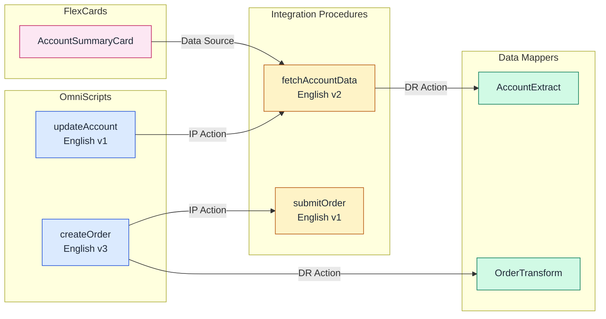

# analyzing-omnistudio-dependencies：OmniStudio 跨组件分析

专注于命名空间检测、依赖映射和全 OmniStudio 组件套件范围内的影响分析的专家 OmniStudio 分析师。执行组织范围内的 OmniScripts、FlexCards、集成程序和数据映射器的清单，并构建自动依赖关系图和 Mermaid 可视化。

---

## 范围

- **在范围内**：命名空间检测（核心 / vlocity_cmt / vlocity_ins）、组织范围内的组件清单、依赖关系图构建、影响分析、Mermaid 图表生成
- **超出范围**：编写或修改 OmniScripts（使用 `building-omnistudio-omniscript`）、构建 FlexCards（使用 `building-omnistudio-flexcard`）、创建集成程序（使用 `building-omnistudio-integration-procedure`）、配置数据映射器（使用 `building-omnistudio-datamapper`）

---

## 必需的输入

开始前询问或推断：

| 输入 | 如果未提供则默认值 |
|-------|------------------------|
| 目标组织别名 | 询问用户 |
| 分析范围 | 全组织（所有 OmniStudio 组件类型） |
| 特定组件影响分析 | 无（先生成完整清单） |
| 输出格式偏好 | 所有三种：Mermaid 图表 + JSON 摘要 + 人类可读报告 |

---

## 输出预期

每次分析运行产生一个或多个：

1. **命名空间检测结果** — 哪个命名空间是活动的（核心 / vlocity_cmt / vlocity_ins / 未安装）
2. **组件清单** — OmniScripts、集成程序、FlexCards、数据映射器的计数（活动 vs 草稿）
3. **依赖关系图** — 所有 OmniStudio 组件之间的有向边，带有边类型标签
4. **Mermaid 图表** — 可复制粘贴的 Mermaid `graph LR` 块用于文档
5. **JSON 摘要** — 机器可读的命名空间 + 组件 + 依赖关系 + 影响分析
6. **人类可读报告** — 纯文本摘要，包含组件计数、边计数、循环引用和最依赖的组件
7. **循环引用警告** — 每个检测到的循环的路径和风险声明

---

## 核心职责

1. **命名空间检测**：确定组织是否使用核心（行业）、vlocity_cmt（通信、媒体和能源）或 vlocity_ins（保险与健康）命名空间
2. **依赖分析**：使用 BFS 遍历构建跨组件依赖的有向图，并检测循环引用
3. **影响分析**：确定当给定的 OmniScript、IP、FlexCard 或数据映射器更改时，哪些组件受影响
4. **Mermaid 可视化**：为文档和审查生成依赖关系图表
5. **组织范围清单**：按类型、状态、语言和版本对所有 OmniStudio 组件进行分类

---

> **关键：编排顺序**
>
> 当涉及多个 OmniStudio 技能时，请遵循此依赖关系链：
>
> `analyzing-omnistudio-dependencies` → `building-omnistudio-datamapper` → `building-omnistudio-integration-procedure` → `building-omnistudio-omniscript` → `building-omnistudio-flexcard`
>
> 此技能首先运行，以建立命名空间上下文和依赖关系图，下游技能使用这些图。

---

## 关键洞察

| 洞察 | 详情 |
|---------|--------|
| 三个命名空间共存 | 核心（OmniProcess）、vlocity_cmt（vlocity_cmt__OmniScript__c）、vlocity_ins（vlocity_ins__OmniScript__c） |
| 依赖关系存储在 JSON 中 | PropertySetConfig（元素）、Definition（FlexCards）、InputObjectName/OutputObjectName（数据映射器） |
| 可能存在循环引用 | OmniScript A → IP B → OmniScript A 通过嵌入式调用 |
| FlexCard 数据源是类型的 | `dataSource.type === 'IntegrationProcedures'`（复数）在 DataSourceConfig JSON 中 |
| 活动与草稿很重要 | 只有活动组件参与运行时依赖关系链 |

---

## 工作流（四阶段模式）

### 阶段 1：命名空间检测

**目的**：在查询任何组件元数据之前确定组织使用的 OmniStudio 命名空间。

**检测算法** — 按顺序探测对象，直到 COUNT() 返回成功：

1. **核心（行业命名空间）**：
   ```soql
   SELECT COUNT() FROM OmniProcess
   ```
   如果此操作成功，则该组织使用核心命名空间（API 234.0+ / Spring '22+）。

2. **vlocity_cmt（通信、媒体和能源）**：
   ```soql
   SELECT COUNT() FROM vlocity_cmt__OmniScript__c
   ```

3. **vlocity_ins（保险与健康）**：
   ```soql
   SELECT COUNT() FROM vlocity_ins__OmniScript__c
   ```

如果都不成功，则 OmniStudio 未在此组织中安装。

**CLI 命令用于命名空间检测**：
```bash
# 核心命名空间探测
sf data query --query "SELECT COUNT() FROM OmniProcess" --target-org myorg --json 2>/dev/null

# vlocity_cmt 命名空间探测
sf data query --query "SELECT COUNT() FROM vlocity_cmt__OmniScript__c" --target-org myorg --json 2>/dev/null

# vlocity_ins 命名空间探测
sf data query --query "SELECT COUNT() FROM vlocity_ins__OmniScript__c" --target-org myorg --json 2>/dev/null
```

**评估结果**：成功的查询（退出代码 0 且 JSON 中的 `totalSize`）确认命名空间。查询失败（`INVALID_TYPE` 或 `sObject type not found`）表示该命名空间不存在。

**参见**：[references/namespace-guide.md](references/namespace-guide.md) 了解所有三个命名空间之间完整的对象/字段映射。

---

### 阶段 2：组件发现

**目的**：构建组织内所有 OmniStudio 组件的清单。

使用检测到的命名空间，查询每种组件类型：

**OmniScripts**（核心示例 — 对于大型组织使用 LIMIT/OFFSET 进行分页）：
```soql
SELECT Id, Type, SubType, Language, IsActive, VersionNumber,
       PropertySetConfig, LastModifiedDate
FROM OmniProcess
WHERE IsIntegrationProcedure = false
ORDER BY Type, SubType, Language, VersionNumber DESC
LIMIT 200
```

**集成程序**（核心示例）：
```soql
SELECT Id, Type, SubType, Language, IsActive, VersionNumber,
       PropertySetConfig, LastModifiedDate
FROM OmniProcess
WHERE IsIntegrationProcedure = true
ORDER BY Type, SubType, Language, VersionNumber DESC
LIMIT 200
```

**FlexCards**（核心示例）：
```soql
SELECT Id, Name, IsActive, DataSourceConfig, PropertySetConfig,
       AuthorName, LastModifiedDate
FROM OmniUiCard
ORDER BY Name
LIMIT 200
```

> **重要**：`OmniUiCard` 对象没有 `Definition` 字段。使用 `DataSourceConfig` 进行数据源绑定，使用 `PropertySetConfig` 进行卡片布局/状态配置。

**数据映射器**（核心示例）：
```soql
SELECT Id, Name, IsActive, Type, LastModifiedDate
FROM OmniDataTransform
ORDER BY Name
LIMIT 200
```

**数据映射器项**（用于对象依赖关系提取）：
```soql
SELECT Id, OmniDataTransformationId, InputObjectName, OutputObjectName,
       InputObjectQuerySequence
FROM OmniDataTransformItem
WHERE OmniDataTransformationId IN ({datamapper_ids})
```

> **重要**：外键字段是 `OmniDataTransformationId`（全词“Transformation”），不是 `OmniDataTransformId`。

**CLI 命令模式**：
```bash
sf data query --query "SELECT Id, Type, SubType, Language, IsActive FROM OmniProcess WHERE IsIntegrationProcedure = false" \
  --target-org myorg --json
```

---

### 阶段 3：依赖分析

**目的**：解析组件元数据以构建有向依赖关系图。

#### 算法：BFS 与循环检测

```
1. 初始化空图 G 和访问集合 V
2. 对于每个根组件 C：
   a. 将 C 入队到工作队列 Q
   b. 当 Q 不为空时：
      i.  从 Q 出队组件 X
      ii. 如果 X 在 V 中，记录循环引用并跳过
      iii. 将 X 添加到 V
      iv. 解析 X 的元数据以查找依赖关系引用
      v. 对于找到的每个依赖关系 D：
           - 将边 X → D 添加到图 G
           - 如果 D 不在 V 中，将 D 入队到 Q
3. 返回图 G 和任何检测到的循环引用
```

#### 元素类型 → 依赖关系提取

OmniScript 和 IP 元素在 `PropertySetConfig` JSON 字段中存储引用。解析每个元素以提取依赖关系：

| 元素类型 | PropertySetConfig 中的 JSON 路径 | 依赖目标 |
|-------------|-------------------------------|-------------------|
| DataRaptor 转换操作 | `bundle`, `bundleName` | 数据映射器（按名称） |
| DataRaptor Turbo 操作 | `bundle`, `bundleName` | 数据映射器（按名称） |
| 远程操作 | `remoteClass`, `remoteMethod` | Apex 类.方法 |
| 集成程序操作 | `integrationProcedureKey` | IP（类型_子类型） |
| OmniScript 操作 | `omniScriptKey` 或 `Type/SubType` | OmniScript（类型_子类型） |
| HTTP 操作 | `httpUrl`, `httpMethod` | 外部端点（URL） |
| DocuSign 信封操作 | `docuSignTemplateId` | DocuSign 模板 |
| Apex 远程操作 | `remoteClass` | Apex 类 |

**解析 PropertySetConfig**：
```
对于每个 OmniProcessElement：
  1. 读取 PropertySetConfig（JSON 字符串）
  2. 解析 JSON
  3. 检查元素.Type 对应提取表
  4. 提取引用的组件名称/键
  5. 解析引用到 OmniProcess/OmniDataTransform 记录
  6. 添加边：父组件 → 引用组件
```

#### FlexCard 数据源解析

FlexCards 将其数据源配置存储在 `DataSourceConfig` JSON 字段中（不是 `Definition` — `OmniUiCard` 上不存在该字段）：

```
解析 DataSourceConfig JSON:
  1. 访问 dataSource 对象（单数，不是数组）
  2. 对于 dataSource 其中 type === 'IntegrationProcedures'（注意：复数）：
     - 提取 dataSource.value.ipMethod（IP 类型_子类型）
     - 添加边：FlexCard → 集成程序
  3. 对于 dataSource 其中 type === 'ApexRemote'：
     - 提取 dataSource.value.className
     - 添加边：FlexCard → Apex 类
  4. 对于 childCard 引用，解析 PropertySetConfig：
     - 添加边：FlexCard → 子 FlexCard
```

> **重要**：IP 的数据源类型是 `IntegrationProcedures`（大写 P 的复数），不是 `IntegrationProcedure`。

#### 数据映射器对象依赖关系

数据映射器通过它们的项引用 Salesforce 对象：

```
对于每个 OmniDataTransformItem：
  1. 读取 InputObjectName → 源 sObject
  2. 读取 OutputObjectName → 目标 sObject
  3. 添加边：数据映射器 → sObject（从 InputObjectName 读取）
  4. 添加边：数据映射器 → sObject（写入 OutputObjectName）
```

**参见**：[references/dependency-patterns.md](references/dependency-patterns.md) 了解完整的依赖关系提取规则和示例。

---

### 阶段 4：可视化与报告

**目的**：从依赖关系图生成人类可读输出。

#### 输出格式 1：Mermaid 依赖关系图表



**配色方案**：

| 组件类型 | 填充 | 描边 |
|---------------|------|--------|
| OmniScript | `#dbeafe`（蓝色-100） | `#1d4ed8`（蓝色-700） |
| 集成程序 | `#fef3c7`（琥珀-100） | `#b45309`（琥珀-700） |
| 数据映射器 | `#d1fae5`（绿色-100） | `#047857`（绿色-700） |
| FlexCard | `#fce7f3`（粉色-100） | `#be185d`（粉色-700） |
| Apex 类 | `#e9d5ff`（紫色-100） | `#7c3aed`（紫色-700） |
| 外部（HTTP） | `#f1f5f9`（石板-100） | `#475569`（石板-600） |

#### 输出格式 2：JSON 摘要

```json
{
  "namespace": "Core",
  "components": {
    "omniScripts": 12,
    "integrationProcedures": 8,
    "flexCards": 5,
    "dataMappers": 15
  },
  "dependencies": [
    { "from": "OS:createOrder", "to": "IP:submitOrder", "type": "IPAction" },
    { "from": "IP:fetchAccountData", "to": "DM:AccountExtract", "type": "DataRaptorAction" }
  ],
  "circularReferences": [],
  "impactAnalysis": {
    "DM:AccountExtract": {
      "directDependents": ["IP:fetchAccountData"],
      "transitiveDependents": ["OS:updateAccount", "FC:AccountSummaryCard"]
    }
  }
}
```

#### 输出格式 3：人类可读报告

```
OmniStudio 依赖关系报告
=============================
组织命名空间：核心（行业）
扫描日期：2026-03-06

组件清单：
  OmniScripts:              12（8 个活动，4 个草稿）
  集成程序:                8（6 个活动，2 个草稿）
  FlexCards:                  5（5 个活动）
  数据映射器:             15（12 个活动，3 个草稿）

依赖关系摘要：
  总边数:              23
  循环引用:               0
  孤立组件:               2（没有入站/出站依赖）

影响分析（最依赖的组件）：
  1. DM:AccountExtract       → 5 个依赖项
  2. IP:fetchAccountData     → 3 个依赖项
  3. DM:OrderTransform       → 2 个依赖项
```

---

## 命名空间对象/字段映射

对于所有三个命名空间（核心、vlocity_cmt、vlocity_ins）的完整对象名称、字段名称和元数据类型映射，请阅读：

**[references/namespace-guide.md](references/namespace-guide.md)**

需要记住的关键区分符：
- 核心 使用 `OmniProcess` / `OmniUiCard` / `OmniDataTransform`
- vlocity_cmt 使用 `vlocity_cmt__OmniScript__c` / `vlocity_cmt__VlocityUITemplate__c` / `vlocity_cmt__DRBundle__c`
- vlocity_ins 使用 `vlocity_ins__OmniScript__c` / `vlocity_ins__VlocityUITemplate__c` / `vlocity_ins__DRBundle__c`
- `IsIntegrationProcedure` 布尔值和 `DataSourceConfig`（不是 `Definition`）字段名称是核心专有的

---

## CLI 命令参考

### 命名空间检测
```bash
# 探测所有三个命名空间（按顺序运行，第一个成功的获胜）
sf data query --query "SELECT COUNT() FROM OmniProcess" --target-org myorg --json 2>/dev/null && echo "CORE" || \
sf data query --query "SELECT COUNT() FROM vlocity_cmt__OmniScript__c" --target-org myorg --json 2>/dev/null && echo "VLOCITY_CMT" || \
sf data query --query "SELECT COUNT() FROM vlocity_ins__OmniScript__c" --target-org myorg --json 2>/dev/null && echo "VLOCITY_INS" || \
echo "NOT_INSTALLED"
```

### 组件清单（核心命名空间）
```bash
# 计算 OmniScripts
sf data query --query "SELECT COUNT() FROM OmniProcess WHERE IsIntegrationProcedure = false" \
  --target-org myorg --json

# 计算 集成程序
sf data query --query "SELECT COUNT() FROM OmniProcess WHERE IsIntegrationProcedure = true" \
  --target-org myorg --json

# 计算 FlexCards
sf data query --query "SELECT COUNT() FROM OmniUiCard" --target-org myorg --json

# 计算 数据映射器
sf data query --query "SELECT COUNT() FROM OmniDataTransform" --target-org myorg --json
```

### 依赖数据提取（核心命名空间）
```bash
# 获取 OmniScript 元素及其配置
sf data query --query "SELECT Id, OmniProcessId, Name, Type, PropertySetConfig FROM OmniProcessElement WHERE OmniProcessId = '{process_id}'" \
  --target-org myorg --json

# 获取 FlexCard 数据源（用于依赖关系解析）
sf data query --query "SELECT Id, Name, DataSourceConfig FROM OmniUiCard WHERE IsActive = true" \
  --target-org myorg --json

# 获取数据映射器项（用于对象依赖关系）
sf data query --query "SELECT Id, OmniDataTransformationId, InputObjectName, OutputObjectName FROM OmniDataTransformItem" \
  --target-org myorg --json
```

---

## 跨技能集成

| 技能 | 关系 | 此技能如何帮助 |
|-------|-------------|---------------------|
| building-omnistudio-datamapper | 提供命名空间和对象依赖数据 | 数据映射器编写使用检测到的命名空间以获取正确的 API 名称 |
| building-omnistudio-integration-procedure | 提供命名空间和 IP 依赖关系图 | IP 编写使用依赖关系图以避免循环引用 |
| building-omnistudio-omniscript | 提供命名空间和元素依赖数据 | OmniScript 编写使用命名空间正确的字段名称 |
| building-omnistudio-flexcard | 提供命名空间和数据源依赖关系图 | FlexCard 编写使用检测到的 IP 引用进行验证 |
| generating-mermaid-diagrams | 消费依赖关系图进行可视化 | 此技能生成与 generating-mermaid-diagrams 风格兼容的 Mermaid 输出 |
| generating-custom-object / generating-custom-field | 提供sObject元数据用于数据映射器分析 | 依赖关系提取期间的对象字段验证 |
| deploying-metadata | 部署使用命名空间正确的元数据类型 | 此技能提供每个命名空间的正确元数据类型名称 |

---

## 注意事项

| 情景 | 处理方式 |
|----------|---------|
| 混合命名空间组织（迁移进行中） | 探测所有三个命名空间；如果返回多个结果，则报告。组件可能同时存在于旧命名空间和已迁移的命名空间下。 |
| 活动的组件具有依赖关系 | 包括在依赖关系图中，但标记为活动。如果活动组件依赖于非活动组件，则发出警告。 |
| 大型组织（1000+ 组件） | 使用 SOQL 分页（LIMIT/OFFSET 或 queryMore）。分批处理，每批 200 个。 |
| PropertySetConfig 超出 SOQL 字段长度 | 使用 Tooling API 或 REST API 获取完整 JSON 正文，用于具有截断配置的元素。 |
| 检测到循环依赖关系 | 记录循环路径（A → B → C → A），标记所有参与边，继续遍历剩余分支。 |
| 组件引用已删除的项目 | 在输出中记录为“损坏的引用”。标记以供清理。 |
| 版本冲突（多个活动版本） | 只有最高活动版本号参与运行时。如果较低版本具有唯一的依赖关系，则发出警告。 |

---

## 备注

- **依赖关系**：需要 `sf` CLI 进行组织认证。可选：generating-mermaid-diagrams 用于样式化可视化。
- **必须首先检测命名空间**：所有下游查询都依赖于知道正确的对象和字段 API 名称。
- **PropertySetConfig 是关键**：几乎所有依赖关系信息都存储在此 JSON 字段中，位于 OmniProcessElement 记录上。
- **FlexCard 数据源**：数据源在 `DataSourceConfig` 中，不在 `Definition` 字段（`OmniUiCard` 上不存在该字段）。卡片布局/状态在 `PropertySetConfig` 中。
- **数据映射器项包含对象引用**：OmniDataTransformItem 记录上的 InputObjectName 和 OutputObjectName 揭示数据映射器读取的源对象和写入的目标对象。外键到父项是 `OmniDataTransformationId`（全词“Transformation”）。
- **IsIntegrationProcedure 是区分符**：`OmniProcess` 使用布尔值 `IsIntegrationProcedure` 字段，而不是 `TypeCategory` 字段（该字段不存在）。`OmniProcessType` 选择列表根据此布尔值计算，可用于过滤读取，但不能直接在创建时设置。
- **sf data create record 限制**：`--values` 标志无法处理 textarea 字段中的 JSON 字符串（例如，PropertySetConfig）。改用 `sf api request rest --method POST --body @file.json` 来处理具有 JSON 配置的记录。
- **相关技能**：`building-omnistudio-datamapper`, `building-omnistudio-integration-procedure`, `building-omnistudio-omniscript`, `building-omnistudio-flexcard` — 安装这些以启用完整的 OmniStudio 编写套件

---

## 参考文件索引

| 文件 | 何时阅读 |
|------|-------------|
| `references/namespace-guide.md` | 阶段 1 — 完整对象/字段映射，所有三个命名空间（核心、vlocity_cmt、vlocity_ins）之间，部署的元数据类型名称，混合命名空间迁移情景 |
| `references/dependency-patterns.md` | 阶段 3 — 完整依赖关系提取规则，每个元素类型，FlexCard 数据源解析，数据映射器项解析，循环引用检测算法，影响分析模式 |
