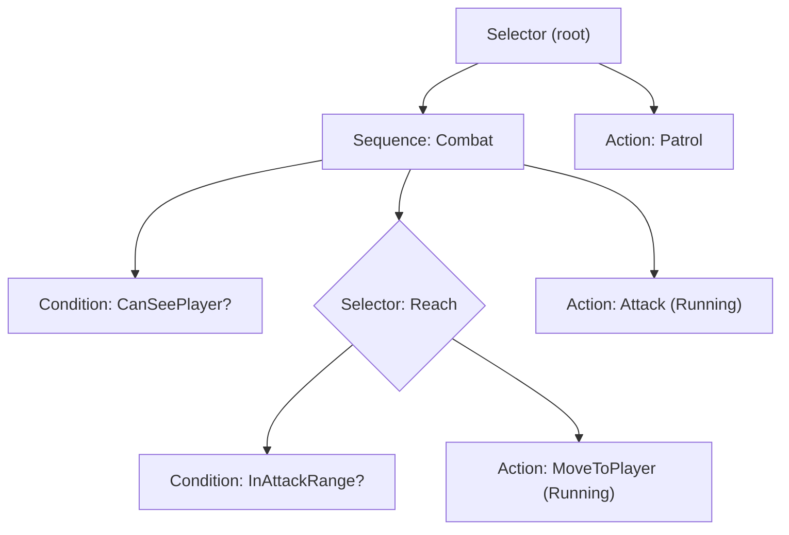

# 行为树与效用AI

NPC决策结构的两种互补方式，以及如何将它们结合使用。**行为树（BT）**将*结构化、优先级、可中断*的逻辑表达为每步被"触发"的树。**效用AI**通过使用归一化曲线对动作进行评分并选择最佳方案来回答*"我现在每个选项有多想要？"*。使用BT进行结构化，在效用AI中处理分级权衡时，部署可信的智能体。

这项技能是`game-ai`（它帮助您在FSM / BT / 导航 / 路径规划之间*选择*）的**实现**伴侣。阅读`game-ai`来选择模型；阅读本文来构建运行时。

## 使用场景

- 使用构建**可重用的BT运行时**：`Blackboard`、`Node`基础、动作/条件叶节点、`Sequence`/`Selector`/`Parallel`组合以及装饰器（Inverter、Cooldown、Repeat）。
- 使用构建**效用AI决策器**：响应曲线、考虑因素以及评分和选择动作的评估器（最大值、softmax或加权随机以实现多样性）。
- 使用构建**混合AI**——一个叶节点将"选择哪个攻击/哪个目标"的决定委托给效用评估器的BT。

**不使用场景**：用于在FSM、BT、导航或路径规划之间*选择*，以及用于A*/导航网格路由，请使用`game-ai`。对于Unreal的基于资源的`BehaviorTree`/`Blackboard`、`BTTask`/`BTService`和`AIController`，请使用`unreal-behavior-trees`。对于移动NPC的导航网格智能体，请使用`unity-navmesh`或引擎的导航节点。

## 核心工作流程

1. **选择模型。** 结构化、优先级、可中断的行为→**BT**。连续"每项选项都评分"的决策（目标、需求、物品选择）→**效用**。两者→**混合**。
2. **首先设计黑板。** 每个智能体一个类型的键/值存储是共享内存，它解耦了节点；叶节点读取/写入它，并且永远不会持有彼此的引用。
3. **编写叶节点。** *条件*立即返回`Success`/`Failure`；*动作*在帧之间返回`Running`直到完成。保持叶节点小且副作用明确。
4. **组合。** `Selector` = OR/后备（第一个非失败者获胜）；`Sequence` = AND（在第一个非成功时停止）；`Parallel`用于并发分支。用装饰器包装策略（反转、冷却、重复、强制成功）。
5. **对于效用：** 列出考虑因素，将每个原始事实通过一个**归一化0..1曲线**映射，组合（加权乘积带补偿，或加权求和），然后选择最大值——添加滞后以防止智能体在平局时来回切换。
6. **有意触发。** 每次决策步骤触发树/评估器一次（通常比渲染慢）。在触发之间保留`Running`状态；通过在调试时在屏幕上绘制活动路径和每个动作的分数来验证。

## 概览架构

行为树自上而下、从左到右评估；每个节点返回一个状态到其父节点：



效用AI是一个评分管道——每个候选动作都被评分，然后选择一个：

```text
facts (distance, health, ammo…)
      │  每个事实→一个归一化0..1响应曲线（考虑因素）
      ▼
score(action) = weight · combine(consideration_1 … consideration_n)   # 乘积+补偿或求和
      ▼
选择：argmax  ·  或softmax / 加权随机以实现多样性  ·  + 滞后以避免抖动
```

**状态是一个三值枚举**，每个节点共享——这是使树可组合的契约：

```csharp
public enum Status { Success, Failure, Running }

public abstract class Node
{
    public abstract Status Tick(Blackboard bb, float dt);
    public virtual void Reset() { }   // 当父节点放弃此子树时调用
}
```

```csharp
// Selector = 后备/OR：返回第一个非Failure的子节点。
public sealed class Selector : Composite
{
    public override Status Tick(Blackboard bb, float dt)
    {
        for (; _current < Children.Count; _current++)
        {
            var s = Children[_current].Tick(bb, dt);
            if (s != Status.Failure) return s;   // 成功或Running停止扫描
        }
        _current = 0;
        return Status.Failure;                    // 每个子节点都失败了
    }
}
```

相应的`Sequence`（AND——在第一个非`Success`时停止）、`Parallel`、`Blackboard`、叶节点基础类以及每个装饰器都在`references/behavior-tree-core.md`中。

## 效用评分的代码片段

```csharp
// 一个考虑因素将一个原始事实通过响应曲线映射到0..1。
float Score(Blackboard bb)
{
    float distance01 = Curves.InverseLerp01(bb.Get<float>("distToPlayer"), 20f, 2f); // 近=1
    float health01   = Curves.Sigmoid(bb.Get<float>("health01"), k: 8f, mid: 0.4f);  // 受伤=低
    // 乘积+补偿可以防止单个0否决，同时低值仍然会减弱。
    return Curves.CompensatedProduct(new[] { distance01, health01 });
}
```

完整的曲线库（线性、二次、指数、逻辑/正弦、smoothstep）、`Consideration`/`UtilityAction`类型以及`UtilityEvaluator`选择策略在`references/utility-ai-system.md`中。

## 陷阱

- **从根每帧重新触发`Running`动作会重新启动它。** 返回`Running`并从您停止的地方继续；仅在父节点实际放弃子树时才`Reset()`。
- **深度树每帧整体重新评估**浪费时间和导致抖动。优先选择浅树和*条件中止*（高优先级条件可以中断低分支）。
- **未归一化的考虑因素。** 如果一个曲线输出0..100，另一个输出0..1，大的占主导地位。每个考虑因素必须返回0..1。
- **效用在接近平局时的抖动。** 添加滞后：给当前正在运行的动作用一个小额奖励，以便智能体做出决定而不是振荡。
- **每帧分配节点、闭包或数组**会创建GC峰值。在生成时一次性构建树；保持每帧工作分配无成本。

## 参考文献

- `references/behavior-tree-core.md` — Blackboard、`Node`/叶节点基础类、动作和条件叶节点、`Sequence`/`Selector`/`Parallel`以及装饰器库（完整的C#）。
- `references/utility-ai-system.md` — 响应曲线库、`Consideration`、`UtilityAction`以及`UtilityEvaluator`（最大值、softmax、加权随机、滞后）。
- `references/practical-examples.md` — 一个守卫巡逻→战斗的BT、一个村民基于需求的效用AI以及一个混合智能体，作为即插即用的模板。
- `references/best-practices-and-pitfalls.md` — 内存管理、分析、避免深度树、事件驱动中止以及将效用AI与BT结合（混合架构）。

## 相关技能

- `game-ai` — 在FSM / BT / 导航之间选择；A*和导航网格路径规划。
- `unreal-behavior-trees` — Unreal的基于资源的BT/Blackboard、任务、装饰器、服务。
- `unity-navmesh` — 执行"移动到"意图的`NavMeshAgent`。
- `physics-tuning` — 智能体半径、移动和碰撞响应，用于运动层。
- `tower-defense`, `fps-shooter`, `rpg` — 组合此决策层的类型。
