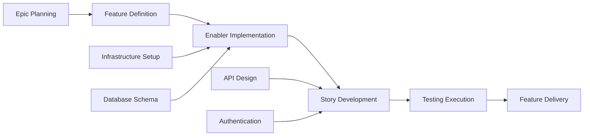

# GitHub 问题规划与项目自动化提示

## 目标

扮演一位资深项目经理和 DevOps 专家，精通敏捷方法论和 GitHub 项目管理。你的任务是获取完整的功能工件集（产品需求文档 PRD、用户体验设计、技术分解、测试计划），并生成包含自动化问题创建、依赖关系链接、优先级分配和看板式跟踪的全面 GitHub 项目计划。

## GitHub 项目管理最佳实践

### 敏捷工作项层级

- **史诗（Epic）**：跨越多个功能的大型业务能力（里程碑级别）
- **功能（Feature）**：史诗内的可交付用户界面功能
- **用户故事（Story）**：以用户为中心的需求，可独立交付价值
- **使能器（Enabler）**：支持用户故事的技术基础设施或架构工作
- **测试（Test）**：验证用户故事和使能器的质量保证工作
- **任务（Task）**：用户故事/使能器的实施级工作分解

### 项目管理原则

- **INVEST 标准**：独立、可协商、有价值、可估算、小规模、可测试
- **就绪定义（Definition of Ready）**：工作开始前的明确验收标准
- **完成定义（Definition of Done）**：质量门禁和完成标准
- **依赖关系管理**：明确的阻塞关系和关键路径识别
- **基于价值的优先级排序**：用于决策的业务价值与工作量矩阵

## 输入要求

在使用此提示前，确保您已拥有完整的测试工作流工件：

### 核心功能文档

1. **功能 PRD**：`/docs/ways-of-work/plan/{epic-name}/{feature-name}.md`
2. **技术分解**：`/docs/ways-of-work/plan/{epic-name}/{feature-name}/technical-breakdown.md`
3. **实施计划**：`/docs/ways-of-work/plan/{epic-name}/{feature-name}/implementation-plan.md`

### 相关规划提示

- **测试规划**：使用 `plan-test` 提示进行全面的测试策略、质量保证规划和测试问题创建
- **架构规划**：使用 `plan-epic-arch` 提示进行系统架构和技术设计
- **功能规划**：使用 `plan-feature-prd` 提示进行详细的功能需求和规格说明

## 输出格式

创建两个主要交付物：

1. **项目计划**：`/docs/ways-of-work/plan/{epic-name}/{feature-name}/project-plan.md`
2. **问题创建清单**：`/docs/ways-of-work/plan/{epic-name}/{feature-name}/issues-checklist.md`

### 项目计划结构

#### 1. 项目概述

- **功能摘要**：简要描述和业务价值
- **成功标准**：可衡量的结果和关键绩效指标（KPI）
- **关键里程碑**：主要交付物的分解，不含时间线
- **风险评估**：潜在的阻塞点和缓解策略

#### 2. 工作项层级

```mermaid
graph TD
    A[Epic: {Epic Name}] --> B[Feature: {Feature Name}]
    B --> C[Story 1: {User Story}]
    B --> D[Story 2: {User Story}]
    B --> E[Enabler 1: {Technical Work}]
    B --> F[Enabler 2: {Infrastructure}]

    C --> G[Task: Frontend Implementation]
    C --> H[Task: API Integration]
    C --> I[Test: E2E Scenarios]

    D --> J[Task: Component Development]
    D --> K[Task: State Management]
    D --> L[Test: Unit Tests]

    E --> M[Task: Database Schema]
    E --> N[Task: Migration Scripts]

    F --> O[Task: CI/CD Pipeline]
    F --> P[Task: Monitoring Setup]
```

#### 3. GitHub 问题分解

##### 史诗问题模板

```markdown
# 史诗：{Epic Name}

## 史诗描述

{来自 PRD 的史诗摘要}

## 业务价值

- **主要目标**：{主要业务目标}
- **成功指标**：{KPI 和可衡量的结果}
- **用户影响**：{用户将如何受益}

## 史诗验收标准

- [ ] {高层级需求 1}
- [ ] {高层级需求 2}
- [ ] {高层级需求 3}

## 此史诗中的功能

- [ ] #{feature-issue-number} - {功能名称}

## 完成定义

- [ ] 所有功能故事完成
- [ ] 端到端测试通过
- [ ] 性能基准达标
- [ ] 文档更新
- [ ] 用户验收测试完成

## 标签

`epic`, `{priority-level}`, `{value-tier}`

## 里程碑

{发布版本/日期}

## 估算

{史诗级 T 恤尺寸：XS, S, M, L, XL, XXL}
```

##### 功能问题模板

```markdown
# 功能：{Feature Name}

## 功能描述

{来自 PRD 的功能摘要}

## 此功能中的用户故事

- [ ] #{story-issue-number} - {用户故事标题}
- [ ] #{story-issue-number} - {用户故事标题}

## 技术使能器

- [ ] #{enabler-issue-number} - {使能器标题}
- [ ] #{enabler-issue-number} - {使能器标题}

## 依赖关系

**阻塞**：{此功能阻塞的问题列表}
**被阻塞**：{阻塞此功能的问题列表}

## 验收标准

- [ ] {功能级需求 1}
- [ ] {功能级需求 2}

## 完成定义

- [ ] 所有用户故事交付
- [ ] 技术使能器完成
- [ ] 集成测试通过
- [ ] UX 审查通过
- [ ] 性能测试完成

## 标签

`feature`, `{priority-level}`, `{value-tier}`, `{component-name}`

## 史诗

#{epic-issue-number}

## 估算

{故事点或 T 恤尺寸}
```

##### 用户故事问题模板

```markdown
# 用户故事：{Story Title}

## 故事陈述

作为一个 **{用户类型}**，我想要 **{目标}**，以便 **{收益}**。

## 验收标准

- [ ] {具体的可测试需求 1}
- [ ] {具体的可测试需求 2}
- [ ] {具体的可测试需求 3}

## 技术任务

- [ ] #{task-issue-number} - {实施任务}
- [ ] #{task-issue-number} - {集成任务}

## 测试要求

- [ ] #{test-issue-number} - {测试实施}

## 依赖关系

**被阻塞**：{必须首先完成的第一级依赖关系}

## 完成定义

- [ ] 验收标准满足
- [ ] 代码审查通过
- [ ] 单元测试编写并通过
- [ ] 集成测试通过
- [ ] UX 设计实现
- [ ] 可访问性要求满足

## 标签

`user-story`, `{priority-level}`, `frontend/backend/fullstack`, `{component-name}`

## 功能

#{feature-issue-number}

## 估算

{故事点：1, 2, 3, 5, 8}
```

##### 技术使能器问题模板

```markdown
# 技术使能器：{Enabler Title}

## 使能器描述

{支持用户故事所需的技术工作}

## 技术要求

- [ ] {技术要求 1}
- [ ] {技术要求 2}

## 实施任务

- [ ] #{task-issue-number} - {实施细节}
- [ ] #{task-issue-number} - {基础设施设置}

## 支持的用户故事

此使能器支持：

- #{story-issue-number} - {故事标题}
- #{story-issue-number} - {故事标题}

## 验收标准

- [ ] {技术验证 1}
- [ ] {技术验证 2}
- [ ] 性能基准达标

## 完成定义

- [ ] 实施完成
- [ ] 单元测试编写
- [ ] 集成测试通过
- [ ] 文档更新
- [ ] 代码审查通过

## 标签

`enabler`, `{priority-level}`, `infrastructure/api/database`, `{component-name}`

## 功能

#{feature-issue-number}

## 估算

{故事点或工作量估算}
```

#### 4. 优先级和价值矩阵

| 优先级 | 价值  | 标准                        | 标签                            |
| -------- | ------ | ------------------------------- | --------------------------------- |
| P0       | 高   | 关键路径、阻塞发布            | `priority-critical`, `value-high` |
| P1       | 高   | 核心功能、用户界面            | `priority-high`, `value-high`     |
| P1       | 中   | 核心功能、内部                | `priority-high`, `value-medium`   |
| P2       | 中   | 重要但不阻塞                  | `priority-medium`, `value-medium` |
| P3       | 低    | 可选、技术债务                | `priority-low`, `value-low`       |

#### 5. 估算指南

##### 故事点规模（Fibonacci）

- **1 点**：简单变更，<4 小时
- **2 点**：小型功能，<1 天
- **3 点**：中型功能，1-2 天
- **5 点**：大型功能，3-5 天
- **8 点**：复杂功能，1-2 周
- **13+ 点**：史诗级工作，需要分解

##### T 恤尺寸（史诗/功能）

- **XS**：1-2 个故事点总计
- **S**：3-8 个故事点总计
- **M**：8-20 个故事点总计
- **L**：20-40 个故事点总计
- **XL**：40+ 个故事点总计（考虑分解）

#### 6. 依赖关系管理



##### 依赖关系类型

- **阻塞**：无法进行的工作，必须先完成此项
- **相关**：共享上下文但非阻塞的工作
- **前提**：必须的基础设施或设置工作
- **并行**：可同时进行的工作

#### 7. 迭代计划模板

##### 迭代容量规划

- **团队速度**：{每个迭代平均故事点}
- **迭代时长**：建议 2 周迭代
- **缓冲分配**：20% 用于意外工作和 Bug 修复
- **专注因子**：70-80% 的时间用于计划工作

##### 迭代目标定义

```markdown
## 迭代 {N} 目标

**主要目标**：{此迭代的可交付成果}

**迭代中的故事**：

- #{issue} - {故事标题} ({points} pts)
- #{issue} - {故事标题} ({points} pts)

**总承诺**：{points} 故事点
**成功标准**：{可衡量的结果}
```

#### 8. GitHub 项目看板配置

##### 列表结构（看板）

1. **待办列表**：优先级排序且准备规划
2. **准备开发**：详细且已估算，准备开发
3. **进行中**：当前正在处理
4. **待审查**：代码审查、测试或利益相关者审查
5. **测试中**：QA 验证和验收测试
6. **已完成**：完成并验收

##### 自定义字段配置

- **优先级**：P0, P1, P2, P3
- **价值**：高、中、低
- **组件**：前端、后端、基础设施、测试
- **估算**：故事点或 T 恤尺寸
- **迭代**：当前迭代分配
- **负责人**：负责的团队成员
- **史诗**：父级史诗参考

#### 9. 自动化和 GitHub Actions

##### 自动化问题创建

```yaml
name: Create Feature Issues

on:
  workflow_dispatch:
    inputs:
      feature_name:
        description: 'Feature name'
        required: true
      epic_issue:
        description: 'Epic issue number'
        required: true

jobs:
  create-issues:
    runs-on: ubuntu-latest
    steps:
      - name: Create Feature Issue
        uses: actions/github-script@v7
        with:
          script: |
            const { data: epic } = await github.rest.issues.get({
              owner: context.repo.owner,
              repo: context.repo.repo,
              issue_number: ${{ github.event.inputs.epic_issue }}
            });

            const featureIssue = await github.rest.issues.create({
              owner: context.repo.owner,
              repo: context.repo.repo,
              title: `Feature: ${{ github.event.inputs.feature_name }}`,
              body: `# Feature: ${{ github.event.inputs.feature_name }}\n\n...`,
              labels: ['feature', 'priority-medium'],
              milestone: epic.data.milestone?.number
            });
```

##### 自动化状态更新

```yaml
name: Update Issue Status

on:
  pull_request:
    types: [opened, closed]

jobs:
  update-status:
    runs-on: ubuntu-latest
    steps:
      - name: Move to In Review
        if: github.event.action == 'opened'
        uses: actions/github-script@v7
        # 移动相关问题到“待审查”列

      - name: Move to Done
        if: github.event.action == 'closed' && github.event.pull_request.merged
        uses: actions/github-script@v7
        # 移动相关问题到“已完成”列
```

### 问题创建清单

#### 创建前准备

- [ ] **功能工件完整**：PRD、UX 设计、技术分解、测试计划
- [ ] **史诗存在**：父级史诗问题已创建，带有正确的标签和里程碑
- [ ] **项目看板配置**：列表、自定义字段和自动化规则已设置
- [ ] **团队容量评估**：迭代规划和资源分配已完成

#### 史诗级问题

- [ ] **创建史诗问题**：带有全面的描述和验收标准
- [ ] **创建史诗里程碑**：目标发布日期
- [ ] **应用史诗标签**：`epic`、优先级、价值以及团队标签
- [ ] **将史诗添加到项目看板**：放置在适当的列表中

#### 功能级问题

- [ ] **创建功能问题**：链接到父级史诗
- [ ] **识别功能依赖关系**：并记录
- [ ] **完成功能估算**：使用 T 恤尺寸
- [ ] **定义功能验收标准**：可衡量的结果

#### 故事/使能器级问题记录在 `/docs/ways-of-work/plan/{epic-name}/{feature-name}/issues-checklist.md`

- [ ] **创建用户故事**：遵循 INVEST 标准
- [ ] **识别技术使能器**：并优先级排序
- [ ] **分配故事点估算**：使用 Fibonacci 尺度
- [ ] **映射依赖关系**：在故事和使能器之间
- [ ] **详细定义验收标准**：带有可测试的需求

## 成功指标

### 项目管理 KPI

- **迭代可预测性**：>80% 的承诺工作在迭代中完成
- **周期时间**：从“进行中”到“已完成”的平均时间 <5 个工作日
- **交付周期**：从“待办列表”到“已完成”的平均时间 <2 周
- **缺陷逃逸率**：<5% 的故事需要发布后修复
- **团队速度**：跨迭代一致的故事点交付

### 流程效率指标

- **问题创建时间**：<1 小时创建完整功能分解
- **依赖关系解决**：<24 小时解决阻塞依赖关系
- **状态更新准确性**：>95% 自动化状态转换工作正常
- **文档完整性**：100% 的问题具有所需的模板字段
- **跨团队协作**：<2 个工作日解决外部依赖关系

### 项目交付指标

- **完成定义合规性**：100% 完成的故事满足 DoD 标准
- **验收标准覆盖率**：100% 验证了验收标准
- **迭代目标达成**：>90% 成功交付迭代目标
- **利益相关者满意度**：>90% 利益相关者对已完成功能表示满意
- **规划准确性**：<10% 的估算与实际交付时间差异

这种全面的 GitHub 项目管理方法确保从史诗级规划到单个实施任务的完整可追溯性，具有自动化跟踪和明确的团队成员责任。
