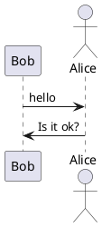
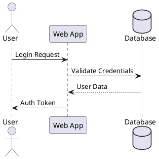
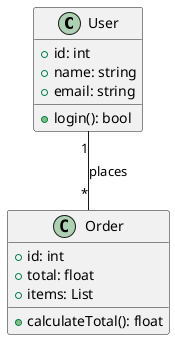
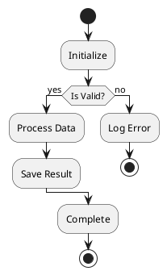
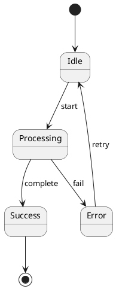
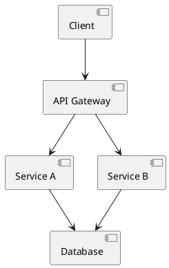
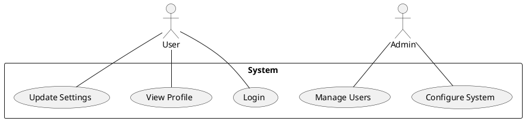
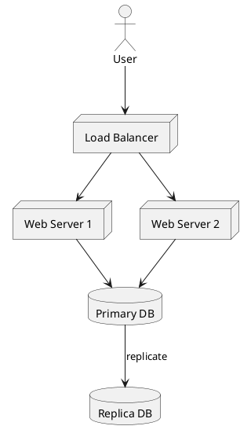

# PlantUML ASCII Art 图形生成器

## 概述

使用 PlantUML 创建基于文本的 ASCII Art 图形。非常适合在终端环境中、README 文件、电子邮件或任何不适合图形图形的场景中创建文档。

## 什么是 PlantUML ASCII Art？

PlantUML 可以将图形生成纯文本（ASCII Art），而不是图像。这对于以下情况非常有用：

- 基于终端的工作流程
- 没有图像支持的 Git 提交/PR
- 需要版本控制的文档
- 没有图形工具的环境

## 安装

```bash
# macOS
brew install plantuml

# Linux (因发行版而异)
sudo apt-get install plantuml  # Ubuntu/Debian
sudo yum install plantuml      # RHEL/CentOS

# 或直接下载 JAR 文件
wget https://github.com/plantuml/plantuml/releases/download/v1.2024.0/plantuml-1.2024.0.jar
```

## 输出格式

| 标志    | 格式        | 描述                          |
| ------- | ------------- | ------------------------------------ |
| `-txt`  | ASCII         | 纯 ASCII 字符                |
| `-utxt` | Unicode ASCII | 使用框绘制字符增强            |

## 基本工作流程

### 1. 创建 PlantUML 图形文件



### 2. 生成 ASCII Art

```bash
# 标准ASCII输出
plantuml -txt diagram.puml

# Unicode增强输出（外观更好）
plantuml -utxt diagram.puml

# 直接使用 JAR 文件
java -jar plantuml.jar -txt diagram.puml
java -jar plantuml.jar -utxt diagram.puml
```

### 3. 查看输出

输出保存为 `diagram.atxt`（ASCII）或 `diagram.utxt`（Unicode）。

## 支持的图形类型

### 序列图



### 类图



### 活动图



### 状态图



### 组件图



### 用例图



### 部署图



## 命令行选项

```bash
# 指定输出目录
plantuml -txt -o ./output diagram.puml

# 处理目录中的所有文件
plantuml -txt ./diagrams/

# 包含隐藏文件（点文件）
plantuml -txt -includeDot diagrams/

# 详细输出
plantuml -txt -v diagram.puml

# 指定字符集
plantuml -txt -charset UTF-8 diagram.puml
```

## Ant 任务集成

```xml
<target name="generate-ascii">
  <plantuml dir="./src" format="txt" />
</target>

<target name="generate-unicode-ascii">
  <plantuml dir="./src" format="utxt" />
</target>
```

## 更好 ASCII 图形的技巧

1. **保持简单**：复杂的图形在 ASCII 中渲染效果不佳
2. **简短标签**：长文本会破坏 ASCII 对齐
3. **使用 Unicode (`-utxt`)**：使用框绘制字符可以获得更好的视觉效果
4. **在分享前测试**：使用固定宽度字体在终端中验证
5. **考虑替代方案**：对于复杂图形，使用 Mermaid.js 或 graphviz

## 示例输出对比

**标准 ASCII (`-txt`)**：

```
     ,---.          ,---.
     |Bob|          |Alice|
     `---'          `---'
      |   hello      |
      |------------->|
      |              |
      |  Is it ok?   |
      |<-------------|
      |              |
```

**Unicode ASCII (`-utxt`)**：

```
┌─────┐        ┌─────┐
│ Bob │        │Alice│
└─────┘        └─────┘
  │   hello      │
  │─────────────>│
  │              │
  │  Is it ok?   │
  │<─────────────│
  │              │
```

## 快速参考

```bash
# 创建 ASCII 序列图
cat > seq.puml << 'EOF'
@startuml
Alice -> Bob: Request
Bob --> Alice: Response
@enduml
EOF

plantuml -txt seq.puml
cat seq.atxt

# 使用 Unicode 创建
plantuml -utxt seq.puml
cat seq.utxt
```

## 故障排除

**问题**：乱码 Unicode 字符

- **解决方案**：确保终端支持 UTF-8 并有适当的字体

**问题**：图形看起来对齐错误

- **解决方案**：使用固定宽度字体（Courier、Monaco、Consolas）

**问题**：命令未找到

- **解决方案**：安装 PlantUML 或直接使用 Java JAR 文件

**问题**：未创建输出文件

- **解决方案**：检查文件权限，确保 PlantUML 有写入权限
