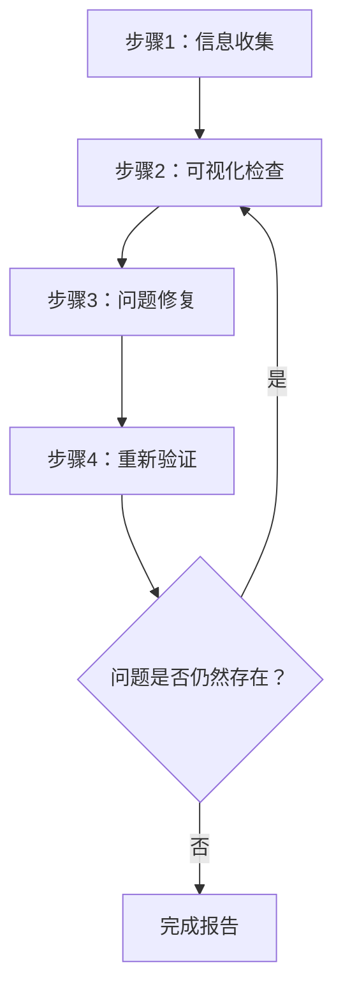
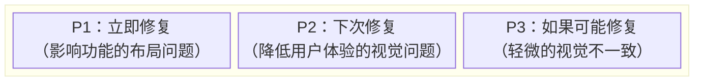
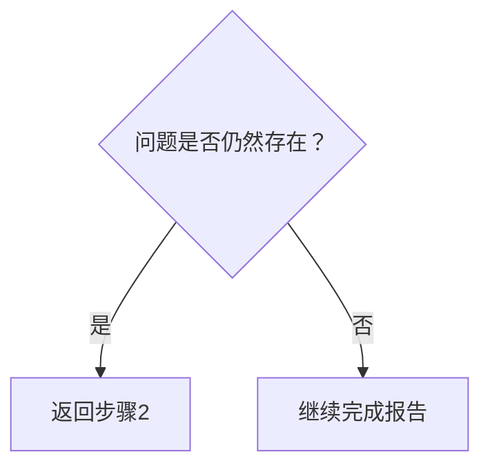

# 网页设计审查工具

该技能能够进行可视化检查和验证网页设计质量，在源代码级别识别和修复问题。

## 应用范围

- 静态网站（HTML/CSS/JS）
- React / Vue / Angular / Svelte 等单页应用框架
- Next.js / Nuxt / SvelteKit 等全栈框架
- WordPress / Drupal 等内容管理系统平台
- 任何其他网页应用

## 前置条件

### 必须满足

1. **目标网站必须正在运行**
   - 本地开发服务器（例如：`http://localhost:3000`）
   - 预发布环境
   - 生产环境（仅限只读审查）

2. **必须支持浏览器自动化**
   - 截图捕获
   - 页面导航
   - DOM 信息获取

3. **（修复时）必须可访问源代码**
   - 项目必须在工作区中存在

## 工作流程概述



---

## 步骤1：信息收集阶段

### 1.1 URL确认

如果未提供URL，向用户询问：

> 请提供要审查的网站URL（例如：`http://localhost:3000`）

### 1.2 理解项目结构

在修复时，收集以下信息：

| 项目 | 示例问题 |
|------|----------|
| 框架 | 您是否使用React / Vue / Next.js等？ |
| 样式方法 | CSS / SCSS / Tailwind / CSS-in-JS等 |
| 源代码位置 | 样式文件和组件位于何处？ |
| 审查范围 | 仅特定页面还是整个网站？ |

### 1.3 自动项目检测

尝试从工作区文件中自动检测：

```
检测目标：
├── package.json     → 框架和依赖
├── tsconfig.json    → TypeScript使用情况
├── tailwind.config  → Tailwind CSS
├── next.config      → Next.js
├── vite.config      → Vite
├── nuxt.config      → Nuxt
└── src/ 或 app/     → 源代码目录
```

### 1.4 识别样式方法

| 方法 | 检测方式 | 编辑目标 |
|------|----------|----------|
| 纯CSS | `*.css`文件 | 全局CSS或组件CSS |
| SCSS/Sass | `*.scss`, `*.sass` | SCSS文件 |
| CSS Modules | `*.module.css` | 模块CSS文件 |
| Tailwind CSS | `tailwind.config.*` | 组件中的className |
| styled-components | 代码中的`styled.` | JS/TS文件 |
| Emotion | `@emotion/`导入 | JS/TS文件 |
| CSS-in-JS（其他） | 内联样式 | JS/TS文件 |

---

## 步骤2：可视化检查阶段

### 2.1 页面遍历

1. 导航到指定URL
2. 捕获截图
3. 获取DOM结构/快照（如果可能）
4. 如果存在其他页面，通过导航遍历

### 2.2 检查项目

检查时和修复后验证时，参考[references/visual-checklist.md](references/visual-checklist.md)。

#### 布局问题

| 问题 | 描述 | 严重程度 |
|------|------|----------|
| 元素溢出 | 内容从父元素或视口溢出 | 高 |
| 元素重叠 | 元素意外重叠 | 高 |
| 对齐问题 | 网格或flex对齐问题 | 中 |
| 间距不一致 | 填充/边距不一致 | 中 |
| 文本裁剪 | 长文本未正确处理 | 中 |

#### 响应式问题

| 问题 | 描述 | 严重程度 |
|------|------|----------|
| 非移动端友好 | 小屏幕上布局崩溃 | 高 |
| 断点问题 | 屏幕尺寸变化时出现不自然的过渡 | 中 |
| 触摸目标 | 移动端按钮太小 | 中 |

#### 可访问性问题

| 问题 | 描述 | 严重程度 |
|------|------|----------|
| 对比度不足 | 文本和背景对比度低 | 高 |
| 无焦点状态 | 键盘导航时无法确定状态 | 高 |
| 缺少alt文本 | 图片没有替代文本 | 中 |

#### 视觉一致性

| 问题 | 描述 | 严重程度 |
|------|------|----------|
| 字体不一致 | 混合字体家族 | 中 |
| 颜色不一致 | 品牌颜色不统一 | 中 |
| 间距不一致 | 相似元素之间间距不均 | 低 |

### 2.3 视口测试（响应式）

在以下视口进行测试：

| 名称 | 宽度 | 代表性设备 |
|------|------|------------|
| 手机 | 375px | iPhone SE/12 mini |
| 平板 | 768px | iPad |
| 桌面 | 1280px | 标准PC |
| 宽屏 | 1920px | 大型显示器 |

---

## 步骤3：问题修复阶段

### 3.1 问题优先级



### 3.2 识别源文件

从有问题的元素中识别源文件：

1. **基于选择器的搜索**
   - 通过类名或ID搜索代码库
   - 使用`grep_search`探索样式定义

2. **基于组件的搜索**
   - 通过元素文本或结构识别组件
   - 使用`semantic_search`探索相关文件

3. **文件模式过滤**
   ```
   样式文件：src/**/*.css, styles/**/*
   组件：src/components/**/*
   页面：src/pages/**, app/**
   ```

### 3.3 应用修复

#### 框架特定修复指南

详情请参考[references/framework-fixes.md](references/framework-fixes.md)。

#### 修复原则

1. **最小化变更**：仅进行解决问题的关键最小变更
2. **尊重现有模式**：遵循项目的现有代码风格
3. **避免破坏性变更**：小心不要影响其他区域
4. **添加注释**：在适当情况下添加注释说明修复原因

---

## 步骤4：重新验证阶段

### 4.1 修复后确认

1. 刷新浏览器（或等待开发服务器HMR）
2. 捕获已修复区域的截图
3. 比较前后状态

### 4.2 回归测试

- 验证修复是否影响了其他区域
- 确认响应式显示未崩溃

### 4.3 迭代决策



**迭代限制**：如果特定问题需要超过3次修复尝试，则咨询用户

---

## 输出格式

### 审查结果报告

```markdown
# 网页设计审查结果

## 摘要

| 项目 | 值 |
|------|----|
| 目标URL | {URL} |
| 框架 | {检测到的框架} |
| 样式 | {CSS / Tailwind / 等} |
| 测试视口 | 桌面、手机 |
| 检测到的问题 | {N} |
| 已修复问题 | {M} |

## 检测到的问题

### [P1] {问题标题}

- **页面**：{页面路径}
- **元素**：{选择器或描述}
- **问题**：{问题的详细描述}
- **修复文件**：`{文件路径}`
- **修复详情**：{变更描述}
- **截图**：前后对比

### [P2] {问题标题}
...

## 未修复的问题（如有）

### {问题标题}
- **原因**：{未修复/无法修复的原因}
- **建议操作**：{对用户的建议}

## 建议

- {对未来改进的建议}
```

---

## 必需能力

| 能力 | 描述 | 是否必需 |
|------|------|----------|
| 网页导航 | 访问URL、页面转换 | ✅ |
| 截图捕获 | 页面图像捕获 | ✅ |
| 图像分析 | 视觉问题检测 | ✅ |
| DOM获取 | 页面结构获取 | 推荐 |
| 文件读写 | 源代码读取和编辑 | 修复时必需 |
| 代码搜索 | 项目内代码搜索 | 修复时必需 |

---

## 参考实现

### 使用Playwright MCP实现

[Playwright MCP](https://github.com/microsoft/playwright-mcp)是此技能的推荐参考实现。

| 能力 | Playwright MCP工具 | 目的 |
|------|------------------|------|
| 导航 | `browser_navigate` | 访问URL |
| 快照 | `browser_snapshot` | 获取DOM结构 |
| 截图 | `browser_take_screenshot` | 用于可视化检查的图像 |
| 点击 | `browser_click` | 与交互元素交互 |
| 调整大小 | `browser_resize` | 响应式测试 |
| 控制台 | `browser_console_messages` | 检测JS错误 |

#### 配置示例（MCP服务器）

```json
{
  "mcpServers": {
    "playwright": {
      "command": "npx",
      "args": ["-y", "@playwright/mcp@latest", "--caps=vision"]
    }
  }
}
```

### 其他兼容的浏览器自动化工具

| 工具 | 功能 |
|------|------|
| Selenium | 广泛的浏览器支持，多语言支持 |
| Puppeteer | 专注于Chrome/Chromium，Node.js |
| Cypress | 易于与E2E测试集成 |
| WebDriver BiDi | 标准化的下一代协议 |

可以使用这些工具实现相同的工作流程。只要它们提供必要的功能（导航、截图、DOM获取），工具的选择就是灵活的。

---

## 最佳实践

### 应做（推荐）

- ✅ 修复前始终保存截图
- ✅ 一次修复一个问题并验证
- ✅ 遵循项目的现有代码风格
- ✅ 大规模变更前与用户确认
- ✅ 详细记录修复详情

### 不应做（不推荐）

- ❌ 无确认即进行大规模重构
- ❌ 忽视设计系统或品牌指南
- ❌ 修复时忽略性能
- ❌ 一次性修复多个问题（难以验证）

---

## 故障排除

### 问题：样式文件未找到

1. 检查`package.json`中的依赖
2. 考虑CSS-in-JS的可能性
3. 考虑构建时生成的CSS
4. 询问用户关于样式方法

### 问题：修复未反映

1. 检查开发服务器HMR是否正常工作
2. 清除浏览器缓存
3. 如果项目需要构建，则重新构建
4. 检查CSS特异性问题

### 问题：修复影响了其他区域

1. 回滚变更
2. 使用更具体的选择器
3. 考虑使用CSS Modules或作用域样式
4. 咨询用户确认影响范围
