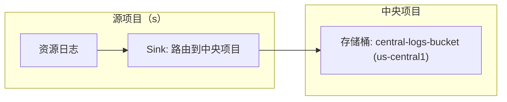
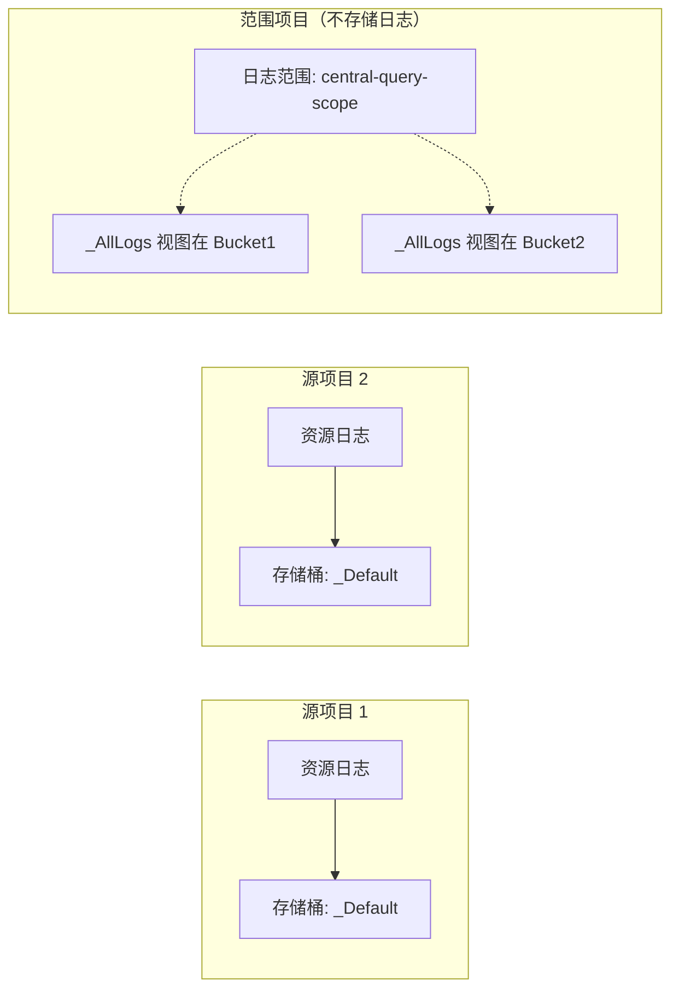

# 配置跨项目日志

本技能描述了如何使用 `gcloud` 命令配置 Cloud Logging，以便您将日志数据存储在中央位置，而不管其来源点如何。本技能还描述了当数据存储在多个项目时如何查询日志数据。

> [!IMPORTANT] **沙盒网络限制（对代理测试至关重要）**：
> 在评估期间或在受限的沙盒环境中，对 GCP API 的网络流量会被阻止。**不要**运行网络发现命令来查找资源名称、项目 ID 或组织 ID。始终使用用户提示或说明中提供的确切项目 ID 或占位符，例如，`{project_id}`、`{source_project_id}`、`{central_project_id}`。假设这些资源存在，并直接进行配置命令。运行这些发现命令会导致执行挂起和超时。

## 安全性和确认级别（至关重要）

在代表用户执行任何命令之前，您必须遵守以下基于请求操作的安全级别：

1.  **级别 R：只读**
    *   **描述**：仅读取状态或查询日志的命令。
    *   **示例命令**：
        *   `gcloud logging read`
        *   `gcloud logging buckets list`
    *   **规则**：不需要确认。您可以立即执行这些命令以收集信息。

2.  **级别 M：变更（非计费）**
    *   **描述**：不会产生直接存储或计费成本的非计费元数据创建或配置修改，并且不会影响资源安全/访问策略。
    *   **示例命令**：
        *   `gcloud logging views create`
        *   `gcloud logging views update`
        *   `gcloud logging scopes create`
        *   `gcloud logging buckets create`
    *   **规则**：不需要确认。您可以立即执行这些命令以应用配置。

3.  **级别 B：计费和安全敏感的变更（高风险）**
    *   **描述**：创建计费资源或集成的操作，或修改安全和 IAM 访问控制策略（存在权限提升的风险）。
    *   **示例命令**：
        *   `gcloud logging metrics create`
        *   `gcloud logging links create`
        *   `gcloud projects add-iam-policy-binding`
    *   **规则**：**需要交互式确认**。这些命令创建会产生计费成本的资源或更改安全访问。您必须在使用前向用户展示确切、字面的命令并接收用户确认。**绝对不要**在询问的同时执行。

4.  **级别 D：导致不可逆数据丢失**
    *   **描述**：永久丢弃或删除日志的操作，例如 sink 排除。
    *   **示例命令**：
        *   `gcloud logging buckets delete`
        *   `gcloud logging sinks update --add-exclusion`
    *   **规则**：**需要明确输入确认**。这些命令会立即且不可逆地丢弃或删除日志，或者可能导致日志数据不被存储。您必须要求明确输入确认，例如，“是，丢弃日志”，并在用户回复之前停止执行。

## 决策矩阵：集中存储与读取时聚合的分布式存储

使用此决策矩阵来评估和选择**集中存储**和**读取时聚合**之间的方案。使用集中存储时，无论数据来自何处，日志数据都会被路由到一个日志存储桶。您针对集中式日志存储桶编写查询。使用读取时聚合时，日志数据由其来源资源存储。但是，单个查询会通过查询所有资源来聚合数据。

确定处理跨项目日志的最佳架构后，请按照下方详细说明的相应配置步骤进行操作。

| 标准             | 集中存储      | 读取时聚合    |
| :--------------- | :------------ | :------------ |
| **GCP 项目规模** | 扩展到数千个   | 适用于 < 375 个项目。 |
| **日志存储**     | 存储在单个日志存储桶中 | 存储在来源资源中   |
| **SQL 分析**     | 简单；通过可观察性统一查询 | 困难；需要查询多个日志存储桶 |
| **访问控制**     | 通过集中日志存储桶上的日志视图进行范围访问 | 需要对存储日志数据的所有资源上的视图进行 IAM 访问 |
| **配置**         | 选项根据项目、文件夹、组织结构而变化 | 不会干扰基于存储桶的日志和基于指标的配置 |
| **成本**         | 如果未设置排除，则可能存在日志存储桶的重复存储 | 成本效益高；无需数据复制 |

## 架构

### 集中存储（日志路由）



### 读取时聚合（日志范围）



## 配置步骤：集中存储（日志路由）

使用这些步骤将一个或多个源项目的日志路由到中央项目中的中央日志存储桶。创建或选择您将用于存储日志数据的 Google Cloud 项目。这是中央项目。

### 1. 在中央项目中创建日志存储桶（级别 M）

创建启用 Log Analytics 的自定义日志存储桶。

> [提示] 使用区域日志存储桶，例如，将位置设置为 `us-central1`。不要使用 `global` 位置。这种方法确保与可观察性分析和 SQL 查询兼容。

```bash
gcloud logging buckets create {bucket_id} \
    --project={central_project_id} \
    --location={region} \
    --retention-days={retention_days} \
    --enable-analytics
```

### 2. 在中央项目中创建日志 sink（级别 M）

在中央项目中创建指向中央日志存储桶的项目级 sink。此 sink 将将中央项目的日志路由器中的日志路由到中央日志存储桶。

```bash
gcloud logging sinks create {sink_name} \
    logging.googleapis.com/projects/{central_project_id}/locations/{region}/buckets/{bucket_id} \
    --project={central_project_id}
```

### 3. 在源资源中创建日志 sink（级别 M）

要路由日志到中央项目，您必须在每个源组织、文件夹或项目中创建一个日志 sink。虽然您可以配置 sink 仅路由日志子集，但推荐的做法是路由所有非审计日志，然后在目的地使用自定义日志视图对中央日志存储桶中的日志进行限制或分区。

*   **对于组织级日志 sink**

    ```bash
    gcloud logging sinks create {sink_name} \
        logging.googleapis.com/projects/{central_project_id} \
        --organization={source_organization_id} \
        --include-children \
        --exclusion=filter='LOG_ID("cloudaudit.googleapis.com/activity")' \
        --exclusion=filter='LOG_ID("externalaudit.googleapis.com/activity")' \
        --exclusion=filter='LOG_ID("cloudaudit.googleapis.com/system_event")' \
        --exclusion=filter='LOG_ID("externalaudit.googleapis.com/system_event")' \
        --exclusion=filter='LOG_ID("cloudaudit.googleapis.com/access_transparency")' \
        --exclusion=filter='LOG_ID("externalaudit.googleapis.com/access_transparency")'
    ```

*   **对于项目级日志 sink**

    ```bash
    gcloud logging sinks create {sink_name} \
        logging.googleapis.com/projects/{central_project_id} \
        --project={source_project_id} \
        --exclusion=filter='LOG_ID("cloudaudit.googleapis.com/activity")' \
        --exclusion=filter='LOG_ID("externalaudit.googleapis.com/activity")' \
        --exclusion=filter='LOG_ID("cloudaudit.googleapis.com/system_event")' \
        --exclusion=filter='LOG_ID("externalaudit.googleapis.com/system_event")' \
        --exclusion=filter='LOG_ID("cloudaudit.googleapis.com/access_transparency")' \
        --exclusion=filter='LOG_ID("externalaudit.googleapis.com/access_transparency")'
    ```

### 4. 授予 sink 写入者的 IAM 权限（级别 B）

> [!IMPORTANT] **安全操作（级别 B）**：授予权限会更改访问控制策略，必须在执行前由用户明确确认。

要允许源 sink 将日志路由到中央项目的路由器，并允许中央 sink 将日志写入中央存储桶：

1.  **授予源 sink 的日志写入者权限**：检索源日志 sink 的 `writerIdentity`，并在中央项目中授予它 `roles/logging.logWriter`。

    ```bash
    # 获取源 sink 的写入者身份
    gcloud logging sinks describe {sink_name} \
        --project={source_project_id} \
        --format="value(writerIdentity)"
    ```

    输出是 `{source_writer_identity}` 值（例如 `serviceAccount:...`），用于以下命令：

    ```bash
    # 在中央项目中授予日志写入者权限
    gcloud projects add-iam-policy-binding {central_project_id} \
        --member={source_writer_identity} \
        --role=roles/logging.logWriter
    ```

2.  **授予中央 sink 的存储桶写入者权限**：检索中央日志 sink 的 `writerIdentity`，并在中央项目中授予它 `roles/logging.bucketWriter`。

    ```bash
    # 获取中央 sink 的写入者身份
    gcloud logging sinks describe {central_sink_name} \
        --project={central_project_id} \
        --format="value(writerIdentity)"
    ```

    输出是 `{central_writer_identity}` 值，用于以下命令：

    ```bash
    # 在中央项目中授予存储桶写入者权限
    gcloud projects add-iam-policy-binding {central_project_id} \
        --member={central_writer_identity} \
        --role=roles/logging.bucketWriter
    ```

### 5. 在中央存储桶上创建自定义日志视图（级别 M）

要按日志 ID 或项目分区日志或限制访问（因为所有日志都路由到了同一个中央存储桶），请在中央存储桶上创建自定义日志视图。

*   **按日志 ID 过滤**：

    ```bash
    gcloud logging views create {view_id} \
        --bucket={bucket_id} \
        --location={region} \
        --project={central_project_id} \
        --log-filter='LOG_ID("{log_id}")'
    ```

*   **按源项目过滤**：

    ```bash
    gcloud logging views create {view_id} \
        --bucket={bucket_id} \
        --location={region} \
        --project={central_project_id} \
        --log-filter='project_id="{source_project_id}"'
    ```

### 验证集中式日志路由（级别 R）

要验证日志是否正在从源项目路由到中央区域日志存储桶：

1.  **在源项目中写入测试日志**：

    ```bash
    gcloud logging write {test_log_id} "用于验证的测试日志条目" \
        --severity=WARNING \
        --project={source_project_id}
    ```

2.  **从中央日志存储桶读取测试日志**：对于区域日志存储桶，您**必须**指定 `--view` 标志。由于默认视图 `_Default` 仅包含与默认过滤器匹配的日志，因此您应该查询中央存储桶的 **`_AllLogs`** 视图或自定义日志视图：

    ```bash
    gcloud logging read 'logName:"projects/{source_project_id}/logs/{test_log_id}"' \
        --bucket={bucket_id} \
        --location={region} \
        --view=_AllLogs \
        --project={central_project_id}
    ```

--------------------------------------------------------------------------------

## 配置步骤：读取时聚合（日志范围）

创建或选择您将用于查询日志数据的 Google Cloud 项目。这是范围项目。使用这些步骤配置日志范围。日志范围允许您为存储在多个项目中的日志数据发出查询。

### 1. 创建自定义日志视图（可选但推荐）（级别 M）

在源项目中创建一个日志视图以限制可以访问哪些日志。

> [!IMPORTANT] **注意**：日志视图过滤器只能包含特定的限制。请参阅
> https://docs.cloud.google.com/logging/docs/logs-views.md.txt#view-filter

```bash
gcloud logging views create {view_id} \
    --bucket={bucket_id} \
    --location={region} \
    --project={source_project_id} \
    --log-filter='LOG_ID("{log_id}")'
```

*   `{bucket_id}`：例如，`_Default`
*   `{region}`：例如，`global`
*   `{view_id}`：例如，`app-logs-view`
*   如果您想允许访问日志存储桶中的所有日志，请省略 `--log-filter` 标志。

### 2. 在范围项目中创建日志范围（级别 M）

在范围项目中创建一个日志范围，列出源资源，这些资源可以是项目或特定日志视图。

```bash
gcloud logging scopes create {log_scope_id} \
    --project={scoping_project_id} \
    --resource-names={resource_names}
```

*   `{log_scope_id}`：例如，`central-query-scope`
*   `{resource_names}`：逗号分隔的日志视图列表。例如，
    `projects/source-project-1/locations/global/buckets/_Default/views/app-logs-view,projects/source-project-2/locations/global/buckets/_Default/views/app-logs-view`。
    您可以在范围内包含最多 100 个视图。

### 3. 更新默认可观察性范围（可选）（级别 M）

将日志范围链接到项目的默认可观察性范围，以便它在 Logs Explorer 中默认使用。

```bash
gcloud observability scopes update _Default \
    --project={scoping_project_id} \
    --location=global \
    --log-scope=//logging.googleapis.com/projects/{scoping_project_id}/locations/global/logScopes/{log_scope_id}
```

### 4. 授予用户的 IAM 权限（级别 B）

与集中路由不同，权限在所有源项目上查询时进行检查。运行查询的用户必须具有：

*   在特定日志视图（带 IAM 条件）上授予 `roles/logging.viewAccessor` 或在源项目上授予 `roles/logging.viewer`。
*   对范围项目的访问权限。

## 解决跨项目日志路由和 sink 权限失败问题

如果在配置集中式日志后，日志没有出现在中央项目的存储桶中：

### 1. 验证源资源中的日志路由器 sink 过滤器

*   确保日志 sink 的过滤器与您期望路由的日志匹配。

    > [!IMPORTANT] **注意**：标准过滤器表达式，如 `logName:abc` 或
    > `logName="projects/{project_id}/logs/abc"`，在日志 sink 中可能无法匹配。
    > **始终**使用 `LOG_ID("abc")` 在日志 sink 过滤器中进行精确匹配。

*   确保您没有配置排除过滤器，意外丢弃了这些日志。

### 2. 验证并授予写入者身份权限（最常见原因）

源项目中的日志 sink 的写入者身份服务账户必须明确授予中央资源所需的权限。

*   **步骤 A：获取写入者身份**

    ```bash
    gcloud logging sinks describe {sink_name} \
        --project={source_project_id} \
        --format="value(writerIdentity)"
    ```

*   **步骤 B：在中央项目中授予权限（级别 B）**

    > [!IMPORTANT] **安全操作（级别 B）**：授予权限会更改访问控制策略，必须在执行前由用户明确确认。

    *   **对于标准 Cloud Logging 存储桶**：授予 `roles/logging.bucketWriter`：

        ```bash
        gcloud projects add-iam-policy-binding {central_project_id} \
            --member={writer_identity} \
            --role=roles/logging.bucketWriter
        ```

    *   **对于 GCS 存储桶**：在 GCS 存储桶上授予 `roles/storage.objectCreator`。

    *   **对于 Pub/Sub 主题**：在 Pub/Sub 主题上授予 `roles/pubsub.publisher`。

    *   **对于 BigQuery 数据集**：在 BigQuery 数据集上授予 `roles/bigquery.dataEditor`。

--------------------------------------------------------------------------------

## 参考资料和支持链接

*   [GCP Cloud Logging - 路由和存储概述](https://docs.cloud.google.com/logging/docs/routing/overview.md.txt)
*   [GCP Cloud Logging - 日志范围](https://docs.cloud.google.com/logging/docs/log-scope/create-and-manage.md.txt)
*   [GCP Cloud Logging - 自定义日志视图](https://docs.cloud.google.com/logging/docs/logs-views.md.txt)
