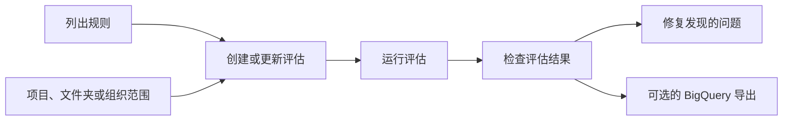

# 工作负载管理器基础

工作负载管理器验证企业工作负载是否符合 Google Cloud 最佳实践和建议。公共客户端库以评估为中心：定义资源范围，选择内置或自定义规则，运行评估，然后检查结果和扫描的资源。

## 使用此流程



## 核心 API 限制

为确保兼容性、安全性和成功集成：

*   **仅使用公共接口：** 您必须严格使用官方公共 `google-cloud-workloadmanager` 客户端库或公共 REST API (`workloadmanager.googleapis.com/v1`) 与工作负载管理器交互。
*   **禁止使用内部或未公开的 API：** 请勿尝试使用内部 RPC 协议、私有服务后端或未公开的发现机制。它们不支持公共集成，并且会失败。
*   **无特定服务的 CLI：** 没有公共的 `gcloud workload-manager` CLI 命令组。仅使用 `gcloud` 进行身份验证、IAM 角色分配和获取原始 REST 令牌。
*   **沙盒执行健壮性（身份验证/模拟回退）：** 当 gcloud 身份验证或工作负载管理器 API 调用在与沙盒或受限环境（例如，由于上下文感知访问令牌阻止、缺少 API 启用或模拟资源返回 404/403）失败时，立即回退到显示示例代码和来自您参考的静态发现结果，而不是进入重试循环。显示正确的客户端库代码结构或 REST API 负载示例，清楚地解释身份验证或资源限制，并静态列出典型规则或模拟发现结果以满足请求。

## 前置条件

1.  启用工作负载管理器 API：

    ```bash
    gcloud services enable workloadmanager.googleapis.com --quiet
    ```

2.  在使用客户端库之前，使用应用默认凭证 (ADC) 进行本地身份验证：

    ```bash
    gcloud auth application-default login
    ```

3.  确保 Workload Manager 服务代理在您的项目中具有所需的角色（API/客户端库使用强制要求，请参阅 [IAM & 安全](references/iam-security.md)）。

4.  授予完成任务所需的最低权限角色。从 `roles/workloadmanager.viewer` 开始，仅用于对评估资源进行只读访问，并在创建、更新、运行或删除评估时仅使用 `roles/workloadmanager.evaluationAdmin` 或 `roles/workloadmanager.admin`。

## 快速客户端库示例

使用 Python 客户端库进行第一个可工作的自动化路径：

```bash
python3 -m pip install --upgrade google-cloud-workloadmanager
```

```python
from google.cloud import workloadmanager_v1

project_id = "PROJECT_ID"
location = "LOCATION"
parent = f"projects/{project_id}/locations/{location}"

client = workloadmanager_v1.WorkloadManagerClient()

rules = client.list_rules(
    request=workloadmanager_v1.ListRulesRequest(
        parent=parent,
        evaluation_type=workloadmanager_v1.Evaluation.EvaluationType.OTHER,
    )
)

for rule in rules.rules:
    print(rule.name, rule.display_name, rule.severity)
```

## 参考 目录

-   [核心概念](references/core-concepts.md)：评估、规则、结果、扫描资源、支持的工作负载类型和 API 结构。
-   [通用最佳实践](references/general-best-practices.md)：Google Cloud 通用最佳实践立场检查、`OTHER` 评估指南、自定义 Rego 规则和扩展/自动化模式。
-   [客户端库](references/client-library-usage.md)：Python 和 Go 客户端库示例，用于列出规则、创建评估、运行评估和读取发现结果。
-   [REST 使用](references/rest-usage.md)：公共工作负载管理器 API 和操作轮询的直接 REST 示例。
-   [公共 CLI 状态](references/public-cli-status.md)：没有记录的服务特定 `gcloud workload-manager` 命令组；仅使用 `gcloud` 进行身份验证、IAM、API 启用和 REST 令牌。
-   [公共 MCP 状态](references/public-mcp-status.md)：没有记录的公共工作负载管理器 MCP 服务器；使用客户端库或 REST API 替代。
-   [设置前置条件](references/setup-prerequisites.md)：仅用于相邻前置条件的 Terraform 示例，例如 API 启用、IAM、BigQuery 导出数据集和 KMS 密钥。这不是工作负载管理器资源管理。
-   [IAM & 安全](references/iam-security.md)：工作负载管理器角色、最低权限指南、服务代理、数据处理和 CMEK 注意事项。

如果产品行为或 API 字段在此未涵盖，请在实施前检查当前工作负载管理器产品文档和客户端库参考。

## 权威参考

-   [工作负载管理器概述](https://docs.cloud.google.com/workload-manager/docs/overview)
-   [Google Cloud 最佳实践](https://docs.cloud.google.com/workload-manager/docs/reference/best-practices-general)
-   [工作负载管理器 REST API](https://docs.cloud.google.com/workload-manager/docs/reference/rest)
-   [关于自定义规则](https://docs.cloud.google.com/workload-manager/docs/evaluate/custom-rules/about-custom-rules)
-   [使用 Rego 编写自定义规则](https://docs.cloud.google.com/workload-manager/docs/evaluate/custom-rules/rego-custom-rules)
-   [Python 包](https://pypi.org/project/google-cloud-workloadmanager/)
-   [工作负载管理器 IAM 角色](https://docs.cloud.google.com/iam/docs/roles-permissions/workloadmanager)
-   对于更多信息，使用开发者知识 MCP 服务器 `search_documents` 工具。

## 其他上下文

-   [使用工作负载管理器掌握云立场管理](https://discuss.google.dev/t/mastering-cloud-posture-management-security-reliability-and-finops-with-workload-manager/318258)
