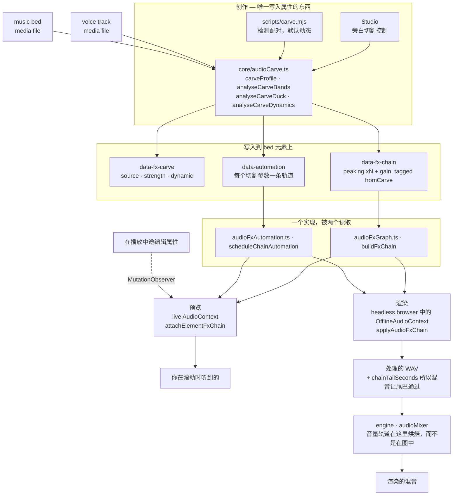
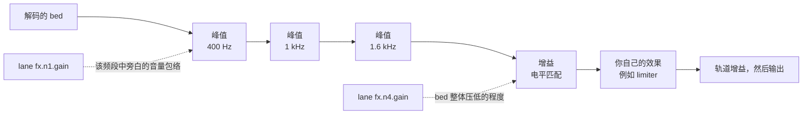

# HyperFrames 音频

混音是一组关系，而不是一堆处理器的堆叠。两条单独听起来都正确的音轨放在一起可能无法收听，而解决方法几乎不可能是“调低一个”，而是找到它们争夺的东西，并将其交给需要的一方。这里的每个工具都用来表达其中一种关系。

效果存在于元素上作为 `data-fx-chain`，预览和渲染运行相同的 Web Audio 图——在实时环境中是工作室，在浏览器内部的离线环境中是引擎。每个效果只有一个实现，所以在滚动时听到的就是你写入的。你永远不会调两次。

剪辑时间保持 `/hyperframes-core`：音频/视频修剪和源范围使用 `data-start`、`data-duration` 和 `data-media-start`，交叉淡入淡出会重叠不同音轨上的剪辑。这项技能拥有放置音轨的淡入/淡出、交叉淡入淡出包络、音轨增益/音轨音量、音量和效果自动化、压低/旁白切割，以及效果链。`/media-use` 拥有 sourcing、生成和预处理。

常量 `data-playback-rate` (`0.1..10`) 在匹配的音频/视频元素使用相同的定时、源偏移和速率时，对图片和保留音调的声音是渲染安全的。速度斜坡是 `data-automation` 中的 `rate` 轨（见 `docs/reference/speed-ramps`）；它胜过常量并保持预览和渲染中的音调。HyperFrames 不提供自动波形同步或漂移校正。
对于可复制的切割/交叉淡入淡出/重时间食谱，使用 `/hyperframes-core` → `references/creator-editing-recipes.md`。

三个属性承载所有内容，在音频/视频元素本身上——或者，对于前两个，在 `<hf-audio-group>` 总线上（见“一个总线用于多个音轨”）：

| 属性         | 持有                                                     |
| ------------ | --------------------------------------------------------- |
| `data-fx-chain`   | 效果，按信号顺序                                          |
| `data-automation` | 此音轨音量或其效果参数上的包络                         |
| `data-fx-carve`   | 切割自身的设置，以便它可以重新导出                     |

提供的效应家族是增益、均衡器（高通、低通、峰值、搁架）、压缩器、限制器、门、饱和、延迟、混响、合唱、相位器和位压碎。

每个的确切 JSON 以及一条轨道必须满足的规则：`references/attributes.md`。
每个效果及其参数、范围和单位：`references/fx-registry.md`。
如何弄清楚你无法听到的文件出了什么问题：`references/diagnosis.md`。
**预设、命名任务和单旋钮配置文件，以及症状到修复表：`references/presets.md`** — 在构建链之前阅读它，因为其中一个预设或命名任务通常已经命名了问题。

## 它们如何组合在一起

两个创作表面编写这些属性；两个运行时通过相同的构建器读取它们。共享的中间层是为什么预览会预测渲染。



切割自身的设置在播放时永远不会读取——播放的是它产生的链和轨道。`data-fx-carve` 存在的原因是，可以在现有的切割上更改强度，而不是从过滤器中猜测出来。

在切割的 bed 中，信号首先通过凹陷，然后是电平匹配，然后是你自己构建的任何东西——这就是为什么你添加的限制器仍然充当最后一个天花板：



静态切割是具有固定值且没有任何轨道的相同图。

## 首先，弄清楚什么不正确

下面的表从“它听起来很混响”——这假定有人已经听了并说了。给你一个文件并说“修复它”，你没有这样的句子，而且你不能听，所以你必须测量。一条规则统治着所有这一切：

> **单个未知旁白的绝对频谱无法诊断。**
> 共振峰是 ±10 dB，基频在 85–255 Hz 之间，句子在结束时下降 5–6 dB。它们中的每一个单独读起来都像缺陷，而它们中的每一个都是说话者。

所以比较，并且与文件内部的东西比较：如果存在，则干净的原版，否则是停顿——在间隙中可听到的任何东西都是加性的，而间隙的频谱是通道而不是旁白。与发布的平均频谱或合成的控制旁白比较不起作用：两个说话者之间的差异大于大多数缺陷，而且这两个评估背后的错误答案都来自这一点。

当没有原版且没有可用的静默时，静态音调缺陷确实未确定。说这种情况并提供适合的读数，而不是选择一个并构建一个链。

命令、陷阱和工作食谱：**`references/diagnosis.md`**。在诊断一个没有人描述的文件之前阅读它。

## 从症状开始

一旦你知道了频段和类型，就说出音频出了什么问题。大多数糟糕的音频是一个或两个中的这些，每个都有一个已提供的答案：

| 它听起来像                     | 寻求                                          |
| ---------------------------- | --------------------------------------------- |
| 下方有嗡嗡声或重击声            | `rumble-cut`，或 80 Hz 处的 `highpass`         |
| 混响、胸部                  | **控制混响** 任务（200 Hz）                    |
| 模糊、像卡纸一样              | **减少混浊** 任务（250 Hz）                    |
| 单词难以辨认                | **增加清晰度** 任务（3 kHz），或切割 bed      |
| 刺耳、累人                  | **柔和刺耳** 任务（3.2 kHz）                   |
| 某些单词比其他单词响得多        | 压缩器上的 **平均度**，或平均音量             |
| 句子之间有房间音调            | `room-gate`                                    |
| 旁白和音乐在竞争            | **旁白切割**——不是在两者上的 EQ              |
| 干燥、无处录制              | `room-tight` 或 `room-natural`                 |
| 只是“业余”                  | `voice-clean`，这是以上四个按顺序             |

完整目录，每个预设包含的内容，频段词汇，以及故意不涵盖的内容（去咝声、降噪、音调匹配）：`references/presets.md`。

在你添加之前减去，在过滤之后调整音量，在音量之后是关系，然后是特性和天花板。每一步都会改变下一步听到的内容——在高通滤波器之前设置的压缩器会花费时间追逐嗡嗡声。

## 根据问题而不是名称寻求一个家族

**滤波器** (`highpass`、`lowpass`、`peaking`、`lowshelf`、`highshelf`) 决定音轨被允许占据哪些频率。这是处理两个来源冲突的第一个工具，因为冲突发生在频段中：bed 和旁白都想要 1–3 kHz，从 bed 中获取这些成本远低于关闭整个东西的成本。在旁白上的高通滤波器是解决嗡嗡声的标准方法；低通滤波器会故意使声音变暗或变模糊。

**动态** (`gain`、`compressor`、`limiter`、`gate`) 决定音轨的音量如何随时间变化。压缩器缩小响亮和安静之间的距离，以便安静的部分可以出来。限制器是一个天花板——它不会改变任何东西，它保证不会超过任何东西。门会移除低于阈值的任何东西，这就是你如何消除短语之间的房间音调。`gain` 是一个普通的音量阶段，当音轨必须让路时，自动化轨道会骑乘它。

**非线性** (`saturate`、`bitcrush`) 改变波形形状，这会添加原本不存在的谐波。当音轨需要性格或粗糙而不是纠正时寻求它——并记住它是生成性的：它使瘦源更密集，而不是更干净。

**时间** (`delay`、`reverb`、`chorus`、`phaser`) 将音轨置于空间中或给它宽度。这些是最容易破坏混音的，因为尾巴或失谐的副本占据了声音需要的相同空间。在应该坐在其他东西后面的音轨上使用它们，并保持湿声量低于单独隔离时听起来正确的声量。

链是串行的：每个效果处理前一个效果产生的输出。所以纠正性滤波器会放在早期，中间是性格，最后是限制器，它实际上可以作为天花板起作用。

## 旁白切割

**它解决的问题。** 底下的音乐床使旁白难以跟随。反射是整个床压低，这有效，但会牺牲床的所有存在感——音乐在整个旁白期间都变得无力。但旁白不需要整个频谱。它只需要它实际占据的几个频段。切割只取这些，而 bed 保留其低频和顶部，所以它仍然是音乐，而旁白仍然是可理解的。

**它是一种关系，而不是一个效果。** 设置存在于 _bed_ 上——被处理的轨道——就像侧链压缩器一样，它命名要听的声音，正好如出一辙：你选择让音量变小的轨道，并选择使其变小的东西。**永远不要在旁白轨道上放置切割。** 旁白对自己进行切割是一个错误，而不是一个微妙的混音选择。

**每个旁白，而不是其中一个。** `sources` 是一个列表，因为 bed 通常在一系列下运行——一个叙述者、一个采访回答、一个第二主持人。它们在 bed 的时钟上求和，然后再进行任何测量（`mixCarveSources`），所以一个分析涵盖了所有它们：频段来自所有语音，而包络在任何一个发生时都会上升。在 bed 播放时永远不会播放的旁白被排除在外；它们无法掩盖它。

**对一个以上的 clip id 进行切割是错误的。分组剪辑并对分组进行切割。** 这是一个不变量，而不是一个提示。逐个命名剪辑必须完全正确，并且只有在下一次编辑之前才会保持正确——稍后添加的第四个叙述剪辑在切割的感知之外播放，而 bed 无法在它下面安静地淡入。相反，命名组可以在分析时解决成员资格，因此稍后添加到组中的剪辑会覆盖它，而无需触摸 `sources` 任何东西：

```html
<!-- 分组叙述，然后对 bed 进行切割 -->
<audio id="vo-intro" data-audio-group="voiceover" …></audio>
<audio id="vo-middle" data-audio-group="voiceover" …></audio>
<audio id="vo-outro" data-audio-group="voiceover" …></audio>

<audio id="music" data-fx-carve='{"enabled":true,"sources":["voiceover"],"strength":0.8}' …></audio>
```

命名两个或多个普通 clip id 而不是组的 `sources` 会触发 `audio_carve_ungrouped_sources` lint 规则——它仍然有效，但它会在剪辑添加时无声地腐烂。

**保持切割组是一个旁白组：没有 bed，没有 SFX，没有音乐。** 组 id 在 `sources` 中解析为在每个分析中每个当前成员，所以你命名的组就是你得到的组——不是写入它时测量的轨道。有两个方法会咬人：

- **bed 在自己的源组中。** 它被自己作为旁白切割，切割自己的内容——“永远不要将轨道切割为自己”规则在重新分析后到达。
- **SFX 或音乐剪辑在旁白组中。** 它在下一个分析中进入侧链，而 bed 开始在咻声中压低，即使写入属性的运行从未测量过它。

这两种情况在切割写入时都是不可见的：分析会求和它检测到的旁白，并且永远不会通过组解析进行往返，所以第一个通过是真正正确的，而下一个是错误的。所以给每个角色一个自己的组——`music` 用于 bed，`voiceover` 用于叙述，`sfx` 用于打击——并保持包含只有旁白的 `sources` 中的组命名。

`carve.mjs` 拒绝在看到这两种情况时写入组形式，记录 clip id，并在 stderr 上说明哪个成员阻止了它。然后 `audio_carve_ungrouped_sources` 规则指向安排而不是 CLI 安静地持久化比它测量更宽的切割。

这个运行排除的旁白**不是**这两种情况之一，并且不会阻止组形式：`carve.mjs` 只分析与 bed 重叠的旁白，并且在不编辑 `sources` 的情况下拾取稍后播放的剪辑是整个原因，所以命名组。

### 一个总线用于多个轨道

仅成员资格就足够进行切割，如上所述——但添加一个 `<hf-audio-group>` 元素并使用该 id，组就变成了一个真正的子混音总线：每个成员一个链、一个推子、一个自动化时钟。

```html
<hf-audio-group
  id="voiceover"
  data-label="Voiceover"
  data-volume="0.9"
  data-fx-chain='{"version":1,"nodes":[
    {"type":"compressor","id":"g1","params":{"threshold":-18,"ratio":3}},
    {"type":"peaking","id":"g2","params":{"frequency":3000,"gain":2,"q":1}}]}'
></hf-audio-group>

<audio id="vo-intro" data-audio-group="voiceover" …></audio>
<audio id="vo-middle" data-audio-group="voiceover" …></audio>
```

**当多个轨道属于同一处理时寻求总线。** 四个叙述剪辑每个都想要相同的压缩器是四个链来保持同步，而一旦编辑一个就会漂移；在总线上是一个链，压缩器看到整个旁白而不是每个剪辑单独——这是重点，因为压缩器无法骑乘它只听到三分之一的内容。
每个剪辑的链仍然适用于每个剪辑：一个嘈杂的片段需要它自己的去咝声。

| 在总线上        | 做                                      |
| -------------- | --------------------------------------- |
| `data-fx-chain`   | 一个链覆盖汇总的成员                   |
| `data-automation` | 轨道上的包络，在 COMPOSITION 时间      |
| `data-volume`     | 每个成员的一个推子（默认 1）    |
| `data-label`      | 显示名称；回退到 id                |
| `data-hidden`     | 从混音中删除每个成员                 |

**组自动化是组成时间，而不是剪辑时间。** 总线没有 `data-start`——成员在到达它时已经处于它们的组成位置——所以在组轨道上的 `t: 0` 是组成开始，而不是任何剪辑。剪辑上的轨道是剪辑本地的；相同的数字在两个上意味着不同的瞬间，这是在将包络从剪辑移动到其总线时需要正确的东西。

**切割始终在剪辑上。** `data-fx-carve` 不是组属性。被切割的 bed 是一个单轨道，并且是那个轨道携带 `data-fx-carve`——指向组，根据上面的规则。组和切割在 `sources` 中相遇，而不是在一个元素上。在总线上的切割是应用两次的一半效果：电平的一半测量 bed 自己的音频，而总线没有，所以 bed 然后运行通过总线的滤波器及其自己的。`audio_group_carve_attr` lint 规则捕获它。

**一个剪辑不是总线。** 组的存在是为了给多个轨道一个链、一个推子和一个时钟。将单个剪辑包装在总线上不会比剪辑自己的 `data-fx-chain` 做到更多，并且它加倍了后期编辑必须落地的位置。唯一的理由是：总线的自动化时钟是组成时间，所以单成员总线是如何在剪辑上的轨道上获得组成时间的。

**一个旋钮。** `strength` 是 0..1 并导出一切：切割深度如何、频段数量如何、宽度如何、如何将可理解性置于原始旁白能量之上、音量可能下降的程度、如何低于声音的目标。这六个在真实混音中一起移动——温柔的切割在少数频段中切割较浅，宽度较窄，压低较少——而硬切割在更多频段中切割更深，压低更多——所以它们是一个关系，一次写入在 `carveProfile` 中。`carve.mjs` 默认为 `0.8`——250 Hz 到 2.5 kHz 的六个频段每个切割约 7 dB，在 1.6 kHz 处切割 15 dB，总共 19 dB 的电平空间——因为 bed 在旁白下必须首先让路，然后才是音乐；模块是更改或关闭它的地方。多个候选者会让选择器等待而不是猜测。
Headless——这是当你创作一个组成而不是编辑一个组成时的路径：

```bash
node <SKILL_DIR>/scripts/carve.mjs --comp index.html
```

这就是全部命令。它找到旁白和 bed 本身，以默认强度动态切割，并打印它决定的内容：

```
bed    music-bed (名称看起来像音乐)
voice  narration (仅剩的轨道)
carve  strength 0.8 dynamic
bands  250Hz -7.4dB q2.06, 400Hz -7.4dB q2.06, 630Hz -7.4dB q2.06, 1000Hz -7.4dB q2.06, 1600Hz -14.8dB q2.06, 2500Hz -7.4dB q2.06
level  273-point envelope, floor -19.2 dB
```

当自动选择错误时，使用 `--bed` / `--voice`（可重复）来命名轨道（默认强度 `0.8`；使用 `--dry-run` 来看到报告并写入任何东西。

**它是如何选择轨道的。** 名称首先，因为这是你已经告诉它的，并且答案是可解释的——`classifyAudioName` 在核心中，与工作室自己的选择器使用的分类器相同，所以这两个不能不一致。一个轨道的 id 或文件名看起来像音乐（`music`、`bgm`、`bed`、`score`…）是 bed；所有其他在它上面播放且不是 SFX 形状的都将是旁白。音频元素被优先考虑：视频仅在没有任何音频轨道剩下作为旁白，或者每个 B-roll 剪辑在组成中都会被读取为有人在说话时才计算。**当它无法区分哪个轨道是 bed** 而不是切割错误时，它会拒绝——输入一个 id 是廉价的。

与面板使用相同的分析函数，所以结果是相同的。需要 `ffmpeg` 在 PATH 上，并且在项目中安装 `@hyperframes/core`（`npm i -D @hyperframes/core`）——CLI 在这里内联核心而不是打包它，所以它不能从那里借用。

**它写入的内容** 是一个普通的峰值滤波器链加上一个增益阶段，标记为 `fromCarve`。这个标记是整个诀窍：重新运行会替换之前的切割，并保留你手动构建的每个效果——以及你手动绘制的每个轨道——完全不变。所以以新的强度重新切割是安全且可重复的，并且 `data-fx-carve` 存在的原因是，设置可以读取而不是从过滤器中猜测。

## 自动化

一条轨道是一组在一个参数上的断点：`{t, v}` 在剪辑本地秒和参数自己的单位中。目标是 `volume` 对于轨道的音量，或 `fx.<nodeId>.<param>` 对于效果旋钮。

**只有一些参数可以自动化，而其他轨道上的轨道是沉默的。** 一个旋钮在 Web Audio `AudioParam` 支持它时是可自动化的。四个基于 worklet 的影响——`compressor`、`limiter`、`gate`、`bitcrush`——根本不暴露任何参数，所以任何它们参数上的轨道永远不会移动：要使压缩器的行为随时间变化，请在它之前自动化的 `gain` 阶段。`references/fx-registry.md` 标记了每个参数。

## 验证

几乎没有任何静态门覆盖混音。Linter 读取 `data-automation` 正好有一个冲突——`audio_volume_double_automation`，一个音量轨道在具有 `volume` 的 GSAP 淡入的轨道上，轨道胜过淡入并被忽略——加上 `audio_volume_tween_overrides_gain`，一个轨道上的授权 `data-volume`，其 `volume` 被淡入，淡入的值是绝对的，它们会替换增益而不是缩放它。什么验证链或效果轨道都没有。渲染强制执行这些：一个它无法解析的链会导致整个混音失败，而不是无声地写入干燥信号，因为听起来合理但错误的混音比拒绝更糟。预览的设计相反：一个无法读取的链会播放干燥，所以组成保持可工作。

指向链上的节点而链没有的轨道在读取时会被修剪，而不是错误——所以一个拼错的 `nodeId` 会让你无声地损失包络。从链中读出 id 而不是假设它是什么。

具有尾巴的效果（`reverb`、`delay`）会使渲染的轨道比其源**更长**，而混音是由链告诉如何的。所以具有混响的 bed 不再正好结束于其 `data-duration`；这是预期的，而不是一个错误。

除此之外，混音通过渲染和聆听来验证。对于切割：旁白应该是可理解的，而 bed 不应该听起来空洞，并且 `dynamic` 时 bed 应该在短语之间恢复而不是保持平坦。如果 bed 在声音下听起来不是简单地更安静而是缺口，强度太高——这是唯一具有明显声音的失败模式。
