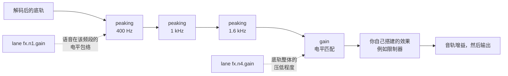

# HyperFrames Audio

一组音频混音（mix）是关系的集合，而非处理器的堆栈。两条单独听来都合理过的音轨，放在一起可能就难以听辨，而解决方案几乎从来不是"把其中一条调低"——而是要找到它们争执的频段，并将其让给更需要它的那一轨。此处所有的工具，都是为了表达其中之一。

效果（Effects）以 `data-fx-chain` 挂载在元素上，预览（preview）与渲染（render）运行的是同一张 Web Audio 图——这是直播语境下的制作环境，也是浏览器内离线场景下的引擎。每种效果只有一种实现，因此你在拖动预览时听到的内容，就是最终写入的内容。你永远不会被要求重复调音。

时间轴（Clip timing）仍由 `/hyperframes-core` 负责：音频/视频的裁剪与源范围使用 `data-start`、`data-duration` 和 `data-media-start`，交叉淡入淡出（crossfades）会在不同音轨上的裁剪片段上重叠。本技能负责放置音轨的淡入/淡出、交叉淡入淡出包络、音轨增益/音轨音量、音量与效果自动化、压韵/配音裁剪（ducking/voiceover carve），以及效果链。`/media-use` 负责素材获取、生成与预处理。

常量 `data-playback-rate`（`0.1..10`）在音频与视频元素同步时间、源偏移与速率时，对画面和保真度音量的渲染是安全的。速度斜坡（speed ramp）是 `data-automation` 中的 `rate` 通道（参见 `docs/reference/speed-ramps`）；它会覆盖常量，并在预览与渲染中保持音高一致。HyperFrames 不提供自动波形同步或漂移校正。

如需可复制的裁切/交叉淡入淡出/变速配方，请使用 `/hyperframes-core` → `references/creator-editing-recipes.md`。

以下三个属性承载了全部内容，它们位于音频/视频元素本身上——或前两者，位于 `<hf-audio-group>` 总线（参见"一总线多音轨"）上：

| 属性（Attribute） | 承载内容 |
| ----------------- | --------------------------------------------------------- |
| `data-fx-chain`   | 效果，按信号顺序 |
| `data-automation` | 本音轨音量或其效果参数的包络 |
| `data-fx-carve`   | 裁切自身的设置，以便可重新推导 |

已发布的效应家族包括：gain（增益）、EQ（高通、低通、峰值、全音波）、compressor（压缩器）、limiter（限制器）、gate（门）、saturate（饱和）、delay（延迟）、reverb（混响）、chorus（和声）、phaser（相位）、bitcrush（比特压碎）。

每种效果的精确 JSON，以及一个通道（lane）必须满足的规则：`references/attributes.md`。
每个效果及其参数、范围和单位：`references/fx-registry.md`。
无法听到问题时的文件诊断方法：`references/diagnosis.md`。
**预设、命名任务与一键参数配置，以及症状到修复的对照表：`references/presets.md`** ——在手工搭建链之前阅读该文件，因为其中一个预设或命名任务通常已点出了问题所在。

## 组合方式

两个创作面（authoring surfaces）写入这些属性；两个运行时（runtimes）通过相同的构建器（builders）读取它们。正是这种共享的中间层，使得预览能够预测渲染结果。

```mermaid
flowchart TB
  voice["语音轨<br/>媒体文件"]
  bed["音乐底轨<br/>媒体文件"]

  subgraph AUTHOR["创作——仅会写入属性的部分"]
    panel["录音棚<br/>配音裁剪控制"]
    script["scripts/carve.mjs<br/>自动检测配对，默认动态"]
    analysis["core/audioCarve.ts<br/>carveProfile · analyseCarveBands<br/>analyseCarveDuck · analyseCarveDynamics"]
    panel --> analysis
    script --> analysis
  end

  voice --> analysis
  bed --> analysis

  subgraph ATTRS["写入到底轨元素上"]
    carveAttr["data-fx-carve<br/>源 · 强度 · 动态"]
    chainAttr["data-fx-chain<br/>peaking xN + gain，标注 fromCarve"]
    autoAttr["data-automation<br/>每个裁切参数一个通道"]
  end

  analysis --> carveAttr
  analysis --> chainAttr
  analysis --> autoAttr

  subgraph SHARED["一种实现，供两者读取"]
    build["audioFxGraph.ts · buildFxChain"]
    sched["audioFxAutomation.ts · scheduleChainAutomation"]
  end

  chainAttr --> build
  autoAttr --> sched

  build --> preview["预览<br/>实时 AudioContext<br/>attachElementFxChain"]
  sched --> preview
  build --> render["渲染<br/>无头浏览器中的离线 AudioContext<br/>applyAudioFxChain"]
  sched --> render

  preview --> heard["在拖动预览时听到的内容"]
  render --> wav["处理后的 WAV<br/>+ chainTailSeconds 以便混音能透出尾部"]
  wav --> mix["引擎 · audioMixer<br/>增益通道已烘焙进 PCM 中，而非图"]
  mix --> out["渲染出的混音"]

  edit["在播放中编辑属性"] -.->|MutationObserver| preview
```



裁切的自身设置在播放时永远不会被读取——是它产生的链与通道在播放。`data-fx-carve` 存在，是为了能够在现有裁切上修改强度，而不是从滤波器中反推猜测。

在已裁切的底轨中，信号先经过降频（dips），再进行电平匹配（level match），然后是你自己搭建的任何效果——这正是为什么你添加的限制器（limiter）仍然作为最后的上限起作用：



静态裁切（static carve）就是同一个图，使用固定值且没有任何通道。

## 首先，排查问题所在

下表从"听起来有浑浊感（boomy）"出发——这预设了某人已经听过了并指出问题。当交付一份文件并告知"修复这个"，却没有这样的描述，也听不到，就只好测量。一条规则贯穿始终：

> **单一未知音轨的绝对频谱无法被诊断。**
> 共振峰（Formants）偏差 ±10 dB，基频在 85–255 Hz 之间，句子在结尾处下降 5–6 dB。每一个都单独看都像是缺陷，而每一个都是说话者本身。

因此要对比，并与**文件内部**的某物进行对比：如果存在的话取干净的原始版本，否则取暂停处——间隙中可听到的内容是可加的，间隙的频谱是通道而非音轨本身。与已发布的平均频谱或合成的对照音轨对比是无效的：两个说话者的差异超过大多数缺陷，而此指导背后的评估中两个错误答案都正是来自这一点。

当没有原始版本且也没有可用静音时，静态的色调缺陷确实难以确定。应说明这一点，并提供符合的读数，而不是随意选一个并据此搭建链。

命令、陷阱与实例配方：**`references/diagnosis.md`**。在诊断一份无人描述过的文件之前阅读它。

## 从症状出发

一旦知道频段与类型，就命名音频存在的问题。大多数不良音频是以下一种或两种，而每种都有已交付的解决方案：

| 听起来像 | 应使用 |
| ---------------------------------- | -------------------------------------------------- |
| 底层有杂音或砰砰声 | `rumble-cut`，或 80 Hz 的高通（highpass） |
| 浑浊、胸腔感重 | **Tame Boominess** 任务（200 Hz） |
| 模糊、像隔着纸板 | **Reduce Mud** 任务（250 Hz） |
| 词句难以听清 | **Add Clarity** 任务（3 kHz），或裁切底轨 |
| 刺耳、令人疲惫 | **Soften Harshness** 任务（3.2 kHz） |
| 部分词句明显比其它更响 | **Evenness**（压缩器上的），或 Even Out Levels |
| 句间有环境音 | `room-gate` |
| 人声与音乐打架 | **Voiceover carve**——而不是在任一侧上做 EQ |
| 干燥、录于无环境处 | `room-tight` 或 `room-natural` |
| 只是"业余感" | `voice-clean`，即以上四者的顺序组合 |

完整目录、每个预设包含什么、频段词汇，以及明确**不覆盖**的内容（去尖音、去噪、音色匹配）：`references/presets.md`。

先减后加，先调电平，再过滤，再处理关系，最后处理特征与上限。每一步都改变后续听到的内容——在做过山车（compressor）之前设置高通，是让过山车在追逐轰隆声上浪费其时间。

## 根据问题而非名称，选取一个家族

**滤波器（Filters）**（`highpass`、`lowpass`、`peaking`、`lowshelf`、`highshelf`）决定音轨允许占据哪些频段。这是两种源冲突时的第一工具，因为冲突发生在频段中：底轨与人声都想占用 1–3 kHz，而剥夺底轨的带宽，比将整轨调低带来的代价要小得多。人声上的高通是处理轰隆声的标准修复；低通则刻意加深或模糊。

**动态处理（Dynamics）**（`gain`、`compressor`、`limiter`、`gate`）决定音轨电平如何随时间变化。压缩器缩小 loud 与 quiet 之间的距离，让安静部分能上来。限制器是上限——它不塑造任何内容，也不保证任何内容不被越过。门（gate）移除低于阈值的部分，这就是你在句间消除环境音的方法。`gain` 是纯粹的电平阶段，也是当音轨需要让位时，自动化通道所骑乘的。

**非线性（Nonlinear）**（`saturate`、`bitcrush`）改变波形形状，从而添加原本不存在的谐波。当音轨需要个性或颗粒感而非修正时，应使用它——并记住它是生成式的：它让薄弱的源更致密，而非更干净。

**时间处理（Time）**（`delay`、`reverb`、`chorus`、`phaser`）将音轨放入空间或赋予其宽度。这些最易破坏混音，因为尾音或失谐的副本会占据人声需要的同一空间。将它们用在应位于其他内容**之后**的东西上，并保持湿感（wet amount）低于单独听来合理的程度。

链是串行的：每个效果处理前一个效果产生的信号。因此纠正性的滤波应靠前，个性放在中间，限制器放在最后，使其能真正作为上限起作用。

## 配音裁切（Voiceover carve）

**它所解决的问题。** 人声下的音乐底轨会让人声难以跟上。反射性做法是压低整个底轨，这有效，但代价是底轨失去全部的存在感——人声期间音乐变得疲软无力。但人声不需要整个频谱，它只需要占据的少数频段。裁切只取这些频段，而底轨保留低频与顶层，因此人声清晰时它仍是音乐。

**它是一个关系，而非效果。** 设置位于 _底轨_——即被处理的音轨——上，并指明要聆听的音轨，正如侧链压缩器（sidechain compressor）一样：你选择哪轨变暗，并选择让其变暗的因素。**永远不要把裁切放在人声轨上。** 对人声裁切自身是一个 bug，而非微妙的混音选择。

**每道人声，而非其中一道。** `sources` 是一个列表，因为底轨通常在一整段序列下方运行——叙述者、访谈回答、第二位演讲者。在做任何测量之前，它们会被叠加到底轨自身的时钟上（`mixCarveSources`），因此一次分析覆盖所有：频段来自其中所有的语音，包络在任意一处发生的地方就会上升。在底轨运行期间从未播放的人声被排除在外；它们无法掩盖底轨。

**用多于一个 clip id 对裁切进行命名是错误的。** 应把片段分组后再对组进行裁切。这是不变式（invariant），而非建议。逐个命名片段必须完全准确，且仅在下次编辑后仍保持正确——后来添加的第四段叙述片段会在裁切的范围之外播放，底轨在该处下无法静音。用组名替代则能在分析时解析成员关系，因此稍后加入组中的片段无需触碰 `sources` 即可被覆盖：

```html
<!-- 分组叙述，然后对底轨按组裁切 -->
<audio id="vo-intro" data-audio-group="voiceover" …></audio>
<audio id="vo-middle" data-audio-group="voiceover" …></audio>
<audio id="vo-outro" data-audio-group="voiceover" …></audio>

<audio id="music" data-fx-carve='{"enabled":true,"sources":["voiceover"],"strength":0.8}' …></audio>
```

`sources` 列表用两个或更多普通 clip id 命名，而非组名，会被 `audio_carve_ungrouped_sources` 校验规则（lint rule）捕获——它仍然可用，但这是当添加片段时会静默劣化的版本。

**保持裁切组为语音组：无底轨、无音效、无音乐。** `sources` 中的组 ID 在每次分析中都会解析为 _所有_ _当前_ 成员，因此你命名的组就是之后你得到的组——而不是写入时被测量的音轨。两种造成问题的情形：

- **底轨在自己的源组中。** 它被当作语音交给自身，并对其自身内容进行裁切——即"永远不要把音轨裁切自身"规则在下次重新分析时才生效。
- **语音组中包含音效或音乐片段。** 它在下次分析时进入侧链，底轨开始在被一个嗖声下压低，尽管写入属性的那次运行并未测量它。

两种在裁切写入的瞬间都不可见：分析会汇总它检测到的语音，从不经过组解析往返，因此第一遍确实正确，只有下一遍才错误。所以为每个角色分配自己的组——底轨用 `music`，叙述用 `voiceover`，打击用 `sfx`——并保持 `sources` 中的组名只包含语音。

`carve.mjs` 在检测到上述任一情况时拒绝写入组形式，记录 clip id，并在 stderr 中说明哪个成员阻断了它。`audio_carve_ungrouped_sources` 规则随即指向安排本身，而非静默持久化了一个比测量更宽的裁切。

本轮未包含的语音 **不是**这些情形之一，也不会阻碍组形式：`carve.mjs` 只分析重叠到底轨的语音，而拾取一个未经过编辑就播放的片段，正是需要命名组的原因。

### 一总线多音轨

如上所述，成员关系本身就已足够用于裁切——但添加一个带有该 ID 的 `<hf-audio-group>` 元素，组就会成为真正的子混音（submix）总线：每个成员一条链、一个推子、一个自动化时钟。

```html
<hf-audio-group
  id="voiceover"
  data-label="Voiceover"
  data-volume="0.9"
  data-fx-chain='{"version":1,"nodes":[
    {"type":"compressor","id":"g1","params":{"threshold":-18,"ratio":3}},
    {"type":"peaking","id":"g2","params":{"frequency":3000,"gain":2,"q":1}}]}'
></hf-audio-group>

<audio id="vo-intro" data-audio-group="voiceover" …></audio>
<audio id="vo-middle" data-audio-group="voiceover" …></audio>
```

**当相同的处理应作用于多轨时，使用总线。** 四个想要同一压缩器的叙述片段需要四条步调一致的链，一旦其中一条被编辑就会发生漂移；在总线上是一条链，压缩器看到的是整个语音，而非每个片段独立——这正是目的，因为压缩器无法骑乘它只能听到三分之一的序列。按片段链仍适用于真正按片段处理的内容：一条需要自己去尖音的嘈杂片段。

| 在总线上 | 起到的作用 |
| ----------------- | ----------------------------------------- |
| `data-fx-chain`   | 跨已汇总成员的一条链 |
| `data-automation` | 总线上的包络，按组合时间（composition time） |
| `data-volume`     | 每个成员的单个推子（默认 1） |
| `data-label`      | 显示名称；回退到 ID |
| `data-hidden`     | 从混音中丢弃每个成员 |

**组自动化是按组合时间，而非片段时间。** 总线没有 `data-start`——成员到达时已处于其组合位置——所以组中通道里的 `t: 0` 是组合的起点，而非任何片段的起点。通道在片段上按片段本地；在两条通道上使用相同的数字意味着不同的时刻，这是移动包络从片段上移到其总线时唯一需要弄对的事。

**裁切始终留在片段上。** `data-fx-carve` 不是组属性。被裁切的底轨是单个音轨，而它正是这条音轨携带 `data-fx-carve`——按照上述规则，它指向 _一个_ 组。组与裁切在 `sources` 中相遇，不在单个元素上。把裁切写在总线上相当于对效果应用了两次，各占一半：电平部分测量的是底轨自身的音频，而总线没有，因此只有滤波器保留下来——且总线及其成员是单一信号路径，因此底轨随后既经过总线的滤波器，也经过它自己的。`audio_group_carve_attr` 校验规则会捕获它。

**单个片段不是总线。** 组存在是为了给多条音轨提供一条链、一个推子和一个时钟。把单个片段包进总线上，无法获得该片段自身 `data-fx-chain` 已具备的任何东西，而且会使后续的编辑需要落在更多位置。唯一仍这么做的原因：总线的自动化时钟是组合时间，因此单个成员的总线是让该片段上的通道获得组合时间定时的唯一方式。

**一个旋钮。** `strength` 是 0..1，它推导一切：剪低的深度、多少频段、多宽、在清晰度与原始语音能量之间偏重的程度、电平可下降的程度、相对于语音偏下的程度。这六个在任何真实混音中同步移动——轻柔的裁切是浅剪于少数频段且压低少的，剧烈的则是更深于更多频段且压得更深——因此它们是一次性写入 `carveProfile` 中的单一关系。`carve.mjs` 默认 `0.8`——从 250 Hz 到 2.5 kHz 的六个频段各裁约 7 dB，1.6 kHz 处裁 15 dB，且有 19 dB 的电平余量——因为底轨在叙述下方必须先让位，其次才作为音乐；`0.25`（三频段内各 6 dB 的切入，6 dB 的余量）保留了底轨的存在，但仍让它能与语音对抗，且实践中被认为太弱。在 `0.5` 处，切入达到 10 dB，此时裁切开始被听作效果，而非为语音留出的空间。当底轨是重点而语音稀疏时，降低 strength。`0` 是仅频谱的——单一频段，完全无电平匹配。

**默认使用裁切——每当音乐在语音下方播放时是必须的。** 任何语音轨（叙述、头像语音、访谈、配音）下的底轨，在完成混音时都会获得裁切，而非作为有时间就去做以打磨的步骤。放置两轨，运行以下命令（默认强度 `0.8`；检测选错时添加 `--bed` / `--voice`），用 `npx hyperframes check` 确认写入的 `data-fx-carve`、`data-fx-chain` 与 `data-automation`，然后才渲染。仅靠音量压低本身不是完成混音：它让语音与底轨在 1–3 kHz 频段持续对抗，并为整个配音耗尽底轨的存在感。仅当不存在需要底轨托底的语音时才跳过裁切——音乐视频、标题卡、剪辑到轨的蒙太奇。

**它始终跟随语音。** 没有静态模式：固定的深度会让底轨在每个暂停处被变薄，一旦两者都已听到就没有理由想要它。每个值都成为语音自身电平的包络——静音时底轨保持原样，响亮段落会将裁切推至满深度——以普通自动化形式写入，因此通道会出现在时间线中且可后续编辑。

**电平匹配是其中一部分。** 频谱裁切无法修复比语音更响的底轨。因此裁切还测量底轨相对于语音的压低程度，并写入一个 `gain` 阶段：静态裁切时保持一个值，动态裁切时由包络驱动。该包络有意缓慢释放——语音结束的瞬间音乐立即恢复到满电平，听起来像机器在操作。

**运行它。** 在录音棚（Studio）中，裁切是音轨效果架上顶部的模块——语音、强度、动态，以及它产出的分析，在一张卡片上。当任何其他音轨可能成为语音时，它都会在那里。只要其上恰好有 **一个** 候选音轨，底轨就会默认以动态方式、在默认强度下被裁切：这正是底轨下方有叙述时想要的，而该模块就是你改变或关闭它的地方。多个候选则会让选择器等待而非猜测。无头模式——这是以创作组成而非编辑组成的路径：

```bash
node <SKILL_DIR>/scripts/carve.mjs --comp index.html
```

这就是全部命令。它找到语音与底轨本身，以默认强度动态裁切，并打印它做出的决定：

```
bed    music-bed (名称看起来像音乐)
voice  narration (仅剩音轨)
carve  strength 0.8 dynamic
bands  250Hz -7.4dB q2.06, 400Hz -7.4dB q2.06, 630Hz -7.4dB q2.06, 1000Hz -7.4dB q2.06, 1600Hz -14.8dB q2.06, 2500Hz -7.4dB q2.06
level  273 点包络，floor -19.2 dB
```

当自动选择错误时，用 `--bed` / `--voice`（可重复）命名音轨，`--strength` 调整强度，`--dry-run` 查看该报告且不写入任何内容。

**它是如何选取音轨的。** 名称优先，因为那是你已经告知它的，且答案可解释——`core` 中的 `classifyAudioName`，录音棚自己的选择器使用同一分类器，因此两者不会矛盾。ID 或文件名看起来像音乐（`music`、`bgm`、`bed`、`score`…）的音轨是底轨；其余在其下方播放且非音效形状的是语音。音频元素优先：视频仅当没有音频音轨可作为语音，或组成中每个 B-roll 片段都会读作有人在说话时才算数。**当无法判断哪条音轨是底轨时，它拒绝运行，而非裁错**——指定一个 ID 很廉价。

与面板使用相同的分析函数，因此结果一致。需要在 PATH 中找到 `ffmpeg`，并在项目中安装 `@hyperframes/core`（`npm i -D @hyperframes/core`）——CLI 内联核心而非自带，因此无法从中借用。

**它写入的内容**是一条普通的 peaking 滤波器链加增益阶段，并标注 `fromCarve`。这种标注是整个技巧：重新运行会替换之前的裁切，但保留你手工搭建的每个效果和手工绘制的每个通道的原始位置。因此在新强度下重新裁切是安全且可复现的，而 `data-fx-carve` 存在，以便能读回设置，而非从滤波器中反推猜测。

## 自动化

一个通道（lane）是单个参数上的一组断点：`{t, v}`，`t` 为片段本地秒，`v` 为参数的自身单位。目标是音轨的 `volume`，或效果的 `fx.<nodeId>.<param>`。

**只有部分参数可被自动化，对其它通道上的车道是静默无效的。** 当旋钮由 Web Audio `AudioParam` 支撑时，它可被自动化。四种基于 worklet 的效果——`compressor`、`limiter`、`gate`、`bitcrush`——完全不暴露参数，因此任何对其参数的通道永远不会移动：要让压缩器行为随时间变化，应在它之前自动化一个 `gain` 阶段。`references/fx-registry.md` 标记了每个参数。

## 验证

几乎没有任何静态检查能覆盖混音。校验器（linter）仅读取 `data-automation` 中的一个确切冲突——`audio_volume_double_automation`，即一个音轨同时有 GSAP 补间（tween）作用于 `volume` 时存在音量通道，此时通道胜出而补间被忽略——以及 `audio_volume_tween_overrides_gain`，即音轨上被作者写入的 `data-volume`，而其 `volume` 正被补间，此时补间的数值为绝对值并替换该增益，而非对其缩放。没有任何内容校验链或效果通道。强制执行这些的是渲染：它无法解析的链会使整个混音失败，而非静默写入干燥信号，因为听起来合理但错误的混音比拒绝更糟。预览按设计相反：无法读取的链以干燥方式播放，使组成保持可工作。

指向链中不存在的节点的通道在读取时被修剪，而非报错——因此拼错的 `nodeId` 会静默丢失包络。应从链中读出 ID，而非假设其被铸造的方式。

带尾音（tail）（`reverb`、`delay`）的效果使渲染出的音轨 **比其源更长**，混音通过链告知了这种额外量。因此有混响的底轨不再在 `data-duration` 处精确结束；这是预期行为，而非 bug。

除此外，混音通过渲染与聆听来验证。对于裁切：语音应清晰可辨，而底轨不应听起来空洞；在 `dynamic` 下，底轨应在句间回升，而非一直平坦。如果底轨在语音下方听起来有凹陷而非只是更安静，则强度过高——这是只有一个明显声音的失败模式。
