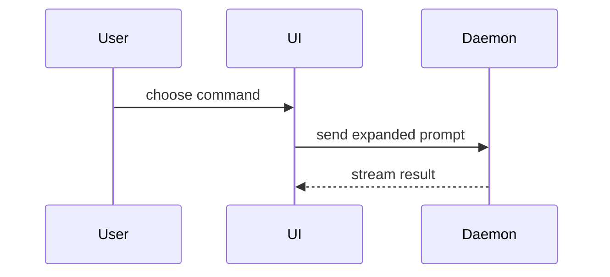

帮助用户通过视觉方式理解当前对话主题。跳过开场白，保持文字简洁。选择能清晰展示关键点的最小视图。

- 以伪代码展示逻辑或算法：

```text
on(save)
  if content is unchanged
    return cached result
  write new content
  return fresh result
```

- 以调用树展示运行时控制流：

```text
submitForm
  createSession
    persistPrompt
    launchAgent
  navigateToSession
```

- 以组件树展示 UI 结构，包括重要的状态和模块边界：

```tsx
<SessionPage> (apps/example/src/routes/session.tsx)
  useSessionEvents()
  <SessionToolbar>
    <RunSkillButton> (packages/ui)
```

- 以浅层文件树展示文件职责或广泛重构：

```text
src/
├── commands/       # 解析用户操作
├── sessions/       # 拥有会话状态
└── transport/      # 发送 API 请求
```

- 以 Mermaid 展示组件交互、控制流或数据流：



- 当要点在于变化且周围结构已存在时，使用 `diff`。使 diff 形状与主题匹配。

对于组件变更：

```diff
 <SessionPage>
   useSessionEvents()
   <SessionToolbar>
+    <RunSkillButton />
   <SessionTimeline>
+    <SkillResultCard />
```

对于文件布局变更：

```diff
 src/
 ├── commands/
+│   └── show-me.ts       # 扩展命令
 ├── sessions/
-└── transport.ts
+└── transport/
+    ├── client.ts
+    └── stream.ts
```

对于调用树或调用栈变更：

```diff
 submitForm
   createSession
     persistPrompt
+    expandSkillMention
     launchAgent
-  navigateToSession
+  navigateToSession
+    subscribeToEvents
```

对于状态或控制流变更：

```diff
 on(save)
-  write content
+  if content is unchanged
+    return cached result
+  write new content
+  invalidate cache
```

- 当大部分内容是新时，或省略上下文会隐藏所有权或顺序时，或用户需要一个可复制的目标形状时，展示整个块：

```ts
function expandSkill(command: string): string {
  const skillName = command.slice(1)
  return `use the ${skillName} skill`
}
```

- 对于视觉 UI、布局、状态比较或 Mermaid 无法表达的密集概念，编写一个聚焦的 HTML 文件——一个图表、信息图或简短的幻灯片，根据要点选择。匹配产品的颜色、类型、间距和组件；使用真实标签和数据；支持桌面和移动。然后为用户打开它：

```
Bash(open path/to/show-me-{description}.html)
```

### 指导

将每个视觉元素放在它支持的简短文字旁边。仅保留回答用户当前问题或解决当前讨论要点的调用、文件、属性、状态和边界。

你可以使用其中一种，也可以使用几种，不太可能全部使用。使用你的判断力，不要让用户感到不知所措。
