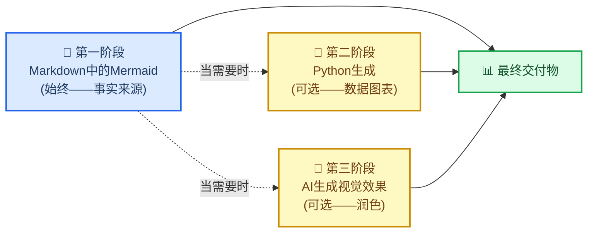
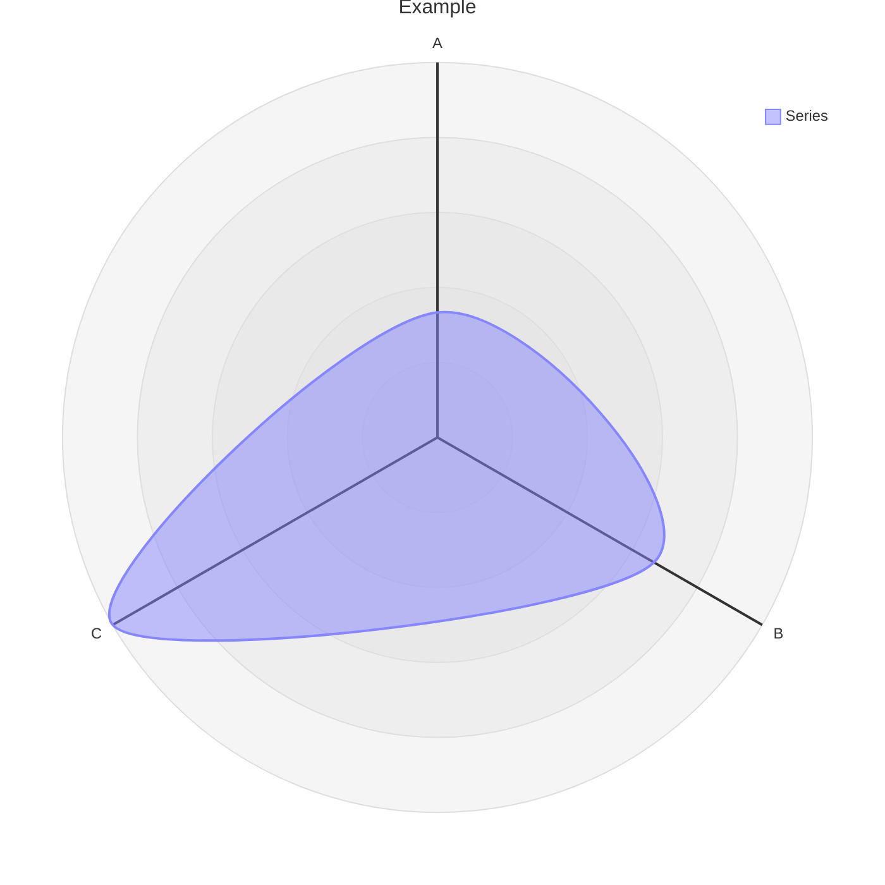

# Markdown和Mermaid写作

## 概述

这项技能教你如何使用**内嵌Mermaid图表的Markdown**（作为默认和标准的格式）来创建科学文档，并强制执行相关标准。

核心假设：在`.md`文件中表达的Mermaid图表关系比任何图像更有价值。它是文本，因此在git中可以干净地进行差异比较。它不需要构建步骤。它可以在GitHub、GitLab、Notion、VS Code以及任何Markdown查看器中原生渲染。它比描述相同关系的散文描述使用的token更少。并且它始终可以稍后转换为精致的图像——但文本版本仍然是事实来源。

> “你报告和文件中`.md`格式的越多，mermaid也像是一个简单的‘脚本语言’。这有助于任何下游渲染，尤其是AI生成的图像（使用mermaid而不是长篇文本来描述关系< tokens）。此外，mermaid可以与Markdown一起渲染，以便人类或AI几乎可以在任何地方轻松使用。”
>
> — Clayton Young (@borealBytes)，K-Dense Discord，2026-02-19

## 何时使用这项技能

使用这项技能的情况：

- 创建**任何科学文档**——报告、分析、手稿、方法部分
- 编写**任何文档**——README、操作指南、决策记录、项目文档
- 生成**任何图表**——工作流、数据管道、架构、时间线、关系
- 生成**任何将进行版本控制的输出**——如果它要放入git，它应该是Markdown
- 与**任何其他技能**一起使用——这项技能定义了封装每个其他输出的文档层
- 有人要求你“添加一个图表”或“可视化关系”——Mermaid优先，始终

不要从Python matplotlib、seaborn或AI图像生成开始用于结构或关系图表。
那些是第二阶段和第三阶段——仅在Mermaid无法表达所需内容时使用（例如，带有真实数据的散点图、照片级真实图像）。

## 🎨 源格式理念

### 为什么基于文本的图表胜出

| 重要因素 | Markdown中的Mermaid | Python/AI图像 |
| ----------------------------- | :-----------------: | :---------------: |
| Git差异可读 | ✅ | ❌ 二进制块 |
| 无需重新生成即可编辑 | ✅ | ❌ |
| 与散文相比的Token效率 | ✅ 更小 | ❌ 更大 |
| 无需构建步骤即可渲染 | ✅ | ❌ 需要托管 |
| 无需视觉即可被AI解析 | ✅ | ❌ |
| 在GitHub / GitLab / Notion中工作 | ✅ | ⚠️ 如果托管 |
| 可访问性（屏幕阅读器） | ✅ accTitle/accDescr | ⚠️ 需要alt文本 |
| 可稍后转换为图像 | ✅ 任何时候 | — 已经是图像 |

### 三阶段工作流程



**第一阶段是强制性的。** 即使你继续进行第二阶段或第三阶段，Mermaid源代码也保持提交。

### Mermaid可以表达的内容

Mermaid涵盖24种图表类型。几乎每个科学关系都适合其中一种：

| 用例 | 图表类型 | 文件 |
| -------------------------------------------- | ---------------- | ---------------------------------------------------- |
| 实验工作流/决策逻辑 | 流程图 | `references/diagrams/flowchart.md` |
| 服务交互/API调用/消息传递 | 序列图 | `references/diagrams/sequence.md` |
| 数据模型/架构 | ER图 | `references/diagrams/er.md` |
| 状态机/生命周期 | 状态图 | `references/diagrams/state.md` |
| 项目时间线/路线图 | Gantt图 | `references/diagrams/gantt.md` |
| 比例/组成 | 饼图 | `references/diagrams/pie.md` |
| 系统架构（缩放级别） | C4图 | `references/diagrams/c4.md` |
| 概念层次/头脑风暴 | 思维导图 | `references/diagrams/mindmap.md` |
| 时间顺序事件/历史 | 时间线 | `references/diagrams/timeline.md` |
| 类层次/类型关系 | 类图 | `references/diagrams/class.md` |
| 用户旅程/满意度地图 | 用户旅程 | `references/diagrams/user_journey.md` |
| 双轴比较/优先级 | 象限图 | `references/diagrams/quadrant.md` |
| 需求可追溯性 | 需求图 | `references/diagrams/requirement.md` |
| 流量大小/资源分布 | Sankey图 | `references/diagrams/sankey.md` |
| 数值趋势/条形+折线图 | XY图 | `references/diagrams/xy_chart.md` |
| 组件布局/空间排列 | 块图 | `references/diagrams/block.md` |
| 工作项状态/任务列 | Kanban图 | `references/diagrams/kanban.md` |
| 云基础设施/服务拓扑 | 架构图 | `references/diagrams/architecture.md` |
| 多维比较/技能雷达 | 雷达图 | `references/diagrams/radar.md` |
| 层次比例/预算 | 树图 | `references/diagrams/treemap.md` |
| 二进制协议/数据格式 | 数据包图 | `references/diagrams/packet.md` |
| Git分支/合并策略 | Git图 | `references/diagrams/git_graph.md` |
| 代码风格序列（编程语法） | ZenUML图 | `references/diagrams/zenuml.md` |
| 多图表组合模式 | 复杂示例 | `references/diagrams/complex_examples.md` |

> 💡 **选择正确的类型，而不是容易的类型。** 不要默认使用流程图来描述所有内容。
> 时间线比流程图更适合时间顺序事件。序列图比流程图更适合服务交互。扫描表格并匹配。

---

## 🔧 核心工作流程

### 第一步：确定文档类型

在从零开始编写之前，检查是否存在模板：

| 文档类型 | 模板 |
| ------------------------------ | ----------------------------------------------- |
| 拉取请求记录 | `templates/pull_request.md` |
| 问题/错误/功能请求 | `templates/issue.md` |
| 短跑/项目看板 | `templates/kanban.md` |
| 架构决策（ADR） | `templates/decision_record.md` |
| 演示文稿/简报 | `templates/presentation.md` |
| 研究论文/分析 | `templates/research_paper.md` |
| 项目文档 | `templates/project_documentation.md` |
| 操作指南/教程 | `templates/how_to_guide.md` |
| 状态报告 | `templates/status_report.md` |

### 第二步：阅读风格指南

在编写任何`.md`文件之前：阅读`references/markdown_style_guide.md`。

需要牢记的关键规则：

- **每个文档一个H1**——标题。决不多于一个。
- **仅在H2标题上使用表情符号**——每个H2一个表情符号，H3/H4中无表情符号
- **引用所有内容**——每个外部声明都获得一个带有完整URL的脚注`[^N]`
- **谨慎使用粗体**——每个段落最多2-3个粗体术语，决不使用整个句子
- **每个`</details>`之后使用水平线**——强制执行
- **对于比较、配置、结构化数据，使用表格而不是散文**
- **对于描述流程、结构或关系的，添加Mermaid图表而不是大段文字**

### 第三步：选择图表类型并阅读其指南

在创建任何Mermaid图表之前：阅读`references/mermaid_style_guide.md`。

然后打开特定类型的文件（例如，`references/diagrams/flowchart.md`）以获取示例、提示和复制粘贴模板。

每个图表的强制规则：

```
accTitle: 简短名称3-8个词
accDescr: 一两句话说明这个图表显示了什么。
```

- **不使用`%%{init}`指令**——会破坏GitHub暗黑模式
- **不使用内联`style`**——仅使用`classDef`
- **每个节点最多一个表情符号**——在标签开始处
- **使用`snake_case`节点ID**——与标签匹配

### 第四步：编写文档

从模板开始。应用Markdown风格指南。将图表与相关文本内联放置——不要放在单独的“图”部分。

### 第五步：作为文本提交

带有内嵌Mermaid的`.md`文件是提交的内容。如果你还生成了PNG或AI图像，这些是补充内容——Markdown是事实来源。

---

## ⚠️ 常见陷阱

### 雷达图语法（`radar-beta`）

**错误:**
```mermaid
radar
title Example
x-axis ["A", "B", "C"]
"Series" : [1, 2, 3]
```

**正确:**


- **使用`radar-beta`**而不是`radar`（裸关键词不存在）
- **使用`axis`**定义维度，**不是**`x-axis`
- **使用`curve`**定义数据系列，**不是**带冒号的引号标签
- **没有`accTitle`/`accDescr`**——`radar-beta`不支持无障碍性注释；始终在图表上方添加描述性斜体段落

### XY图与雷达的混淆

| 图表 | 关键词 | 轴语法 | 数据语法 |
| ------- | ------- | ----------- | ----------- |
| **XY图**（条形/折线图） | `xychart-beta` | `x-axis ["Label1", "Label2"]` | `bar [10, 20]` 或 `line [10, 20]` |
| **雷达**（蜘蛛/网状图） | `radar-beta` | `axis id["Label"]` | `curve id["Label"]{10, 20}` |

### 忘记在支持的类型上添加`accTitle`/`accDescr`

只有某些图表类型支持`accTitle`/`accDescr`。对于不支持这些类型的，始终在代码块上方放置描述性斜体段落：

> _比较三种方法在五个性能维度上的雷达图。注意：雷达图不支持accTitle/accDescr。_


---

## 🔗 与其他技能的集成

### 与`scientific-schematics`

`scientific-schematics`生成AI驱动的出版级图像（PNG）。使用Mermaid图表作为**简报**供示意图使用：

```
工作流程：
1. 将概念作为Mermaid创建在.md中（这项技能——第一阶段）
2. 向scientific-schematics描述相同的概念以生成精致的PNG（第三阶段）
3. 提交两者——.md作为源，PNG作为补充图
```

### 与`scientific-writing`

当`scientific-writing`生成手稿时，所有图表和结构化图形都应使用这项技能的标准。写作技能处理散文和引用；这项技能处理视觉结构。

```
工作流程：
1. 使用scientific-writing起草手稿
2. 对于每个显示工作流、架构或关系的图形：
   - 用遵循这项技能指南的Mermaid图表替换占位符
3. 仅对真正需要照片级/复杂渲染的图形使用scientific-schematics
```

### 与`literature-review`

文献综述产生包含大量关系数据的摘要。使用这项技能来：

- 创建文献景观的概念图（思维导图）
- 显示出版物时间线（时间线或Gantt图）
- 比较方法（象限或雷达图）
- 绘制论文中描述的数据流（序列图或流程图）

### 与任何生成输出文档的技能

在从任何技能最终确定任何文档之前，应用这项技能的清单：

- [ ] 该文档使用模板吗？如果是，我是否从正确的模板开始？
- [ ] 所有图表都是Mermaid，带有`accTitle` + `accDescr`吗？
- [ ] 没有`%%{init}`，没有内联`style`，只有`classDef`？
- [ ] 所有外部声明都用`[^N]`引用了吗？
- [ ] 一个H1，仅在H2上使用表情符号？
- [ ] 每个`</details>`之后都有水平线？

---

## 📚 参考索引

### 风格指南

| 指南 | 路径 | 行数 | 涵盖内容 |
| ----------------------- | ------------------------------------------- | ----- | -------------------------------------------------- |
| Markdown风格指南 | `references/markdown_style_guide.md` | ~733 | 标题、格式、引用、表格、Mermaid集成、模板、质量清单 |
| Mermaid风格指南 | `references/mermaid_style_guide.md` | ~458 | 无障碍性、表情符号集、颜色类、主题中立、类型选择、复杂度等级 |

### 图表类型指南（24种类型）

每个文件包含：生产级示例、特定于该类型的提示和复制粘贴模板。

`references/diagrams/` — 架构、块、C4、类、复杂示例、ER、流程图、Gantt、Git图、Kanban、思维导图、数据包、饼图、象限、雷达、需求、Sankey、序列图、状态图、时间线、树图、用户旅程、XY图、ZenUML

### 文档模板（9种类型）

`templates/` — 决策记录、操作指南、问题、Kanban、演示文稿、项目文档、拉取请求、研究论文、状态报告

### 示例

`assets/examples/example-research-report.md` — 一个完整的科学研究报告，展示了正确的标题层次结构、多种图表类型（流程图、序列图、Gantt图）、表格、脚注引用、可折叠部分以及应用的所有风格指南规则。

---

## 📝 致谢

这项技能中的所有风格指南、图表类型指南和文档模板都从`SuperiorByteWorks-LLC/agent-project`存储库移植，并遵循Apache-2.0许可证。

- **来源**：https://github.com/SuperiorByteWorks-LLC/agent-project
- **作者**：Clayton Young / Superior Byte Works, LLC (@borealBytes)
- **许可证**：Apache-2.0

这项技能（作为scientific-agent-skills的一部分）在MIT许可证下分发。包含的Apache-2.0内容允许下游使用，并保留致谢，如在整个技能的文件头中保留的那样。

---

[^1]: GitHub博客。 (2022)。 "使用Mermaid在Markdown文件中包含图表。" https://github.blog/2022-02-14-include-diagrams-markdown-files-mermaid/

[^2]: Mermaid。 "Mermaid图表绘制和制图工具。" https://mermaid.js.org/
