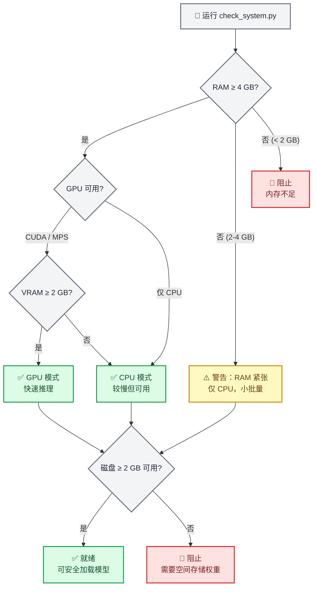
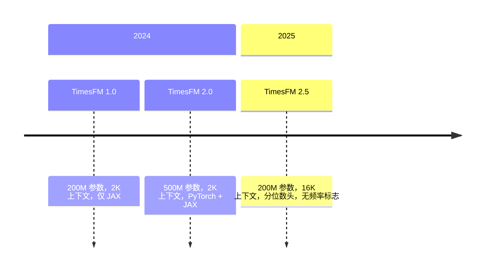

# TimesFM 预测

## 概述

TimesFM（时间序列基础模型）是由 Google Research 开发的一个预训练的仅解码器基础模型，用于时间序列预测。它支持**零样本**工作方式——输入任何单变量时间序列，它都会返回具有校准分位数预测区间的点预测，无需训练。

这项技能封装了 TimesFM 以实现安全的、对代理友好的本地推理。它包含一个**强制性的预加载系统检查器**，在模型加载之前会验证 RAM、GPU 内存和磁盘空间，因此代理永远不会崩溃用户的机器。

> **关键数据**：TimesFM 2.5 使用 200M 参数（磁盘上约 800 MB，CPU RAM 中约 1.5 GB，GPU VRAM 中约 1 GB）。存档的 v1/v2 500M 参数模型需要约 32 GB RAM。始终首先运行系统检查器。

## 何时使用此技能

使用此技能的情况：

- 预测**任何单变量时间序列**（销售、需求、传感器、生命体征、价格、天气）
- 您需要**零样本预测**而无需训练自定义模型
- 您想要**概率预测**，具有校准的预测区间（分位数）
- 您有时间序列的**任何长度**（该模型处理 1–16,384 个上下文点）
- 您需要**批量预测**数百或数千个序列，并且效率高
- 您想要使用**基础模型**方法，而不是手动调整 ARIMA/ETS 参数

不使用此技能的情况：

- 您需要具有系数解释的经典统计模型 → 使用 `statsmodels`
- 您需要时间序列分类或聚类 → 使用 `aeon`
- 您需要多变量向量自回归或格兰杰因果关系 → 使用 `statsmodels`
- 您的数据是表格的（非时间序列）→ 使用 `scikit-learn`

> **异常检测说明**：TimesFM 没有内置的异常检测，但您可以使用**分位数预测作为预测区间**——超出 90% 置信区间（q10–q90）的值在统计上是异常的。有关完整示例，请参阅 `examples/anomaly-detection/` 目录。

## ⚠️ 强制性预加载：系统需求检查

**关键——首次加载模型前始终运行系统检查器。**

```bash
python scripts/check_system.py
```

此脚本检查：

1. **可用 RAM**——如果低于 4 GB 则发出警告，如果低于 2 GB 则阻止
2. **GPU 可用性**——检测 CUDA/MPS 设备和 VRAM
3. **磁盘空间**——验证模型下载 (~800 MB) 所需的空间
4. **Python 版本**——需要 3.10+
5. **现有安装**——检查是否安装了 `timesfm` 和 `torch`

> **注意**：模型权重**不存储在此存储库中**。TimesFM 权重 (~800 MB) 在首次使用时从 HuggingFace 下载，并缓存到 `~/.cache/huggingface/`。预加载检查器确保在开始任何下载之前有足够的资源。



### 按模型版本划分硬件需求

| 模型 | 参数 | CPU RAM | GPU VRAM | 磁盘 | 上下文 |
| ---- | ---- | ------ | ------ | ---- | ------ |
| **TimesFM 2.5**（推荐） | 200M | ≥ 4 GB | ≥ 2 GB | ~800 MB | 最高 16,384 |
| TimesFM 2.0（存档） | 500M | ≥ 16 GB | ≥ 8 GB | ~2 GB | 最高 2,048 |
| TimesFM 1.0（存档） | 200M | ≥ 8 GB | ≥ 4 GB | ~800 MB | 最高 2,048 |

> **建议**：除非有特定原因使用旧检查点，否则始终使用 TimesFM 2.5。它更小、更快，并支持 8 倍更长的上下文。

## 🔧 安装

### 第 1 步：验证系统（始终首先）

```bash
python scripts/check_system.py
```

### 第 2 步：安装 TimesFM

```bash
# 使用 uv（此存储库推荐）
uv pip install timesfm[torch]

# 用于 JAX/Flax 后端（TPU/GPU 上更快）
uv pip install timesfm[flax]
```

### 第 3 步：为您的硬件安装 PyTorch

```bash
# CUDA 12.1（NVIDIA GPU）
uv pip install torch>=2.0.0 --index-url https://download.pytorch.org/whl/cu121

# 仅 CPU
uv pip install torch>=2.0.0 --index-url https://download.pytorch.org/whl/cpu

# Apple Silicon (MPS)
uv pip install torch>=2.0.0  # MPS 支持是内置的
```

### 第 4 步：验证安装

```python
import timesfm
import numpy as np
print(f"TimesFM 版本: {timesfm.__version__}")
print("安装成功")
```

## 🎯 快速入门

### 最小示例（5 行）

```python
import torch, numpy as np, timesfm

torch.set_float32_matmul_precision("high")

model = timesfm.TimesFM_2p5_200M_torch.from_pretrained(
    "google/timesfm-2.5-200m-pytorch"
)
model.compile(timesfm.ForecastConfig(
    max_context=1024, max_horizon=256, normalize_inputs=True,
    use_continuous_quantile_head=True, force_flip_invariance=True,
    infer_is_positive=True, fix_quantile_crossing=True,
))

point, quantiles = model.forecast(horizon=24, inputs=[
    np.sin(np.linspace(0, 20, 200)),  # 任何 1-D 数组
])
# point.shape == (1, 24)        — 中位数预测
# quantiles.shape == (1, 24, 10) — 10%–90% 百分位区间
```

### 从 CSV 进行预测

```python
import pandas as pd, numpy as np

df = pd.read_csv("monthly_sales.csv", parse_dates=["date"], index_col="date")

# 将每一列转换为数组的列表
inputs = [df[col].dropna().values.astype(np.float32) for col in df.columns]

point, quantiles = model.forecast(horizon=12, inputs=inputs)

# 构建结果 DataFrame
for i, col in enumerate(df.columns):
    last_date = df[col].dropna().index[-1]
    future_dates = pd.date_range(last_date, periods=13, freq="MS")[1:]
    forecast_df = pd.DataFrame({
        "date": future_dates,
        "forecast": point[i],
        "lower_80": quantiles[i, :, 2],  # 20% 百分位
        "upper_80": quantiles[i, :, 8],  # 80% 百分位
    })
    print(f"\n--- {col} ---")
    print(forecast_df.to_string(index=False))
```

### 具有协变量的预测（XReg）

TimesFM 2.5+ 通过 `forecast_with_covariates()` 支持外生变量。需要 `timesfm[xreg]`。

```python
# 需要: uv pip install timesfm[xreg]
point, quantiles = model.forecast_with_covariates(
    inputs=inputs,
    dynamic_numerical_covariates={"price": price_arrays},
    dynamic_categorical_covariates={"holiday": holiday_arrays},
    static_categorical_covariates={"region": region_labels},
    xreg_mode="xreg + timesfm",  # 或 "timesfm + xreg"
)
```

| 协变量类型 | 描述 | 示例 |
| -------- | ---- | ---- |
| `dynamic_numerical` | 随时间变化的数值 | 价格、温度、促销支出 |
| `dynamic_categorical` | 随时间变化的分类 | 假日标志、星期几 |
| `static_numerical` | 每个序列的数值 | 店铺大小、账户年龄 |
| `static_categorical` | 每个序列的分类 | 店铺类型、地区、产品类别 |

**XReg 模式：**
- `"xreg + timesfm"`（默认）：TimesFM 首先预测，然后 XReg 调整残差
- `"timesfm + xreg"`：XReg 首先拟合，然后 TimesFM 预测残差

> 参考 `examples/covariates-forecasting/`，了解具有合成零售数据的完整示例。

### 通过分位数区间进行异常检测

TimesFM 没有内置的异常检测，但分位数预测自然提供预测区间，可用于检测异常：

```python
point, q = model.forecast(horizon=H, inputs=[values])

# 90% 预测区间
lower_90 = q[0, :, 1]  # 10% 百分位
upper_90 = q[0, :, 9]  # 90% 百分位

# 检测异常：值超出 90% CI
actual = test_values  # 您的保留数据
anomalies = (actual < lower_90) | (actual > upper_90)

# 严重程度级别
is_warning = (actual < q[0, :, 2]) | (actual > q[0, :, 8])  # 超出 80% CI
is_critical = anomalies  # 超出 90% CI
```

| 严重程度 | 条件 | 解释 |
| ------ | ---- | ---- |
| **正常** | 在 80% CI 内 | 预期行为 |
| **警告** | 超出 80% CI | 不寻常但可能 |
| **严重** | 超出 90% CI | 统计上罕见 (< 10% 概率) |

> 参考 `examples/anomaly-detection/`，了解具有可视化的完整示例。

```python
# 需要: uv pip install timesfm[xreg]
point, quantiles = model.forecast_with_covariates(
    inputs=inputs,
    dynamic_numerical_covariates={"temperature": temp_arrays},
    dynamic_categorical_covariates={"day_of_week": dow_arrays},
    static_categorical_covariates={"region": region_labels},
    xreg_mode="xreg + timesfm",  # 或 "timesfm + xreg"
)
```

## 输出、配置、工作流程和调整

- [references/output_and_config.md](references/output_and_config.md)：读取点预测和 10 个分位数带，推导预测区间，以及 `ForecastConfig` 的每个字段。
- [references/workflows.md](references/workflows.md)：标准预测序列、从宽 CSV 进行多序列预测，以及具有区间覆盖率的回测。
- [references/performance_tuning.md](references/performance_tuning.md)：GPU 和 TF32 设置、`per_core_batch_size` 由可用内存决定，以及内存管理。
- [references/examples_and_validation.md](references/examples_and_validation.md)：可运行的示例、质量检查清单、常见错误和回归检查。

## 🔗 与其他技能的集成

### 与 `statsmodels`

使用 `statsmodels` 进行经典模型（ARIMA、SARIMAX）作为**比较基线**：

```python
# TimesFM 预测
tfm_point, tfm_q = model.forecast(horizon=H, inputs=[values])

# statsmodels ARIMA 预测
from statsmodels.tsa.arima.model import ARIMA
arima = ARIMA(values, order=(1,1,1)).fit()
arima_forecast = arima.forecast(steps=H)

# 比较
print(f"TimesFM MAE: {np.mean(np.abs(actual - tfm_point[0])):.2f}")
print(f"ARIMA MAE:   {np.mean(np.abs(actual - arima_forecast)):.2f}")
```

### 与 `matplotlib` / `scientific-visualization`

将预测和预测区间绘制为具有出版质量的图形。

### 与 `exploratory-data-analysis`

在预测前对时间序列运行 EDA，以了解趋势、季节性和平稳性。

## 📚 可用脚本

### `scripts/check_system.py`

**强制性的预加载检查器。** 首次加载模型前运行。

```bash
python scripts/check_system.py
```

输出示例：
```
=== TimesFM 系统需求检查 ===

[RAM]       总计: 32.0 GB | 可用: 24.3 GB  ✅ 通过
[GPU]       NVIDIA RTX 4090 | VRAM: 24.0 GB      ✅ 通过
[Disk]      可用: 142.5 GB                        ✅ 通过
[Python]    3.12.1                                 ✅ 通过
[timesfm]   已安装 (2.5.0)                      ✅ 通过
[torch]     已安装 (2.4.1+cu121)                ✅ 通过

VERDICT: ✅ 系统已准备好使用 TimesFM 2.5 (GPU 模式)
推荐: per_core_batch_size=128
```

### `scripts/forecast_csv.py`

具有自动系统检查的端到端 CSV 预测。

```bash
python scripts/forecast_csv.py input.csv \
    --horizon 24 \
    --date-col date \
    --value-cols sales,revenue \
    --output forecasts.csv
```

## 📖 参考文档

`references/` 中的详细指南：

| 文件 | 内容 |
| ---- | ---- |
| `references/system_requirements.md` | 硬件级别、GPU/CPU 选择、内存估计公式 |
| `references/api_reference.md` | 完整的 `ForecastConfig` 文档、`from_pretrained` 选项、输出形状 |
| `references/data_preparation.md` | 输入格式、NaN 处理、CSV 加载、协变量设置 |

## 常见陷阱

1. **未运行系统检查** → 模型加载在低 RAM 机器上崩溃。始终首先运行 `check_system.py`。
2. **忘记 `model.compile()`** → `RuntimeError: 模型未编译`。必须在 `forecast()` 之前调用 `compile()`。
3. **未设置 `normalize_inputs=True`** → 大值序列的不稳定预测。
4. **在 RAM < 32 GB 的机器上使用 v1/v2** → 使用 TimesFM 2.5（200M 参数）。
5. **未设置 `fix_quantile_crossing=True`** → 分位数可能不是单调的（q10 > q50）。
6. **在小型 GPU 上使用巨大的 `per_core_batch_size`** → CUDA OOM。从小开始，逐步增加。
7. **传递 2-D 数组** → TimesFM 期望**1-D 数组的列表**，而不是 2-D 矩阵。
8. **忘记 `torch.set_float32_matmul_precision("high")`** → 在 Ampere+ GPU 上推理速度较慢。
9. **未处理输出中的 NaN** → 非常短序列的边缘情况。始终检查 `np.isnan(point).any()`。
10. **对可能为负的序列使用 `infer_is_positive=True`** → 将预测限制在零。对于温度、收入等设置为 False。

## 模型版本



| 版本 | 参数 | 上下文 | 分位数头 | 频率标志 | 状态 |
| ---- | ---- | ------ | -------- | -------- | ---- |
| **2.5** | 200M | 16,384 | ✅ 连续 (30M) | ❌ 移除 | **最新** |
| 2.0 | 500M | 2,048 | ✅ 固定桶 | ✅ 需要 | 存档 |
| 1.0 | 200M | 2,048 | ✅ 固定桶 | ✅ 需要 | 存档 |

**Hugging Face 检查点：**

- `google/timesfm-2.5-200m-pytorch`（推荐）
- `google/timesfm-2.5-200m-flax`
- `google/timesfm-2.0-500m-pytorch`（存档）
- `google/timesfm-1.0-200m-pytorch`（存档）

## 资源

- **论文**：[A Decoder-Only Foundation Model for Time-Series Forecasting](https://arxiv.org/abs/2310.10688) (ICML 2024)
- **存储库**：https://github.com/google-research/timesfm
- **Hugging Face**：https://huggingface.co/collections/google/timesfm-release-66e4be5fdb56e960c1e482a6
- **Google 博客**：https://research.google/blog/a-decoder-only-foundation-model-for-time-series-forecasting/
- **BigQuery 集成**：https://cloud.google.com/bigquery/docs/timesfm-model
