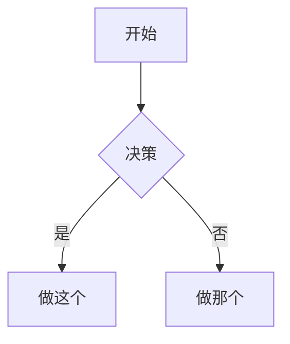

# Obsidian 风格 Markdown 技能

创建和编辑有效的 Obsidian 风格 Markdown。Obsidian 扩展了 CommonMark 和 GFM，增加了维基链接、嵌入、引用、属性、注释和其他语法。本技能仅涵盖 Obsidian 特有的扩展——标准 Markdown（标题、粗体、斜体、列表、引用、代码块、表格）被视为已知知识。

## 工作流程：创建 Obsidian 笔记

1. **在文件顶部添加 frontmatter**，包含属性（标题、标签、别名）。有关所有属性类型的详细信息，请参阅 [PROPERTIES.md](references/PROPERTIES.md)。
2. **使用标准 Markdown 编写内容**，结构下方使用 Obsidian 特有的语法。
3. **使用维基链接（`[[Note]]`）链接相关笔记**，用于内部库连接，或使用标准 Markdown 链接用于外部 URL。
4. **使用 `![[embed]]` 语法嵌入其他笔记、图片或 PDF 的内容**。有关所有嵌入类型的详细信息，请参阅 [EMBEDS.md](references/EMBEDS.md)。
5. **使用 `> [!type]` 语法添加引用**，用于突出显示信息。有关所有引用类型的详细信息，请参阅 [CALLOUTS.md](references/CALLOUTS.md)。
6. **验证**笔记在 Obsidian 的阅读视图中是否正确渲染。

> 在维基链接和 Markdown 链接之间选择时：使用 `[[wikilinks]]` 链接到库内的笔记（Obsidian 会自动跟踪重命名），使用 `[text](url)` 仅用于外部 URL。

## 内部链接（维基链接）

```markdown
[[Note Name]]                          链接到笔记
[[Note Name|显示文本]]                 自定义显示文本
[[Note Name#标题]]                     链接到标题
[[Note Name#^block-id]]                链接到块
[[#同一笔记中的标题]]                  同一笔记标题链接
```

通过在段落后附加 `^block-id` 来定义块 ID：

```markdown
这段文字可以被链接到。 ^my-block-id
```

对于列表和引用，将块 ID 放在块后的单独一行：

```markdown
> 一个引用块

^quote-id
```

## 嵌入

将任何维基链接前缀为 `!` 以内联嵌入其内容：

```markdown
![[Note Name]]                         嵌入完整笔记
![[Note Name#标题]]                   嵌入部分
![[image.png]]                         嵌入图片
![[image.png|300]]                     嵌入带宽度的图片
![[document.pdf#page=3]]               嵌入 PDF 页面
```

有关音频、视频、搜索嵌入和外部图片，请参阅 [EMBEDS.md](references/EMBEDS.md)。

## 引用

```markdown
> [!note]
> 基本引用。

> [!warning] 自定义标题
> 带有自定义标题的引用。

> [!faq]- 默认折叠
> 可折叠引用（- 折叠，+ 展开）。
```

常见类型：`note`、`tip`、`warning`、`info`、`example`、`quote`、`bug`、`danger`、`success`、`failure`、`question`、`abstract`、`todo`。

有关完整列表、别名、嵌套和自定义 CSS 引用的详细信息，请参阅 [CALLOUTS.md](references/CALLOUTS.md)。

## 属性（frontmatter）

```yaml
---
title: 我的笔记
date: 2024-01-15
tags:
  - project
  - active
aliases:
  - 另一个名称
cssclasses:
  - custom-class
---
```

默认属性：`tags`（可搜索标签）、`aliases`（用于链接建议的替代笔记名称）、`cssclasses`（用于样式的 CSS 类）。

有关所有属性类型、标签语法规则和高级用法的详细信息，请参阅 [PROPERTIES.md](references/PROPERTIES.md)。

## 标签

```markdown
#tag                    内联标签
#nested/tag             带有层次结构的嵌套标签
```

标签可以包含字母、数字（不能作为第一个字符）、下划线、连字符和正向斜杠。标签也可以在 frontmatter 下的 `tags` 属性中定义。

## 注释

```markdown
这是可见的 %%但这是隐藏的%% 文本。

%%
整个块在阅读视图中被隐藏。
%%
```

## Obsidian 特有的格式化

```markdown
==突出显示的文本==                   突出显示语法
```

## 数学（LaTeX）

```markdown
内联：$e^{i\pi} + 1 = 0$

块：
$$
\frac{a}{b} = c
$$
```

## 图表（Mermaid）

````markdown

````

要链接 Mermaid 节点到 Obsidian 笔记，添加 `class NodeName internal-link;`。

## 脚注

```markdown
带有脚注的文本[^1]。

[^1]: 脚注内容。

内联脚注。^[这是内联的。]
```

## 完整示例

````markdown
---
title: 项目 Alpha
date: 2024-01-15
tags:
  - project
  - active
status: in-progress
---

# 项目 Alpha

该项目旨在使用现代技术 [[改进工作流程]]。

> [!重要] 关键截止日期
> 第一个里程碑将于 ==1 月 30 日== 到期。

## 任务

- [x] 初始规划
- [ ] 开发阶段
  - [ ] 后端实现
  - [ ] 前端设计

## 笔记

该算法使用 $O(n \log n)$ 排序。有关详细信息，请参阅 [[算法笔记#排序]]。

![[架构图.png|600]]

在 [[会议笔记 2024-01-10#决策]] 中审查。
````

## 参考

- [Obsidian 风格 Markdown](https://help.obsidian.md/obsidian-flavored-markdown)
- [内部链接](https://help.obsidian.md/links)
- [嵌入文件](https://help.obsidian.md/embeds)
- [引用](https://help.obsidian.md/callouts)
- [属性](https://help.obsidian.md/properties)
