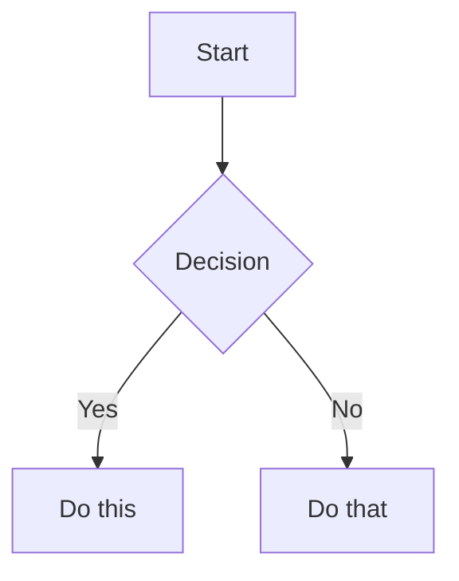

# Obsidian 风味 Markdown 技能

创建和编辑有效的 Obsidian 风味 Markdown。Obsidian 在 CommonMark 和 GFM 的基础上扩展了 wikilinks、嵌入、callouts、属性、注释等语法。本技能仅涵盖 Obsidian 特有的扩展——标准 Markdown（标题、粗体、斜体、列表、引用、代码块、表格）视为已知知识。

## 工作流：创建 Obsidian 笔记

1. **添加 frontmatter**，在文件顶部包含属性（标题、标签、别名）。查看 [PROPERTIES.md](references/PROPERTIES.md) 了解所有属性类型。
2. **编写内容**，使用标准 Markdown 构建结构，并在此基础上使用下方的 Obsidian 特定语法。
3. **链接相关笔记**，使用 wikilinks（`[[Note]]`）建立内部仓库连接，或使用标准 Markdown 链接（`[text](url)`）链接外部 URL。
4. **嵌入内容**，使用 `![[embed]]` 语法嵌入来自其他笔记、图片或 PDF 的内容。查看 [EMBEDS.md](references/EMBEDS.md) 了解所有嵌入类型。
5. **添加 callouts**，使用 `> [!type]` 语法高亮重要信息。查看 [CALLOUTS.md](references/CALLOUTS.md) 了解所有 callout 类型。
6. **验证**笔记在 Obsidian 的阅读视图下渲染是否正确。

> 在 wikilinks 和 Markdown 链接之间选择时：在仓库内部的笔记使用 `[[wikilinks]]`（Obsidian 会自动跟踪重命名），仅对外部 URL 使用 `[text](url)`。

## 内部链接（Wikilinks）

```markdown
[[Note Name]]                         链接到笔记
[[Note Name|Display Text]]            自定义显示文本
[[Note Name#Heading]]                 链接到标题
[[Note Name#^block-id]]               链接到代码块
[[#Heading in same note]]             同笔记标题链接
```

在任意段落末尾追加 `^block-id` 即可定义代码块 ID：

```markdown
This paragraph can be linked to. ^my-block-id
```

对于列表和引用，将代码块 ID 放在代码块下方单独一行：

```markdown
> A quote block

^quote-id
```

## 嵌入

在任意 wikilink 前加 `!` 即可内联嵌入其内容：

```markdown
![[Note Name]]                        嵌入完整笔记
![[Note Name#Heading]]                嵌入章节
![[image.png]]                        嵌入图片
![[image.png|300]]                    嵌入带宽度的图片
![[document.pdf#page=3]]              嵌入 PDF 页面
```

查看 [EMBEDS.md](references/EMBEDS.md) 了解音频、视频、搜索嵌入及外部图片。

## Callouts

```markdown
> [!note]
> Basic callout.

> [!warning] Custom Title
> Callout with a custom title.

> [!faq]- Collapsed by default
> Foldable callout (- collapsed, + expanded).
```

常用类型：`note`、`tip`、`warning`、`info`、`example`、`quote`、`bug`、`danger`、`success`、`failure`、`question`、`abstract`、`todo`。

查看 [CALLOUTS.md](references/CALLOUTS.md) 了解完整列表、别名、嵌套及自定义 CSS callout。

## 属性（Frontmatter）

```yaml
---
title: My Note
date: 2024-01-15
tags:
  - project
  - active
aliases:
  - Alternative Name
cssclasses:
  - custom-class
---
```

默认属性：`tags`（可搜索的标签）、`aliases`（笔记的替代名称，用于链接建议）、`cssclasses`（用于样式设置的 CSS 类）。

查看 [PROPERTIES.md](references/PROPERTIES.md) 了解所有属性类型、标签语法规则及高级用法。

## 标签

```markdown
#tag                   行内标签
#nested/tag            带层级结构的嵌套标签
```

标签可包含字母、数字（首字符不能是数字）、下划线、连字符和正斜杠。标签也可在 frontmatter 的 `tags` 属性下定义。

## 注释

```markdown
This is visible %%but this is hidden%% text.

%%
This entire block is hidden in reading view.
%%
```

## Obsidian 特定格式

```markdown
==Highlighted text==                  高亮语法
```

## 数学（LaTeX）

```markdown
行内：$e^{i\pi} + 1 = 0$

块级：
$$
\frac{a}{b} = c
$$
```

## 图表（Mermaid）

````markdown

````

将 Mermaid 节点与 Obsidian 笔记链接时，需添加 `class NodeName internal-link;`。

## 脚注

```markdown
带有脚注[^1]的文本。

[^1]: 脚注内容。

行内脚注。^[这是行内脚注。]
```

## 完整示例

````markdown
---
title: Project Alpha
date: 2024-01-15
tags:
  - project
  - active
status: in-progress
---

# Project Alpha

本项目旨在使用现代技术[[改进工作流程]]。

> [!important] 关键截止日期
> 第一个里程碑的截止日期为 ==January 30th==。

## 任务

- [x] 初始规划
- [ ] 开发阶段
  - [ ] 后端实现
  - [ ] 前端设计

## 备注

该算法使用 $O(n \log n)$ 排序。详情请参阅 [[Algorithm Notes#Sorting]]。

![[Architecture Diagram.png|600]]

已在 [[Meeting Notes 2024-01-10#Decisions]] 中评审。
````

## 参考

- [Obsidian 风味 Markdown](https://help.obsidian.md/obsidian-flavored-markdown)
- [内部链接](https://help.obsidian.md/links)
- [嵌入文件](https://help.obsidian.md/embeds)
- [Callouts](https://help.obsidian.md/callouts)
- [属性](https://help.obsidian.md/properties)
