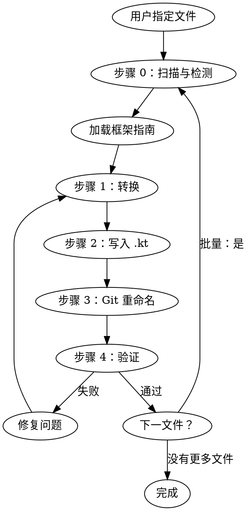

# Java 到 Kotlin 转换

使用一套严谨的 4 步转换方法将 Java 源文件转换为符合 Kotlin 习惯用法的形式，每一步都会检查 5 个不变式。支持框架感知转换，能够处理注解位置目标、库习惯用法和 API 保留。

## 工作流程



## 步骤 0：扫描与检测框架

在转换之前，扫描 Java 文件的导入语句以检测正在使用的框架。仅加载匹配的框架参考文件以保持上下文聚焦。

### 框架检测表

| 导入前缀 | 框架指南 |
|---|---|
| `org.springframework.*` | [SPRING.md](references/frameworks/SPRING.md) |
| `lombok.*` | [LOMBOK.md](references/frameworks/LOMBOK.md) |
| `javax.persistence.*`, `jakarta.persistence.*`, `org.hibernate.*` | [HIBERNATE.md](references/frameworks/HIBERNATE.md) |
| `com.fasterxml.jackson.*` | [JACKSON.md](references/frameworks/JACKSON.md) |
| `io.micronaut.*` | [MICRONAUT.md](references/frameworks/MICRONAUT.md) |
| `io.quarkus.*`, `javax.enterprise.*`, `jakarta.enterprise.*` | [QUARKUS.md](references/frameworks/QUARKUS.md) |
| `dagger.*`, `dagger.hilt.*` | [DAGGER-HILT.md](references/frameworks/DAGGER-HILT.md) |
| `io.reactivex.*`, `rx.*` | [RXJAVA.md](references/frameworks/RXJAVA.md) |
| `org.junit.*`, `org.testng.*` | [JUNIT.md](references/frameworks/JUNIT.md) |
| `com.google.inject.*` | [GUICE.md](references/frameworks/GUICE.md) |
| `retrofit2.*`, `okhttp3.*` | [RETROFIT.md](references/frameworks/RETROFIT.md) |
| `org.mockito.*` | [MOCKITO.md](references/frameworks/MOCKITO.md) |

如果检测到 `javax.inject.*`，通过查找这些框架的其他导入来检查 Dagger/Hilt 与 Guice。如果存在歧义，则加载两个指南。

## 步骤 1：转换

应用来自 [CONVERSION-METHODOLOGY.md](references/CONVERSION-METHODOLOGY.md) 的转换方法。

这是一个 4 步思维链过程：
1. **忠实 1:1 翻译** — 完全保留语义
2. **可空性与可变性审计** — val/var，可空类型
3. **集合类型转换** — Java 可变 → Kotlin 类型
4. **习惯用法转换** — 属性，字符串模板，lambda 表达式

每一步之后都会检查 5 个不变式。如果任何不变式被违反，则回退到上一步并重新执行。

在步骤 4（习惯用法转换）期间应用任何加载的框架特定指南。

## 步骤 2：写入输出

将转换后的 Kotlin 代码写入与原始 Java 文件同名且位于同一目录的 `.kt` 文件。

## 步骤 3：保留 Git 历史记录

为保留 `git blame` 历史记录，使用两阶段方法：

```bash
# 阶段 1：重命名（创建重命名跟踪）
git mv src/main/java/com/example/Foo.java src/main/kotlin/com/example/Foo.kt
git commit -m "重命名 Foo.java 为 Foo.kt"

# 阶段 2：替换内容（作为修改跟踪，而非新文件）
# 将转换后的 Kotlin 内容写入 Foo.kt
git commit -m "将 Foo 从 Java 转换为 Kotlin"
```

如果项目将 Java 和 Kotlin 保存在同一源根（例如 `src/main/java/`），则原地重命名：

```bash
git mv src/main/java/com/example/Foo.java src/main/java/com/example/Foo.kt
```

如果项目不使用 Git，则直接写入 `.kt` 文件并删除 `.java` 文件。

## 步骤 4：验证

转换后，使用 [checklist.md](assets/checklist.md) 进行验证：
- 尝试编译转换后的文件
- 运行现有测试
- 检查注解位置目标
- 确认没有行为变化

## 批量转换

在转换多个文件（目录或包）时：

1. **列出所有 `.java` 文件** 在目标范围内
2. **按依赖顺序排序** — 首先转换不导入其他转换集合文件的叶子依赖（文件），然后逐步处理依赖这些文件的文件
3. **逐个文件转换** — 对每个文件应用完整工作流（步骤 0-4）
4. **跟踪进度** — 报告哪些文件已完成，哪些尚未完成
5. **处理交叉引用** — 转换文件后，如果需要，更新其他 Java 文件中的导入（例如，如果类移动了包）

对于大批量文件，考虑按包（从叶子包自下而上）进行转换。

## 常见陷阱

参见 [KNOWN-ISSUES.md](references/KNOWN-ISSUES.md) 以了解：
- Kotlin 关键字冲突（`when`，`in`，`is`，`object`）
- SAM 转换歧义
- Java 互操作中的平台类型
- `@JvmStatic` / `@JvmField` / `@JvmOverloads` 用法
- 检查异常和 `@Throws`
- 通配符泛型 → Kotlin 变异
