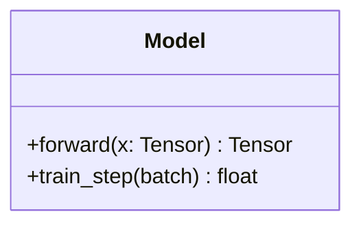
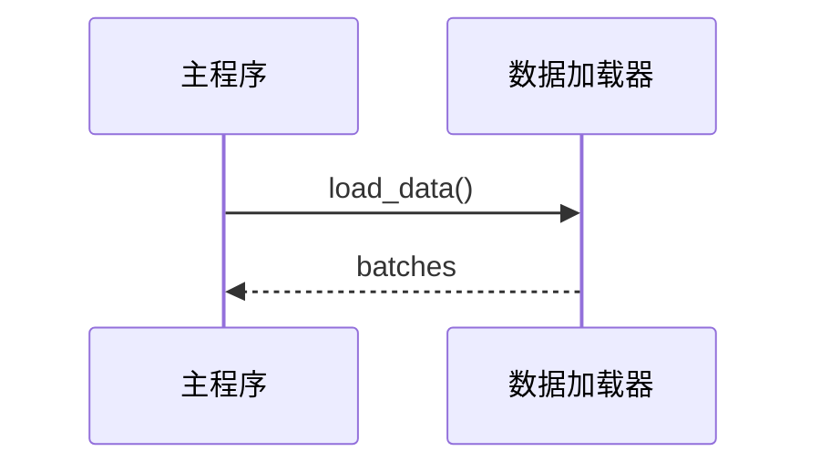

# 算法设计

将方法形式化为算法伪代码和系统架构图。

## 输入

- `$0` — 需要形式化的方法描述或实现

## 参考文献

- 算法和图表模板：`~/.claude/skills/algorithm-design/references/algorithm-templates.md`

## 工作流程

### 第一步：形式化算法
1. 定义清晰的输入和输出
2. 确定主循环/递归结构
3. 指定所有参数及其类型
4. 编写分步伪代码

### 第二步：生成 LaTeX 伪代码
使用 `algorithm` + `algpseudocode` 环境：
```latex
\begin{algorithm}[t]
\caption{方法名称}
\label{alg:method}
\begin{algorithmic}[1]
\Require 输入 $x$，参数 $\theta$
\Ensure 输出 $y$
\State 初始化 ...
\For{$t = 1$ to $T$}
    \State $z_t \gets f(x_t; \theta)$
    \If{满足收敛条件}
        \State \textbf{break}
    \EndIf
\EndFor
\State \Return $y$
\end{algorithmic}
\end{algorithm}
```

### 第三步：生成 UML 图表（Mermaid）

#### 类图


#### 消息图


### 第四步：验证一致性
- 每个伪代码步骤必须映射到代码模块
- UML 中的每个类都必须在实现中存在
- 参数名称在伪代码和代码中必须一致

## 规则

- 使用标准的算法符号（非代码语法）
- 编号行以便于参考
- 作为注释或命题包含复杂度分析
- 使用 `\Require` / `\Ensure` 表示输入/输出
- 保持伪代码在适当的抽象级别 — 不过于详细，也不过于模糊

## 相关技能
- 上游：[原子分解](../atomic-decomposition/)，[数学推理](../math-reasoning/)
- 下游：[实验代码](../experiment-code/)，[论文写作部分](../paper-writing-section/)
- 参见：[符号方程](../symbolic-equation/)
