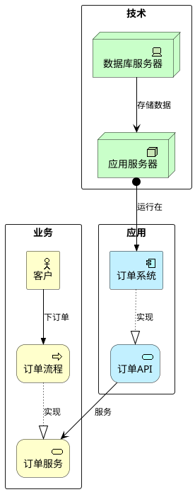

# 企业架构图生成器 (ArchiMate)

**快速入门：** 添加 `!include <archimate/Archimate>` → 声明类型化的元素 → 使用 `Rel_*` 宏连接 → 使用 `rectangle` 分组到层 → 使用 ` ```plantuml ` 分隔符包裹。

> ⚠️ **重要提示：** 始终使用 ` ```plantuml ` 或 ` ```puml ` 代码分隔符。绝对不要使用 ` ```text ` — 它将不会渲染为图表。

## 关键规则

- 每个图表以 `@startuml` 开头并以 `@enduml` 结尾
- 在使用任何宏之前必须包含 `!include <archimate/Archimate>`
- 元素语法：`Layer_Type(alias, "Label")`
- 关系语法：`Rel_Type(fromAlias, toAlias, "label")`
- 使用 `rectangle "Layer" { ... }` 将元素分组到 ArchiMate 层
- 方向性后缀 `_Up`, `_Down`, `_Left`, `_Right` 控制关系方向

## 元素宏

### 业务层

| 宏 | ArchiMate 元素 |
|-------|-------------------|
| `Business_Actor(id, "Label")` | 业务角色 |
| `Business_Role(id, "Label")` | 业务角色 |
| `Business_Process(id, "Label")` | 业务流程 |
| `Business_Function(id, "Label")` | 业务功能 |
| `Business_Service(id, "Label")` | 业务服务 |
| `Business_Event(id, "Label")` | 业务事件 |
| `Business_Interface(id, "Label")` | 业务接口 |
| `Business_Collaboration(id, "Label")` | 业务协作 |
| `Business_Object(id, "Label")` | 业务对象 |
| `Business_Product(id, "Label")` | 业务产品 |
| `Business_Contract(id, "Label")` | 业务合同 |
| `Business_Representation(id, "Label")` | 业务表示 |

### 应用层

| 宏 | ArchiMate 元素 |
|-------|-------------------|
| `Application_Component(id, "Label")` | 应用组件 |
| `Application_Service(id, "Label")` | 应用服务 |
| `Application_Function(id, "Label")` | 应用功能 |
| `Application_Interface(id, "Label")` | 应用接口 |
| `Application_Process(id, "Label")` | 应用流程 |
| `Application_Interaction(id, "Label")` | 应用交互 |
| `Application_Event(id, "Label")` | 应用事件 |
| `Application_Collaboration(id, "Label")` | 应用协作 |
| `Application_DataObject(id, "Label")` | 应用数据对象 |

### 技术层

| 宏 | ArchiMate 元素 |
|-------|-------------------|
| `Technology_Device(id, "Label")` | 技术设备 |
| `Technology_Node(id, "Label")` | 技术节点 |
| `Technology_SystemSoftware(id, "Label")` | 系统软件 |
| `Technology_Artifact(id, "Label")` | 技术工件 |
| `Technology_CommunicationNetwork(id, "Label")` | 通信网络 |
| `Technology_Path(id, "Label")` | 技术路径 |
| `Technology_Service(id, "Label")` | 技术服务 |
| `Technology_Process(id, "Label")` | 技术流程 |
| `Technology_Function(id, "Label")` | 技术功能 |
| `Technology_Interface(id, "Label")` | 技术接口 |

### 动机层

| 宏 | ArchiMate 元素 |
|-------|-------------------|
| `Motivation_Stakeholder(id, "Label")` | 利益相关者 |
| `Motivation_Driver(id, "Label")` | 驱动因素 |
| `Motivation_Assessment(id, "Label")` | 评估 |
| `Motivation_Goal(id, "Label")` | 目标 |
| `Motivation_Outcome(id, "Label")` | 结果 |
| `Motivation_Principle(id, "Label")` | 原则 |
| `Motivation_Requirement(id, "Label")` | 需求 |
| `Motivation_Constraint(id, "Label")` | 约束 |
| `Motivation_Value(id, "Label")` | 价值 |

### 策略层

| 宏 | ArchiMate 元素 |
|-------|-------------------|
| `Strategy_Capability(id, "Label")` | 能力 |
| `Strategy_Resource(id, "Label")` | 资源 |
| `Strategy_CourseOfAction(id, "Label")` | 行动方案 |
| `Strategy_ValueStream(id, "Label")` | 价值流 |

### 实施层

| 宏 | ArchiMate 元素 |
|-------|-------------------|
| `Implementation_WorkPackage(id, "Label")` | 工作包 |
| `Implementation_Deliverable(id, "Label")` | 可交付成果 |
| `Implementation_Plateau(id, "Label")` | 平台 |
| `Implementation_Gap(id, "Label")` | 差距 |
| `Implementation_Event(id, "Label")` | 实施事件 |

## 关系宏

所有关系都支持方向性后缀：`_Up`, `_Down`, `_Left`, `_Right`。

| 宏 | ArchiMate 关系 | 线条样式 |
|-------|------------------------|------------|
| `Rel_Composition(from, to, "label")` | 组合 | 实线 + 填充菱形 |
| `Rel_Aggregation(from, to, "label")` | 聚合 | 实线 + 空心菱形 |
| `Rel_Assignment(from, to, "label")` | 分配 | 实线 + 圆形→三角形 |
| `Rel_Realization(from, to, "label")` | 实现 | 虚线 + 空心三角形 |
| `Rel_Serving(from, to, "label")` | 服务 | 实线 + 箭头 |
| `Rel_Triggering(from, to, "label")` | 触发 | 实线 + 填充三角形 |
| `Rel_Flow(from, to, "label")` | 流 | 虚线 + 填充三角形 |
| `Rel_Access(from, to, "label")` | 访问 | 虚线 |
| `Rel_Access_r(from, to, "label")` | 访问（读取） | 虚线 + 箭头 |
| `Rel_Access_w(from, to, "label")` | 访问（写入） | 虚线 + 反向箭头 |
| `Rel_Influence(from, to, "label")` | 影响 | 虚线 + 箭头 |
| `Rel_Association(from, to, "label")` | 关联 | 实线 |
| `Rel_Specialization(from, to, "label")` | 特化 | 实线 + 空心三角形 |

## 快速示例



## 图表类型

| 类型 | 目的 | 关键宏 | 示例 |
|------|---------|------------|---------|
| 企业景观 | 完整 B/A/T 分层视图 | 所有层 | [enterprise-landscape.md](examples/enterprise-landscape.md) |
| 应用集成 | 应用间数据流 | `Application_*` | [application-integration.md](examples/application-integration.md) |
| 技术基础设施 | 基础设施堆栈 | `Technology_*` | [technology-infrastructure.md](examples/technology-infrastructure.md) |
| 业务能力 | 能力地图 | `Strategy_*`, `Business_*` | [business-capability.md](examples/business-capability.md) |
| 迁移规划 | 基于平台的路线图 | `Implementation_*` | [migration-planning.md](examples/migration-planning.md) |
| 安全架构 | 安全控制 | `Technology_*`, `Motivation_*` | [security-architecture.md](examples/security-architecture.md) |
| 数据架构 | 数据流 & 所有权 | `Application_DataObject`, `Rel_Access_*` | [data-architecture.md](examples/data-architecture.md) |
| DevOps 管道 | CI/CD 交付链 | `Technology_*`, `Application_*` | [devops-pipeline.md](examples/devops-pipeline.md) |
