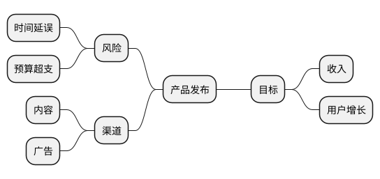

# 思维导图图示生成器

**快速入门：** 以 `@startmindmap` 开始 -> 使用 `*` 或 `+/-` 标记定义根节点和分支 -> 可选设置分支侧、方向和样式 -> 用 ` ```plantuml ` 分隔符包裹。

> ⚠️ **重要提示：** 始终使用 ` ```plantuml ` 或 ` ```puml ` 代码分隔符。绝对不要使用 ` ```text ` — 它将不会渲染为图示。

## 关键规则

- 每个图示以 `@startmindmap` 开始并以 `@endmindmap` 结束
- 每个层级通过重复标记表示：
  - `*` 样式：`*`（根节点）、`**`（第一级）、`***`（第二级）
  - `+/-` 样式：`+` 向左分支、`-` 向右分支
- 在同一本地分支中保持一种标记样式一致（不要随机混合缩进样式）
- 使用 `left side` 切换后续分支到根节点的左侧
- 需要时使用方向关键词：
  - `top to bottom direction`
  - `right to left direction`
- 多行节点内容必须使用块语法：
  - `**:Line 1\nLine 2;`
- 快速颜色编码，使用内联节点颜色：
  - `*[#Orange] 根节点`
  - `**[#lightgreen] 子节点`
- 可复用主题，定义 `<style>` 并应用原型如 `<<green>>`
- 支持富文本/Creole和图标语法（见示例）

## 节点语法速查表

| 模式 | 含义 | 示例 |
|------|------|------|
| `* Root` | 星号语法根节点 | `* 产品策略` |
| `** Child` | 第一级子节点 | `** 目标` |
| `*** Grandchild` | 更深层级 | `*** KPI` |
| `+ Root` | +/- 语法根节点 | `+ 架构` |
| `++ 左分支` | 单侧分支扩展 | `++ 服务` |
| `-- 右分支` | 对侧分支扩展 | `-- 风险` |
| `***_ 无框` | 无框/极简子节点 | `***_ 备注` |
| `# Root` | 替代根标记样式 | `# 主题` |
| `**:...;` | 多行块节点 | `**:项目 A\n项目 B;` |

## 分支侧和方向

| 控制 | 语法 | 用例 |
|------|------|------|
| 左侧分支 | `left side` | 从根节点分割为左右组 |
| 自上而下 | `top to bottom direction` | 树状垂直层级 |
| 自右而左 | `right to left direction` | 从右到左阅读流程或镜像布局 |

## 样式选项

| 方法 | 语法 | 适用场景 |
|------|------|----------|
| 内联节点颜色 | `**[#FFBBCC] 灵感` | 快速单节点强调 |
| 可复用类样式 | `<style> ... .green { ... } </style>` + `<<green>>` | 一致性视觉主题 |
| 基于深度的样式 | `:depth(1) { ... }` | 按层级深度全局格式化 |
| 节点/箭头全局样式 | `node { ... }` / `arrow { ... }` | 统一字体和连接器 |

## 推荐配色方案

选择与图示目的匹配的配色方案。使用内联 `[#hex]` 快速着色或定义 `<style>` 类以复用。

### 通用（柔和色）

| 角色 | 十六进制 | 预览 | 用法 |
|------|-----|-----|-----|
| 根节点 | `#2196F3` | 🔵 | 中心主题 |
| 分支 A | `#A5D6A7` | 🟢 | 分类/组 1 |
| 分支 B | `#90CAF9` | 🔵 | 分类/组 2 |
| 分支 C | `#CE93D8` | 🟣 | 分类/组 3 |
| 分支 D | `#FFE082` | 🟡 | 分类/组 4 |
| 叶节点 | `#E0E0E0` | ⚪ | 细节节点 |

### 状态 / RAG

| 状态 | 十六进制 | 用法 |
|------|-----|-----|
| 已完成/OK | `#C8E6C9` | 已完成，健康 |
| 进行中 | `#FFF9C4` | 活跃，警告 |
| 阻塞/风险 | `#FFCDD2` | 问题，危险 |
| 未开始 | `#E0E0E0` | 待处理，中性 |

### 暖色企业

| 角色 | 十六进制 |
|------|-----|
| 根节点 | `#1565C0` |
| 第一级 | `#FFB74D` |
| 第二级 | `#4DB6AC` |
| 第三级 | `#E0E0E0` |

### 冷色科技

| 角色 | 十六进制 |
|------|-----|
| 根节点 | `#263238` |
| 第一级 | `#00BCD4` |
| 第二级 | `#80DEEA` |
| 第三级 | `#B2EBF2` |

### 地球色

| 角色 | 十六进制 |
|------|-----|
| 根节点 | `#5D4037` |
| 第一级 | `#A1887F` |
| 第二级 | `#C8E6C9` |
| 第三级 | `#FFF9C4` |

> **提示：** 避免纯饱和色（`#FF0000`，`#00FF00`）—— 它们会降低可读性。背景色优先使用柔和/低饱和度，仅保留根节点使用醒目颜色。

## 思维导图模式

| 模式 | 目的 | 示例 |
|------|------|------|
| 基本层级 | 主题分解和学习大纲 | [basic-hierarchy.md](examples/basic-hierarchy.md) |
| 双侧布局 | 优/缺点、选项与风险、双面分析 | [bilateral-layout.md](examples/bilateral-layout.md) |
| 无框分支 | 轻量级次要节点和注释 | [boxless-branches.md](examples/boxless-branches.md) |
| 样式主题 | 带颜色编码的分支和可复用类 | [styled-theme.md](examples/styled-theme.md) |
| 方向控制 | 垂直或从右到左阅读方向 | [direction-control.md](examples/direction-control.md) |
| 富文本内容 | 带图标和格式的详细笔记 | [rich-text-content.md](examples/rich-text-content.md) |
| 项目规划 | 工作分解和行动图 | [project-planning.md](examples/project-planning.md) |

## 快速示例



## 常见问题

| 问题 | 解决方案 |
|------|----------|
| 图示未渲染 | 使用 ` ```plantuml ` 分隔符 + `@startmindmap ... @endmindmap` |
| 分支深度看起来不对 | 检查标记计数（`*`，`**`，`***`）和缩进一致性 |
| 多行文本解析错误 | 使用 `: ... ;` 块语法，确保存在尾随 `;` |
| 颜色未应用 | 验证十六进制格式（`#RRGGBB`）或原型类名 |
| 布局方向不符合预期 | 添加显式 `top to bottom direction` 或 `right to left direction` |
