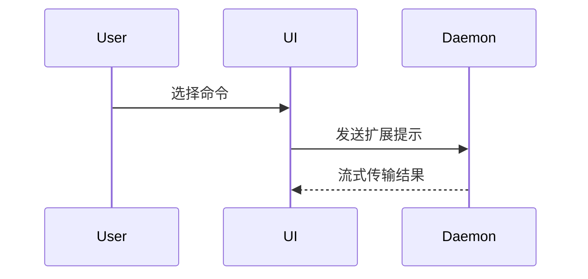

使用此模板编写 PR 正文：

```markdown
## 摘要

<图表、差异草图或树状图>

## 证据

- **之前：** <截图/输出/失败的测试运行>
  **之后：** <截图/输出/通过的测试运行>

## 合并风险

**门：** <单向或双向>

<可选：描述>

**爆炸范围：** <单字描述>

<可选：合并的潜在影响>
```

## 部分

跳过所有前言并保持文字简洁。使用 `CONTEXT.md` 中的用户领域语言。

### 摘要

选择能清晰展示关键点的最小视图。

- 将逻辑或算法展示为伪代码：

```text
on(save)
  if 内容未更改
    return 缓存结果
  写入新内容
  return 新鲜结果
```

- 将运行时控制流展示为调用树：

```text
submitForm
  createSession
    persistPrompt
    launchAgent
  navigateToSession
```

- 将 UI 结构展示为组件树，包括重要的状态和模块边界：

```tsx
<SessionPage>(apps / example / src / routes / session.tsx);
useSessionEvents() < SessionToolbar > <RunSkillButton>(packages / ui);
```

- 将文件职责或广泛重构展示为浅层文件树：

```text
src/
├── commands/       # 解析用户操作
├── sessions/       # 拥有会话状态
└── transport/      # 发送 API 请求
```

- 使用 Mermaid 展示组件交互、控制流或数据流：



- 当要点是变更内容且周围结构已存在时使用 `diff`。匹配 diff 形状与主题。

对于组件变更：

```diff
 <SessionPage>
   useSessionEvents()
   <SessionToolbar>
+    <RunSkillButton />
   <SessionTimeline>
+    <SkillResultCard />
```

对于文件布局变更：

```diff
 src/
 ├── commands/
+│   └── show-me.ts       # 扩展命令
 ├── sessions/
-└── transport.ts
+└── transport/
+    ├── client.ts
+    └── stream.ts
```

对于调用树或调用栈变更：

```diff
 submitForm
   createSession
     persistPrompt
+    expandSkillMention
     launchAgent
-  navigateToSession
+  navigateToSession
+    subscribeToEvents
```

对于状态或控制流变更：

```diff
 on(save)
-  写入内容
+  if 内容未更改
+    return 缓存结果
+  写入新内容
+  使缓存失效
```

- 当大部分内容是新时、省略上下文会隐藏所有权或顺序时、或用户需要可复制目标形状时展示整个块：

```ts
function expandSkill(command: string): string {
  const skillName = command.slice(1);
  return `使用 ${skillName} 技能`;
}
```

#### 指导

将每个视觉元素放置在它支持的简短文本旁边。仅保留回答用户当前问题或解决当前讨论点的调用、文件、属性、状态和边界。

你可以使用其中之一，也可以使用多个，不太可能使用所有。使用你的判断力，不要让用户感到不知所措。

### 证据

证明变更有效的具体证据。展示之前和之后。

截图是 S 级 - 当环境设置好且变更可见时。

基于执行的证据是 A 级。测试结果、控制台输出。展示现在失败和通过的精确测试，使用伪代码。

### 合并风险

描述它是单向门还是双向门。你可以通过双向门回滚，但不能通过单向门。成本较低的回滚 PR 风险较低。涉及破坏性操作或难以逆转决策的变更是一向门。

爆炸范围是由此 PR 引入的变更的潜在影响或范围。考虑所有可能性。例如布局变更、对消费者的破坏、移动响应性等。
