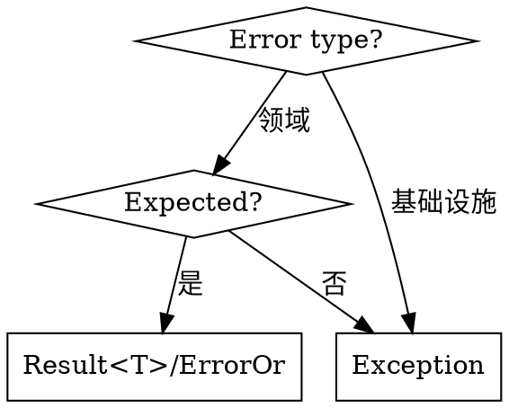
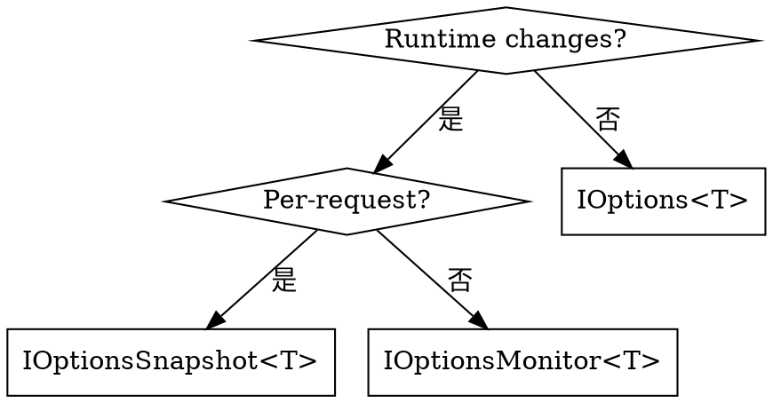
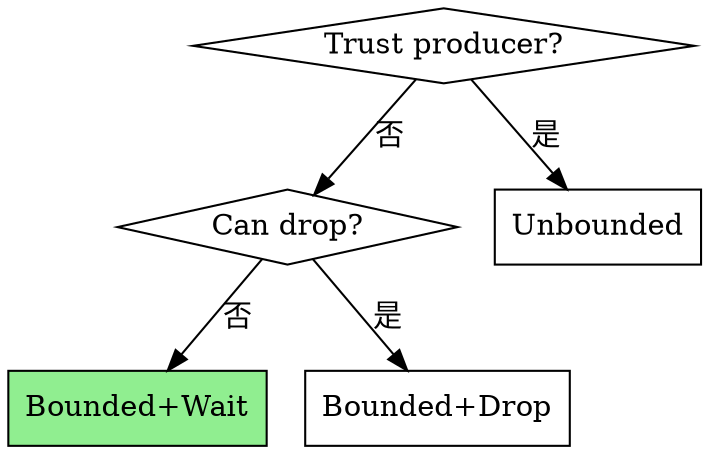

# .NET 10 & C# 14 最佳实践

.NET 10（长期支持版本，2025年11月发布）与 C# 14。涵盖最小 API，不涉及 MVC。

**官方文档：** [.NET 10](https://learn.microsoft.com/en-us/dotnet/core/whats-new/dotnet-10/overview) | [C# 14](https://learn.microsoft.com/en-us/dotnet/csharp/whats-new/csharp-14) | [ASP.NET Core 10](https://learn.microsoft.com/en-us/aspnet/core/release-notes/aspnetcore-10.0)

## 详细文件

| 文件 | 主题 |
|------|--------|
| [csharp-14.md](csharp-14.md) | 扩展代码块、`field` 关键字、空条件赋值 |
| [minimal-apis.md](minimal-apis.md) | 验证、TypedResults、过滤器、模块化单体、垂直切片 |
| [security.md](security.md) | JWT 认证、CORS、速率限制、OpenAPI 安全、中间件顺序 |
| [infrastructure.md](infrastructure.md) | 选项、弹性、通道、健康检查、缓存、Serilog、EF Core、键值服务 |
| [testing.md](testing.md) | WebApplicationFactory、集成测试、认证测试 |
| [anti-patterns.md](anti-patterns.md) | HttpClient、DI 被困、阻塞异步、N+1 查询 |
| [libraries.md](libraries.md) | MediatR、FluentValidation、Mapster、ErrorOr、Polly、Aspire |

---

## 快速入门

```xml
<Project Sdk="Microsoft.NET.Sdk.Web">
  <PropertyGroup>
    <TargetFramework>net10.0</TargetFramework>
    <LangVersion>14</LangVersion>
    <Nullable>enable</Nullable>
  </PropertyGroup>
</Project>
```

```csharp
var builder = WebApplication.CreateBuilder(args);

// 核心服务
builder.Services.AddValidation();
builder.Services.AddProblemDetails();
builder.Services.AddOpenApi();

// 安全性
builder.Services.AddAuthentication().AddJwtBearer();
builder.Services.AddAuthorization();
builder.Services.AddRateLimiter(opts => { /* 见 security.md */ });

// 基础设施
builder.Services.AddHealthChecks();
builder.Services.AddOutputCache();

// 模块
builder.Services.AddUsersModule();

var app = builder.Build();

// 中间件（顺序很重要 - 见 security.md）
app.UseExceptionHandler();
app.UseHttpsRedirection();
app.UseCors();
app.UseRateLimiter();
app.UseAuthentication();
app.UseAuthorization();
app.UseOutputCache();

app.MapOpenApi();
app.MapHealthChecks("/health");
app.MapUsersEndpoints();
app.Run();
```

---

## 决策流程图

### 结果与异常



### IOptions 选择



### 通道类型



---

## 关键模式总结

### C# 14 扩展代码块
```csharp
extension<T>(IEnumerable<T> source)
{
    public bool IsEmpty => !source.Any();
}
```

### .NET 10 内置验证
```csharp
builder.Services.AddValidation();
app.MapPost("/users", (UserDto dto) => TypedResults.Ok(dto));
```

### TypedResults（始终使用）
```csharp
app.MapGet("/users/{id}", async (int id, IUserService svc) =>
    await svc.GetAsync(id) is { } user
        ? TypedResults.Ok(user)
        : TypedResults.NotFound());
```

### 模块模式
```csharp
public static class UsersModule
{
    public static IServiceCollection AddUsersModule(this IServiceCollection s) => s
        .AddScoped<IUserService, UserService>();

    public static IEndpointRouteBuilder MapUsersEndpoints(this IEndpointRouteBuilder app)
    {
        var g = app.MapGroup("/api/users").WithTags("Users");
        g.MapGet("/{id}", GetUser.Handle);
        return app;
    }
}
```

### HTTP 弹性
```csharp
builder.Services.AddHttpClient<IApi, ApiClient>()
    .AddStandardResilienceHandler();
```

### 错误处理（RFC 9457）
```csharp
builder.Services.AddProblemDetails();
app.UseExceptionHandler();
app.UseStatusCodePages();
```

---

## 必须使用的模式（始终使用这些）

| 任务 | ✅ 始终使用 | ❌ 绝不使用 |
|------|--------------|--------------|
| 扩展成员 | C# 14 `extension<T>()` 代码块 | 传统 `this` 扩展方法 |
| 属性验证 | C# 14 `field` 关键字 | 手动背靠字段 |
| 空赋值 | `obj?.Prop = value` | `if (obj != null) obj.Prop = value` |
| API 返回 | `TypedResults.Ok()` | `Results.Ok()` |
| 选项验证 | `.ValidateOnStart()` | 缺少验证 |
| HTTP 弹性 | `AddStandardResilienceHandler()` | 手动 Polly 配置 |
| 时间戳 | `DateTime.UtcNow` | `DateTime.Now` |

---

## 快速参考卡

```
┌─────────────────────────────────────────────────────────────────┐
│                    .NET 10 / C# 14 PATTERNS                      │
├─────────────────────────────────────────────────────────────────┤
│ EXTENSION PROPERTY:  extension<T>(IEnumerable<T> s) {           │
│                        public bool IsEmpty => !s.Any();         │
│                      }                                          │
├─────────────────────────────────────────────────────────────────┤
│ FIELD KEYWORD:       public string Name {                       │
│                        get => field;                            │
│                        set => field = value?.Trim();            │
│                      }                                          │
├─────────────────────────────────────────────────────────────────┤
│ OPTIONS VALIDATION:  .BindConfiguration(Section)                │
│                      .ValidateDataAnnotations()                 │
│                      .ValidateOnStart();   // CRITICAL!         │
├─────────────────────────────────────────────────────────────────┤
│ HTTP RESILIENCE:     .AddStandardResilienceHandler();           │
├─────────────────────────────────────────────────────────────────┤
│ TYPED RESULTS:       TypedResults.Ok(data)                      │
│                      TypedResults.NotFound()                    │
│                      TypedResults.Created(uri, data)            │
├─────────────────────────────────────────────────────────────────┤
│ ERROR PATTERN:       ErrorOr<User> or user?.Match(...)          │
├─────────────────────────────────────────────────────────────────┤
│ IOPTIONS:            IOptions<T>        → 启动时，不重新加载    │
│                      IOptionsSnapshot<T> → 每次请求重新加载   │
│                      IOptionsMonitor<T>  → 实时 + OnChange()    │
└─────────────────────────────────────────────────────────────────┘
```

---

## 反模式快速参考

| 反模式 | 修复 |
|--------------|-----|
| `new HttpClient()` | 注入 `HttpClient` 或 `IHttpClientFactory` |
| `Results.Ok()` | `TypedResults.Ok()` |
| 手动 Polly 配置 | `AddStandardResilienceHandler()` |
| 单例 → 范围 | 使用 `IServiceScopeFactory` |
| `GetAsync().Result` | `await GetAsync()` |
| 异常用于流程 | 使用 `ErrorOr<T>` 结果模式 |
| `DateTime.Now` | `DateTime.UtcNow` |
| 缺少 `.ValidateOnStart()` | 始终添加到选项注册 |

见 [anti-patterns.md](anti-patterns.md) 获取完整列表。

---

## 库快速参考

| 库 | 包 | 目的 |
|---------|---------|---------|
| MediatR | `MediatR` | CQRS |
| FluentValidation | `FluentValidation.DependencyInjectionExtensions` | 验证 |
| Mapster | `Mapster.DependencyInjection` | 映射 |
| ErrorOr | `ErrorOr` | 结果模式 |
| Polly | `Microsoft.Extensions.Http.Resilience` | 弹性 |
| Serilog | `Serilog.AspNetCore` | 日志记录 |

见 [libraries.md](libraries.md) 获取使用示例。
