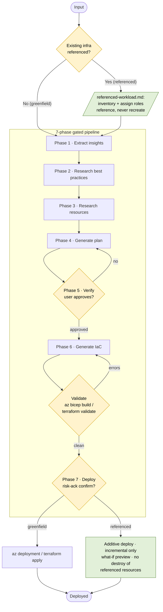

# Azure 企业基础设施规划器

## 何时使用此技能

在用户需要时激活此技能，当用户希望：
- 根据工作负载或架构描述规划企业 Azure 基础设施
- 设计登陆区、中心辐射网络或多区域拓扑结构
- 设计网络基础设施：VNets、子网、防火墙、私有端点、VPN 网关
- 规划身份、RBAC 与合规驱动的基础设施
- 为订阅范围或多资源组部署生成 Bicep 或 Terraform 代码
- 规划灾备、故障转移或跨区域高可用拓扑

## 快速参考

 | 属性 | 详情 |
 |---|---|
 | MCP 工具 | `insights_get`, `get_azure_bestpractices_get`, `wellarchitectedframework_serviceguide_get`, `microsoft_docs_fetch`, `microsoft_docs_search`, `bicepschema_get` |
 | CLI 命令 | `az deployment group create`, `az bicep build`, `az resource list`, `terraform init`, `terraform plan`, `terraform validate`, `terraform apply`, `checkov` |
 | 输出模式 | [schema.md](references/schema.md) |
 | 关键参考 | [workflow.md](references/workflow.md), [waf-checklist.md](references/waf-checklist.md), [resources/](references/resources/README.md), [constraints/](references/constraints/README.md) |

## 工作流程（起始）

按照 [workflow.md](references/workflow.md) 中的逐步说明，执行基础设施规划与配置的 7 个阶段。

## 架构

该技能运行一个 **7 阶段、门控流水线**。输入被分类为以下两种流程之一：

- **Greenfield** — 仅有新需求；直接执行各阶段。
- **Referenced (brownfield)** — 用户提供了已存在的内容（实时资源 / 资源组 / 订阅、IaC 或基础设施方案，或需求文档）。相同阶段会运行，并包含 [referenced-workload.md](references/referenced-workload.md)：盘点并引用现有资源（绝不重建），将新工作负载接入其中，且 **第 7 阶段部署为增量式**（仅增量，绝不修改或销毁被引用的资源）。

每个阶段只有在门控通过后才能推进。第 5 阶段需要用户明确批准；**第 6 阶段是经过加固、可自验证的门控**——生成的 IaC 必须默认安全，通过本地验证（`az bicep build` / `terraform validate`）且零错误，通过 `checkov` 安全扫描且无未解决的 high/critical 级别发现，且技能必须在推进前 **展示命令输出**并发出完成自检；第 7 阶段需要用户明确且确认风险已知晓的部署确认。

**产物**（写入 `<project-root>/` 下）：`.azure/insights.json`（第 1 阶段），`.azure/infrastructure-plan.json`（第 4 阶段，状态 `draft`→`approved`→`deployed`），以及 `infra/main.bicep` + `infra/modules/*` 或 `infra/main.tf` + `infra/modules/**`（第 6 阶段）。

## MCP 工具

 | 工具 | 用途 |
 |---|---|
 | `insights_get` | 获取用户现有 Azure 环境的洞察，以指导规划决策 |
 | `get_azure_bestpractices_get` | Azure 在代码生成、运维和部署方面的最佳实践 |
 | `wellarchitectedframework_serviceguide_get` | 特定 Azure 服务的 WAF 服务指南 |
 | `microsoft_docs_search` | 在 Microsoft Learn 中搜索相关的文档片段 |
 | `microsoft_docs_fetch` | 通过 URL 获取 Microsoft Learn 页面完整内容 |
 | `bicepschema_get` | 任何 Azure 资源类型的 Bicep 模式定义（最新 API 版本） |

## 错误处理

 | 错误 | 原因 | 修复 |
 |---|---|
 | MCP 工具错误或不可用 | 工具调用超时、连接错误，或工具不存在 | 重试一次；若无法解决，回退到参考文件并通知用户 |
 | 缺少计划审批 | `meta.status` 不是 `approved` | 停止并提示用户进行审批，然后再进行 IaC 生成或部署 |
 | IaC 验证失败 | `az bicep build` 或 `terraform validate` 返回错误 | 修复生成的代码并重新验证；若无法解决，通知用户 |
 | 配对约束违规 | SKU 或资源组合不兼容 | 在进入 IaC 生成之前在计划中修复 |
 | 基础设施方案或 IaC 文件未找到 | 文件写入到错误位置或未创建 | 确认文件位于 `<project-root>/.azure/` 和 `<project-root>/infra/`；如果缺失，严格按照 [workflow.md](references/workflow.md) 重新创建文件 |
