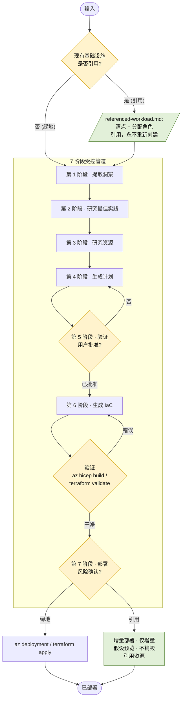

# Azure 企业基础设施规划器

## 使用此技能的场景

当用户需要执行以下操作时，请激活此技能：
- 从工作负载或架构描述中规划企业 Azure 基础设施
- 架构化着陆区、星型网络或多区域拓扑
- 设计网络基础设施：VNet、子网、防火墙、私有端点、VPN 网关
- 规划身份、RBAC 和合规性驱动的基础设施
- 为订阅范围或多资源组部署生成 Bicep 或 Terraform
- 规划灾难恢复、故障转移或跨区域高可用性拓扑

## 快速参考

| 属性 | 详情 |
|---|---|
| MCP 工具 | `insights_get`, `get_azure_bestpractices_get`, `wellarchitectedframework_serviceguide_get`, `microsoft_docs_fetch`, `microsoft_docs_search`, `bicepschema_get` |
| CLI 命令 | `az deployment group create`, `az bicep build`, `az resource list`, `terraform init`, `terraform plan`, `terraform validate`, `terraform apply`, `checkov` |
| 输出架构 | [schema.md](references/schema.md) |
| 关键参考 | [workflow.md](references/workflow.md), [waf-checklist.md](references/waf-checklist.md), [resources/](references/resources/README.md), [constraints/](references/constraints/README.md) |

## 工作流（从这里开始）

按照 [workflow.md](references/workflow.md) 中的分步说明，执行基础设施规划和配置的 7 个阶段。

## 架构

该技能运行一个 **7 阶段、受控的管道**。输入将被分类到两个流程之一：

- **绿地** — 仅包含新需求；直接运行所有阶段。
- **引用（褐地）** — 用户提供已存在的资源（一个活动资源 / 资源组 / 订阅、IaC 或基础设施计划，或需求文档）。相同的阶段将运行，并加上 [referenced-workload.md](references/referenced-workload.md)：现有资源将被清点和引用（永远不会重新创建），新工作负载将被连接到它们，并且 **第 7 阶段以增量方式部署**（仅增量 — 永远不会修改或销毁引用的资源）。

每个阶段只有在通过其受控点后才会推进。第 5 阶段需要明确用户批准；**第 6 阶段是一个硬化、自我验证的受控点** — 生成的 IaC 必须默认安全，通过本地验证 (`az bicep build` / `terraform validate`) 且无错误，通过 `checkov` 安全扫描且无未解决的严重/关键问题，并且技能必须 **显示命令输出** 并发出完成自我检查后才能推进；第 7 阶段需要明确的、已确认风险的部署确认。

**工件**（写入 `<project-root>/` 下）：`.azure/insights.json`（第 1 阶段）、`.azure/infrastructure-plan.json`（第 4 阶段，状态 `draft`→`approved`→`deployed`），以及 `infra/main.bicep` + `infra/modules/*` 或 `infra/main.tf` + `infra/modules/**`（第 6 阶段）。

## MCP 工具

| 工具 | 目的 |
|------|---------|
| `insights_get` | 检索有关用户现有 Azure 环境的洞察，以指导规划决策 |
| `get_azure_bestpractices_get` | 代码生成、操作和部署的 Azure 最佳实践 |
| `wellarchitectedframework_serviceguide_get` | 特定 Azure 服务的 WAF 服务指南 |
| `microsoft_docs_search` | 在 Microsoft Learn 中搜索相关文档片段 |
| `microsoft_docs_fetch` | 通过 URL 检索 Microsoft Learn 页面的完整内容 |
| `bicepschema_get` | 任何 Azure 资源类型的 Bicep 架构定义（最新 API 版本） |

## 错误处理

| 错误 | 原因 | 解决方法 |
|---|---|---|
| MCP 工具错误或不可用 | 工具调用超时、连接错误或工具不存在 | 重新尝试一次；如果未解决，则回退到参考文件并通知用户 |
| 计划批准缺失 | `meta.status` 不是 `approved` | 在生成 IaC 或部署之前停止并提示用户批准 |
| IaC 验证失败 | `az bicep build` 或 `terraform validate` 返回错误 | 修复生成的代码并重新验证；如果未解决，则通知用户 |
| 配对约束违规 | 不兼容的 SKU 或资源组合 | 在继续生成 IaC 之前在计划中修复 |
| 基础设施计划或 IaC 文件未找到 | 文件写入错误位置或未创建 | 验证文件是否存在于 `<project-root>/.azure/` 和 `<project-root>/infra/`；如果缺失，请严格按照 [workflow.md](references/workflow.md) 重新创建文件 |
