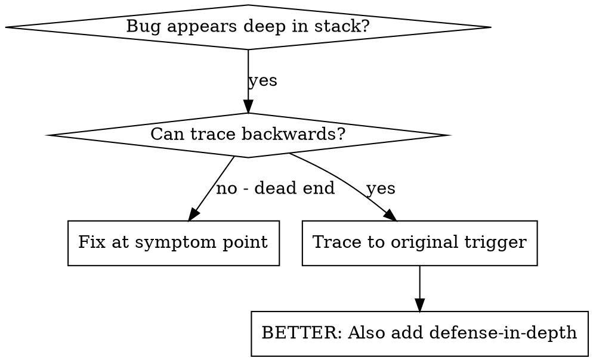
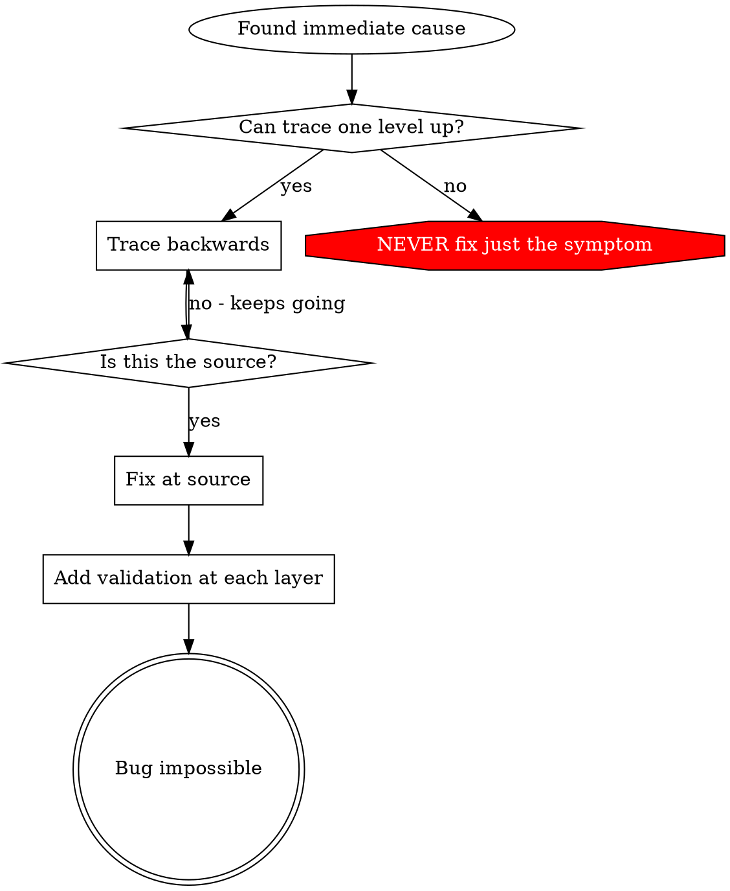

# 根因追踪

## 概述

错误通常出现在调用栈的深处（在错误的目录中执行 git init、在错误的位置创建文件、使用错误路径打开数据库）。你的本能是修复错误出现的地方，但这只是在处理症状。

**核心原则：** 通过调用链反向追踪，直到找到原始触发因素，然后在源头修复。

## 何时使用



**使用场景：**

- 错误发生在执行深处（而非入口点）
- 调用栈显示长调用链
- 不清楚无效数据来自何处
- 需要找到哪个测试/代码触发了问题

## 追踪过程

### 1. 观察症状

```
错误：git init 在 /Users/jesse/project/packages/core 失败
```

### 2. 找到直接原因

**什么代码直接导致这个错误？**

```typescript
await execFileAsync('git', ['init'], { cwd: projectDir });
```

### 3. 询问：什么调用了这个？

```typescript
WorktreeManager.createSessionWorktree(projectDir, sessionId)
  → 被 Session.initializeWorkspace() 调用
  → 被 Session.create() 调用
  → 被 Project.create() 中的测试调用
```

### 4. 继续向上追踪

**传递了什么值？**

- `projectDir = ''`（空字符串！）
- 空字符串作为 `cwd` 解析为 `process.cwd()`
- 那是源代码目录！

### 5. 找到原始触发因素

**空字符串来自哪里？**

```typescript
const context = setupCoreTest(); // 返回 { tempDir: '' }
Project.create('name', context.tempDir); // 在 beforeEach 之前访问！
```

## 添加调用栈

当无法手动追踪时，添加监控：

```typescript
// 在有问题的操作之前
async function gitInit(directory: string) {
  const stack = new Error().stack;
  console.error('DEBUG git init:', {
    directory,
    cwd: process.cwd(),
    nodeEnv: process.env.NODE_ENV,
    stack,
  });

  await execFileAsync('git', ['init'], { cwd: directory });
}
```

**关键：** 测试中使用 `console.error()` 而非日志器（日志器可能不会显示）

**运行并捕获：**

```bash
npm test 2>&1 | grep 'DEBUG git init'
```

**分析调用栈：**

- 查找测试文件名
- 找到触发调用的行号
- 识别模式（相同的测试？相同的参数？）

## 找到哪个测试导致污染

如果测试中出现问题但不知道哪个测试：

使用二分查找脚本：@find-polluter.sh

```bash
./find-polluter.sh '.git' 'src/**/*.test.ts'
```

逐个运行测试，在第一个污染者处停止。查看脚本了解用法。

## 真实案例：空 projectDir

**症状：** `.git` 在 `packages/core/`（源代码）中创建

**追踪链：**

1. `git init` 在 `process.cwd()` 运行 ← 空的 cwd 参数
2. WorktreeManager 被传递空 projectDir
3. Session.create() 传递了空字符串
4. 测试在 beforeEach 之前访问了 `context.tempDir`
5. setupCoreTest() 初始返回 `{ tempDir: '' }`

**根本原因：** 顶层变量初始化访问了空值

**修复：** 使 tempDir 成为 getter，如果 beforeEach 之前访问则抛出异常

**同时添加了纵深防御：**

- 层级 1：Project.create() 验证目录
- 层级 2：WorkspaceManager 验证非空
- 层级 3：NODE_ENV 防护拒绝在 tmpdir 外执行 git init
- 层级 4：git init 之前的调用栈记录

## 关键原则



**永远不要只在错误出现的地方修复。** 追踪回找到原始触发因素。

## 调用栈技巧

**在测试中：** 使用 `console.error()` 而非日志器——日志器可能被抑制
**在操作之前：** 在危险操作之前记录，而不是失败之后
**包含上下文：** 目录、cwd、环境变量、时间戳
**捕获调用栈：** `new Error().stack` 显示完整的调用链

## 真实影响

从调试会话（2025-10-03）：

- 通过 5 层追踪找到根本原因
- 在源头修复（getter 验证）
- 添加了 4 层防御
- 1847 个测试通过，零污染
