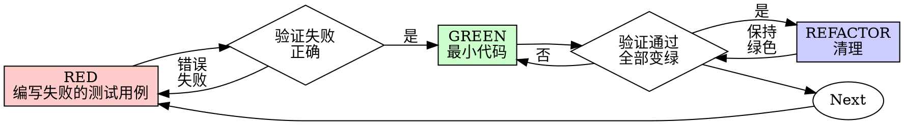

# 测试驱动开发（TDD）

## 概述

先写测试用例。观察它失败。编写最少的代码使其通过。

**核心原则：** 如果你没有观察到测试用例失败，你就不知道它是否测试了正确的东西。

**违反规则的字面意义就是违反规则的精髓。**

## 何时使用

**总是：**

- 新功能
- 修复错误
- 重构
- 行为变更

**例外（询问你的合作者）：**

- 一次性原型
- 生成代码
- 配置文件

想着“这次就跳过TDD”？停止。那是在找借口。

## 铁律

```
没有失败的测试用例，就没有生产代码
```

在测试用例之前编写代码？删除它。重新开始。

**没有例外：**

- 不要把它保留为“参考”
- 不要在编写测试用例时“调整”它
- 不要查看它
- 删除就是删除

从测试用例中全新实现。无论如何。

## 红绿重构



### RED - 编写失败的测试用例

编写一个最小的测试用例，展示应该发生什么。

<良好>
```typescript
test('retries failed operations 3 times', async () => {
  let attempts = 0;
  const operation = () => {
    attempts++;
    if (attempts < 3) throw new Error('fail');
    return 'success';
  };

  const result = await retryOperation(operation);

  expect(result).toBe('success');
  expect(attempts).toBe(3);
});

```
清晰的名称，测试真实的行为，一件事情
</良好>

<不良>
```typescript
test('retry works', async () => {
  const mock = jest.fn()
    .mockRejectedValueOnce(new Error())
    .mockRejectedValueOnce(new Error())
    .mockResolvedValueOnce('success');
  await retryOperation(mock);
  expect(mock).toHaveBeenCalledTimes(3);
});
```

模糊的名称，测试模拟代码而不是代码
</不良>

**要求：**

- 一个行为
- 清晰的名称
- 真实的代码（除非不可避免地使用模拟）

### Verify RED - 观察它失败

**强制执行。永远不要跳过。**

```bash
npm test path/to/test.test.ts
```

确认：

- 测试失败（不是错误）
- 错误信息是预期的
- 失败是因为功能缺失（不是拼写错误）

**测试通过？** 你正在测试现有的行为。修复测试。

**测试出错？** 修复错误，重新运行，直到它正确失败。

### GREEN - 最小代码

编写通过测试的最简单代码。

<良好>
```typescript
async function retryOperation<T>(fn: () => Promise<T>): Promise<T> {
  for (let i = 0; i < 3; i++) {
    try {
      return await fn();
    } catch (e) {
      if (i === 2) throw e;
    }
  }
  throw new Error('unreachable');
}
```
刚好足够通过
</良好>

<不良>
```typescript
async function retryOperation<T>(
  fn: () => Promise<T>,
  options?: {
    maxRetries?: number;
    backoff?: 'linear' | 'exponential';
    onRetry?: (attempt: number) => void;
  }
): Promise<T> {
  // YAGNI
}
```
过度设计
</不良>

不要添加功能，重构其他代码，或“改进”超出测试范围。

### Verify GREEN - 观察它通过

**强制执行。**

```bash
npm test path/to/test.test.ts
```

确认：

- 测试通过
- 其他测试仍然通过
- 输出纯净（没有错误，警告）

**测试失败？** 修复代码，而不是测试。

**其他测试失败？** 立即修复。

### REFACTOR - 清理

只有在绿色之后：

- 移除重复
- 改进名称
- 提取辅助函数

保持测试为绿色。不要添加行为。

### 重复

下一个失败的测试用例用于下一个功能。

## 良好测试

| 质量 | 良好 | 不良 |
|------|------|------|
| **最小** | 一件事。名称中包含“和”？拆分它。 | `test('validates email and domain and whitespace')` |
| **清晰** | 名称描述行为 | `test('test1')` |
| **显示意图** | 展示期望的API | 遮蔽代码应该做什么 |

## 为什么顺序很重要

**“我会先写测试用例来验证它是否工作”**

测试用例写在代码之后立即通过。立即通过证明不了什么：

- 可能测试了错误的东西
- 可能测试了实现而不是行为
- 可能遗漏了你忘记的边缘情况
- 你从未见过它捕获错误

先写测试用例迫使你必须看到测试用例失败，证明它实际上测试了某些东西。

**“我已经手动测试了所有的边缘情况”**

手动测试是临时的。你认为你测试了所有的事情，但实际上：

- 没有记录你测试了什么
- 代码更改时无法重新运行
- 在压力下容易忘记情况
- “我试了它，它工作了”≠全面

自动化测试是系统的。它们总是以同样的方式运行。

**“删除X小时的工作是浪费”**

沉没成本谬误。时间已经过去了。你的选择现在：

- 删除并使用TDD重写（X更多小时，高信心）
- 保留它并在之后添加测试（30分钟，低信心，可能存在错误）

保留你无法信任的代码。“浪费”是保留你无法信任的代码。没有真实测试的工作代码是技术债务。

**“TDD是教条的，务实意味着适应”**

TDD是务实的：

- 在提交前发现错误（比调试后更快）
- 防止回归（测试立即捕获中断）
- 文档化行为（测试显示如何使用代码）
- 使重构成为可能（自由更改，测试捕获中断）

“务实的捷径”= 生产中调试=更慢。

**“测试之后实现同样的目标——这是精神而不是仪式”**

不。测试之后的答案“这个做什么？” 测试优先的答案“这个应该做什么？”

测试之后的答案受到你实现的偏见。你测试你构建的东西，而不是需要的东西。你验证你记住的边缘情况，而不是发现的边缘情况。

测试优先迫使你在实现之前发现边缘情况。测试之后的答案验证你记住了一切（你没有）。

30分钟的测试之后≠TDD。你得到覆盖率，失去证明测试工作的证据。

## 常见的借口

| 借口 | 现实 |
|------|------|
| “太简单，不需要测试” | 简单代码会出问题。测试需要30秒。 |
| “我会之后测试” | 测试通过立即证明不了什么。 |
| “测试之后实现同样的目标” | 测试之后=“这个做什么？” 测试优先=“这个应该做什么？” |
| “已经手动测试” | 临时的≠系统的。没有记录，无法重新运行。 |
| “删除X小时是浪费” | 沉没成本谬误。保留未经验证的代码是技术债务。 |
| “保留为参考，先写测试用例” | 你会调整它。那是测试之后。删除就是删除。 |
| “需要先探索” | 好。扔掉探索，开始使用TDD。 |
| “测试困难=设计不清晰” | 听从测试。测试困难=使用困难。 |
| “TDD会减慢我的速度” | TDD比调试更快。务实=先写测试。 |
| “手动测试更快” | 手动测试不能证明边缘情况。你会重新测试每个更改。 |
| “现有代码没有测试” | 你正在改进它。为现有代码添加测试。 |

## 红旗 - 停止并重新开始

- 测试用例在代码之前
- 测试用例在实现之后
- 测试用例立即通过
- 无法解释为什么测试用例失败
- 测试用例“稍后”添加
- 找借口“就这一次”
- “我已经手动测试了它”
- “测试之后实现同样的目的”
- “这是精神而不是仪式”
- “保留为参考”或“调整现有代码”
- “已经花费X小时，删除是浪费”
- “TDD是教条的，我是务实的”
- “这个是不同的，因为……”

**所有这些意味着：删除代码。使用TDD重新开始。**

## 示例：修复错误

**错误：** 允许空电子邮件

**RED**

```typescript
test('rejects empty email', async () => {
  const result = await submitForm({ email: '' });
  expect(result.error).toBe('Email required');
});
```

**Verify RED**

```bash
$ npm test
FAIL: expected 'Email required', got undefined
```

**GREEN**

```typescript
function submitForm(data: FormData) {
  if (!data.email?.trim()) {
    return { error: 'Email required' };
  }
  // ...
}
```

**Verify GREEN**

```bash
$ npm test
PASS
```

**REFACTOR**
如果需要，从多个字段提取验证。

## 验证清单

在标记工作完成之前：

- [ ] 每个新的函数/方法都有一个测试用例
- [ ] 观察了每个测试用例在实现之前失败
- [ ] 每个测试用例都以预期的原因失败（功能缺失，不是拼写错误）
- [ ] 编写了通过每个测试用例的最小代码
- [ ] 所有测试用例都通过
- [ ] 输出纯净（没有错误，警告）
- [ ] 测试用例使用真实代码（只有在不可避免的情况下才使用模拟）
- [ ] 覆盖边缘情况和错误

无法检查所有框？你跳过了TDD。重新开始。

## 卡住时

| 问题 | 解决方案 |
|------|------|
| 不知道如何测试 | 编写期望的API。首先编写断言。询问你的合作者。 |
| 测试太复杂 | 设计太复杂。简化接口。 |
| 必须模拟所有东西 | 代码耦合太强。使用依赖注入。 |
| 测试设置太大 | 提取辅助函数。仍然复杂？简化设计。 |

## 集成调试

发现错误？编写失败的测试用例重现它。遵循TDD循环。测试证明了修复并防止了回归。

永远不要在没有测试的情况下修复错误。

## 最终规则

```
生产代码→测试用例存在并且首先失败
否则→不是TDD
```

没有你的合作者的许可，没有例外。

---

# 测试反模式

## 概述

测试必须验证真实行为，而不是模拟行为。模拟是隔离的手段，而不是被测试的东西。

**核心原则：** 测试代码做了什么，而不是模拟做了什么。

**遵循严格的TDD可以防止这些反模式。**

## 铁律

```
1. 永远不要测试模拟行为
2. 永远不要向生产类添加仅用于测试的方法
3. 永远不要在没有理解依赖关系的情况下模拟
```

## 反模式1：测试模拟行为

**违规：**

```typescript
// ❌ BAD: 测试模拟是否存在
test('renders sidebar', () => {
  render(<Page />);
  expect(screen.getByTestId('sidebar-mock')).toBeInTheDocument();
});
```

**为什么这是错误的：**

- 你在验证模拟是否工作，而不是组件是否工作
- 测试通过时模拟存在，失败时不存在
- 告诉你关于真实行为的任何信息

**你的合作者的纠正：** “我们在测试模拟的行为吗？”

**修复：**

```typescript
// ✅ GOOD: 测试真实组件或不要模拟它
test('renders sidebar', () => {
  render(<Page />);  // 不要模拟sidebar
  expect(screen.getByRole('navigation')).toBeInTheDocument();
});

// 或者如果sidebar必须模拟以实现隔离：
// 不要断言模拟 - 使用sidebar存在时测试Page的行为
```

### 门函数

```
在断言任何模拟元素之前：
  询问：“我在测试真实组件行为还是只是模拟存在？”

  如果测试模拟存在：
    停止 - 删除断言或取消模拟组件

  测试真实行为而不是
```

## 反模式2：生产类中的仅用于测试的方法

**违规：**

```typescript
// ❌ BAD: destroy() 仅在测试中使用
class Session {
  async destroy() {  // 看起来像生产API！
    await this._workspaceManager?.destroyWorkspace(this.id);
    // ... 清理
  }
}

// 在测试中
afterEach(() => session.destroy());
```

**为什么这是错误的：**

- 生产类被测试专用的代码污染
- 如果在生产中意外调用，则危险
- 违反YAGNI和关注点分离
- 混淆对象生命周期与实体生命周期

**修复：**

```typescript
// ✅ GOOD: 测试工具处理测试清理
// Session没有destroy() - 它在生产中是无状态的

// 在test-utils/
export async function cleanupSession(session: Session) {
  const workspace = session.getWorkspaceInfo();
  if (workspace) {
    await workspaceManager.destroyWorkspace(workspace.id);
  }
}

// 在测试中
afterEach(() => cleanupSession(session));
```

### 门函数

```
在向生产类添加任何方法之前：
  询问：“这个方法只由测试使用吗？”

  如果是：
    停止 - 不要添加它
    放在测试工具中而不是

  询问：“这个类拥有这个资源的生命周期吗？”

  如果不是：
    停止 - 错误的类包含这个方法
```

## 反模式3：没有理解就模拟

**违规：**

```typescript
// ❌ BAD: 模拟破坏测试逻辑
test('detects duplicate server', () => {
  // 模拟阻止测试依赖的配置写入！
  vi.mock('ToolCatalog', () => ({
    discoverAndCacheTools: vi.fn().mockResolvedValue(undefined)
  }));

  await addServer(config);
  await addServer(config);  // 应该抛出错误 - 但不会！
});
```

**为什么这是错误的：**

- 模拟的方法有测试依赖的副作用（写入配置）
- 为了“安全”而过度模拟破坏了实际行为
- 测试通过的原因错误或神秘地失败

**修复：**

```typescript
// ✅ GOOD: 在正确的级别模拟
test('detects duplicate server', () => {
  // 模拟慢的部分，保留测试需要的行為
  vi.mock('MCPServerManager'); // 只模拟慢服务器启动

  await addServer(config);  // 配置写入
  await addServer(config);  // 重复检测 ✓
});
```

### 门函数

```
在模拟任何方法之前：
停止 - 不要模拟

  1. 询问：“真实方法有什么副作用？”
  2. 询问：“测试依赖这些副作用中的任何吗？”
  3. 询问：“我是否完全理解这个测试需要什么？”

  如果依赖副作用：
    在较低级别模拟（实际的慢/外部操作）
    或者使用保留必要行为的测试双工
    不是测试依赖的高级别方法

  如果不确定测试依赖什么：
    首先使用真实实现运行测试
    观察实际需要发生什么
    然后在正确的级别添加最小的模拟

  信号：
    - “我会模拟这个以确保安全”
    - “这个可能很慢，最好模拟它”
    - 没有理解依赖链就模拟
```

## 反模式4：不完整的模拟

**违规：**

```typescript
// ❌ BAD: 部分模拟 - 只有你认为需要的字段
const mockResponse = {
  status: 'success',
  data: { userId: '123', name: 'Alice' }
  // 缺失：下游代码使用的metadata
};

// 后来：当代码访问response.metadata.requestId时出错
```

**为什么这是错误的：**

- **部分模拟隐藏了结构假设** - 你只模拟了你知道的字段
- **下游代码可能依赖于你没有包含的字段** - 沉默的失败
- **测试通过但集成失败** - 模拟不完整，真实API完整
- **虚假的信心** - 测试证明不了真实行为

**铁律：** 模拟完整的作为真实存在于现实中的数据结构，而不是你立即测试使用的字段。

**修复：**

```typescript
// ✅ GOOD: 完整地镜像真实API的完整性
const mockResponse = {
  status: 'success',
  data: { userId: '123', name: 'Alice' },
  metadata: { requestId: 'req-789', timestamp: 1234567890 }
  // 真实API返回的所有字段
};
```

### 门函数

```
在创建模拟响应之前：
检查：“真实API响应包含哪些字段？”

  动作：
    1. 检查实际API响应的文档/示例
    2. 包含系统可能消费的所有下游字段
    3. 验证模拟完全匹配真实响应模式

  关键：
    如果你正在创建一个模拟，你必须理解整个结构
    部分模拟在代码依赖于遗漏的字段时默默地失败

  如果不确定：包含所有记录的字段
```

## 反模式5：集成测试作为事后想法

**违规：**

```
✅ 实现完成
❌ 没有编写测试用例
“准备进行测试”
```

**为什么这是错误的：**

- 测试是实现的一部分，不是可选的后续步骤
- TDD会捕获这个问题
- 没有测试不能声称完成

**修复：**

```
TDD循环：
1. 编写失败的测试用例
2. 实现以通过
3. 重构
4. 然后声称完成
```

## 当模拟变得太复杂

**警告信号：**

- 模拟设置比测试逻辑更长
- 为了让测试通过而模拟所有东西
- 模拟缺少真实组件拥有的方法
- 模拟更改时测试失败

**你的合作者的问题：** “我们这里需要使用模拟吗？”

**考虑：** 使用真实组件的集成测试通常比复杂的模拟更简单

## TDD防止这些反模式

**为什么TDD有帮助：**

1. **先写测试用例** → 强迫你思考你实际上在测试什么
2. **观察它失败** → 确认测试测试真实行为，而不是模拟
3. **最小实现** → 没有测试专用的方法混入
4. **真实依赖** → 你在模拟之前看到测试实际需要什么

**如果你在测试模拟行为，你违反了TDD** - 你在没有先在真实代码之前观察测试失败的情况下添加了模拟。

## 快速参考

| 反模式 | 修复 |
|------|------|
| 断言模拟元素 | 测试真实组件或取消模拟它 |
| 生产类中的仅用于测试的方法 | 移到测试工具中 |
| 没有理解就模拟 | 首先理解依赖关系，最小化模拟 |
| 不完整的模拟 | 完整地镜像真实API |
| 测试用例作为事后想法 | TDD - 测试用例优先 |
| 过于复杂的模拟 | 考虑集成测试 |

## 红旗

- 断言检查`*-mock`测试ID
- 仅在测试文件中调用的方法
- 模拟设置>50%的测试
- 移除模拟时测试失败
- 无法解释为什么需要模拟
- 模拟“为了安全”

## 底线

**模拟是隔离的工具，而不是测试的东西。**

如果TDD揭示你在测试模拟行为，你就做错了。

修复：测试真实行为或质疑你为什么要模拟。
