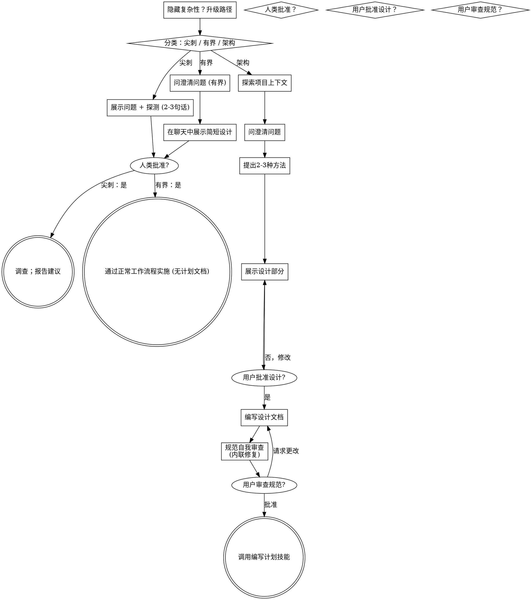

# 将想法转化为设计

通过自然协作对话，帮助将想法转化为完整的设计和规范。

首先，根据请求需要的流程程度进行分类，然后按照你的路径进行工作：理解上下文、完善想法、展示设计，并获得你的人类合作伙伴的批准。

## 建立共同理解

头脑风暴的成果是人类合作伙伴可以识别和纠正的理解，基于他们想要实现的目标。

1. **发现意图。** 使用请求和可用的上下文来确定预期结果、目标受众以及成功标准。当信息缺失时，在提出功能或方法之前，先问一个关于目的或预期用途的集中问题。知道应用程序类型并不能告诉你你的合作伙伴为什么想要它。收集缺失的需求不会让他们再次授权任务。
2. **写下你的理解。** 将预期结果、相关约束和成功标准总结成一条你的合作伙伴可以评估的简短笔记。将他们说的话与假设分开。邀请纠正，并在将其视为设计简报之前纳入他们的答案。
3. **将意图带入设计。** 在选定的路径的设计工件中保留达成的理解：用于架构工作的书面规范，或用于有界工作和尖刺的聊天中的设计/探测。对照该理解检查拟议的功能和技术选择。

当请求已经提供目的和约束时，反映这种理解，而不是再次询问相同的问题。保持笔记简洁；其准确性和纠正的机会很重要。

<HARD-GATE>
在采取任何实施行动之前，包括调用实施技能、编写产品代码、搭建框架、安装产品依赖项或创建外部项目，请完成选定路径的先决条件：

- 尖刺：人类合作伙伴批准问题和探测。
- 有界：人类合作伙伴批准简短的聊天设计。
- 架构：人类合作伙伴审查并批准书面规范，然后审查书面实施计划并选择其执行方法。对话设计批准仅允许编写规范；规范批准仅允许调用编写计划。

回复批准实际呈现的阶段。对想法或功能范围的批准不批准尚不存在的工件。从最早的不完整阶段开始；不要将一个批准变成跳过选定路径其余部分的许可。允许在先决条件未完成时进行只读项目探索。
</HARD-GATE>

## 三种路径

在你提出第一个问题之前，对请求进行分类并大声说出分类——"这看起来是有界的，所以我在这里展示一个简短的设计，而不是编写规范"——以便你的人类合作伙伴可以覆盖它：

- **尖刺**——一个可行性问题（"我们能..."、"这是否可能..."、"快速脏乱可以"），其输出是一个答案，而不是你保留的代码。展示问题和你要尝试的内容（2-3句话），得到一个点头，然后以正确性允许的最便宜的方式找出答案。没有设计文档，没有规范文件。报告发现作为建议；你构建的任何东西都应标记为一次性。
- **有界**——对已经存在于此存储库中的代码的良好范围更改：一个新的标志、一个小端点、一个单文件修复。
  理解应用程序类型是不够的——有界意味着你要更改的流程已经在这里供阅读。如果没有现有的流程要更改，任务就不是有界的。问重要的澄清问题，在聊天中展示简短的设计（几句话到几段简短的文字），然后停止。只有在你的人类合作伙伴对设计说"是"之后，实施才开始——有界任务的批准和架构任务一样困难。没有规范文件，没有实施计划文档。
- **架构**——新项目、新子系统、重新结构组件如何组合或更改其他依赖的接口的更改。遵循完整的过程：问题、方法、分节设计、书面规范，然后是编写计划技能。

当你在两个路径之间犹豫不决时，选择更重的路径。棘轮是单向的：在任务中途发现的隐藏复杂性会升级路径——停止，说出来，并升级。中途不会降级。

## 反模式："太简单不需要批准"

每个路径都以你的人类合作伙伴在实施之前批准所需的设计而结束。有界更改可能只需要聊天中的两句话。一个新的待办事项列表项目是有架构的，需要书面规范和计划交接。根据选定的路径调整工件大小；在实施之前完成该路径的审查。

## 信号灯

| 思想 | 现实 |
|---------|---------|
| "这太简单了，不需要设计" | 遵循选定的路径：有界更改获得简短的聊天设计；架构更改获得书面规范和计划交接。 |
| "我会称之为有界并跳过规范" | 伸手去标签以跳过工作是怀疑——选择更重的路径。 |
| "它是有界的，设计是显而易见的——我会在他们阅读时开始" | 关卡是批准，不是设计的长度。展示，然后在听到"是"之前停止。 |
| "我了解这种类型的应用程序，所以它是有界的" | 有界衡量存储库，而不是你的熟悉程度。一个新项目没有现有的流程——它是架构的。 |
| "尖刺有效，所以我会保留代码" | 尖刺的输出是一个答案。保留代码是一个新请求——进行分类。 |
| "它长大了，但我几乎完成了——不需要重新分类" | 隐藏的复杂性中途升级路径。停止并说出来。 |
| "他们批准了尖刺，所以后续更改也获得了批准" | 每个任务都有自己的分类和自己的批准。 |

## 清单

首先分类，宣布路径，然后为你的路径上的每个项目创建任务并按顺序完成。

**尖刺：**
1. **探索项目上下文**——足够以构建探测
2. **展示问题 + 探测计划**——2-3句话
3. **获得批准**——点头就足够了
4. **调查**——以正确性允许的最便宜的方式
5. **报告发现**——一个建议；将构建的任何东西标记为一次性

**有界：**
1. **探索项目上下文**——检查文件、文档、最近的提交
2. **问澄清问题**——一次一个，重要的那些
3. **在聊天中展示简短设计**——方法、触及的文件、测试
4. **获得批准**——停止并等待明确的"是"；在同一口气中展示设计和开始跳过关卡
5. **实施**——继续正常的开发工作流程（TDD适用）；没有计划文档

**架构：**
1. **探索项目上下文**——检查文件、文档、最近的提交
2. **适时提供视觉伴侣**——不是 upfront。第一次一个问题会真正比描述更清楚时显示，提供它（它自己的消息）；在批准后，它的浏览器标签会为你打开。如果没有视觉问题出现，永远不要提供它。见下文的视觉伴侣部分。
3. **问澄清问题**——一次一个，理解目的/约束/成功标准
4. **提出2-3种方法**——包括权衡和你的建议
5. **展示设计**——按其复杂性分节，获得用户批准后每个部分
6. **编写设计文档**——保存到 `docs/superpowers/specs/YYYY-MM-DD-<主题>-设计.md` 并提交
7. **规范自我审查**——快速内联检查占位符、矛盾、歧义、范围（见下文）
8. **用户审查书面规范**——在继续之前要求用户审查规范文件
9. **过渡到实施**——调用编写计划技能以创建实施计划

## 流程图

**终端状态受路径限制。** 架构：头脑风暴后调用的唯一技能是编写计划——永远不调用前端设计、mcp-builder 或任何其他实施技能。有界：批准后，实施直接通过正常开发工作流程进行；没有计划文档。尖刺：终端状态是报告建议。

## 流程

下方的子部分服务于有界和架构路径（尖刺在"展示探测，获得点头"时停止）。从**探索方法**开始的各部分是架构路径深度——对于有界工作，上下文加上几个问题加上简短的聊天设计就是整个流程。

**理解想法：**

- 首先检查当前项目状态（文件、文档、最近的提交）
- 在问详细问题之前，评估范围：如果请求描述了多个独立的子系统（例如，"构建一个具有聊天、文件存储、计费和分析的平台"），立即标记。不要在需要先分解的项目上花费问题来完善细节。
- 如果项目太大，无法为一个规范分解为子项目：独立的部分是什么，它们如何相关，应该按什么顺序构建？然后通过正常设计流程对第一个子项目进行头脑风暴。每个子项目都有自己的规范→计划→实施周期。
- 对于适当范围的项目，一次问一个问题来完善想法
- 尽可能使用多项选择题，开放式问题也可以
- 每条消息只问一个问题 - 如果一个主题需要更多探索，将其分成多个问题
- 专注于理解：目的、约束、成功标准

**探索方法：**

- 提出具有权衡的2-3种不同方法
- 交谈式地展示选项，包括你的建议和推理
- 首先展示你建议的选项并解释原因
- 严格地YAGNI - 从每个方法和设计中删除不必要的功能

**展示设计：**

- 一旦你认为你理解你要构建的内容，就展示设计
- 每个部分按其复杂性缩放：如果简单，几句话；如果微妙，最多200-300字
- 询问它是否看起来正确
- 涵盖：架构、组件、数据流、错误处理、测试
- 如果不清楚，准备好回去澄清

**为隔离和清晰而设计：**

- 将系统分解为每个部分都有一个清晰目的、通过定义良好的接口进行通信、可以独立理解和测试的小单元
- 对于每个单元，你应该能够回答：它做什么，如何使用它，以及它依赖什么？
- 是否有人可以在不阅读其内部的情况下理解一个单元做什么？你是否可以在不破坏消费者的情况下更改内部？如果不是，边界需要工作。
- 较小、良好边界化的单元也更容易与你一起工作——你可以更好地推理关于一次可以持在上下文中一次的代码，并且当文件集中时，你的编辑更可靠。当文件变长时，这通常是它做太多工作的信号。

**在现有代码库中工作：**

- 在提出更改之前探索当前结构。遵循现有模式。
- 如果现有代码存在影响工作的问题（例如，一个文件变得太大、边界不清、职责纠缠），将有针对性的改进作为设计的一部分包含在内——一个好开发者改进他们正在工作的代码的方式。
- 不要提出无关的重构。专注于当前目标。
