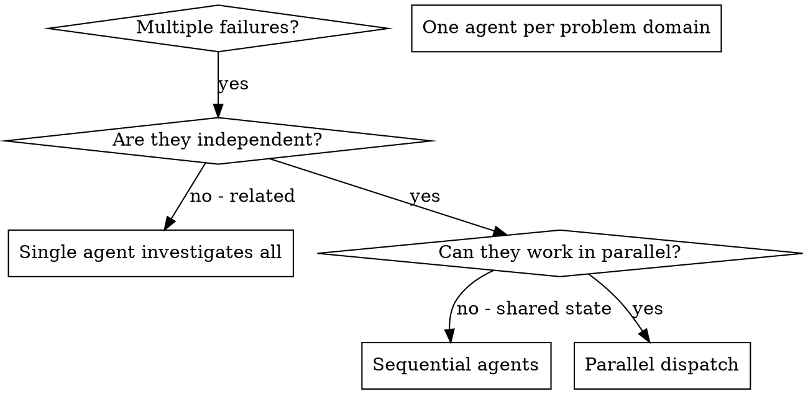

# 并行代理调度

## 概述

你将任务委托给具有隔离上下文的专用代理。通过精确设计它们的指令和上下文，你确保它们保持专注并成功完成任务。它们绝不能继承你的会话上下文或历史记录——你构建精确的上下文供它们使用。这也保留了你的上下文以进行协调工作。

当你有多个不相关的失败（不同的测试文件、不同的子系统、不同的错误）时，按顺序调查它们会浪费时间。每次调查都是独立的，可以并行进行。

**核心原则：** 每个独立的问题域调度一个代理。让它们并行工作。

## 何时使用



**使用场景：**
- 3个或更多测试文件因不同根本原因失败
- 多个子系统独立损坏
- 每个问题可以在不了解其他上下文的情况下理解
- 调查之间没有共享状态

**不使用场景：**
- 失败是相关的（修复一个可能修复其他）
- 需要理解完整的系统状态
- 代理会相互干扰

## 模式

### 1. 识别独立域

按损坏内容分组：
- 文件A测试：工具审批流程
- 文件B测试：批量完成行为
- 文件C测试：中止功能

每个域都是独立的——修复工具审批不会影响中止测试。

### 2. 创建专注的代理任务

每个代理获得：
- **特定范围：** 一个测试文件或子系统
- **明确目标：** 使这些测试通过
- **约束：** 不要更改其他代码
- **预期输出：** 你发现和修复的内容摘要

### 3. 并行调度

在同一响应中发出所有三个子代理调度——它们并行运行：

```text
子代理（通用型）："修复 agent-tool-abort.test.ts 失败"
子代理（通用型）："修复 batch-completion-behavior.test.ts 失败"
子代理（通用型）："修复 tool-approval-race-conditions.test.ts 失败"
# 三个同时运行。
```

一个响应中多个调度调用 = 并行执行。每个响应一个 = 顺序执行。

### 4. 审查和集成

代理返回时：
- 阅读每个摘要
- 验证修复是否存在冲突
- 运行完整测试套件
- 集成所有更改

## 代理提示结构

好的代理提示应满足：
1. **专注：** 一个清晰的问题域
2. **自包含：** 理解问题所需的全部上下文
3. **明确输出：** 代理应返回什么？

```markdown
修复 src/agents/agent-tool-abort.test.ts 中的3个失败测试：

1. "should abort tool with partial output capture" - 预期消息中包含 'interrupted at'
2. "should handle mixed completed and aborted tools" - 快速工具中止而不是完成
3. "should properly track pendingToolCount" - 预期3个结果但得到0

这些问题是时序/竞争条件问题。你的任务：

1. 阅读测试文件并理解每个测试验证的内容
2. 确定根本原因——是时序问题还是实际错误？
3. 通过：
   - 将任意超时替换为事件等待
   - 如果发现，修复中止实现中的错误
   - 如果测试行为发生变化，调整测试预期

不要只是增加超时——找到真正的问题。

返回：你发现和修复的内容摘要。
```

## 常见错误

**❌ 过于宽泛：** "修复所有测试" - 代理会迷失方向
**✅ 具体：** "修复 agent-tool-abort.test.ts" - 专注的范围

**❌ 缺少上下文：** "修复竞争条件" - 代理不知道在哪里
**✅ 上下文：** 粘贴错误消息和测试名称

**❌ 缺少约束：** 代理可能会重构所有内容
**✅ 约束：** "不要更改生产代码" 或 "仅修复测试"

**❌ 模糊输出：** "修复它" - 你不知道发生了什么变化
**✅ 具体：** "返回根本原因和更改的摘要"

## 不应使用的场景

**相关的失败：** 修复一个可能修复其他——先一起调查
**需要完整上下文：** 理解需要看到整个系统
**探索性调试：** 你还不确定什么损坏了
**共享状态：** 代理会相互干扰（编辑相同文件、使用相同资源）

## 会话中的真实示例

**场景：** 大型重构后3个文件中的6个测试失败

**失败：**
- agent-tool-abort.test.ts：3个失败（时序问题）
- batch-completion-behavior.test.ts：2个失败（工具未执行）
- tool-approval-race-conditions.test.ts：1个失败（执行计数=0）

**决策：** 独立域——中止逻辑与批量完成分离，与竞争条件分离

**调度：**
```
代理1 → 修复 agent-tool-abort.test.ts
代理2 → 修复 batch-completion-behavior.test.ts
代理3 → 修复 tool-approval-race-conditions.test.ts
```

**结果：**
- 代理1：将超时替换为事件等待
- 代理2：修复事件结构错误（threadId位置错误）
- 代理3：添加等待异步工具执行完成的等待

**集成：** 所有修复独立，无冲突，完整套件变绿

## 验证

代理返回后：
1. **审查每个摘要** - 理解发生了什么变化
2. **检查冲突** - 代理是否编辑了相同代码？
3. **运行完整套件** - 验证所有修复是否协同工作
4. **抽查** - 代理可能会犯系统性错误
