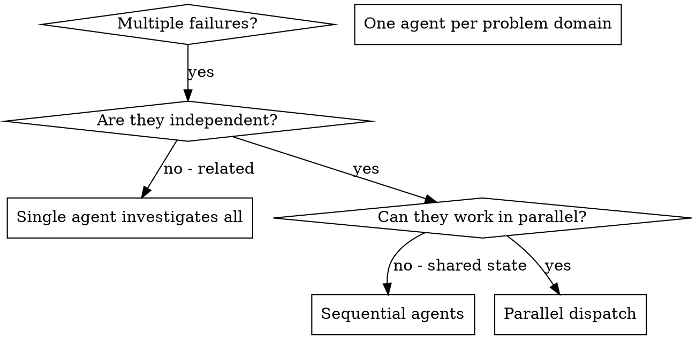

# 并行代理派发

## 概述

您将任务委托给拥有独立上下文的专职代理。通过精确设计其指令与上下文，确保它们保持专注并成功完成任务。它们绝不应继承您的会话上下文或历史记录——您只为它们构建所需的确切内容。这同时也保留了您的自身上下文，以便用于协调工作。

当您遇到多个无关的故障（不同的测试文件、不同的子系统、不同的错误）时，顺序调查会浪费时间。每次调查都是独立的，可以并行进行。

**核心原则：** 每个独立的问题领域派发一个代理。让它们并行工作。

## 何时使用



**使用时：**
- 3 个及以上测试文件因不同的根本原因而失败
- 多个子系统独立出现故障
- 每个问题均可无需其他问题的上下文被理解
- 调查之间无共享状态

**不使用的情况：**
- 故障相互关联（修复一个可能修复其他问题）
- 需要理解整个系统的状态
- 代理之间会产生干扰

## 模式

### 1. 识别独立领域

按出现故障的内容进行分组：
- A 文件的测试：工具审批流程
- B 文件的测试：批量完成行为
- C 文件的测试：中止功能

每个领域相互独立——修复工具审批不会影响中止测试。

### 2. 创建专注的代理任务

每个代理获得：
- **明确范围：** 一个测试文件或子系统
- **明确目标：** 使这些测试通过
- **限制：** 不要改动其他代码
- **预期输出：** 你发现的问题及修复情况的摘要

### 3. 并行派发

在同一个回复中发起所有三个子代理的派发——它们将并行运行：

```text
Subagent (general-purpose): "Fix agent-tool-abort.test.ts failures"
Subagent (general-purpose): "Fix batch-completion-behavior.test.ts failures"
Subagent (general-purpose): "Fix tool-approval-race-conditions.test.ts failures"
# All three run concurrently.
```

同一回复中的多次派发调用 = 并行执行。每次回复一次 = 顺序执行。

### 4. 审查与集成

当代理返回后：
- 阅读每份摘要
- 验证修复不存在冲突
- 运行完整测试套件
- 整合所有修改

## 代理提示词结构

良好的代理提示词具备：
1. **聚焦** - 一个清晰的问题领域
2. **自包含** - 理解问题所需的所有上下文
3. **输出要求明确** - 代理应返回什么内容？

```markdown
Fix the 3 failing tests in src/agents/agent-tool-abort.test.ts:

1. "should abort tool with partial output capture" - expects 'interrupted at' in message
2. "should handle mixed completed and aborted tools" - fast tool aborted instead of completed
3. "should properly track pendingToolCount" - expects 3 results but gets 0

These are timing/race condition issues. Your task:

1. Read the test file and understand what each test verifies
2. Identify root cause - timing issues or actual bugs?
3. Fix by:
   - Replacing arbitrary timeouts with event-based waiting
   - Fixing bugs in abort implementation if found
   - Adjusting test expectations if testing changed behavior

Do NOT just increase timeouts - find the real issue.

Return: Summary of what you found and what you fixed.
```

## 常见错误

**❌ 范围过宽：** "修复所有测试" - 代理会迷失方向
**✅ 具体明确：** "修复 agent-tool-abort.test.ts" - 范围聚焦

**❌ 无上下文：** "修复竞态条件" - 代理不清楚位置
**✅ 附带上下文：** 粘贴错误信息及测试名称

**❌ 无限制：** 代理可能会重构所有内容
**✅ 附带限制：** "不要修改生产代码" 或 "仅修复测试"

**❌ 输出模糊：** "修复它" - 你不知道具体改了什么
**✅ 具体明确：** "返回根本原因及修改内容的摘要"

## 不应使用的情况

**相关故障：** 修复其中一个可能修复其他问题——应先共同排查
**需要完整上下文：** 理解需要查看整个系统
**探索性调试：** 你尚未明确故障所在
**共享状态：** 代理会产生干扰（编辑相同文件、使用相同资源）

## 真实会话示例

**场景：** 主要重构后，3 个文件中出现 6 个测试失败

**故障：**
- agent-tool-abort.test.ts：3 个失败（时序问题）
- batch-completion-behavior.test.ts：2 个失败（工具未执行）
- tool-approval-race-conditions.test.ts：1 个失败（执行次数为 0）

**决策：** 领域相互独立——中止逻辑、批量完成、竞态条件相互分离

**派发：**
```
Agent 1 → Fix agent-tool-abort.test.ts
Agent 2 → Fix batch-completion-behavior.test.ts
Agent 3 → Fix tool-approval-race-conditions.test.ts
```

**结果：**
- Agent 1：将超时改为基于事件的等待
- Agent 2：修复了事件结构 bug（threadId 位置错误）
- Agent 3：添加了等待异步工具执行完成的逻辑

**集成：** 所有修复相互独立、无冲突，完整测试套件全部通过

## 验证

代理返回后：
1. **审查每份摘要** - 了解变更内容
2. **检查冲突** - 代理是否编辑了相同的代码？
3. **运行完整套件** - 验证所有修复协同生效
4. **抽查** - 代理可能出现系统性错误
