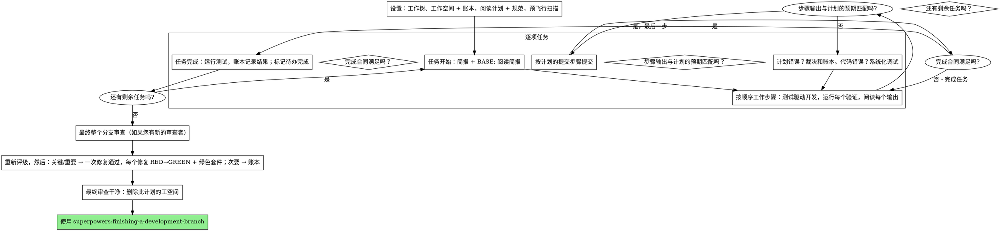

# 执行计划

在本会话中，您亲自逐项执行计划：每个任务没有专门的实施子代理，每个任务没有专门的审查者。最后对整个分支进行一次全新的上下文审查。

**为何内联执行：** 子代理驱动的开发为每个任务支付了全新的实施者和审查者，每个任务都要重新从零开始阅读代码库。内联执行支付了您的单个上下文加上一次审查。它放弃的是每个任务的全新上下文和每个任务的第二双眼睛。这项技能通过其他方式保留了这两件事的价值：简报就是规范，账本就是您的记忆，测试驱动开发是每个任务的门禁，最终的审查者就是第二双眼睛。

**核心原则：** 计划已经完成了思考。精确执行它，用您亲眼目睹失败的测试并随后通过的测试来证明每一步，并留下一个不会因您遗忘而消失的记录。

**叙述：** 在工具调用之间，最多叙述一行短句——账本和工具结果承载着记录。

**持续执行：** 在任务之间不要暂停以与您的人类伙伴确认。他们选择内联执行是为了节省成本，而不是在每项任务之后回答“我是否应该继续”。从计划中执行所有任务，不要停止。

**裁决，而非停滞。** 冲突、歧义、计划缺陷——决定它们。规范是约束性权威，计划是其论据，而您的判断决定了两者都无法回答的内容。将每个裁决记录在账本中，格式为 `裁决：<您决定的内容> — <原因> — <如果错误将付出的代价>`，然后继续进行。在没有账本裁决的情况下偏离计划是一个秘密做出的决定。

有四件事会阻止您，也只有这些：不可逆或破坏性操作；安全敏感操作；超出此工作树且规范要求您首先询问的副作用（合并、向共享分支推送、发布）；以及计划如此破败以至于每条前进的路径都是猜测。对于这些情况，请停止并询问。

## 使用场景

- 您有一个来自 `superpowers:writing-plans` 的计划，并且您的人类伙伴在交接时选择了内联执行。
- 您的 harness 没有子代理工具（参见 `../using-superpowers/references/` 中的平台特定参考）。永远不要编造一个调度；在这里运行计划。
- 任务大多是独立的——与 `superpowers:subagent-driven-development` 相同的前置条件。

一个完全指定的计划使内联执行成为转录加测试：它在中端会话模型上运行良好，并且最强大的模型赚取成本的地方是最终的审查，这项技能将其单独调度。当您的人类伙伴选择内联时，告诉他们这一点。

当您的人类伙伴希望每个任务都有一个审查门禁，或者当计划足够长以至于其后续任务将在压缩的上下文中运行时，优先选择 `superpowers:subagent-driven-development`。在长计划上内联执行仍然有效——账本是使其可恢复的关键——但最后一项任务会得到最少的关注。

## 流程



## 设置

确保工作在隔离的工作空间中进行：使用 `superpowers:using-git-worktrees` 创建一个或验证现有的工作空间。未经您人类伙伴的明确同意，永远不要在 main/master 分支上开始实施。

会话记忆不会在压缩时保留。失去位置的内联执行者会重新实施已经存在的提交——这与控制器重新调度它们相同，但代价是您自己的上下文。在账本文件中跟踪进度，而不仅仅是在待办事项中。Harness 待办事项是实时视图；账本是记录。

工作空间和账本与 `superpowers:subagent-driven-development` 共享——相同的目录，相同的格式——因此一个计划可以在飞行中更改执行者，新的执行者可以从相同的账本恢复。

- 每个计划拥有一个工作空间：在技能开始时，运行 `../subagent-driven-development/scripts/sdd-workspace PLAN_FILE` — 它会打印计划的 git 忽略目录（`<repo-root>/.superpowers/sdd/<plan-basename>/`），这是此计划每个工件的家：账本、简报、审查包。另一个计划的目录永远不会是您读取或写入的。
- 检查此计划的账本位于 `<workspace>/progress.md`。如果其第一行命名了您的计划文件，则带有 `Task <N>: complete` 行的任务已完成——不要重做它们；从没有该行的第一个任务开始。即使您的上下文不再记得创建它们，它们的提交也存在于 git 中：压缩后，信任账本和 `git log` 而不是您自己的记忆。如果账本的第一行命名了不同的计划文件，则是另一个计划的进度：留下它并开始您自己的，全新的。
- 使用其身份作为第一行创建账本：`# SDD 账本 — 计划: <计划文件路径>`。
- `git clean -fdx` 将销毁工作空间（它是 git 忽略的临时文件）；如果发生这种情况，从 `git log` 恢复。

阅读计划一次，记下其上下文和全局约束，并为每个任务创建一个待办事项。如果计划命名了规范，也阅读它：规范是计划论证的权威，计划内部的冲突根据它解决。没有可到达的规范的计划会得到账本注释说明——没有规范的裁决是临时的。

**必需子技能：** 现在在任务 1 之前加载 `superpowers:test-driven-development`。它管理每个任务每一步的规则；一个步骤已经说“首先编写失败的测试”的计划不会使您免除阅读它。

在任务 1 之前，扫描计划中任务之间的冲突。计划的接口块告诉您在哪里查找：对于每个消耗早期任务生成内容的任务，一行账本——两个任务，一个生成的内容与另一个消耗的内容，以及您发现的内容。不共享任何内容的任务没有行；任务的共享任务为空的计划得到单行 `预飞行：没有共享接口`。根据规范作为约束性权威裁决每一行暴露的冲突，在账本旁边记录裁决，然后开始任务 1。您自己的文本在您阅读其简报时检查，而不是在这里。

## 任务循环

您打印的每项内容，以及每个工具结果，都保留在您的上下文中，直到会话结束。将长测试输出重定向到工作空间中的文件，并读取其尾部；阅读简报，而不是整个计划。

### 1. 接收任务

- 运行此技能的 `scripts/task-start PLAN_FILE N`。它一次调用打印简报路径和 BASE（任务的范围切割自的提交）。阅读每个任务的简报，包括您从设置中记住的任务：您记住的是摘要，简报包含确切的值、签名和测试用例。
- 在待办事项中标记任务的 `in_progress`。

每个工具调用都会重新读取您的整个上下文。账本记录与工作一起进行——在提交调用中追加账本，永远不会在自己的调用中执行。

### 2. 工作步骤

计划的步骤已经按 RED-GREEN 顺序排列；在 `superpowers:test-driven-development` 下按该顺序执行它们。测试步骤的代码首先编写，然后首先运行。看到它失败是一个步骤，而不是一种形式——在实现存在之前就通过的测试是关于测试的发现。

运行命令的每个步骤都有一个 `Expected:` 行。运行命令，阅读其输出，并进行比较。三种结果：

- **匹配。** 下一步。
- **代码错误。** 使用 `superpowers:systematic-debugging`。找到原因；永远不要为了使步骤的输出匹配而打补丁。
- **计划错误**——一个步骤与规范矛盾，早期任务的接口与当前任务消耗的内容不匹配，一个无法工作的命令。根据规范满足的最小更改进行裁决，将其作为 `Task <N>: 裁决: <发现> — <您决定的内容和原因>` 记录在账本中，然后继续。裁决是携带的，而不是记忆的：后续任务触摸相同接口时，它们从账本中读取。

按计划的提交步骤提交。跨越多个提交的任务很好；BASE 是审查范围切割自的提交，永远不会是 `HEAD~1`。

### 3. 完成合同

在任务的账本行之前，以下所有内容都是真实的，本会话中有证据——而不是从看起来正确的 diff 推断：

- 简报命名的每个测试都存在于本任务中并运行，并且您阅读了输出。
- 任务运行的最终测试通过——`task-done` 是该运行，它将命令和结果写入账本行。
- 简报中的每个 `Expected:` 行都与实际输出进行了比较。
- 简报的每个偏差都有一个账本中的 `Ruling:` 行。

**必需子技能：** `superpowers:verification-before-completion` 支配此主张。如果任何项目缺失，任务未完成：完成它。

### 4. 完成任务

运行此技能的 `scripts/task-done PLAN_FILE N BASE -- <测试命令>`，使用简报为整个任务命名的测试命令。它运行测试，将完整输出保留在工作空间中，打印尾部，并且——只有在它们通过时——将完成行追加到账本：

`Task <N>: complete (commits <base7>..<head7>, tests: <命令> → <结果>)`

运行失败不记录任何内容；任务未完成。当它记录时，标记待办完成并接收下一个任务。

## 最终审查

运行 `../subagent-driven-development/scripts/review-package PLAN_FILE MERGE_BASE HEAD`（`MERGE_BASE` = 分支开始的提交，例如 `git merge-base main HEAD`）并审查它打印的文件。

**有子代理工具：** 使用 `superpowers:requesting-code-review` 的 `[code-reviewer.md](../requesting-code-review/code-reviewer.md)`，使用最强大的可用模型调度审查者——整个分支审查是一个判断任务，使用计划路径、规范路径、如果计划有 `Review Focus` 部分则逐字复制（计划测试未执行的输入类和失败模式——审查者检查每个），以及指向账本 `Ruling:` 行的指针，以便它可以权衡您做出的裁决。明确指定模型；省略模型继承了会话的模型，这可能不是最强大的。这是整个运行买到的唯一全新上下文。不要跳过它，也不要用您自己的 diff 阅读替换它。

**没有子代理工具：** 阅读代码审查者.md 并自行对包进行审查，作为最后一个任务的账本行之后的单独通过。在账本中写入 `Final review: self-review (no subagent tool)`，并在您的最终消息中说明这一点：作者的自审不如新的审查者弱，并且您的人类伙伴决定这是否足够才能合并。

在采取任何行动之前，对发现进行排序。审查者的严重性标签是建议；门禁是您的。它的“拒绝判断”列表也是您的：每行都是您做出并记录的裁决，就像计划冲突一样——`Final: 裁决: <审查者放弃的行为> — <一个合理使用此软件的人得到的内容，以及为什么站得住脚或为什么现在是发现> — <如果错误将付出的代价>`。首先重新评级，按效果：规范是一份愿景文档，发现的评级是一个合理使用此软件的人如果它发布，而不是规范是否命名了触发它的输入——一个因为规范沉默而将发现评级为次要的审查者已经对规范进行了评级，而不是对效果进行评级。然后：

- **关键和重要** 进入修复通过。
- **次要** 被记录为 `Final: minor (deferred): <一句话>` 并记录在您的最终消息的“延迟的次要项”下。次要项永远不会进入修复通过，也永远不会成为裁决——裁决是关于冲突的决定，而不是拒绝抛光建议的注释。

您自己修复关键和重要的发现——在这里您是实施者——在一次性通过中。每个修复都由测试驱动开发验证，而不是由第二位审查者验证：编写一个重现发现的测试，看到它失败，使其通过，然后运行整个套件。将每个记录在账本中，格式为 `Final: fixed <发现> — <测试名称> RED→GREEN, 套件 <N>/<N>`。没有首先失败的测试的修复不是经过验证的；通过后套件不是绿色的意味着通过没有完成。不要调度重新审查：它将重新读取一个 diff，其覆盖测试已经回答了“已解决”，其套件运行已经回答了“没有破坏任何东西”。

您决定不修复的发现是一个裁决——`Final: 裁决: <发现> — <代码站得住脚的原因> — <如果错误将付出的代价>`——它将到达您的人类伙伴的裁决列表。没有第二次修复通过。

## 完成

在您删除任何内容之前，将包含 `Ruling:` 的每个账本行收集到您的最终消息的“我做出的裁决”下，按您做出的顺序，每个都带有如果错误将付出的代价，以及每个 `minor (deferred)` 行在“延迟的次要项”下。两个列表都是详尽的。您的最终消息是唯一一个将您在您人类伙伴名义下做出的决定——以及您选择不采取行动的发现——传达给他们的地方。

当最终审查干净并且其修复已提交时，删除此计划的工空间目录——历史记录是记录。兄弟目录属于其他计划；不要碰它们。

使用 `superpowers:finishing-a-development-branch`。

## 常见理由

| 免责声明 | 现实 |
|--------|---------|
| "我记得任务 N 是什么" | 您记得一个摘要。简报包含确切的值。阅读它。 |
| "计划的代码是正确的，跳过观看测试失败" | 您从未见过测试失败，它证明不了任何东西。它是一个步骤。运行它。 |
| "我会在任务结束时运行整个套件，而不是每步运行" | 每步运行是您学习哪个步骤破坏它的方式。任务的末尾运行是合同，而不是替代品。 |
| "计划在这里是错误的，我会直接做正确的事" | 做正确的事并记录裁决。未记录的偏离是在秘密中做出的决定。 |
| "我会在几个任务后记录账本行" | 压缩不会等待一个方便的时刻。每个任务一行，在与提交相同的消息中。 |
| "让我在下一个任务之前检查一下" | 他们选择内联是为了节省成本。进度提示会花费他们的时间。只有四个停止会阻止您。 |
| "我仔细阅读了自己的 diff；最终的审查者是多余的" | 同一作者，同样的盲点。审查者是这次运行买到的唯一全新上下文。 |
| "测试应该通过，改变很小" | "应该"不是证据。合同要求命令及其输出。 |
| "子代理很慢且昂贵，我会跳过最终审查" | 内联已经移除了每项任务的审查者。整个分支的一次审查是底线，不是上限。 |
| "审查者说次要，所以它是次要的" | 标签对规范的沉默进行了评级。评级效果。首先重新评级，然后门禁。 |
| "修复很明显，不需要先写一个失败的测试" | 失败的测试是唯一证明发现真实且现在已经消失的证据。没有它，您有一个 diff 和一个希望。 |
| "我会在那里的时候修复次要项" | 您修复的每个次要项都是一个测试、一个修复和一个套件运行，您的伙伴没有要求。记录它们；您的伙伴决定。 |

## 示例工作流

```
您：我正在使用执行计划技能来内联实现此计划。

[设置：工作树已验证]
[阅读计划一次：docs/superpowers/plans/feature-plan.md; 规范已阅读]
[解决工作空间：sdd-workspace docs/superpowers/plans/feature-plan.md — 账本中没有，全新开始]
[预飞行扫描：2 行共享接口，4 行自洽性，干净；写入账本]
[为所有任务创建待办事项]

任务 1：安装脚本钩子

[task-start plan 1 → 简报阅读; BASE a1b2c3d]
[步骤 1：编写失败的测试 — 已编写]
[步骤 2：运行它 — FAIL: install_hook 未定义。匹配预期。]
[步骤 3：实现 — 已编写]
[步骤 4：运行它 — PASS 1/1. 匹配预期。]
[步骤 5：提交 — d4e5f6a]
[合同：测试运行，输出已阅读，没有偏差]
[task-done plan 1 a1b2c3d -- npm test -- hooks → 账本：Task 1: complete (commits a1b2c3d..d4e5f6a, tests: npm test -- hooks → 1/1 pass)]

任务 2：恢复模式

[task-start plan 2 → 简报阅读; BASE d4e5f6a]
[步骤 2：运行失败的测试 — FAIL，但在导入错误：任务 1 导出了 installHook，简报消耗 install_hook]
[Ruling: 简报的消费者名称是任务 1 的 Produces 块中的拼写错误；使用 installHook — 账本：Task 2: Ruling: install_hook → installHook — 匹配任务 1 Produces — 如果错误将付出的代价：一个重命名]
[步骤 2-5 按计划进行; 提交 b7c8d9e]
[task-done plan 2 d4e5f6a -- npm test -- 恢复 → 账本：Task 2: complete (commits d4e5f6a..b7c8d9e, tests: npm test -- 恢复 → 8/8 pass)]

...

[所有任务之后：review-package plan MERGE_BASE HEAD; 调度代码审查者，最强大的模型]
审查者：一个重要发现——进度报告间隔硬编码。两个次要项。
[重新评级：重要站得住脚；次要项 → 账本作为延迟]
[修复通过：测试_progress_interval_configurable RED → 提取 PROGRESS_INTERVAL → GREEN; 套件 12/12; 提交]
[账本：Final: fixed hardcoded interval — test_progress_interval_configurable RED→GREEN, 套件 12/12]

我做出的裁决：
- Task 2: install_hook → installHook (简报拼写错误; 如果错误将付出的代价: 一个重命名)

延迟的次要项：
- README 缺少一个使用示例
- recovery.js 可以将 verify/repair 分成两个文件

[删除此计划的工空间——记录现在存在于 git]

使用 `superpowers:finishing-a-development-branch`。
```
