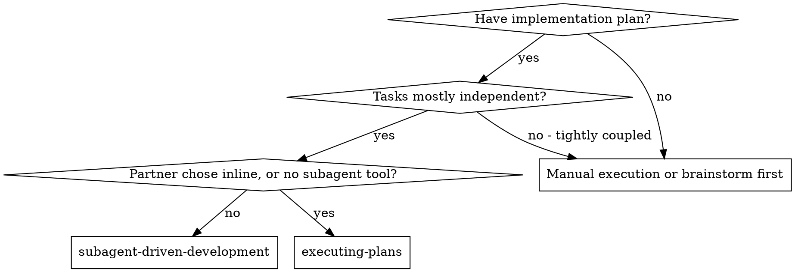
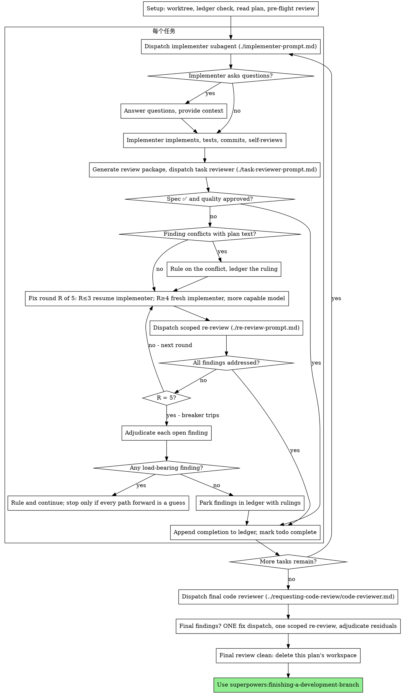

# 基于子代理的开发

通过为每个任务分派一个新的实现子代理来执行计划，在每次执行后进行任务审查（规范符合性+代码质量），并在最后进行广泛的整个分支审查。

**为什么使用子代理：** 你将任务委托给具有隔离上下文的专用代理。通过精确设计它们的指令和上下文，你确保它们保持专注并成功完成任务。它们绝不能继承你的会话的上下文或历史记录——你构建了它们需要的所有内容。这也保留了你的上下文以进行协调工作。

**核心原则：** 每个任务一个新鲜的子代理 + 任务审查（规范+质量）+ 广泛的最终审查 = 高质量，快速迭代

**叙述：** 在工具调用之间，最多叙述一行短句——账本和工具结果记录了记录。

**持续执行：** 不要在任务之间停下来与你的人类合作伙伴确认。从计划中执行所有任务，不要停止。唯一停止的原因是下面列出的四个原因，或者所有任务完成。"我应该继续吗？"提示和进度摘要浪费了他们的时间——他们让你执行计划，所以执行它。

**规则，而不是停滞。** 运行的计划不会等待人类。冲突，歧义，计划缺陷，你想要超过的限制——决定它们。规范是约束性权威，计划是其论点，你的判断解决了两者都无法回答的问题。将每个决定记录在账本中，作为`规则：<你决定的内容> — <原因> — <如果错误会付出什么代价>`，然后继续。一个错误的规则会花费你的人类合作伙伴可以看到并可以撤销的重工；一个停在问题上的会话会花费他们一整天，并且什么也得不到。

有四件事会阻止你，也只有这些：不可逆或破坏性操作；安全敏感操作；规范说你在工作树之外发生的副作用（合并，向共享分支推送，发布）；以及计划如此破旧，以至于每条前进的道路都是一个猜测。对于这些，停下来并询问。

## 使用场景



**与内联执行计划（Executing Plans）对比：**
- 每个任务一个新鲜的子代理（无上下文污染）而不是一个上下文执行每个任务
- 每个任务后进行审查（规范符合性+代码质量）而不是只在最后审查
- 每个任务和每个审查都花费一个新的上下文；内联花费一个上下文加上一个最终审查者
- 两者都在此会话中运行，共享同一个计划工作空间和账本，并且在任务之间永远不会暂停

## 流程



## 设置

确保工作在隔离的工作空间中进行：使用`superpowers:using-git-worktrees`创建一个或验证现有的工作空间。未经你的人类合作伙伴明确同意，切勿在main/master分支上开始实现。

对话内存不会在压缩后存活。在真实会话中，丢失位置的控制器重新分派了整个完成的任务序列——这是观察到的最昂贵的失败。在账本文件中跟踪进度，而不仅仅是在待办事项中。

- 每个计划拥有一个工作空间：在技能开始时，运行此技能的`bash scripts/sdd-workspace PLAN_FILE`——它打印计划的git忽略目录（在`<repo-root>/.superpowers/sdd/`下），其中包含此计划的所有工件：账本、简报、报告、审查包。另一个计划的目录永远不会是你的阅读或写入权限。
- 检查此计划的账本在`<workspace>/progress.md`。如果它的第一行命名了你的计划文件，则带有`Task <N>: complete`行的任务已完成——不要重新分派它们；从没有该行的第一个任务开始。一个最后一行是修复轮次的任务处于循环中：在下一个轮次中继续循环。一个账本的第一行命名了不同的计划文件——或者一个散乱的账本在旧的扁平路径`.superpowers/sdd/progress.md`中——是另一个计划的进度：将其保留原位并开始你自己的，新鲜的。
- 使用其身份作为第一行创建账本：`# SDD 账本 — 计划: <计划文件路径>`。
- 账本是你的恢复地图：它命名的提交存在于git中，即使你的上下文不再记得创建它们。压缩后，相信账本和`git log`而不是你自己的记忆。
- `git clean -fdx`将销毁工作空间（它是git忽略的草稿）；如果发生这种情况，从`git log`中恢复。
- 读取计划一次，注意其上下文和全局约束，并为每个任务创建一个待办事项。如果计划命名了规范，也读取它：规范是计划论证的权威，计划内部的冲突解决针对它。没有可访问的规范的计划会得到账本注释，说明这一点——没有规范的裁决是临时的。
- 在分派任务1之前，扫描计划一次以查找冲突，并写下你检查时的内容：

- 任务相互矛盾或与计划的全球约束冲突
- 计划明确要求而审查标准将其视为缺陷（一个断言什么都测试的测试，逐字复制逻辑块）

扫描的输出是一个表格，而不是一个裁决。每对共享文件或接口的任务一行：两个任务，一个产生的内容与另一个消耗的内容，以及你发现的内容。每个任务一行：它自己的文本是否同意自己——它指定的测试与它指定的代码，它创建的文件与它稍后触摸的文件。没有那些行的“扫描干净”不是一个你运行过的扫描。

将表格写入账本。在执行开始之前，裁决你发现的所有内容——每个与计划文本冲突的发现——并记录每个裁决在账本中。如果扫描干净，则无需评论继续。裁决它表面上的每个冲突——规范是约束性权威，计划是其论点——在账本旁边记录裁决，并分派任务1。审查循环仍然是冲突的网，这些冲突只有在实施中才会出现。

## 模型选择

使用能够处理每个角色的最少强大的模型来节省成本并提高速度。

**机械实现任务**（隔离函数，清晰的规范，1-2个文件）：使用一个快速、廉价的模型。当计划很好地指定时，大多数实现任务都是机械的。

**集成和判断任务**（多文件协调，模式匹配，调试）：使用标准模型。

**架构和设计任务**：使用最强大的可用模型。最终的整个分支审查是其中之一——使用最强大的可用模型，而不是会话默认值来分派它。

**审查任务**：选择具有相同判断的模型，根据差异的大小、复杂性和风险进行缩放。一个小型的机械差异不需要最强大的模型；一个微妙的并发更改需要。小修复差异的范围重审需要中端级别的模型。

**修复循环升级（第4-5轮）**：使用比卡住的实现者至少高一个级别的模型。

**始终在分派子代理时明确指定模型。** 省略模型会继承你的会话模型——通常是最大能力和最昂贵的——这会默默地击败本节。

**回合数比代币价格更重要。** 墙上时间和上下文成本随着子代理执行多少回合而变化，并且最便宜的模型通常在多步骤工作中需要2-3倍的回合数——总体成本更高。使用中端模型作为审查者和从文本描述中工作的实现者的底层。当任务的计划文本包含要写入的完整代码时，实现是转录加测试：使用最便宜的层级来实现。单文件机械修复也使用最便宜的层级。

**任务复杂性信号（实现任务）：**
- 触摸1-2个文件，有完整的规范→廉价模型
- 触摸多个文件，有集成问题→标准模型
- 需要设计判断或广泛的代码库理解→最强大的模型

## 任务循环

**批量小同形状的工作。** 当计划列出了几个任务，每个任务都是相同类型的小独立编辑时——相同的单行修复、常量更改或跨文件重复的字段添加——不要为每个任务分派一个子代理。编写一个分派简报，列出每个文件及其更改，将整个批量发送给一个子代理，并将其差异作为一个单元进行审查。为需要自己的判断、自己的测试或自己的审查表面的工作保留每个任务一个分派。

你粘贴到分派提示中的所有内容——以及子代理返回的所有内容——都保留在你的上下文中，并在会话的其余部分以及每个后续回合中重新读取。将工件作为文件传递。

**等待已分派的子代理：** 不要使用短超时轮询等待界面，也永远不要坐在一个沉默的、无限制的等待中。在你有本地工作——账本更新、打包下一个审查、阅读报告——继续工作；子结果会自行到达。当你真正空闲时，在有限的时间段内等待（五到十分钟，如果你的平台允许），并在时间段之间发布一行状态并协调你的活动子代：列出它们，并追查那些没有报告就完成的任何子代。一个有限的时间段几乎保持了长等待的效率，同时保证在几分钟内而不是在会话结束时注意到卡住或丢失的子代。

### 1. 分派实现者

在分派实现者之前记录BASE (`git rev-parse HEAD`)——审查包和修复轮次的差异需要它。

- **任务简报：** 在分派实现者之前，运行此技能的`bash scripts/task-brief PLAN_FILE N`——它将任务的完整文本提取到唯一命名的文件中，并打印路径。编写分派，使简报保持单一来源要求。你的分派应包含： (1) 一行说明此任务在项目中的位置； (2) 简报路径，作为"先读这个——它是你的要求，以及要逐字使用的确切值"； (3) 之前任务中的接口和决策，简报无法知道； (4) 你在简报中注意到的任何歧义； (5) 报告文件路径和报告合同。确切的值（数字、魔法字符串、签名、测试用例）仅出现在简报中。永远不要让子代理读取整个计划文件。
- **报告文件：** 将实现者的报告文件命名为简报（简报 `…/task-N-brief.md` → 报告 `…/task-N-report.md`），并将其放在分派提示中。实现者在那里编写完整的报告，并只返回状态、提交、一行测试摘要和关注点。
- 一个分派提示描述一个任务，而不是会话的历史记录。不要将累积的先前任务摘要（"Tasks 1-3后的状态"）粘贴到后续分派中——一个真实会话的分派命中42k个字符，其中99%是粘贴的历史记录。一个新鲜的子代理需要它的任务、它触摸的接口和全局约束。其他任何东西。
- 分派包含了无子代理合同（它在实现者模板中）：实现者永远不会分派子代理——不是助手，也永远不会审查者。审查来自你，在报告之后。在真实会话中，每个由工人spawn的审查者都重复了控制器分派的相同任务审查——每个任务一个完整的额外审查座位。
- 如果先前任务在与此任务触摸的区域中停在账本中，请在分派中携带指向该账本条目的指针。
- 从分派结果中记录实现者的代理身份——修复轮次1-3恢复此代理。
- 永远不要并行分派多个实现子代理（冲突）。

模板：[implementer-prompt.md](implementer-prompt.md)

### 2. 处理报告

实现子代理报告四种状态之一。适当地处理每种状态：

**DONE:** 生成审查包 (`bash scripts/review-package PLAN_FILE BASE HEAD`, 从此技能的目录——它打印它写入的唯一文件路径；BASE是你分派实现者之前记录的提交——永远不要`HEAD~1`，这会默默地丢弃多提交任务的所有但最后一个提交。), 然后分派任务审查者，并使用打印的路径。

**DONE_WITH_CONCERNS:** 实现者完成了工作，但标记了疑虑。在继续之前阅读疑虑。如果疑虑是关于正确性或范围，则在审查之前解决它们。如果是观察结果（例如，"这个文件正在变大"），请记录它们并继续审查。

**NEEDS_CONTEXT:** 实现者需要未提供的信息。提供缺失的上下文并重新分派。

**BLOCKED:** 实现者无法完成任务。评估阻塞器：1. 如果它是上下文问题，提供更多上下文并使用相同的模型重新分派 2. 如果任务需要更多推理，使用更强大的模型重新分派 3. 如果任务太大，将其拆分成更小的部分 4. 如果计划本身是错误的，裁决更正，记录它，并携带分派中的裁决重新分派
**永远不要**忽略升级或强制相同的模型在不更改的情况下重试。如果实现者说它卡住了，需要改变一些东西。

如果实现者提问——在开始之前或任务执行中——清楚地回答，如果需要提供额外的上下文，不要急于将其推进实现。

### 3. 审查任务

每个任务的审查都是任务范围的门。广泛的审查只发生一次，在最终的整个分支审查时。永远不要跳过任务审查，并且永远不要接受缺少任何裁决的报告——规范符合性和任务质量都是必需的。实现者自我审查永远不会取代任务审查；两者都需要。

- 将审查者的差异作为文件交给审查者：运行此技能的`bash scripts/review-package PLAN_FILE BASE HEAD`并将文件路径传递给审查者（它打印的路径）（或者，不使用bash：`git log --oneline`，`git diff --stat`，`git diff -U10`为范围，重定向到一个唯一命名的文件）。输出永远不会进入你自己的上下文，审查者看到提交列表、统计摘要和带有上下文的完整差异。使用你在分派实现者之前记录的BASE——永远不要`HEAD~1`，这会默默地截断多提交任务。永远不要在没有差异文件的情况下分派任务审查者。

**审查者输入：** 审查者得到三个路径——相同的简报文件、报告文件和审查包——加上绑定任务的全球约束。

**你交给审查者的全局约束块是其注意力透镜。** 将绑定要求从计划的“全局约束”部分或规范中逐字复制：确切的值、确切的格式以及组件之间的声明关系（"与X相同的布局"，“匹配Y"）。审查者的模板已经携带了过程规则（YAGNI，测试卫生，审查方法）——约束块用于此项目的规范要求。

不要添加开放式指令，如"检查所有使用"或"如果有用，运行竞争测试"，而没有具体的、任务特定的原因
不要要求审查者重新运行实现者已经在相同代码上运行的测试——实现者的报告携带了测试证据
不要预先判断审查者发现的发现——永远不要指示审查者忽略或不要标记特定问题。如果你认为一个发现是误报，让审查者提出它，并在审查循环中裁决它。如果你正在编写的提示包含"不要标记"、"不要将X视为缺陷"、"最多严重"、"计划选择了"——停止：你正在预先判断，通常是为了省略审查循环。

任务审查者可能会报告"⚠️ Cannot verify from diff"项目——存在于未更改的代码中的要求或跨越任务的。这些不会阻止审查的其余部分，但你必须在确认每个项目是真实差距之前解决每个项目：你持有计划，而审查者缺乏跨任务上下文。如果你确认一个项目是一个真正的差距，将其视为失败的规范审查——它进入修复循环与其他发现一起。

模板：[task-reviewer-prompt.md](task-reviewer-prompt.md)

### 4. 修复循环

当审查报告规范❌、任何关键或重要发现，或你确认的⚠️项目为真实差距时，循环触发。

循环开始之前，两条路线立即离开它：

- 在进行中记录次要发现到进度账本（`Task <N>: minor (deferred): <一行简述>`），并将最终整个分支审查指向该列表，以便它可以筛选出在合并之前必须修复的发现。一个无人阅读的汇总是一个无声的丢弃。次要发现永远不会进入循环。
- 标记为计划强制的发现——或任何与计划文本要求冲突的发现——是你的裁决对象：权衡发现与计划文本，以规范作为约束性权威做出决定，并在采取行动之前记录每个裁决在账本中。如果扫描干净，则无需评论继续。裁决它表面上的每个冲突——规范是约束性权威，计划是其论点——在账本旁边记录裁决，并分派任务1。审查循环仍然是冲突的网，这些冲突只有在实施中才会出现。

**修复轮次：** 每个修复分派加上一个范围重审。每个任务最多五个轮次：

**轮次1-3 — 恢复原始实现者。** 将打开发现逐字发送给它。它的上下文是完整的：它知道任务、代码和它自己的选择。如果你的外壳无法向活动的子代理发送另一个消息，分派一个携带简报路径、报告文件路径和发现的新的实现者——报告文件是持久记忆的。

**轮次4-5 — 分派一个更强大的模型上的新鲜实现者**（根据模型选择），带有简报路径、报告文件路径、打开的发现和此框架："先前实现者尝试此任务[N]次；你现在拥有它。阅读报告文件以了解尝试了什么。"

一个循环存活三个恢复通常意味着实现者无法看到它自己的问题——新鲜的眼睛和更高的能力在一个动作中。

**无论哪种方式，每个轮次：** 实现者修复、重新运行覆盖测试，将修复报告附加到相同的报告文件，并返回简短合同。在重新分派审查者之前，确认修复报告包含覆盖测试、运行的命令和输出；一旦所有三个都存在，就分派审查。在修复消息中命名覆盖测试文件——一个小修复不需要整个套件。

**重新审查是范围性的。** 运行`bash scripts/review-package PLAN_FILE FIX_BASE HEAD`，其中FIX_BASE是先前审查看到的头，并分派[re-review-prompt.md]与发现列表、简报、报告文件和打印的diff路径，以便重新审查者阅读一个文件而不是用git命令重新推导分支差异。使用最强大的可用模型（见模型选择），使用`superpowers:requesting-code-review`的
[code-reviewer.md](../requesting-code-review/code-reviewer.md)。将其指向账本的延迟次要和停车线，以便它可以筛选出在合并之前必须修复的发现。

**每个轮次之后，** 附加到账本：
`Task <N>: fix round <R>/5 (<X> addressed, <Y> open — <发现一行；提交 <a7>..<b7>)`

永远不要在控制器会话中自己修复发现——你的上下文保持干净以进行协调，控制器修复会跳过审查。

**破坏者。** 当轮次5的重新审查仍然留下打开的发现时，停止分派。你自己裁决每个打开的发现——你持有计划，而审查者缺乏审查者缺乏的跨任务上下文：

- **审查者错了，或者这一点是可争议的：** 停止它——
  `Task <N>: parked — <发现> — Ruling: <为什么代码仍然有效>`。最终的审查会看到双方。
- **真实，但没有任何下游构建在其上：** 以相同的方式停车，带有说明它真实且被延后的裁决。
- **真实且承载重量**——一个后续任务构建在其上，或者它揭示了一个计划缺陷：裁决能够解锁依赖工作的最小更改，记录裁决为`Task <N>: Ruling: <发现> — <你决定的内容和原因>`，并将其带入下一个任务的分派。停车结构性失败会无声地让每个依赖任务构建在其上。只有在缺陷让每条前进的道路都成为猜测时才停止。

仅在此上限处裁决。提前裁决以结束循环是使用不同名称的预先判断。每个裁决都是账本条目——一个无声的丢弃是禁止的。

###  **完成任务**

当审查返回干净——或者每个打开的发现都在上限处停车并裁决——在相同消息中附加完成行到账本中，作为你的其他簿记：

- `Task <N>: complete (commits <base7>..<head7>, review clean)`
- `Task <N>: complete (commits <base7>..<head7>, <K> parked)`在触发破坏者之后

然后标记待办事项完成并继续。在审查有未解决的关键/重要问题既未修复也未在上限处裁决时，永远不要转移到下一个任务。

## 最终审查

最终的整个分支审查也得到一个包：运行
`bash scripts/review-package PLAN_FILE MERGE_BASE HEAD` (MERGE_BASE = 分支开始的提交，例如 `git merge-base main HEAD`)，并将打印的路径包含在最终审查分派中，以便最终审查者阅读一个文件而不是重新推导分支差异。使用最强大的可用模型（见模型选择），使用
`superpowers:requesting-code-review`的
[code-reviewer.md](../requesting-code-review/code-reviewer.md)。指向账本的延迟次要和停车线，以便它可以筛选出在合并之前必须修复的发现。

如果最终整个分支审查返回发现，分派一个修复子代理，带有完整的发现列表——不是每个修复者一个修复。每个修复者重建上下文并重新运行套件；一个真实会话的最终审查修复浪潮的成本超过了所有任务的总和。然后运行恰好一个范围重审的修复浪潮
(`bash scripts/review-package PLAN_FILE FIX_BASE HEAD` over the fix range,
[re-review-prompt.md](re-review-prompt.md)).
像任务循环中的破坏者一样裁决任何残留发现：停车带有裁决，或者裁决承载重量的发现并记录你决定的内容。这里有四个原因会阻止你。没有第二个修复浪潮——残留的承载重量发现会在完成`finishing-a-development-branch`呈现选项时向你的人类合作伙伴显示。

## 完成

在你删除任何东西之前，将包含`Ruling:`的每个账本行——预飞行裁决、停车发现、破坏者裁决，所有这些——收集到你的最终消息下"我做出的裁决"，按你做出的顺序，每个都有如果错误会付出什么代价。列表是详尽的：如果账本包含一个裁决，列表就包含它。这是唯一能让你的人类合作伙伴看到你为你做出的决定的地方——他们阅读它并重新工作你弄错的内容。一个在 workspace中死亡的裁决是一个秘密做出的决定。

当最终的整个分支审查干净且其修复已合并时，删除此计划的 workspace (`rm -rf <workspace>`)——历史记录现在是记录。兄弟目录属于其他计划；留下它们。

使用`superpowers:finishing-a-development-branch`。

## 常见理由

|借口|现实|
|---|---|
|“规范符合性差不多”|审查者发现了规范差距=未完成。修复或触发上限并裁决——那是唯一的出口。|
|“我自己修复，分派是开销”|控制器修复会污染你的上下文并跳过审查。恢复实现者。|
|“再多一轮就会收敛”|超过上限后，轮次不会收敛——失败是结构性的。裁决并路由。|
|“审查者会找到新东西”|范围重审验证修复；它们不能漫游。未触及代码的新发现进入账本，而不是循环。|
|“这个发现显然是错误的，我会丢弃它”|你仅在上限处裁决，并且每个裁决都是账本条目。禁止无声丢弃。|
|“修复很小，跳过重新审查”|未审查的修复是回归的来源。每个轮次都以一个范围重审结束。|
|“审查减慢了循环”|没有审查的循环只是未经验证的混乱。审查是循环的刹车和转向。|
|“账本簿记是开销”|账本是压缩后存活的。没有账本的控制器重新分派了整个完成的任务序列。|
|“实现者生成了自己的审查者——免费的额外保证”|这是一个重复审查相同差异的工人审查者；任务审查是门。一个工人spawn的审查者是缺陷，而不是严谨。|

## 示例工作流程

```
你：我正在使用基于子代理的开发来执行此计划。

[设置：工作树已验证]
[读取计划文件一次：docs/superpowers/plans/feature-plan.md]
[解析工作空间：bash scripts/sdd-workspace docs/superpowers/plans/feature-plan.md — 没有账本内部，重新开始]
[为所有任务创建待办事项]

任务 1：安装脚本钩子

[为任务 1 运行任务简报；分派实现者，附带简报+报告路径+上下文]

实现者："在我开始之前 - 钩子应该安装在用户还是系统级别?"

你："用户级别 (~/.config/superpowers/hooks/)

实现者：[稍后]
  - 实现了 install-hook 命令
  - 添加了测试，5/5 通过
  - 自我审查：我发现我错过了 --force 标志，我添加了它
  - 提交

[运行审查包 (`bash scripts/review-package PLAN_FILE BASE HEAD`; 分派任务审查者，并使用打印的路径]
任务审查者：规范 ✅ - 所有要求都得到满足，没有多余的东西。
  优势：良好的测试覆盖率，干净。问题：无。任务质量：批准。

[账本：任务 1: complete (commits a1b2c3d..d4e5f6a, review clean)]

任务 2：恢复模式

[为任务 2 运行任务简报；分派实现者，附带简报+报告路径+上下文]

实现者：[没有问题]
  - 添加了 verify/repair 模式
  - 8/8 测试通过
  - 提交

[运行审查包 (`bash scripts/review-package PLAN_FILE BASE HEAD`; 分派任务审查者，并使用打印的路径]
任务审查者：规范 ❌:
  - 缺失：进度报告（规范说"每100个项目报告一次"）
  问题 (重要)：魔法数字 (100)

[修复轮次 1：恢复实现者，带有两个发现]
实现者：添加了进度报告，提取 PROGRESS_INTERVAL 常量。
  重新运行测试/recovery.test.js — 10/10 通过。修复报告附加。

[运行审查包 (`bash scripts/review-package PLAN_FILE FIX_BASE HEAD`; 分派范围重新审查]
重新审查者：缺少进度报告 — ADDRESSED (src/recovery.js:41).
  魔法数字 — ADDRESSED (src/recovery.js:7). 新破坏：无。
  裁决：所有发现已解决。

[账本：任务 2: fix round 1/5 (2 addressed, 0 open; commits d4e5f6a..b7c8d9e]
[账本：任务 2: complete (commits d4e5f6a..b7c8d9e, review clean)]

...

[所有任务完成后]
[运行审查包 (`bash scripts/review-package PLAN_FILE MERGE_BASE HEAD`; 分派最终代码审查者，最强大的模型]
最终审查者：所有要求都得到满足。延迟次要发现筛选：没有阻止合并的。

[删除此计划的 workspace — 记录现在存在于git中]

完成！使用`superpowers:finishing-a-development-branch`.
```
