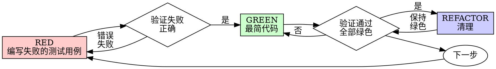

# 测试驱动开发 (TDD)

## 概述

先写测试用例。观察它失败。编写最少的代码使其通过。

**核心原则：** 如果你没有观察到测试用例失败，你就不知道它是否测试了正确的内容。

**违反规则的字面意义就是违反规则的精髓。**

## 何时使用

**始终：**
- 新功能
- 修复错误
- 重构
- 行为变更

**例外（询问你的合作者）：**
- 一次性原型
- 生成的代码
- 配置文件

思考“这次就跳过TDD”？停止。那是合理化。

## 铁律

```
没有失败的测试用例，不生成生产代码
```

在测试用例之前编写代码？删除它。重新开始。

**没有例外：**
- 不要保留它作为“参考”
- 不要在编写测试用例时“调整”它
- 不要查看它
- 删除就是删除

从测试用例开始实施。无论如何。

## 红绿重构



### RED - 编写失败的测试用例

编写一个最简测试用例，展示应该发生什么。

<良好>
```typescript
test('重试失败的运算3次', async () => {
  let 尝试次数 = 0;
  const 运算 = () => {
    尝试次数++;
    if (尝试次数 < 3) throw new Error('失败');
    return '成功';
  };

  const 结果 = await retryOperation(运算);

  expect(结果).toBe('成功');
  expect(尝试次数).toBe(3);
});
```
清晰的名称，测试实际行为，一件事情
</良好>

<不良>
```typescript
test('重试工作', async () => {
  const mock = jest.fn()
    .mockRejectedValueOnce(new Error())
    .mockRejectedValueOnce(new Error())
    .mockResolvedValueOnce('成功');
  await retryOperation(mock);
  expect(mock).toHaveBeenCalledTimes(3);
});
```
模糊的名称，测试模拟代码而不是实际代码
</不良>

**要求：**
- 一个行为
- 清晰的名称
- 实际代码（除非不可避免地使用模拟）

### Verify RED - 观察它失败

**强制执行。永远不要跳过。**

```bash
npm test path/to/test.test.ts
```

确认：
- 测试失败（不是错误）
- 错误信息是预期的
- 失败是因为功能缺失（而不是拼写错误）

**测试通过？** 你正在测试现有行为。修复测试。

**测试出错？** 修复错误，重新运行直到它正确失败。

### GREEN - 最简代码

编写最简单的代码通过测试。

<良好>
```typescript
async function retryOperation<T>(fn: () => Promise<T>): Promise<T> {
  for (let i = 0; i < 3; i++) {
    try {
      return await fn();
    } catch (e) {
      if (i === 2) throw e;
    }
  }
  throw new Error('无法到达');
}
```
刚好足够通过
</良好>

<不良>
```typescript
async function retryOperation<T>(
  fn: () => Promise<T>,
  options?: {
    maxRetries?: number;
    backoff?: 'linear' | 'exponential';
    onRetry?: (尝试次数: number) => void;
  }
): Promise<T> {
  // YAGNI
}
```
过度设计
</不良>

不要添加功能，重构其他代码，或“改进”超出测试范围。

### Verify GREEN - 观察它通过

**强制执行。**

```bash
npm test path/to/test.test.ts
```

确认：
- 测试通过
- 其他测试仍然通过
- 输出纯净（没有错误，警告）

**测试失败？** 修复代码，而不是测试。

**其他测试失败？** 立即修复。

**“其他测试”是指项目的套件，而不仅仅是你的文件。** 你编写的测试的绿色运行并不是一个绿色的套件。在你称改变完成之前，即使你的任务只命名了一个测试文件，也要运行项目的测试命令（裸 `pytest`，`npm test`，`cargo test`——无论仓库使用什么）。“其他测试”是指项目的套件，而不仅仅是你的文件。一个绿色的测试运行并不是一个绿色的套件。在称改变完成之前，即使你的任务只命名了一个测试文件，也要运行项目的测试命令（裸 `pytest`，`npm test`，`cargo test`——无论仓库使用什么）。一个范围声明在你的任务中界定可交付成果，而不是你的验证。任何运行显示的失败——包括一个你没有造成的失败——都应按名称报告；一个你观察到的红色测试滚动过去而没有提及的测试是遗漏导致的报告虚假。

### REFACTOR - 清理

只有在绿色之后：
- 移除重复
- 改进名称
- 提取辅助函数

保持测试绿色。不要添加行为。

### 重复

下一个失败的测试用例用于下一个功能。

## 良好测试

| 质量 | 良好 | 不良 |
|------|------|------|
| **最小化** | 一件事。名称中有“和”？拆分它。 | `test('验证电子邮件和域名和空白')` |
| **清晰** | 名称描述行为 | `test('test1')` |
| **展示意图** | 演示期望的API | 遮蔽代码应该做什么 |

在编写或更改任何测试时，阅读 [writing-good-tests.md](writing-good-tests.md) 以保持测试诚实：
- 名称生产更改会导致测试失败——在编写它之前
- 基于实际行为断言，而不是模拟行为
- 将测试专用代码保留在测试工具中，而不是生产类中
- 在模拟依赖项之前理解其副作用

## 常见合理化

| 托词 | 现实 |
|------|------|
| “太简单，不需要测试” | 简单代码会出错。测试只需30秒。 |
| “我会在之后测试” | 测试在之后立即通过——这证明了什么。它们可能测试了错误的内容，测试了实现而不是行为，或者遗漏了你忘记的边缘情况。你从未观察过它失败，所以你从未证明它能捕获错误。测试首先强迫失败。 |
| “测试之后达到相同目标（精神而非仪式）” | 测试之后回答“这个做什么？”；测试首先回答“这个应该做什么？”。在之后编写的测试受到你已经编写的代码的影响——你验证了你记住的情况，而不是你可能会发现的情况。没有证明测试工作的覆盖率。 |
| “已经手动测试” | 手动测试是临时的：没有记录你覆盖的内容，没有方法在代码更改时重新运行它，在压力下容易忘记情况。“我试过它时工作”——不等于全面。自动测试每次都以相同的方式运行。 |
| “删除X小时是浪费” | 沉没成本谬误——无论哪种方式，时间已经花费。真正的选择：使用TDD重写（高信心）与之后添加测试（低信心，可能存在错误）保持它。保持你无法信任的代码是浪费。 |
| “保留作为参考，首先编写测试” | 你会调整它。那是之后测试。删除意味着删除。 |
| “需要先探索” | 好。扔掉探索，开始使用TDD。 |
| “测试困难=设计不明确” | 听从测试。测试困难=使用困难。 |
| “TDD会减慢我的速度” | TDD是务实的路径：在提交前捕获错误，防止回归，让你在没有恐惧的情况下重构。务实的捷径意味着在生产中调试——更慢，不是更快。 |
| “手动测试更快” | 手动测试不能证明边缘情况。你会重新测试每个更改。 |
| “现有代码没有测试” | 你正在改进它。为现有代码添加测试。 |

## 红旗 - 停止并重新开始

- 测试用例之前有代码
- 实现之后有测试用例
- 测试用例立即通过
- 无法解释为什么测试用例失败
- 测试用例“之后”添加
- 合理化“就这一次”
- “我已经手动测试了它”
- “测试之后达到相同目的”
- “精神而非仪式”
- “保留作为参考”或“调整现有代码”
- “已经花费X小时，删除是浪费”
- “TDD是教条，我正在务实地做”
- “这不同，因为...”

**所有这些意味着：删除代码。使用TDD重新开始。**

## 示例：修复错误

**错误：** 接受空电子邮件

**RED**
```typescript
test('拒绝空电子邮件', async () => {
  const 结果 = await submitForm({ email: '' });
  expect(结果.error).toBe('电子邮件必需');
});
```

**Verify RED**
```bash
$ npm test
FAIL: expected '电子邮件必需', got undefined
```

**GREEN**
```typescript
function submitForm(data: FormData) {
  if (!data.email?.trim()) {
    return { error: '电子邮件必需' };
  }
  // ...
}
```

**Verify GREEN**
```bash
$ npm test
PASS
```

**REFACTOR**
如果需要，提取多个字段的验证。

## 验证清单

在标记工作完成之前：

- [ ] 每个新的函数/方法都有一个测试用例
- [ ] 在实现之前观察每个测试用例失败
- [ ] 每个测试用例都因预期原因失败（功能缺失，不是拼写错误）
- [ ] 为每个测试用例编写最少的代码通过
- [ ] 所有测试用例都通过
- [ ] 输出纯净（没有错误，警告）
- [ ] 测试用例使用实际代码（模拟只有在不可避免时才使用）
- [ ] 边缘情况和错误得到覆盖

无法检查所有框？你跳过了TDD。重新开始。

## 遇到困难时

| 问题 | 解决方案 |
|------|----------|
| 不知道如何测试 | 编写期望的API。首先编写断言。询问你的合作者。 |
| 测试太复杂 | 设计太复杂。简化接口。 |
| 必须模拟所有内容 | 代码耦合太强。使用依赖注入。 |
| 测试设置太大 | 提取辅助函数。仍然复杂？简化设计。 |

## 集成调试

发现错误？编写失败的测试用例重现它。遵循TDD循环。测试证明了修复并防止了回归。

永远不要在没有测试的情况下修复错误。

## 最终规则

```
生产代码→测试用例存在且首先失败
否则→不是TDD
```

没有你的合作者的许可，没有例外。
