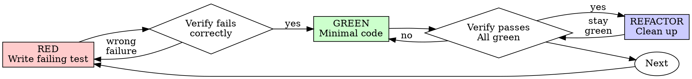

# 测试驱动开发（TDD）

## 概述

先编写测试。观察测试失败。编写最简代码使其通过。

**核心原则：** 如果你没有观察测试失败，你就不知道它是否在测试正确的功能。

**严守规则的条文，就是违背规则的精神。**

## 何时使用

**总是：**
- 新功能
- 修复 Bug
- 重构
- 行为变更

**例外情况（需咨询你的人类伙伴）：**
- 临时原型
- 生成的代码
- 配置文件

思考“这次只是跳过 TDD”？停止。这是找借口。

## 铁律

```
NO PRODUCTION CODE WITHOUT A FAILING TEST FIRST
```

测试之前编写代码？删除，重新开始。

**无例外：**
- 不能将其作为“参考”保留
- 编写测试时不能“适配”它
- 不能查看它
- 删除即删除

从测试重新实现。一律如此。

## 红-绿-重构



### RED - 编写失败测试

编写一个极简的测试，展示期望发生的行为。

<Good>
```typescript
test('retries failed operations 3 times', async () => {
  let attempts = 0;
  const operation = () => {
    attempts++;
    if (attempts < 3) throw new Error('fail');
    return 'success';
  };

  const result = await retryOperation(operation);

  expect(result).toBe('success');
  expect(attempts).toBe(3);
});
```
命名清晰，测试真实行为，只测试一件事
</Good>

<Bad>
```typescript
test('retry works', async () => {
  const mock = jest.fn()
    .mockRejectedValueOnce(new Error())
    .mockRejectedValueOnce(new Error())
    .mockResolvedValueOnce('success');
  await retryOperation(mock);
  expect(mock).toHaveBeenCalledTimes(3);
});
```
命名模糊，测试的是 mock 而非代码
</Bad>

**要求：**
- 测试单一行为
- 命名清晰
- 使用真实代码（除非不可避免，否则不使用 mock）

### 验证 RED - 观察测试失败

**强制性。绝不跳过。**

```bash
npm test path/to/test.test.ts
```

确认：
- 测试失败（而非报错）
- 失败信息符合预期
- 因功能缺失而失败（而非因拼写错误）

**测试通过？** 说明你测试的是已有行为。请修正测试。

**测试报错？** 修复报错，重新运行直至正确失败。

### GREEN - 最小代码

编写最简单的代码使其通过测试。

<Good>
```typescript
async function retryOperation<T>(fn: () => Promise<T>): Promise<T> {
  for (let i = 0; i < 3; i++) {
    try {
      return await fn();
    } catch (e) {
      if (i === 2) throw e;
    }
  }
  throw new Error('unreachable');
}
```
刚好足够通过测试
</Good>

<Bad>
```typescript
async function retryOperation<T>(
  fn: () => Promise<T>,
  options?: {
    maxRetries?: number;
    backoff?: 'linear' | 'exponential';
    onRetry?: (attempt: number) => void;
  }
): Promise<T> {
  // YAGNI
}
```
过度设计
</Bad>

不要添加功能，不要重构其他代码，也不要在测试之外“改进”代码。

### 验证 GREEN - 观察测试通过

**强制性。**

```bash
npm test path/to/test.test.ts
```

确认：
- 测试通过
- 其他测试仍通过
- 输出纯净（无错误、警告）

**测试失败？** 请修正代码，而非测试。

**其他测试失败？** 立即修正。

**“其他测试”指的是整个项目的测试套件，而非仅你所在的单个文件。**
你编写测试的运行结果为绿色，并不等于整个测试套件通过。在认为变更已完成之前，请运行项目的测试命令（如裸用的 `pytest`、`npm test`、`cargo test`，具体以仓库实际使用为准），即使任务仅指定了一个测试文件。任务中的范围说明限定了交付成果，而非你的验证范围。该运行中出现的任何失败——包括你非因自身原因导致的失败——都必须在报告中以具体名称说明；若在观察测试通过时跳过并未提及某一失败的红色测试，则属于通过遗漏伪造了报告。

### REFACTOR - 清理优化

仅在测试通过之后：
- 消除重复
- 优化命名
- 提取辅助函数

保持测试通过。不要添加行为。

### 重复

为下一个功能编写下一个失败的测试。

## 优秀的测试

| 质量 | 优秀 | 不良 |
|---------|------|-----|
| **最小化** | 只测试一件事。名称中出现“and”？需拆分。 | `test('validates email and domain and whitespace')` |
| **清晰** | 名称描述了行为 | `test('test1')` |
| **体现意图** | 展示了期望的接口 | 掩盖了代码应完成的工作 |

当编写或修改任何测试时，请阅读 [writing-good-tests.md](writing-good-tests.md) 以获取保持测试真实的规则：
- 在编写代码之前，明确会导致该测试失败的生产代码变更

- 断言真实行为，切勿断言 mock 行为
- 将仅用于测试的代码放在测试工具中，而非生产类中
- 在 mock 依赖之前，先理解其副作用

## 常见找借口

| 找借口 | 实际情况 |
|--------|---------|
| “过于简单无法测试” | “过于简单无法测试”。简单的代码容易出问题。测试仅需 30 秒。 |
| “编写完后再测试” | “编写完后再测试”。编写完后的测试会立即通过——这无法证明任何内容。它们可能测试了错误的功能，测试了实现而非行为，或者遗漏了你忘记的边界情况。你从未观察其失败，因此从未证明它能捕获该 Bug。先编写测试的方式能强制产生这种失败。 |
| “编写测试后达成相同目标（注重精神而非形式）” | “编写测试后达成相同目标（注重精神而非形式）”。编写测试后回答“这做了什么？”；先编写测试回答“这应该做什么？”。编写测试后的测试会受到已编写代码的影响——你验证的是自己记得的情况，而非本会发现的情况。覆盖率缺乏测试有效的证明。 |
| “已经手动测试过” | “已经手动测试过”。手动测试具有随机性：没有覆盖内容的记录，代码变更时无法重新运行，压力下容易遗漏情况。“我试过就能用”不等于全面。自动测试每次运行方式一致。 |
| “删除 X 小时是浪费的” | “删除 X 小时是浪费的”。沉没成本谬误——无论哪种情况，那段时间都已经花费了。真正的选择：用 TDD 重写（高置信度）vs. 保留代码并在之后补充测试（低置信度，可能存在 Bug）。保留无法信任的代码才是浪费。 |
| “保留作为参考，先编写测试” | “保留作为参考，先编写测试”。你之后会去适配它。那属于编写测试后。删除即删除。 |
| “需要先探索” | “需要先探索”。可以。舍弃探索过程，直接以 TDD 开始。 |
| “测试困难意味着设计不明确” | “测试困难意味着设计不明确”。倾听测试的反馈。难以测试的代码，难以使用。 |
| “TDD 会拖慢我” | “TDD 会拖慢我”。TDD 才是务实的路径：在提交前发现 Bug，防止回归，让你无惧重构。“务实的”捷径意味着在生产环境中调试——更慢，而非更快。 |
| “手动测试更快” | “手动测试更快”。手动测试无法证明边界情况。你每次改动都需要重新测试。 |
| “已有代码没有测试” | “已有代码没有测试”。你正在改进它。为已有代码添加测试。 |

## 红色警示 - 停止并重新开始

- 测试之前的代码
- 实现后的测试
- 测试立即通过
- 无法解释测试失败的原因
- “稍后”添加的测试
- 找借口称“这次只是如此”
- “我已经手动测试过”
- “编写测试后达成相同目的”
- “注重精神而非形式”
- “保留作为参考”或“适配已有代码”
- “已花费 X 小时，删除是浪费的”
- “TDD 是教条，我在务实处理”
- “这是因为...”

**所有这些情况意味着：删除代码。以 TDD 重新开始。**

## 示例：修复 Bug

**Bug：** 接受空的邮箱

**RED**
```typescript
test('rejects empty email', async () => {
  const result = await submitForm({ email: '' });
  expect(result.error).toBe('Email required');
});
```

**验证 RED**
```bash
$ npm test
FAIL: expected 'Email required', got undefined
```

**GREEN**
```typescript
function submitForm(data: FormData) {
  if (!data.email?.trim()) {
    return { error: 'Email required' };
  }
  // ...
}
```

**验证 GREEN**
```bash
$ npm test
PASS
```

**REFACTOR**
提取多个字段的校验逻辑，如有需要。

## 验证清单

在标记工作完成之前：

- [ ] 每个新函数/方法都有测试
- [ ] 在实现每个测试之前，已观察其失败
- [ ] 每个测试因预期原因（功能缺失，而非拼写错误）失败
- [ ] 编写了最小代码以通过每个测试
- [ ] 所有测试通过
- [ ] 输出纯净（无错误、警告）
- [ ] 测试使用真实代码（除非不可避免，否则不使用 mock）
- [ ] 覆盖边界情况和错误处理

无法核对所有项？说明你跳过了 TDD。重新开始。

## 遇到困境时

| 问题 | 解决方案 |
|---------|----------|
| 不知道如何测试 | 编写期望的接口。先编写断言。咨询你的人类伙伴。 |
| 测试过于复杂 | 设计过于复杂。简化接口。 |
| 必须 mock 所有内容 | 代码耦合过度。使用依赖注入。 |
| 测试设置过大 | 提取辅助函数。仍然复杂？简化设计。 |

## 调试集成

发现 Bug？编写失败测试以复现该问题。遵循 TDD 循环。测试证明修复有效并防止回归。

绝不没有测试就修复 Bug。

## 最终规则

```
Production code → test exists and failed first
Otherwise → not TDD
```

未经人类伙伴许可，无例外情况。
