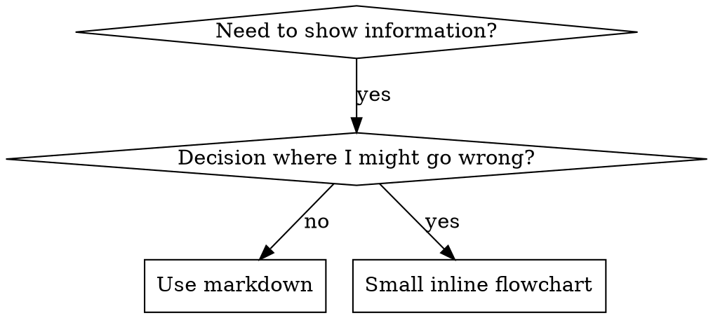

# 写作技巧

## 概述

**写作技巧就是将测试驱动开发应用于流程文档。**

**个人技能存在于你的运行时技能目录**（在 Claude Code 上是 `~/.claude/skills/`）——有关这些运行时上的路径，请参阅 [codex-tools.md](../using-superpowers/references/codex-tools.md) 或 [gemini-tools.md](../using-superpowers/references/gemini-tools.md)。Codex、Copilot CLI 和 Gemini CLI 也都识别 `~/.agents/skills/` 作为跨运行时别名。

你编写测试用例（使用子代理的压力场景），观察它们失败（基线行为），编写技能（文档），观察测试通过（代理遵守），然后重构（关闭漏洞）。

**核心原则：**如果你没有在缺少技能的情况下观察代理失败，你就不知道这个技能是否教会了正确的事情。

**必需背景：**在使用此技能之前，你必须理解 superpowers:test-driven-development。该技能定义了基本的 RED-GREEN-REFACTOR 循环。此技能将 TDD 应用于文档。

**官方指南：**有关 Anthropic 的官方技能创作最佳实践，请参阅 anthropic-best-practices.md。本文档提供了其他模式和指南，以补充此技能中 TDD 聚焦的方法。

## 技能是什么？

**技能**是经过验证的技术、模式或工具的参考指南。技能帮助未来的代理找到并应用有效的方法。

**技能是：**可重用的技术、模式、工具、参考指南

**技能不是：**关于你如何解决一次问题的叙述

## 技能的 TDD 映射

| TDD 概念 | 技能创建 |
|-------------|----------------|
| **测试用例** | 使用子代理的压力场景 |
| **生产代码** | 技能文档 (SKILL.md) |
| **测试失败 (RED)** | 代理在缺少技能的情况下违反规则（基线） |
| **测试通过 (GREEN)** | 技能存在时代理遵守 |
| **重构** | 在保持合规性的同时关闭漏洞 |
| **先编写测试** | 在编写技能之前运行基线场景 |
| **观察它失败** | 记录代理使用的确切推理 |
| **最小代码** | 编写解决这些特定违规的技能 |
| **观察它通过** | 验证代理现在遵守 |
| **重构循环** | 找到新的推理 → 插入 → 重新验证 |

整个技能创建过程遵循 RED-GREEN-REFACTOR。

## 何时创建技能

**创建条件：**
- 技巧对你来说不是直观的
- 你会在跨项目再次引用此内容
- 模式具有广泛的适用性（不是项目特定的）
- 他人会从中受益

**不创建条件：**
- 一次性解决方案
- 标准做法已在其他地方得到充分记录
- 项目特定的约定（放入你的指令文件）
- 机械约束（如果可以通过正则表达式/验证来执行，请自动化它——保留文档用于判断）

## 技能类型

### 技术
具有可遵循步骤的具体方法（基于条件的等待、根本原因追踪）

### 模式
思考问题的方法（使用标志扁平化、测试不变量）

### 参考
API 文档、语法指南、工具文档（办公文档）

## 目录结构


```
skills/
  skill-name/
    SKILL.md              # 主要参考（必需）
    supporting-file.*     # 只需在需要时
```

**扁平命名空间** - 所有技能在一个可搜索的命名空间中

**分离文件：**
1. **重参考**（100+ 行） - API 文档、综合语法
2. **可重用工具** - 脚本、实用程序、模板

**保留内联：**
- 原则和概念
- 代码模式（< 50 行）
- 其他所有内容

## SKILL.md 结构

**前文（YAML）：**
- 两个必需字段：`name` 和 `description`（有关所有支持字段的详细信息，请参阅 [agentskills.io/specification](https://agentskills.io/specification)）
- 总计最大 1024 个字符
- `name`：仅使用字母、数字和连字符（不允许括号、特殊字符）
- `description`：第三人称，仅描述何时使用（不描述做什么）
  - 以 "Use when..." 开头，以关注触发条件
  - 包括具体症状、情况和上下文
  - **永远不要总结技能的过程或工作流程**（有关原因，请参阅 SDO 部分）
  - 尽可能保持在 500 个字符以内

```markdown
---
name: Skill-Name-With-Hyphens
description: Use when [specific triggering conditions and symptoms]
---

# Skill Name

## 概述
这是什么？用 1-2 句话说明核心原则。

## 何时使用
[如果决策不明显，则使用小型内联流程图]

使用症状和用例的要点列表
何时不用

## 核心模式（用于技术和模式）
前后代码比较

## 快速参考
用于扫描常见操作的表格或要点

## 实现
用于简单模式的内联代码
链接到文件以用于重参考或可重用工具

## 常见错误
出错原因及修复方法

## 真实世界影响（可选）
具体结果
```

## 技能发现优化 (SDO)

**对发现至关重要：**未来的代理需要找到你的技能

### 1. 丰富的描述字段

**目的：**你的代理会阅读描述来决定为给定任务加载哪些技能。让它回答："我现在应该阅读这个技能吗？"

**格式：**以 "Use when..." 开头，以关注触发条件

**关键：**描述 = 何时使用，不是技能做什么

描述应仅描述触发条件。不要在描述中总结技能的过程或工作流程。

**为什么这很重要：**测试显示，当描述总结技能的工作流程时，代理可能会遵循描述而不是阅读完整的技能内容。一条说 "任务之间的代码审查" 的描述导致代理执行了一次审查，即使技能的流程图清楚地显示了两次审查（规范合规性然后代码质量）。

当描述更改为仅 "在当前会话中执行实现计划时使用"（没有工作流程总结）时，代理正确地阅读了流程图并遵循了两个阶段的审查过程。

**陷阱：**总结工作流程的描述会为代理创建一个捷径。技能正文变成了代理跳过的文档。

```yaml
# ❌ BAD：总结工作流程 - 代理可能会遵循此内容而不是阅读技能
description: Use when executing plans - dispatches subagent per task with code review between tasks

# ❌ BAD：过多的过程细节
description: Use for TDD - write test first, watch it fail, write minimal code, refactor

# ✅ GOOD：仅触发条件，没有工作流程总结
description: Use when executing implementation plans with independent tasks in the current session

# ✅ GOOD：仅触发条件
description: Use when implementing any feature or bugfix, before writing implementation code
```

**内容：**
- 使用具体的触发器、症状和情况，表明此技能适用
- 描述问题（竞争条件、行为不一致），而不是特定语言的症状（setTimeout、sleep）
- 除非技能本身是特定技术的，否则保持触发器与技术无关
- 如果技能是特定技术的，请在触发器中明确说明
- 使用第三人称（注入到系统提示中）
- **永远不要总结技能的过程或工作流程**

```yaml
# ❌ BAD：太抽象、模糊，不包含何时使用
description: For async testing

# ❌ BAD：第一人称
description: I can help you with async tests when they're flaky

# ❌ BAD：提及技术，但技能不是特定于它的
description: Use when tests use setTimeout/sleep and are flaky

# ✅ GOOD：以 "Use when" 开头，描述问题，没有工作流程
description: Use when tests have race conditions, timing dependencies, or pass/fail inconsistently

# ✅ GOOD：特定于技术的技能，具有明确的触发器
description: Use when using React Router and handling authentication redirects
```

### 2. 关键词覆盖

使用代理会搜索的词语：
- 错误消息："Hook timed out"、"ENOTEMPTY"、"race condition"
- 症状："flaky"、"hanging"、"zombie"、"pollution"
- 同义词："timeout/hang/freeze"、"cleanup/teardown/afterEach"
- 工具：实际命令、库名称、文件类型

### 3. 描述性命名

**使用主动语态，动词优先：**
- ✅ `creating-skills` 而不是 `skill-creation`
- ✅ `condition-based-waiting` 而不是 `async-test-helpers`

### 4. 令牌效率（关键）

**问题：**入门技能和频繁引用的技能会加载到每个对话中。每个令牌都很重要。

**目标字数：**
- 入门工作流：每个 <150 字
- 频繁加载的技能：总计 <200 字
- 其他技能：<500 字（仍然要简洁）

**技术：**

**将详细信息移至工具帮助：**
```bash
# ❌ BAD：在 SKILL.md 中记录所有标志
search-conversations supports --text、--both、--after DATE、--before DATE、--limit N

# ✅ GOOD：参考 --help
search-conversations 支持多种模式和过滤器。运行 --help 获取详细信息。
```

**使用交叉引用：**
```markdown
# ❌ BAD：重复工作流程细节
搜索时，使用模板分派子代理...
[20 行重复的说明]

# ✅ GOOD：引用其他技能
始终使用子代理（50-100 倍的上下文节省）。必需：使用 [other-skill-name] 进行工作流程。
```

**压缩示例：**
```markdown
# ❌ BAD：冗长的示例（42 个字）
你的人类合作伙伴："我们之前如何在 React Router 中处理身份验证错误？"
你：我会搜索过去的对话中 React Router 身份验证模式。
[分派子代理，搜索查询："React Router 身份验证错误处理 401"]

# ✅ GOOD：最小示例（20 个字）
合作伙伴："我们如何在 React Router 中处理身份验证错误？"
你：搜索中...
[分派子代理 → 综合]
```

**消除冗余：**
- 不要重复交叉引用技能中的内容
- 不要解释从命令中显而易见的内容
- 不要包含多个相同模式的示例

**验证：**
```bash
wc -w skills/path/SKILL.md
# getting-started workflows: 目标是每个 <150
# 其他频繁加载的：目标是总计 <200
```

**按你做什么或核心洞察命名：**
- ✅ `condition-based-waiting` > `async-test-helpers`
- ✅ `using-skills` 而不是 `skill-usage`
- ✅ `flatten-with-flags` > `data-structure-refactoring`
- ✅ `root-cause-tracing` > `debugging-techniques`

**动名词（-ing）适用于过程：**
- `creating-skills`、`testing-skills`、`debugging-with-logs`
- 主动的，描述你正在采取的行动

### 5. 交叉引用其他技能

**在编写引用其他技能的文档时：**

仅使用技能名称，并带有明确的要求标记：
- ✅ 好：`**必需子技能：** 使用 superpowers:test-driven-development`
- ✅ 好：`**必需背景：** 你必须理解 superpowers:systematic-debugging`
- ❌ 坏：`See skills/testing/test-driven-development`（不明确是否必需）
- ❌ 坏：`@skills/testing/test-driven-development/SKILL.md`（强制加载，消耗 200k+ 上下文）

**为什么没有 @ 链接：**`@` 语法立即强制加载文件，在需要它们之前消耗 200k+ 上下文。

## 流程图使用



**仅用于：**
- 非明显的决策点
- 过程循环，你可能会过早停止
- "使用 A 与使用 B 的决策" 决策

**永远不要用于：**
- 参考材料 → 表格、列表
- 代码示例 → Markdown 块
- 线性指令 → 编号列表
- 没有语义意义的标签（step1、helper2）

有关 graphviz 风格规则，请参阅本目录中的 `graphviz-conventions.dot`。

**为你的人类合作伙伴可视化：**使用本目录中的 `render-graphs.js` 将技能的流程图渲染为 SVG：
```bash
node ./render-graphs.js ../some-skill           # 每个图表单独
node ./render-graphs.js ../some-skill --combine # 所有图表在一个 SVG
```

## 代码示例

**一个优秀的示例胜过许多平庸的示例**

选择最相关的语言：
- 测试技术 → TypeScript/JavaScript
- 系统调试 → Shell/Python
- 数据处理 → Python

**好的示例：**
- 完整且可运行
- 带有注释，解释原因
- 来自真实场景
- 清晰地显示模式
- 准备好适应（不是通用模板）

**不要：**
- 在 5+ 种语言中实现
- 创建填空模板
- 编写虚构的示例

你擅长移植 - 一个好的示例就足够了。

## 文件组织

### 自包含技能
```
defense-in-depth/
  SKILL.md    # 所有内容内联
```
何时：所有内容都适合，不需要重参考

### 带有可重用工具的技能
```
condition-based-waiting/
  SKILL.md    # 概述 + 模式
  example.ts  # 可重用帮助程序以供适应
```
何时：工具是可重用代码，而不仅仅是叙述

### 带有重参考的技能
```
pptx/
  SKILL.md       # 概述 + 工作流程
  pptxgenjs.md   # 600 行 API 参考
  ooxml.md       # 500 行 XML 结构
  scripts/       # 可执行工具
```
何时：参考材料太大，无法内联

在正文中通过解释器调用捆绑脚本（`bash scripts/tool.sh`、`node scripts/tool.js`），永远不要通过裸路径调用：一些 harness 插件打包器会删除可执行位，并且裸的 `scripts/tool.sh` 在那里会因 `Permission denied` 而失败。

## 铁律（与 TDD 相同）

```
没有失败的测试，就没有技能
```

这适用于新技能和现有技能的编辑。

编写技能之前测试？删除它。重新开始。
没有测试就编辑技能？同样是违规。

**没有例外：**
- 不是 "简单的添加"
- 不是 "只是添加一个部分"
- 不是 "文档更新"
- 不要保留未测试的更改作为 "参考"
- 不要 "在运行测试时适应"
- 删除就是删除

**必需背景：**superpowers:test-driven-development 技能解释了为什么这很重要。相同的原理解适用于文档。

## 测试所有技能类型

不同的技能类型需要不同的测试方法：

### 强制纪律技能（规则/要求）

**示例：**TDD、验证完成前、设计编码前

**测试方法：**
- 学术问题：他们是否理解规则？
- 压力场景：他们在压力下是否遵守？
- 多种压力组合：时间 + 沉没成本 + 疲惫不堪
- 识别推理并添加明确的反制措施

**成功标准：**代理在最大压力下遵守规则

### 技术技能（如何指导）

**示例：**condition-based-waiting、root-cause-tracing、防御性编程

**测试方法：**
- 应用场景：他们能否正确应用技术？
- 变化场景：他们能否处理边缘情况？
- 缺少信息测试：指令是否有差距？

**成功标准：**代理成功将技术应用于新场景

### 模式技能（思维模型）

**示例：**减少复杂性、信息隐藏概念

**测试方法：**
- 识别场景：他们是否知道何时适用模式？
- 应用场景：他们能否使用思维模型？
- 反例：他们知道何时不适用？

**成功标准：**代理正确识别何时/如何应用模式

### 参考技能（文档/API）

**示例：**API 文档、命令参考、库指南

**测试方法：**
- 检索场景：他们能否找到正确的信息？
- 应用场景：他们能否正确使用他们找到的内容？
- 空白测试：常见用例是否覆盖？

**成功标准：**代理找到并正确应用参考信息

## 跳过测试的常见推理

| 推理 | 现实 |
|--------|---------|
| "技能显然很清楚" | 对你来说清楚 ≠ 对其他代理来说清楚。测试它。 |
| "只是一个参考" | 参考可以有空白、不清楚的部分。测试检索。 |
| "测试是过度" | 未测试的技能有问题。总是。 15 分钟测试可以节省数小时。 |
| "如果出现问题，我会测试" | 问题 = 代理无法使用技能。测试要在部署前进行。 |
| "测试太繁琐" | 测试比在生产中调试坏技能更不繁琐。 |
| "我很确定它是好的" | 过度自信会保证问题。无论如何都要测试。 |
| "学术审查就足够了" | 阅读 ≠ 使用。测试应用场景。 |
| "没有时间测试" | 部署未测试的技能会浪费更多时间来修复它。 |

**所有这些都意味着：测试后再部署。没有例外。**

## 匹配失败的形式

在编写指导之前，对基线失败进行分类。正确的形式可以显著地反作用于另一种失败形式。

| 基线失败 | 正确形式 | 错误形式 |
|---|---|---|
| 在压力下跳过/违反规则（知道更好的，还是做了） | 禁止 + 推理表 + 红旗（见下文的 Bulletproofing） | 软指导 ("prefer...", "consider...") |
| 遵守，但输出形状不正确（冗长的提示、隐藏的裁决、重述规范） | 积极配方或合同：说明输出是什么——它的部分，按顺序 | 禁止列表 ("不要重述", "从不叙述") |
| 从他们已经生成的某物中省略了必需的元素 | 结构：在代理填充的模板中具有必需字段或插槽 | 在模板附近使用散文提醒 |

**为什么禁止会反作用于塑造问题：**在竞争激励（"使提示自包含"）下，代理会与 "不要 X" 进行协商。在分派提示指导的词语测试中，禁止臂产生的不需要的内容明显多于配方臂（完全分离的分布），并且趋势甚至比没有指导的控制组更差——微测试你自己的案例，而不是假设，但默认情况下永远不要使用禁止。配方不会留下任何协商空间：输出匹配声明的形状，或者不匹配。

**你选择的形式的规则：**
- **没有细微差别条款。** "不要 X，除非它很重要" 重新打开协商——将一个细微差别条款附加到成功的配方会使它从一致变为嘈杂，在相同的词语测试中。将真正的例外作为可观察的谓词的条件来表示。

## 技能 Bulletproofing 以抵抗推理

需要执行纪律的技能（如 TDD）需要抵制推理。代理很聪明，在压力下会找到漏洞。

**范围：**此工具包用于纪律失败——一个知道规则并在压力下跳过规则的代理。对于形状不正确的输出或省略的元素，基于禁止的 Bulletproofing 会适得其反；使用 Match the Form to the Failure 中的形式。
