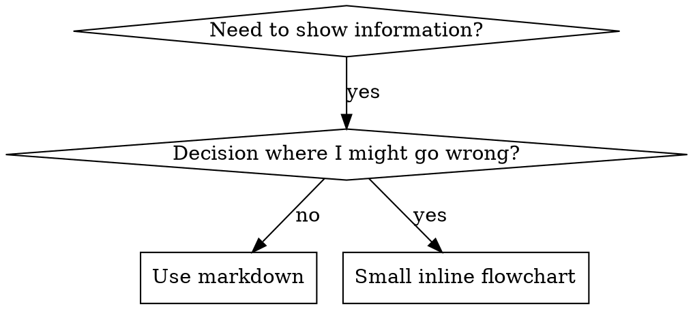

# 写作技能

## 概述

**写作技能是对流程文档应用测试驱动开发（Test-Driven Development）。**

**个人技能存放在你的运行时技能目录**（Claude Code 中为 `~/.claude/skills/`）——查看 [codex-tools.md](../using-superpowers/references/codex-tools.md) 或 [gemini-tools.md](../using-superpowers/references/gemini-tools.md) 以获取这些运行时对应的路径。Codex、Copilot CLI 和 Gemini CLI 也都认可 `~/.agents/skills/` 作为跨运行时别名。

你编写测试用例（包含子代理的压力场景），观察它们失败（基线行为），编写技能（文档），观察测试通过（代理遵循），并进行重构（填补漏洞）。

**核心原则：** 如果你没有在拥有该技能的情况下观察到代理失败，你就无法知道该技能是否教授了正确的内容。

**必需背景：** 你必须在了解 `superpowers:test-driven-development` 之前才能使用本技能。该技能定义了 RED-GREEN-REFACTOR 循环的基本规律。本技能将 TDD 适配到文档编写中。

**官方指引：** 如需了解 Anthropic 官方的技能编写最佳实践，请参阅 anthropic-best-practices.md。本文档提供了与此技能中 TDD 方法互补的额外模式与指南。

## 什么是技能？

**技能** 是经过验证的技巧、模式或工具的参考指南。技能帮助未来的代理找到并应用有效的方案。

**技能包括：** 可复用技巧、模式、工具、参考指南

**技能不包括：** 描述你曾经如何解决某个问题的叙事

## 技能与 TDD 的映射

| TDD 概念 | 技能创建 |
|-----------|----------------|
| **测试用例** | 包含子代理的压力场景 |
| **生产代码** | 技能文档（SKILL.md） |
| **测试失败（RED）** | 无技能时代理违反规则（基线） |
| **测试通过（GREEN）** | 存在技能时代理遵循要求 |
| **重构** | 在保持合规的同时填补漏洞 |
| **先写测试** | 在编写技能**之前**运行基线场景 |
| **观察失败** | 记录代理使用的具体合理化理由 |
| **最小代码** | 编写专门解决那些特定违规的技能内容 |
| **观察通过** | 验证代理现在已遵循要求 |
| **重构循环** | 发现新合理化理由 → 填补 → 重新验证 |

整个技能创建过程遵循 RED-GREEN-REFACTOR。

## 何时创建技能

**在以下情况下创建：**
- 该技巧对你而言并不直观明显
- 你需要在多个项目中再次引用
- 模式适用范围广泛（非项目特定）
- 其他人员会从中受益

**对于以下情况不要创建：**
- 一次性解决方案
- 已有其他地方充分文档化的标准实践
- 项目特定约定（放入你的指令文件中）
- 机制性约束（若可通过正则表达式/验证强制，则应自动化——将文档留给需要判断的内容）

## 技能类型

### 技巧
包含执行步骤的具体方法（基于条件等待、根因追踪）

### 模式
看待问题的思维方式（扁平化加标志、测试不变式）

### 参考
API 文档、语法指南、工具文档（办公文档）

## 目录结构

```
skills/
  skill-name/
    SKILL.md              # 主要参考文档（必需）
    supporting-file.*     # 仅在需要时使用
```

**扁平命名空间** - 所有技能在同一可搜索命名空间中

**为以下情况使用独立文件：**
1. **重量级参考**（100+ 行）- API 文档、全面的语法说明
2. **可复用工具** - 脚本、实用程序、模板

**内联保留：**
- 原则与概念
- 代码模式（< 50 行）
- 其余内容

## SKILL.md 结构

**前置元数据（YAML）：**
- 两个必需字段：`name` 和 `description`（查看 [agentskills.io/specification](https://agentskills.io/specification) 了解所有支持字段）
- 总长度不超过 1024 字符
- `name`：仅使用字母、数字和连字符（不使用括号、特殊字符）
- `description`：第三人称，仅描述何时使用（而非技能做什么）
  - 以 "Use when..." 开头，聚焦触发条件
  - 包含具体的症状、场景和上下文
  - **绝不为总结技能的流程或工作流程**（见 SDO 章节说明原因）
  - 尽量控制在 500 字符以内

```markdown
---
name: Skill-Name-With-Hyphens
description: Use when [具体触发条件与症状]
---

# 技能名称

## 概述
说明此技能是什么？用 1-2 句话说明核心原则。

## 何时使用
[如需非直观决策，使用小型内联流程图]

症状与用例的要点列表
何时不使用

## 核心模式（针对技巧/模式）
前后代码对比

## 快速参考
扫描常见操作的表格或列表

## 实现
简单模式使用内联代码
重量级参考或可复用工具链接到独立文件

## 常见错误
出现什么问题 + 修正方法

## 实际影响（可选）
具体结果
```

## 技能发现优化（SDO）

**对发现至关重要：** 未来的代理需要能够找到你的技能

### 1. 丰富的描述字段

**目的：** 你的代理读取描述以决定针对给定任务加载哪些技能。使其能够回答："现在是否应该阅读本技能？"

**格式：** 以 "Use when..." 开头，聚焦触发条件

**关键：描述 = 何时使用，而非技能做什么**

描述应**仅**描述触发条件。不要在描述中总结技能的流程或工作流程。

**为什么这很重要：** 测试显示，当描述总结技能的工作流程时，代理可能依据描述而非阅读完整技能内容来行事。当描述包含"任务间执行代码审查"时，代理只进行了一次审查，尽管技能中的流程图明确显示了两次审查（规范合规性审查，然后是代码质量审查）。

当描述改为仅"Use when executing implementation plans with independent tasks in the current session"（不含工作流程总结）时，代理正确读取了流程图并遵循了两个阶段的审查流程。

**陷阱：** 总结工作流程的描述会创建代理会采用的捷径。技能正文成为代理跳过的文档。

```yaml
# ❌ 错误：总结工作流程 - 代理可能依据此而非阅读技能
description: Use when executing plans - dispatches subagent per task with code review between tasks

# ❌ 错误：流程细节过多
description: Use for TDD - write test first, watch it fail, write minimal code, refactor

# ✅ 正确：仅触发条件，无工作流程总结
description: Use when executing implementation plans with independent tasks in the current session

# ✅ 正确：仅触发条件
description: Use when implementing any feature or bugfix, before writing implementation code
```

**内容：**
- 使用具体触发条件、症状和场景，表明本技能适用
- 描述**问题**（竞态条件、行为不一致），而非**特定语言的症状**（setTimeout、sleep）
- 除非技能本身是技术特定的，否则保持触发技术中立
- 若技能是技术特定的，在触发条件中明确表明
- 使用第三人称（注入系统提示时使用）
- **绝不为总结技能的流程或工作流程**

```yaml
# ❌ 错误：过于抽象、模糊，未包含何时使用
description: For async testing

# ❌ 错误：第一人称
description: I can help you with async tests when they're flaky

# ❌ 错误：提及技术但技能并非特定于该技术
description: Use when tests use setTimeout/sleep and are flaky

# ✅ 正确：以 "Use when" 开头，描述问题，无工作流程
description: Use when tests have race conditions, timing dependencies, or pass/fail inconsistently

# ✅ 正确：技术特定技能并明确触发条件
description: Use when using React Router and handling authentication redirects
```

### 2. 关键词覆盖

使用代理会搜索的词汇：
- 错误信息："Hook timed out"、"ENOTEMPTY"、"race condition"
- 症状："flaky"、"hanging"、"zombie"、"pollution"
- 同义词："timeout/hang/freeze"、"cleanup/teardown/afterEach"
- 工具：实际命令、库名称、文件类型

### 3. 描述性命名

**使用主动语态，以动词开头：**
- ✅ `creating-skills` 而非 `skill-creation`
- ✅ `condition-based-waiting` 而非 `async-test-helpers`

### 4. Token 效率（关键）

**问题：** 入门和工作频繁引用的技能会加载到**每一个**对话中。每个 token 都有成本。

**目标词数：**
- 入门工作流：每个 <150 词
- 频繁加载技能：总计 <200 词
- 其他技能：<500 词（仍需简洁）

**技巧：**

**将细节移至工具帮助中：**
```bash
# ❌ 错误：在 SKILL.md 中记录所有标志
search-conversations supports --text, --both, --after DATE, --before DATE, --limit N

# ✅ 正确：引用 --help
search-conversations 支持多种模式和过滤。运行 --help 查看详情。
```

**使用交叉引用：**
```markdown
# ❌ 错误：重复工作流细节
When searching, dispatch subagent with template...
[20 行重复指令]

# ✅ 正确：引用其他技能
始终使用子代理（节省 50-100 倍上下文）。必需：使用 [other-skill-name] 进行工作流。
```

**压缩示例：**
```markdown
# ❌ 错误：详细示例（42 词）
your human partner: "How did we handle authentication errors in React Router before?"
You: I'll search past conversations for React Router authentication patterns.
[以搜索查询 "React Router authentication error handling 401" 派发子代理]

# ✅ 正确：最小示例（20 词）
Partner: "How did we handle auth errors in React Router?"
You: Searching...
[派发子代理 → 综合]
```

**消除冗余：**
- 不重复已交叉引用技能中的内容
- 不解释命令中显而易见的内容
- 不包含同一模式的多个示例

**验证：**
```bash
wc -w skills/path/SKILL.md
# 入门工作流：目标每个 <150
# 其他频繁加载：目标总计 <200
```

**按所做动作或核心洞察命名：**
- ✅ `condition-based-waiting` > `async-test-helpers`
- ✅ `using-skills` 而非 `skill-usage`
- ✅ `flatten-with-flags` > `data-structure-refactoring`
- ✅ `root-cause-tracing` > `debugging-techniques`

**动名词（-ing）对流程效果良好：**
- `creating-skills`、`testing-skills`、`debugging-with-logs`
- 主动，描述你所采取的行动

### 5. 交叉引用其他技能

在编写引用其他技能的文档时：

仅使用技能名称，并带有明确的必需标记：
- ✅ 良好：`**REQUIRED SUB-SKILL:** Use superpowers:test-driven-development`
- ✅ 良好：`**REQUIRED BACKGROUND:** You MUST understand superpowers:systematic-debugging`
- ❌ 错误：`See skills/testing/test-driven-development`（无法判断是否为必需）
- ❌ 错误：`@skills/testing/test-driven-development/SKILL.md`（强制加载，消耗上下文）

**不使用 @ 链接的原因：** `@` 语法会立即强制加载文件，在需要时消耗 200k+ 上下文。

## 流程图使用



**仅在以下情况使用流程图：**
- 非直观的决策点
- 可能过早停止的流程循环
- "何时使用 A 而非 B" 的决策

**绝不在以下情况使用流程图：**
- 参考材料 → 表格、列表
- 代码示例 → Markdown 代码块
- 线性指令 → 编号列表
- 无语义含义的标签（step1、helper2）

详见本目录下的 `graphviz-conventions.dot` 了解 graphviz 样式规则。

**为你的同事可视化：** 使用本目录下的 `render-graphs.js` 将技能中的流程图渲染为 SVG：
```bash
node ./render-graphs.js ../some-skill           # 每个图表单独渲染
node ./render-graphs.js ../some-skill --combine # 所有图表合并为单个 SVG
```

## 代码示例

**一个优秀的示例胜过多个平庸的示例**

选择最相关的语言：
- 测试技巧 → TypeScript/JavaScript
- 系统调试 → Shell/Python
- 数据处理 → Python

**良好示例：**
- 完整且可运行
- 带有解释 WHY 的注释
- 来自真实场景
- 清晰展示模式
- 易于适配（非通用模板）

**不要：**
- 用 5+ 种语言实现
- 创建填空模板
- 编写牵强的示例

你很擅长移植 - 一个优秀的示例就足够了。

## 文件组织

### 自包含技能
```
defense-in-depth/
  SKILL.md    # 所有内容内联
```
适用场景：所有内容都能容纳，无需重量级参考

### 含可复用工具的技能
```
condition-based-waiting/
  SKILL.md    # 概述 + 模式
  example.ts  # 可适配的可用辅助工具
```
适用场景：工具是可复用的代码，而非仅是叙事

### 含重量级参考的技能
```
pptx/
  SKILL.md       # 概述 + 工作流程
  pptxgenjs.md   # 600 行 API 参考
  ooxml.md       # 500 行 XML 结构
  scripts/       # 可执行工具
```
适用场景：参考材料过大，不适合内联

通过语法中的解释器调用打包的脚本（`bash scripts/tool.sh`、`node scripts/tool.js`），绝不使用裸路径调用：一些测试框架插件打包器会去除可执行位，裸路径 `scripts/tool.sh` 在那里会因 `Permission denied` 失败。

## 铁律（与 TDD 相同）

```
没有先有失败测试，就没有技能
```

这适用于**新技能**和**现有技能的修改**。

**无例外：**
- 不适用于"简单新增"
- 不适用于"仅添加章节"
- 不适用于"文档更新"
- 不要将未经测试的修改保留为"参考"
- 不要在运行测试时"适配"
- 删除即删除

**必需背景：** `superpowers:test-driven-development` 技能解释了这对 TDD 的重要性。这些原则同样适用于文档编写。

## 对所有技能类型的测试

不同类型的技能需要不同的测试方法：

### 纪律约束技能（规则/要求）

**示例：** TDD、完成任务前验证、编写代码前设计

**使用以下方式测试：**
- 学术问题：他们是否理解规则？
- 压力场景：在压力下是否遵循要求？
- 多种压力组合：时间 + 沉没成本 + 疲劳
- 识别合理化理由并添加明确反驳

**成功标准：** 代理在最大压力下遵循规则

### 技巧技能（指南）

**示例：** condition-based-waiting、root-cause-tracing、defensive-programming

**使用以下方式测试：**
- 应用场景：他们是否能正确应用技巧？
- 变体场景：是否处理边界情况？
- 缺失信息测试：指令是否有缺口？

**成功标准：** 代理将技巧成功应用于新场景

### 模式技能（思维模型）

**示例：** reducing-complexity、信息隐藏概念

**使用以下方式测试：**
- 识别场景：他们是否在模式适用时识别？
- 应用场景：他们是否能使用思维模型？
- 反例：他们是否知道何时不适用？

**成功标准：** 代理正确判断何时以及如何应用模式

### 参考技能（文档/API）

**示例：** API 文档、命令参考、库指南

**使用以下方式测试：**
- 检索场景：他们能否找到正确信息？
- 应用场景：他们是否能正确使用找到的信息？
- 缺口测试：常见用例是否已覆盖？

**成功标准：** 代理找到并正确应用参考信息

## 跳过测试的常见合理化理由

| 借口 | 现实 |
|--------|---------|
| "技能显然清晰" | 对你清晰 ≠ 对其他代理清晰。测试一下。 |
| "它只是参考" | 参考也可能存在缺口、不清晰的部分。测试检索。 |
| "测试是多余" | 未经测试的技能始终有问题。测试 15 分钟可节省数小时。 |
| "等出现问题时再测试" | 问题 = 代理无法使用技能。在部署前测试。 |
| "测试太繁琐" | 测试比在生产中调试有缺陷的技能更不繁琐。 |
| "我确信它是好的" | 过度自信必然导致问题。仍要测试。 |
| "学术评审就够了" | 阅读 ≠ 使用。测试应用场景。 |
| "没时间测试" | 部署未经测试的技能比之后修复它浪费更多时间。 |

**所有这些借口都意味着：在部署前测试。无例外。**

## 根据失败类型匹配形式

在编写指导前，先分类基线失败。针对一种失败类型的防护形式，会在另一种失败类型上明显适得其反。

| 基线失败 | 正确形式 | 错误形式 |
|-----------|---------|---------|
| 在压力下跳过/违反规则（认为更好，仍照做） | 禁止 + 合理化理由表 + 红旗（见下文 Bulletproofing） | 柔和指导（"建议..."、"考虑..."） |
| 遵循要求，但输出形状错误（冗长提示、判定位置不当、重复规范） | 正面配方或契约：明确输出是什么——其组成部分，按顺序 | 禁止列表（"不要重复"、"绝不要叙述"） |
| 在已产生的内容中遗漏必需元素 | 结构化：填写模板时的必需字段或槽位 | 模板附近的散文提醒 |
| 行为应取决于条件 | 根据可观察谓词的关键条件（"若简报存在，则引用它"） | 无条件规则 + 豁免条款 |

**为什么禁止规则在塑造问题时会适得其反：** 在"使提示自包含"这一竞争激励下，代理会与"不要 X"进行协商。在调度提示指导的措辞对对比测中，禁止条款产生的无需内容明显多于配方条款（完全分离的分布），且结果甚至比无指导对照组更差——请自行微测你的用例，而非假设，但默认情况下永远不要使用禁止形式。配方不留协商余地：输出符合所述形状，或不符合。

**所选形式无论哪种的规则：**
- **无细微条款。** "除非重要否则不要 X"会重新打开协商——在同一措辞测试中，给获胜配方添加一个细微条款，使其从一致变为杂乱。将真正的例外作为基于可观察谓词的独立条件表达。
- **豁免条款不限定范围。** "此限制不适用于代码块"仍然会抑制代码块。若输出部分必须豁免，重构使规则无法到达该部分。

## 防止技能被合理化（Bulletproofing）

需要约束纪律的技能（如 TDD）需要抵抗合理化。代理很聪明，在压力下会找到漏洞。

**范围：** 本工具包针对纪律失败——即代理知道规则，但在压力下仍跳过的情况。对于输出形状错误或遗漏元素的情况，基于禁止的防护适得其反；请使用 Match the Form to the Failure 中的形式。

**心理学说明：** 理解说服技巧为何有效有助于你系统应用它们。参见 persuasion-principles.md 了解研究基础（Cialdini, 2021; Meincke et al., 2025）中关于权威、承诺、稀缺、社会证明和统一原则的内容。

### 明确封堵每一个漏洞

不要仅陈述规则——禁止具体变通方法：

<错误>
```markdown
先写代码再测试？删除它。
```
</错误>

<正确>
```markdown
先写代码再测试？删除它。重新开始。

**无例外：**
- 不要保留为"参考"
- 在编写测试时不要"适配"它
- 不要查看它
- 删除即删除
```
</正确>

### 应对"精神与字面"的辩护

早期加入基础原则：

```markdown
**违反规则的字面，就是违反规则的精神。**
```

这切断了整个"我在遵循精神"类辩护。

### 构建合理化理由表

从基线测试（见下文测试章节）中捕获合理化理由。代理作出的每一个借口都列入该表：

```markdown
| 借口 | 现实 |
|--------|---------|
| "太简单，无需测试" | 简单代码会出错。测试仅需 30 秒。 |
| "之后再测试" | 立即通过的测试证明不了任何问题。 |
| "之后测试能达到相同目标" | 测试后 = "这做什么？" 测试先 = "这应该做什么？" |
```

### 创建红旗列表

让代理在合理化时能轻松自检：

```markdown
## 红旗 - 停止并重新开始

- 先写代码再测试
- "我已手动测试过"
- "之后测试能达到相同目的"
- "这是关于精神而非仪式"
- "这是不同的，因为..."

**所有这些意味着：删除代码。用 TDD 重新开始。**
```

### 在 SDO 中为违规症状更新

在描述中添加即将违反规则的违规症状：

```yaml
description: use when implementing any feature or bugfix, before writing implementation code
```

## 技能上的 RED-GREEN-REFACTOR

遵循 TDD 循环：

### RED：编写失败测试（基线）

在无技能的情况下，用包含子代理的压力场景运行。记录具体行为：
- 他们做出了哪些选择？
- 使用了哪些合理化理由（逐字记录）？
- 哪些压力触发了违规？

这是"观察测试失败"——你必须在编写技能前看到代理的自然行为。

### GREEN：编写最小技能

编写解决那些特定合理化理由的技能内容。不要为假设的案例添加多余内容。

在**有技能**的情况下运行相同场景。代理现在应能遵循要求。

### REFACTOR：填补漏洞

代理发现新合理化理由？添加明确反驳。测试直到完全防得住漏洞。

### 在全量场景前进行措辞微测

全量压力场景运行是最终关口，但每次迭代慢且代价高。先用微测验证措辞本身：

1. **每次调用一个全新上下文样本** —— 原始 API 调用，或若无法访问 API 则使用单次子代理。系统提示 = 指导将存在的真实上下文（完整技能或提示模板，而非孤立指导）；用户消息 = 诱使失败的的任务。
2. **始终包含无指导对照组。** 若对照组未表现出失败，则无需要修复之处——停止，不要编写指导。
3. **每个变体 5+ 次重复。** 单个样本不可靠。
4. **手动阅读每个被标记匹配项。** 喜欢的话可用程序评分，但模板回声和引用的反例伪装成命中；仅依赖自动化计数会同时高估失败与成功。
5. **变异性是指标。** 当指导生效时，重复样本收敛为相同形状。五个重复中五个不同解释意味着措辞无约束力——先收紧形式，再添加内容。

微测验证措辞；它们不替代纪律技能的压力场景测试。

**测试方法学：** 参见 [testing-skills-with-subagents.md](testing-skills-with-subagents.md) 了解完整测试方法学：
- 如何编写压力场景
- 压力类型（时间、沉没成本、权威、疲劳）
- 系统填补漏洞
- 元测试技巧

## 反模式

### ❌ 叙事示例
"在 2025-10-03 会话中，我们发现空项目Dir导致..."
**为什么不好：** 过于具体，不可复用

### ❌ 多语言稀释
example-js.js、example-py.py、example-go.go
**为什么不好：** 质量平庸，维护负担重

### ❌ 流程图中的代码
```dot
step1 [label="import fs"];
step2 [label="read file"];
```
**为什么不好：** 无法复制粘贴，难以阅读

### ❌ 通用标签
helper1、helper2、step3、pattern4
**为什么不好：** 标签应有语义含义

## 停止：在进入下一个技能前

**编写任何技能后，你 MUST STOP 并完成部署流程。**

**不要：**
- 不逐个测试就批量创建多个技能
- 在当前技能验证前进入下一个技能
- 以"批量更高效"为由跳过测试

**以下部署清单对每个技能都是强制性的。**

部署未经测试的技能 = 部署未经测试的代码。这是质量标准的违背。

## 技能创建检查清单（TDD 适配）

**重要：为以下每一项清单内容创建待办。**

**RED 阶段 - 编写失败测试：**
- [ ] 创建压力场景（纪律技能需 3+ 种组合压力）
- [ ] 无技能运行场景——逐字记录基线行为
- [ ] 识别合理化理由/失败中的模式

**GREEN 阶段 - 编写最小技能：**
- [ ] 名称仅使用字母、数字、连字符（不使用括号/特殊字符）
- [ ] YAML 前置元数据包含必需字段 `name` 和 `description`（总长 ≤1024 字符；见 [spec](https://agentskills.io/specification)）
- [ ] 描述以 "Use when..." 开头，包含具体触发条件/症状
- [ ] 描述使用第三人称
- [ ] 全篇包含用于搜索的关键词（错误、症状、工具）
- [ ] 清晰的概述，含核心原则
- [ ] 解决 RED 阶段识别的具体基线失败
- [ ] 指导形式匹配失败类型（见 Match the Form to the Failure）
- [ ] 对行为塑造型指导：在无指导对照组上对措辞进行微测（5+ 次重复，每个被标记匹配项人工阅读）——纯参考技能为 N/A
- [ ] 代码内联或链接到独立文件
- [ ] 一个优秀示例（非多语言）
- [ ] 有技能运行场景——验证代理现在能遵循

**REFACTOR 阶段 - 填补漏洞：**
- [ ] 从测试中识别新合理化理由
- [ ] 添加明确反驳（若为纪律技能）
- [ ] 从所有测试迭代构建合理化理由表
- [ ] 创建红旗列表
- [ ] 测试直到完全防得住漏洞

**质量检查：**
- [ ] 决策非直观时使用小型流程图
- [ ] 快速参考表
- [ ] 常见错误章节
- [ ] 无叙事式讲故事
- [ ] 仅对工具或重量级参考使用支持文件

**部署：**
- [ ] 将技能提交到 git 并推送到你的分支（若已配置）
- [ ] 考虑通过 PR 贡献（若 broadly 有用）

## 发现工作流程

未来的代理如何找到你的技能：

1. **遇到问题**（"测试不稳定"）
2. **搜索技能**（搜索描述、浏览分类）
3. **找到技能**（描述匹配）
4. **扫描概述**（是否相关？）
5. **阅读模式**（快速参考表）
6. **加载示例**（仅实施时）

**为这一流程优化**——将可搜索术语尽量早且频繁地放置。
