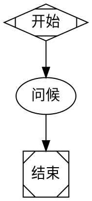
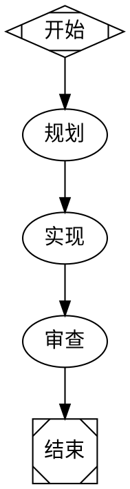
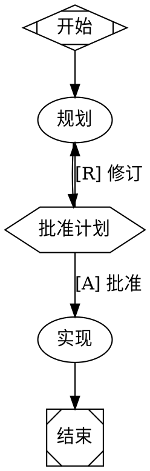
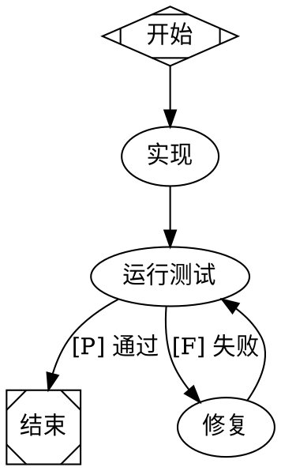
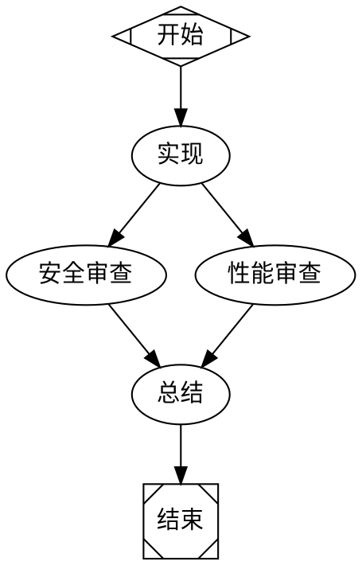
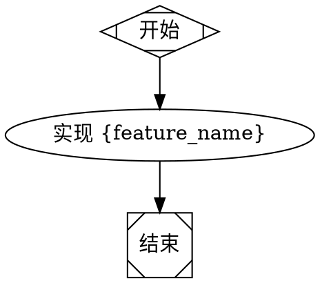
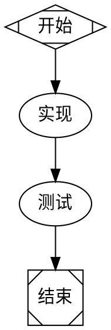
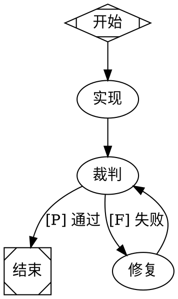
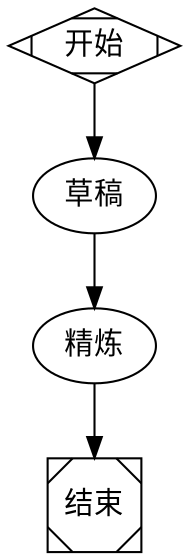

# Fabro Workflow Factory

> 技能由 [ara.so](https://ara.so) 提供 — 2026每日技能集合。

Fabro 是一个用 Rust 编写的开源 AI 编码工作流协调器。它允许您将代理管道定义为 Graphviz DOT 图 — 包含分支、循环、人工审批门、多模型路由和云沙盒执行 — 然后作为持久服务运行。您定义流程；代理执行它；您只在重要之处进行干预。

---

## 安装

```bash
# 通过 Claude 代码（推荐）
curl -fsSL https://fabro.sh/install.md | claude

# 通过 Codex
codex "$(curl -fsSL https://fabro.sh/install.md)"

# 通过 Bash
curl -fsSL https://fabro.sh/install.sh | bash
```

安装后，运行一次性设置和每个项目的初始化：

```bash
fabro install      # 全局一次性设置
cd my-project
fabro init         # 每个项目设置（创建 .fabro/ 配置）
```

---

## 主要 CLI 命令

```bash
# 工作流管理
fabro run <workflow.dot>          # 执行工作流
fabro run <workflow.dot> --watch  # 实时输出流
fabro runs                        # 列出所有运行
fabro runs show <run-id>          # 检查特定运行

# 人机交互
fabro approve <run-id>            # 批准待审批门
fabro reject <run-id>             # 拒绝/修订待审批门

# 沙盒访问
fabro ssh <run-id>                # 进入运行中的沙盒的 shell
fabro preview <run-id> <端口>     # 将沙盒端口本地暴露

# 回顾
fabro retro <run-id>              # 查看运行回顾（成本、持续时间、叙述）

# 配置
fabro config                      # 查看当前配置
fabro config set <键> <值>    # 设置配置值
```

---

## 工作流定义（Graphviz DOT）

工作流是使用 Graphviz DOT 语言的 `.dot` 文件，并带有 Fabro 特定属性。

### 节点类型

| 形状 | 含义 |
|---|---|
| `Mdiamond` | 开始节点 |
| `Msquare` | 结束节点 |
| `rectangle` (默认) | 代理节点 (LLM 轮次) |
| `hexagon` | 人工门 (暂停审批) |

### 最小 Hello World



```bash
fabro run hello.dot
```

---

## 多模型路由与样式表

Fabro 使用类似 CSS 的 `model_stylesheet` 声明在图上路由节点到模型。使用类来定位节点组。



### 支持的模型样式表属性

```
model: <model-id>           # 例如. claude-sonnet-4-5, gpt-4o, gemini-2-flash
reasoning_effort: 低|中|高
provider: anthropic|openai|google
```

---

## 人工门（审批节点）

使用 `shape=hexagon` 暂停执行以进行人工审批。转换标签为 `[A]` (批准) 和 `[R]` (修订/拒绝)。



从 CLI 批准或拒绝：

```bash
fabro runs                          # 找到暂停的 run-id
fabro approve <run-id>              # 继续实现
fabro reject <run-id> --note "在计划中添加错误处理"
```

---

## 循环和修复循环

使用标记转换构建自动重试/修复循环：



---

## 并行节点

通过从单个源分叉边来并发运行多个代理节点：



---

## 变量和动态提示

在提示中使用 `{变量}` 插值。在运行时传递变量：



```bash
fabro run feature.dot --var feature_name=oauth-login
```

---

## 云沙盒（Daytona）

要在云中而不是本地运行代理，请配置一个 Daytona 沙盒：

```bash
fabro config set sandbox.provider daytona
fabro config set sandbox.api_key $DAYTONA_API_KEY
fabro config set sandbox.region us-east-1
```

然后在工作流图中添加沙盒配置：



```bash
fabro run sandboxed.dot          # 启动云 VM，运行工作流，然后关闭
fabro ssh <run-id>               # 进入运行中的沙盒进行调试
fabro preview <run-id> 3000      # 将沙盒端口 3000 本地转发
```

---

## Git 检查点

Fabro 会自动将代码更改和执行元数据提交到每个阶段的 Git 分支。要检查或恢复：

```bash
fabro runs show <run-id>         # 查看每个阶段的分支名称
git checkout fabro/<run-id>/implement   # 检查特定阶段的代码
git diff fabro/<run-id>/plan fabro/<run-id>/implement  # 阶段之间的差异
```

---

## 回顾

每次运行后，Fabro 会生成一个包含成本、持续时间、更改文件和 LLM 编写的叙述的回顾：

```bash
fabro retro <run-id>
```

示例输出：

```
运行: implement-oauth-2024
持续时间:  4m 32s
成本:      $0.043
文件:     src/auth.rs (+142), src/lib.rs (+8), tests/auth_test.rs (+67)

叙述:
  代理成功实现了 OAuth2 PKCE 流。它创建了 auth 模块，与现有中间件集成，并添加了集成测试。
  需要一个修复循环，因为刷新令牌测试失败。
```

---

## REST API 和 SSE 流

Fabro 运行一个用于程序化使用的 API 服务器：

```bash
fabro serve --port 8080
```

### 通过 API 触发运行

```bash
curl -X POST http://localhost:8080/api/runs \
  -H "Content-Type: application/json" \
  -d '{
    "workflow": "workflows/plan-implement.dot",
    "variables": { "feature_name": "dark-mode" }
  }'
```

### 通过 SSE 流运行事件

```bash
curl -N http://localhost:8080/api/runs/<run-id>/events
```

### 通过 API 批准门

```bash
curl -X POST http://localhost:8080/api/runs/<run-id>/approve \
  -H "Content-Type: application/json" \
  -d '{ "decision": "approve" }'
```

---

## 环境变量

```bash
# 必需的 — 至少一个 LLM 提供商密钥
export ANTHROPIC_API_KEY=...
export OPENAI_API_KEY=...
export GOOGLE_API_KEY=...

# 可选的 — 云沙盒
export DAYTONA_API_KEY=...

# 可选的 — Fabro API 服务器认证
export FABRO_API_TOKEN=...
```

---

## 项目结构约定

```
my-project/
├── .fabro/               # Fabro 配置（由 `fabro init` 创建）
│   └── config.toml
├── workflows/            # 您的 DOT 工作流定义
│   ├── plan-implement.dot
│   ├── fix-loop.dot
│   └── ensemble-review.dot
├── specs/                # 自然语言规范，由提示引用
│   └── feature-name.md
└── src/                  # 您的实际源代码
```

---

## 常见模式

### 模式：规范驱动实现



### 模式：廉价草稿，昂贵精炼



---

## 故障排除

**`fabro: 命令未找到`**
- 重新运行安装脚本并确保 `~/.local/bin`（或安装前缀）在您的 `$PATH` 中。
- 安装后尝试 `source ~/.bashrc` 或 `source ~/.zshrc`。

**代理卡在循环中**
- 添加最大迭代保护：使用计数器变量和条件转换强制 N 次迭代后退出。
- 检查您的提示 — 模糊的退出条件会导致循环。

**人工门从未暂停**
- 确认节点使用 `shape=hexagon`，而不仅仅是包含“批准”的标签。
- 检查 `fabro runs show <run-id>` 以确认运行到达了该节点。

**沙盒启动失败**
- 验证 `DAYTONA_API_KEY` 已设置且有效。
- 运行 `fabro config` 以确认 `sandbox.provider` 设置为 `daytona`。
- 检查 `fabro runs show <run-id>` 以获取沙盒错误详细信息。

**模型未找到 / API 错误**
- 确保已导出正确的提供商 API 密钥 (`ANTHROPIC_API_KEY`, `OPENAI_API_KEY`, 等.)。
- 检查样式表中的 `model:` 值是否与提供商的确切模型 ID 匹配。

**运行立即退出而不做工作**
- 验证 DOT 文件具有从 `start` (`shape=Mdiamond`) 到 `exit` (`shape=Msquare`) 的有效路径。
- 运行 `dot -Tsvg workflow.dot -o workflow.svg` 以可视化检查图，查找断开的节点。

---

## 资源

- [文档](https://docs.fabro.sh)
- [为什么 Fabro](https://docs.fabro.sh/getting-started/why-fabro)
- [DOT 语言参考](https://docs.fabro.sh/reference/dot-language)
- [API 参考](https://docs.fabro.sh/api-reference/overview)
- [教程](https://docs.fabro.sh/tutorials/hello-world)
- [错误报告](https://github.com/fabro-sh/fabro/issues)
- [功能请求](https://github.com/fabro-sh/fabro/discussions)
